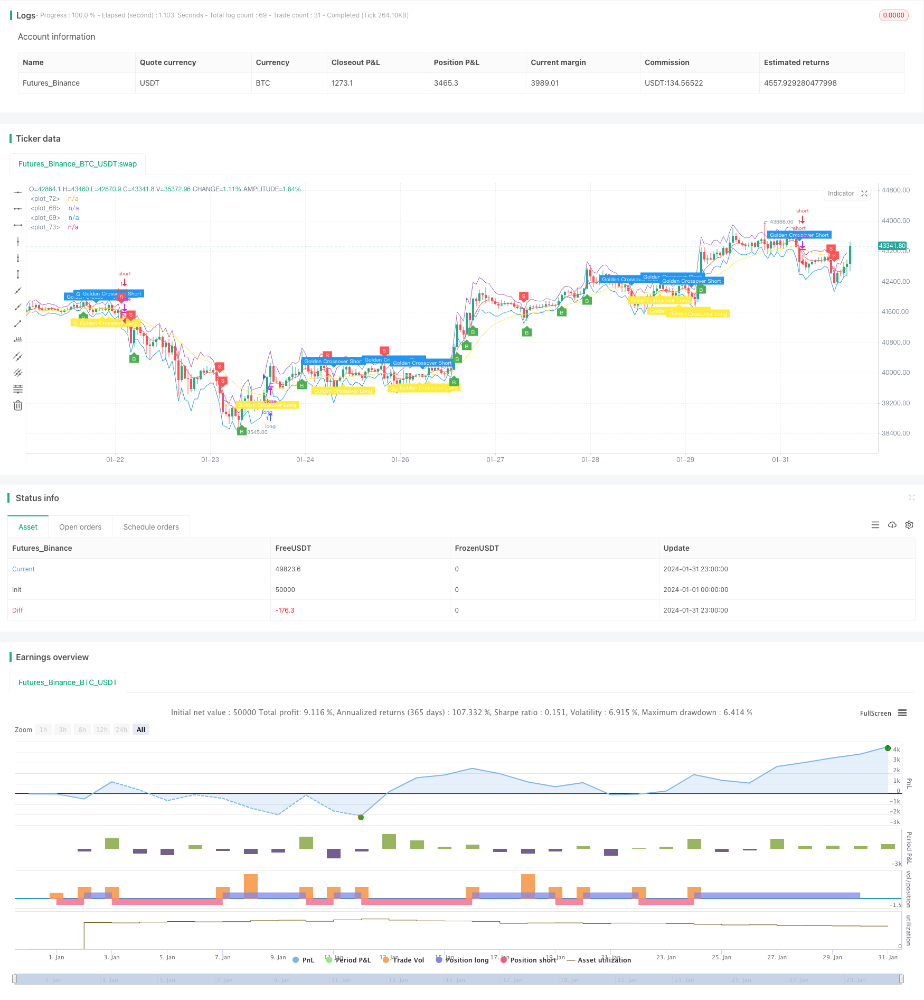

> Name

Based on RSI Golden Cross super short strategy RSI-Golden-Cross-Short-Strategy
> Author

ChaoZhang

> Strategy Description


[trans]
### 1. Strategy Overview
The RSI golden cross super short-selling strategy uses the ATR band, double RSI indicators and the golden cross of the EMA moving average to achieve trend judgment and entries. The ATR band is used to determine whether the price is overbought and oversold, the double RSI indicator is used to confirm the price trend, and the EMA moving average golden cross is used to find entry opportunities. This strategy is simple in design and easy to implement, making it an efficient and flexible short-selling strategy.
### 2. Strategy Principle
This strategy uses three components: ATR band, dual RSI indicator and EMA moving average to realize the entries signal. When the price opens above the upper ATR band, we judge it to be overbought. At this time, if the fast-cycle RSI is lower than the slow-cycle RSI, it indicates that the trend has changed from bullish to bearish, and if a dead cross occurs on the EMA, it indicates that the trend is further weakening. Combining these three signals, we can determine a strong shorting opportunity.
Specifically, when the price opens, it is judged whether it is higher than the upper ATR band, which is `open>upper_band`. If it is, it may be in the overbought area. Then we judge whether the fast RSI is lower than the slow RSI, which is `rsi1<rsi2`. If it is true, it means that the trend has weakened and turned from bull to bear. Finally, we test whether the EMA moving average has a dead cross, that is, `ta.crossover(longSMA, shortSMA)` ​​is established. If the three conditions are met, we will send a short signal to enter the market.
On the contrary, if the price opens below the lower ATR band, the fast RSI is higher than the slow RSI and an EMA golden cross occurs, a long entry signal will be generated.
The main innovation of this strategy is the introduction of dual RSI indicators for trend judgment, which is more reliable than a single RSI. It also combines ATR bands and EMA moving averages for signal filtering to make signals more accurate and reliable. This is the core highlight of this strategy.
### 3. Strategic advantages
This strategy has the following advantages:
1. Use the double RSI indicator to judge the trend more accurately and reliably
2. ATR band determines overbought and oversold areas to avoid false breakthroughs
3. Enter the market when a clear golden cross or dead cross occurs on the EMA moving average to increase signal accuracy.
4. A combination of multiple indicators for mutual verification, with high reliability
5. Strategy design is simple and easy to implement
6. Can profit from both overbought and oversold conditions at the same time
7. There are many adjustable parameters, which can be adjusted according to different markets.
### 4. Strategic Risks
There are also some risks to be aware of with this strategy:
1. EMA is prone to misdiagnosis, and smoothed MA may be more stable.
2. It’s easy to get caught in a volatile market and stop losses.
3. Improper parameter settings may increase error signals
4. It is too early to say when to break through the ATR band, and it may be a false breakthrough.
The above risks can be optimized and dealt with mainly from the following aspects:
1. Test using smoothed MA instead of EMA moving average
2. Appropriately loosen the stop loss range to avoid frequent stop losses in volatile markets.
3. Adjust parameter combinations to find the best balance
4. Introduce more indicators for secondary verification when breaking through the wave band
### 5. Strategy optimization direction
This strategy can be further optimized from the following aspects:
1. Test using Smoothed MA instead of EMA to see if it can reduce misdiagnosed signals.
2. Add volatility indicators such as Keltner channel for secondary verification to avoid false breakthroughs
3. Add more trend indicators such as ADX to judge the general trend
4. Adjust parameter settings according to the characteristics of specific varieties to find the best combination
5. Test performance under different time period parameters
6. Add machine learning algorithm to automatically optimize parameters
These optimization measures can further improve the stability, flexibility and profitability of the strategy.
### 6. Summary
The RSI Golden Cross super short-selling strategy is overall a very efficient and practical short-term short-selling strategy. It simultaneously uses the advantages of three indicators to integrate and implement entries signals, and can adapt to different varieties and market environments through parameter adjustment. The core innovation of this strategy lies in the use of dual RSI indicators to judge trend changes, and mutual verification with the ATR band and EMA moving average to form highly accurate entries. Overall, this strategy is very practical and worthy of investors' active use, but it also needs to pay attention to some possible risk factors. Through continuous testing and optimization, I believe this strategy can become a major profit tool for investors.
||

### I. Strategy Overview  

The RSI Golden Cross Short strategy utilizes ATR bands, double RSI indicators and golden cross of EMAs to identify trends and entries. The ATR bands determine overbought/oversold levels, double RSI indicators confirm the trend, and EMA crossovers identify opportunity for entries. This simple yet flexible short strategy can be highly effective for profit.

### II. Strategy Logic   

This strategy combines ATR bands, double RSI indicators and EMA lines to generate entry signals. When price opens above the upper ATR band indicating overbought levels, and the faster RSI crosses below slower RSI showing trend reversal from bullish to bearish, together with a death cross occuring in EMAs suggesting weakening trend, we have a strong signal for short entry.  

Specifically, when the opening price is above the upper ATR band i.e. `open > upper_band`, the asset may be overbought. Then we check if the fast RSI is less than slow RSI i.e. `rsi1 < rsi2`, suggesting the trend is turning from bullish to bearish. Finally we detect if a death cross happens in EMAs i.e. `ta.crossover(longSMA, shortSMA)` occurs. If all three conditions are met, a short entry signal is triggered.  

Conversely, if price opens below lower ATR band, fast RSI crosses above slow RSI, and a golden cross forms in EMAs, a long entry signal is generated.

The key innovation of this strategy is the introduction of double RSI indicators for better trend identification. Compared to a single RSI, the reliability is higher. Together with the ATR bands and EMA filters, the entry signals become more accurate and reliable. This is the core strength of the strategy.  

### III. Advantages  

The advantages of this strategy include:

1. More accurate trend identification using double RSI indicators  
2. ATR bands avoid false breakout by determining overbought/oversold levels
3. High signal accuracy by entering on golden/death cross of EMA lines   
4. Increased reliability from combining multiple indicators  
5. Simple logic easy to implement  
6. Profit from both long and short sides  
7. Flexibility to adjust parameters for different markets

### IV. Risks  

Some risks to note:   

1. EMA lines susceptible to whipsaws, smoothed MA may be more stable  
2. Can be stopped out frequently during ranging markets
3. Inadequate parameter setting may increase false signals  
4. Premature ATR band breakout may turn out to be false

The risks can be addressed by:
1. Test using Smoothed MA instead of EMA
2. Relax stop loss to avoid being stopped out prematurely  
3. Find optimal parameter balance through rigorous backtesting
4. Add more indicators to confirm ATR band breakouts  

### V. Enhancement Opportunities   

The strategy can be further improved by:   

1. Test Smoothed MA against EMA to reduce false signals 
2. Add volatility measure like Keltner Channels to avoid false breakouts
3. Incorporate trend filters like ADX for overall market direction
4. Adjust parameters based on asset characteristics  
5. Test performance across different timeframes  
6. Utilize machine learning to auto optimize parameters   

These opportunities can make the strategy more stable, flexible and profitable.  

### VI. Conclusion   

Overall, the RSI Golden Cross Short strategy is a highly effective short-term short strategy. It combines multiple indicators to generate entry signals, and is adjustable across assets and markets. Its novelty lies in using double RSI for trend identification, validated by ATR bands and EMA crossovers. This produces high-accuracy entry signals. The strategy has immense practical utility for investors, if risks are monitored and parameters optimized continually through testing. It has the potential to become a powerful profit engine in the trader's arsenal.  

[/trans]

> Strategy Arguments


|Argument|Default|Description|
|----|----|----|
|v_input_int_1|14|ATR Period|
|v_input_float_1|true|ATR Multi|
|v_input_string_1|0|ATR Smoothing: WMA|SMA|EMA|RMA|
|v_input_int_2|5|Fast EMA|
|v_input_int_3|21|Slow EMA|
|v_input_int_4|40|Fast RSI Length|
|v_input_int_5|60|Slow RSI Length|


> Source (PineScript)

``` pinescript
/*backtest
start: 2024-01-01 00:00:00
end: 2024-01-31 23:59:59
period: 1h
basePeriod: 15m
exchanges: [{"eid":"Futures_Binance","currency":"BTC_USDT"}]
*/

//@version=5
//Revision: Updated script to pine script version 5
//added Double RSI for Long/Short prosition trend confirmation instead of single RSI
strategy("Super Scalper - 5 Min 15 Min", overlay=true)
source = close
atrlen = input.int(14, "ATR Period")
mult = input.float(1, "ATR Multi", step=0.1)
smoothing = input.string(title="ATR Smoothing", defval="WMA", options=["RMA", "SMA", "EMA", "WMA"])

ma_function(source, atrlen) =>
    if smoothing == "RMA"
        ta.rma(source, atrlen)
    else
        if smoothing == "SMA"
            ta.sma(source, atrlen)
        else
            if smoothing == "EMA"
                ta.ema(source, atrlen)
            else
                ta.wma(source, atrlen)

atr_slen = ma_function(ta.tr(true), atrlen)
upper_band = atr_slen * mult + close
lower_band = close - atr_slen * mult

// Create Indicator's
ShortEMAlen = input.int(5, "Fast EMA")
LongEMAlen = input.int(21, "Slow EMA")
shortSMA = ta.ema(close, ShortEMAlen)
longSMA = ta.ema(close, LongEMAlen)
RSILen1 = input.int(40, "Fast RSI Length")
RSILen2 = input.int(60, "Slow RSI Length")
rsi1 = ta.rsi(close, RSILen1)
rsi2 = ta.rsi(close, RSILen2)
atr = ta.atr(atrlen)

//RSI Cross condition
RSILong = rsi1 > rsi2
RSIShort = rsi1 < rsi2

// Specify conditions
longCondition = open < lower_band
shortCondition = open > upper_band
GoldenLong = ta.crossover(shortSMA, longSMA)
Goldenshort = ta.crossover(longSMA, shortSMA)

plotshape(shortCondition, title="Sell Label", text="S", location=location.abovebar, style=shape.labeldown, size=size.tiny, color=color.new(color.red, 0), textcolor=color.white)
plotshape(longCondition, title="Buy Label", text="B", location=location.belowbar, style=shape.labelup, size=size.tiny, color=color.new(color.green, 0), textcolor=color.white)
plotshape(Goldenshort, title="Golden Sell Label", text="Golden Crossover Short", location=location.abovebar, style=shape.labeldown, size=size.tiny, color=color.new(color.blue, 0), textcolor=color.white)
plotshape(GoldenLong, title="Golden Buy Label", text="Golden Crossover Long", location=location.belowbar, style=shape.labelup, size=size.tiny, color=color.new(color.yellow, 0), textcolor=color.white)

// Execute trade if condition is True
if (longCondition)
    stopLoss = low - atr * 1
    takeProfit = high + atr * 4
    if (RSILong)
        strategy.entry("long", strategy.long)

if (shortCondition)
    stopLoss = high + atr * 1
    takeProfit = low - atr * 4
    if (RSIShort)
        strategy.entry("short", strategy.short)

// Plot ATR bands to chart

////ATR Up/Low Bands
plot(upper_band)
plot(lower_band)

// Plot Moving Averages
plot(shortSMA, color=color.red)
plot(longSMA, color=color.yellow)

```

> Detail

https://www.fmz.com/strategy/442547

> Last Modified

2024-02-22 17:05:17
