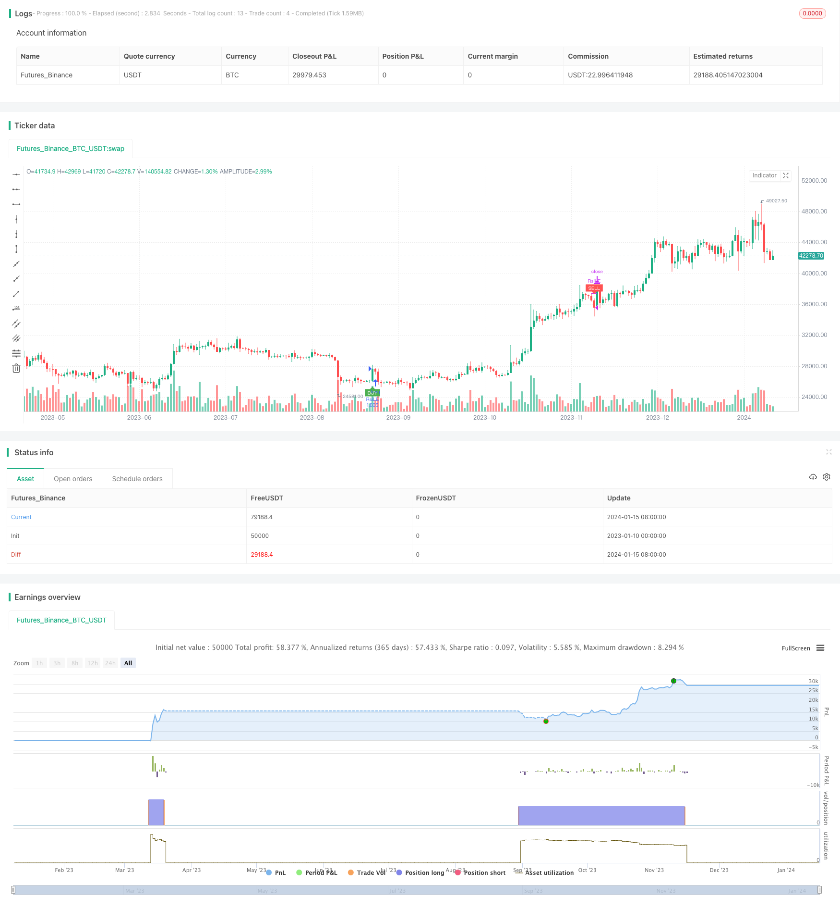

> Name

Short-term trading strategy based on RSI indicator RSI-Indicator-Based-Short-term-Trading-Strategy
> Author

ChaoZhang

> Strategy Description


 [trans]

### Overview
This strategy designs a short-term trading strategy based on the Relative Strength Index (RSI) indicator, which is mainly used for trading within the 15-minute time frame. This strategy determines whether the market is overbought and oversold by calculating the RSI indicator and sends buy and sell signals. A buy signal is generated when the RSI indicator crosses the low of 30, and a sell signal is generated when the RSI indicator crosses the high of 70. This strategy is suitable for short-term range trading and can capture intermediate fluctuations to make profits.
### Strategy Principles
The RSI indicator is a technical analysis tool that determines whether the market is overbought or oversold by calculating the ratio of price increases and decreases within a certain time period. The RSI indicator ranges from 0 to 100. A value below 30 indicates that the asset is oversold, and a value above 70 indicates that the asset is overbought.
This strategy sets the RSI indicator parameters to 14 periods, the overbought line to 70, and the oversold line to 30. When the RSI crosses 30 from below, a buy signal is generated, which means that the market turns from oversold to long; when the RSI crosses below 70 from above, a sell signal is generated, which means that the market turns from long to short. After the strategy receives the signal, it uses 1 times the leverage of the entire account funds to go long or short to achieve short-term trading profits.
### Advantage Analysis
The biggest advantage of this strategy is that the rules are simple and clear, easy to understand and implement. The Relative Strength Index is a classic quantitative indicator that is widely used to determine whether the market is overbought or oversold. The strategy itself does not need to predict future market trends and price targets. It only needs to follow the RSI indicator signal, which reduces the difficulty of strategy optimization.
Another advantage is that the strategy is highly adaptable. This strategy can be applied to any variety and any time frame, and is especially suitable for short and medium term capture of range oscillations. In addition, the strategy only needs to optimize three parameters: RSI cycle, overbought line, and oversold line. The parameter space is small, and it is easy to test and optimize to find the best parameter combination.
### Risk Analysis
The biggest risk of this strategy is the uncertainty of the holding time. When the market is overbought or oversold for a long time, it will cause the strategy to hold positions for too long and suffer greater losses. At this time, it is necessary to stop losses in time to control risks.
Another risk is that trading frequency may be too high. When the market fluctuates around the RSI overbought and oversold lines, buy and sell signals will be triggered frequently, increasing transaction fees and slippage costs. This requires appropriate adjustment of parameters and expansion of the distance between overbought and oversold ranges to reduce unnecessary transactions.
### Optimization direction
This strategy can be optimized from the following aspects:
1. Optimize RSI parameters, adjust cycle parameters and overbought and oversold line positions, and find the best parameter combination
2. Add stop-loss and take-profit strategies and set reasonable stop-loss and take-profit levels.
3. Add filter conditions to avoid unnecessary transactions. For example, setting the minimum fluctuation range, transaction volume filtering, etc.
4. Optimize capital utilization and set up dynamic position control
5. Combine with other indicators to improve strategy stability
### Summarize
This strategy designs a simple and practical short-term trading strategy based on the RSI indicator. The strategy signal rules are clear, easy to implement, and the capital utilization rate is high. It is suitable for medium and short-term capture of overbought and oversold phenomena in the market for polar trading. Through continuous testing and optimization, this strategy can become a very stable and reliable quantitative trading system.
||

### Overview

This strategy designs a short-term trading strategy based on the Relative Strength Index (RSI) indicator, mainly for trading in the 15-minute timeframe. The strategy generates buy and sell signals by calculating the RSI indicator to judge whether the market is overbought or oversold. It generates a buy signal when the RSI indicator crosses above the lower point of 30, and generates a sell signal when the RSI indicator crosses below the upper point of 70. This strategy is suitable for short-term range trading to capture profits from intermediate fluctuations.

### Strategy Logic

The RSI indicator is a technical analysis tool that calculates the ratio of price uptrends and downtrends over a certain time period to determine whether the market is overbought or oversold. The RSI indicator value ranges from 0 to 100. A value below 30 indicates the asset is oversold, and a value above 70 indicates the asset is overbought.

This strategy sets the RSI indicator parameters to 14 periods, the overbought line to 70, and the oversold line to 30. When the RSI crosses above 30 from below, a buy signal is generated, which means the market turns from oversold to bullish. When the RSI crosses below 70 from above, a sell signal is generated, which means the market turns from bullish to bearish. After receiving the signal, the strategy takes a directional long or short position with 1x leverage of the total account funds to make profits from short-term trading.


### Advantage Analysis  

The biggest advantage of this strategy is that the rules are simple and clear, easy to understand and implement. The Relative Strength Index is a very classic quantitative indicator, widely used to judge the overbought and oversold conditions of the market. The strategy itself does not need to predict future market trends and price targets, just follow the RSI indicator signals, which reduces the difficulty of strategy optimization.

Another advantage is that the strategy has strong adaptability. This strategy can be applied to any variety and timeframe, especially suitable for catching range oscillation in medium and short term. In addition, the strategy only needs to optimize three parameters: RSI period, overbought line and oversold line. The parameter space is small, which makes it easy to test and optimize to find the best parameter combination.

### Risk Analysis

The biggest risk of this strategy is that the holding time is uncertain. When the market experiences prolonged overbought or oversold conditions, it will lead to excessively long holding periods of the strategy positions and greater losses. At this point, timely stop loss is needed to control risks.

Another risk is that the trading frequency may be too high. When the market fluctuates up and down around the RSI overbought and oversold lines, it will frequently trigger buy and sell signals, increasing transaction fees and slippage costs. This requires appropriate adjustments to parameters to widen the overbought and oversold interval distance to reduce unnecessary trading.

### Optimization Directions 

This strategy can be optimized in the following aspects:

1. Optimize RSI parameters to find the best combination of period parameters and overbought/oversold line positions.

2. Add stop loss/take profit strategies with reasonable stop loss price and take profit price.  

3. Add filtering conditions to avoid unnecessary trading, e.g. minimum fluctuation range, trading volume filters.

4. Optimize capital utilization by setting dynamic position sizing.  

5. Combine with other indicators to improve strategy stability.

### Conclusion

This strategy designs a simple and practical short-term trading strategy based on the RSI indicator. The strategy signal rules are clear and easy to implement with high capital utilization. It is suitable for catching market overbought/oversold conditions for contrarian trading in medium and short term. Through continuous testing and optimization, this strategy can become a very stable and reliable quantitative trading system.

[/trans]

> Strategy Arguments


|Argument|Default|Description|
|----|----|----|
|v_input_1|14|length|
|v_input_2|30|overSold|
|v_input_3|70|overBought|
|v_input_4|10|Stop Loss %|
|v_input_5|true|Take Profit %|


> Source (PineScript)

``` pinescript
/*backtest
start: 2023-01-10 00:00:00
end: 2024-01-16 00:00:00
period: 1d
basePeriod: 1h
exchanges: [{"eid":"Futures_Binance","currency":"BTC_USDT"}]
*/

//@version=4
strategy("RSI Strategy", overlay=true)
length = input( 14 )
overSold = input( 30 )
overBought = input( 70 )
sl_inp = input(10.0, title='Stop Loss %')/100
tp_inp = input(1.0, title='Take Profit %')/100

haOpen = 0.0
haOpen := haOpen[1]
 
st_level = strategy.position_avg_price * (1 - sl_inp)
take_level = strategy.position_avg_price * (1 + tp_inp)
price = close
vrsi = rsi(price, length)
co = crossover(vrsi, overSold)
cu = crossunder(vrsi, overBought)
strategy.initial_capital =50000
orderSize = ((strategy.initial_capital * 1) / close)
if (not na(vrsi))
	if (co)
		strategy.order("RsiLE", strategy.long, orderSize, take_level, st_level, comment="RsiLE")
	if (cu)
		strategy.close("RsiLE")//strategy.entry("RsiSE", strategy.short, qty=orderSize, comment="RsiSE")

plotshape(not na(vrsi) and co and haOpen == 0.0, style=shape.labelup, location=location.belowbar, color=color.green, size=size.tiny, title="buy label", text="BUY", textcolor=color.white)
plotshape(not na(vrsi) and co and haOpen == 1.0, style=shape.labelup, location=location.belowbar, color=color.orange, size=size.tiny, title="buy label", text="INC", textcolor=color.white)
plotshape(not na(vrsi) and cu and haOpen == 1.0, style=shape.labeldown, location=location.abovebar, color=color.red, size=size.tiny, title="sell label", text="SELL", textcolor=color.white)

if (not na(vrsi))
	if (co)
	    haOpen := 1.0
	if (cu)
	    haOpen := 0.0
//strategy.exit("Stop Loss/TP","RsiLE", stop=stop_level, limit=take_level)
//plot(strategy.equity, title="equity", color=color.red, linewidth=2, style=plot.style_areabr)
```

> Detail

https://www.fmz.com/strategy/439049

> Last Modified

2024-01-17 11:49:15
