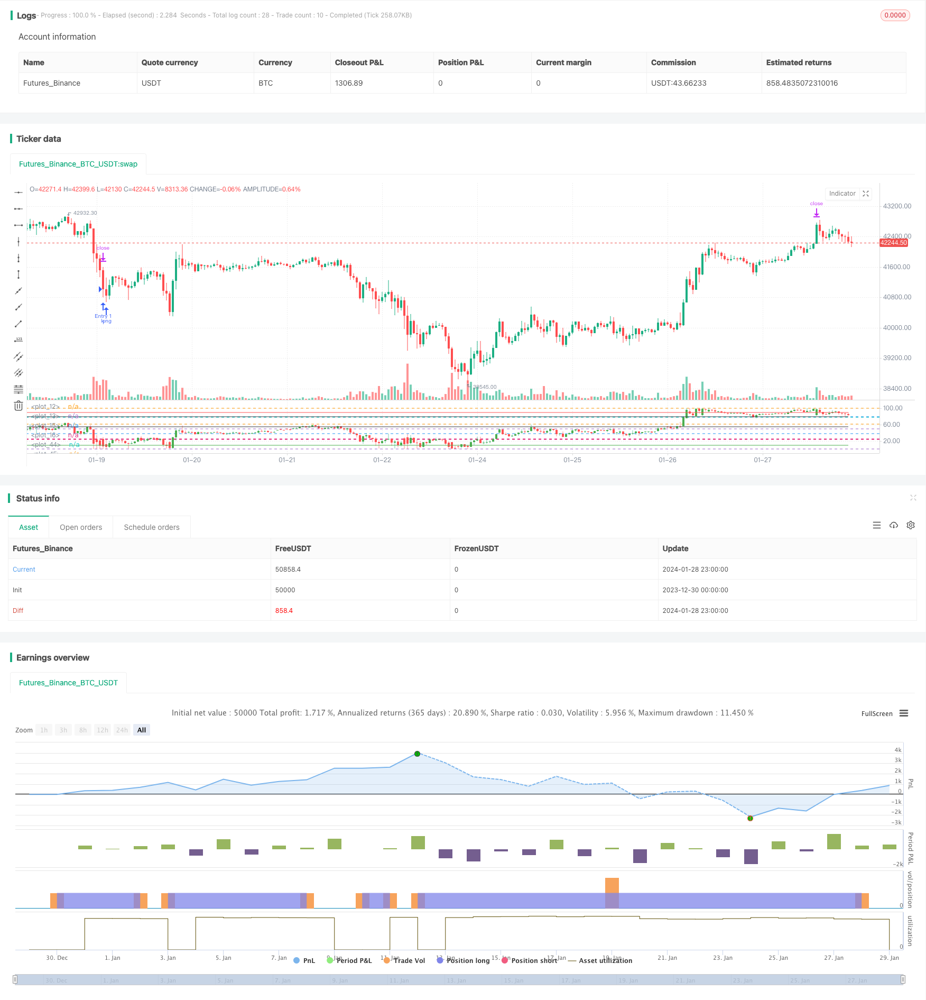

> Name

Stock trading two-way pyramid strategy based on RSI indicatorRSI-Indicator-Based-Stock-Trading-Pyramiding-Strategy
> Author

ChaoZhang

> Strategy Description


 [trans]
## Overview
This article mainly introduces a two-way pyramid strategy for stock trading designed based on the Relative Strength Index (RSI). This strategy uses the RSI indicator to determine the overbought and oversold areas of the stock, and cooperates with the pyramid positioning principle to achieve profits.
## Strategy Principle
- Use the RSI indicator to determine whether a stock has entered overbought or oversold territory. When the RSI is below 25, it is oversold, and when it is above 80, it is overbought.
- When the RSI enters the oversold zone, start a long entry. When the RSI enters the overbought zone, start shorting.
- Using the pyramid method of adding positions, you can add positions up to 7 times. Set a stop-profit and stop-loss point every time you add a position.
## Advantage Analysis
- Using the RSI indicator to determine overbought and oversold areas can capture larger price reversal opportunities.
- The pyramid method of adding positions can obtain a better rate of return when the market is correct.
- Set a stop-profit and stop-loss after each additional position to control risks.
## Risk Analysis
- The effect of the RSI indicator on determining overbought and oversold is unstable and may cause false signals.
- It is necessary to set the number of positions reasonably. The risk of adding too many positions will increase.  
- The stop loss point setting needs to consider volatility and cannot be set too small.
## Optimization direction
- You can consider filtering RSI signals in combination with other indicators to improve the accuracy of judging overbought and oversold. For example, the cooperation of KDJ, BOLL and other indicators.
- Floating stops can be set to track the price. Dynamically adjust according to volatility and risk control requirements.  
- Consider using adaptive parameters based on market conditions (bull market, bear market, etc.).
## Summarize
This strategy combines the RSI indicator with the pyramid position adding strategy. It can obtain more profits by adding positions while judging overbought and oversold. Although the accuracy of RSI judgment needs to be improved, a stable trading strategy can be formed through reasonable parameter optimization and combination with other indicators. This strategy has certain universality and is a relatively simple and direct quantitative trading method.
||

## Overview

This article mainly introduces a stock trading pyramiding strategy designed based on the Relative Strength Index (RSI) indicator. The strategy uses the RSI indicator to determine overbought and oversold areas of stocks and implements profit making through pyramiding principles.

## Strategy Principle  

- Use the RSI indicator to judge whether the stock has entered the overbought or oversold area. RSI below 25 is oversold, and above 80 is overbought.
- When the RSI enters the oversold area, start going long. When the RSI enters the overbought area, start going short.
- Adopt the pyramiding method, with up to 7 additional purchases. Set take profit and stop loss points after each additional purchase.

## Advantage Analysis

- Using the RSI indicator to determine the overbought and oversold areas can capture larger price reversal opportunities.
- The pyramiding method can obtain relatively better returns when the market moves correctly.  
- Setting take profit and stop loss after each additional purchase can control risks.

## Risk Analysis  

- The effect of RSI indicator to determine overbought and oversold areas is unstable, and wrong signals may occur.
- The number of additional purchases needs to be set reasonably, too many additional purchases will increase risks.
- The setting of stop loss points needs to consider volatility, cannot be set too small.  

## Optimization Directions

- Consider combining other indicators to filter RSI signals and improve the accuracy of determining overbought and oversold statuses. Such as KDJ, BOLL and other indicators.
- Can set floating stop loss to track price. Adjust dynamically according to volatility and risk control requirements.
- Consider using adaptive parameters based on market conditions (bull market, bear market, etc.).  

## Summary  

This strategy combines the RSI indicator with the pyramiding strategy. While judging the overbought and oversold statuses, it can obtain more returns through additional purchases. Although the accuracy of RSI judgment needs to be improved, through reasonable parameter optimization and combination with other indicators, it can form an effective trading strategy. This strategy has some universality and is a relatively simple and straightforward quantitative trading method.

[/trans]

> Strategy Arguments


|Argument|Default|Description|
|----|----|----|
|v_input_1|80|OverBought|
|v_input_2|25|OverSold|
|v_input_3|5|RSI Length|
|v_input_4|3|ProfitTarget_Percent|
|v_input_5|10|LossTarget_Percent|


> Source (PineScript)

``` pinescript
/*backtest
start: 2023-12-30 00:00:00
end: 2024-01-29 00:00:00
period: 1h
basePeriod: 15m
exchanges: [{"eid":"Futures_Binance","currency":"BTC_USDT"}]
*/

//@version=4
// This source code is subject to the terms of the Mozilla Public License 2.0 at https://mozilla.org/MPL/2.0/
// © RafaelZioni

strategy(title='Simple RSI strategy', overlay=false)

SWperiod = 1
look = 0
OverBought = input(80, minval=50)
OverSold = input(25, maxval=50)

bandmx = hline(100)
bandmn = hline(0)

band1 = hline(OverBought)
band0 = hline(OverSold)
//band50 = hline(50, color=black, linewidth=1)
fill(band1, band0, color=color.purple, transp=98)


src = close
len = input(5, minval=1, title="RSI Length")
up = rma(max(change(src), 0), len)
down = rma(-min(change(src), 0), len)
rsi = down == 0 ? 100 : up == 0 ? 0 : 100 - 100 / (1 + up / down)

p = 100

//scale
hh = highest(high, p)
ll = lowest(low, p)
scale = hh - ll

//dynamic OHLC
dyno = (open - ll) / scale * 100
dynl = (low - ll) / scale * 100
dynh = (high - ll) / scale * 100
dync = (close - ll) / scale * 100

//candle color
color_1 = close > open ? 1 : 0

//drawcandle
hline(78.6)
hline(61.8)
hline(50)
hline(38.2)
hline(23.6)
plotcandle(dyno, dynh, dynl, dync, title="Candle", color=color_1 == 1 ? color.green : color.red)
plot(10, color=color.green)
plot(55, color=color.black)
plot(80, color=color.black)
plot(90, color=color.red)

long = rsi <= OverSold ? 5 : na

//Strategy
golong = rsi <= OverSold ? 5 : na

longsignal = golong  
//based on https://www.tradingview.com/script/7NNJ0sXB-Pyramiding-Entries-On-Early-Trends-by-Coinrule/
//set take profit

ProfitTarget_Percent = input(3)
Profit_Ticks = close * (ProfitTarget_Percent / 100) / syminfo.mintick

//set take profit

LossTarget_Percent = input(10)
Loss_Ticks = close * (LossTarget_Percent / 100) / syminfo.mintick


//Order Placing

strategy.entry("Entry 1", strategy.long, when=strategy.opentrades == 0 and longsignal)

strategy.entry("Entry 2", strategy.long, when=strategy.opentrades == 1 and longsignal)

strategy.entry("Entry 3", strategy.long, when=strategy.opentrades == 2 and longsignal)

strategy.entry("Entry 4", strategy.long, when=strategy.opentrades == 3 and longsignal)

strategy.entry("Entry 5", strategy.long, when=strategy.opentrades == 4 and longsignal)

strategy.entry("Entry 6", strategy.long, when=strategy.opentrades == 5 and longsignal)

strategy.entry("Entry 7", strategy.long, when=strategy.opentrades == 6 and longsignal)


if strategy.position_size > 0
    strategy.exit(id="Exit 1", from_entry="Entry 1", profit=Profit_Ticks, loss=Loss_Ticks)
    strategy.exit(id="Exit 2", from_entry="Entry 2", profit=Profit_Ticks, loss=Loss_Ticks)
    strategy.exit(id="Exit 3", from_entry="Entry 3", profit=Profit_Ticks, loss=Loss_Ticks)
    strategy.exit(id="Exit 4", from_entry="Entry 4", profit=Profit_Ticks, loss=Loss_Ticks)
    strategy.exit(id="Exit 5", from_entry="Entry 5", profit=Profit_Ticks, loss=Loss_Ticks)
    strategy.exit(id="Exit 6", from_entry="Entry 6", profit=Profit_Ticks, loss=Loss_Ticks)
    strategy.exit(id="Exit 7", from_entry="Entry 7", profit=Profit_Ticks, loss=Loss_Ticks)

```

> Detail

https://www.fmz.com/strategy/440430

> Last Modified

2024-01-30 15:26:49
