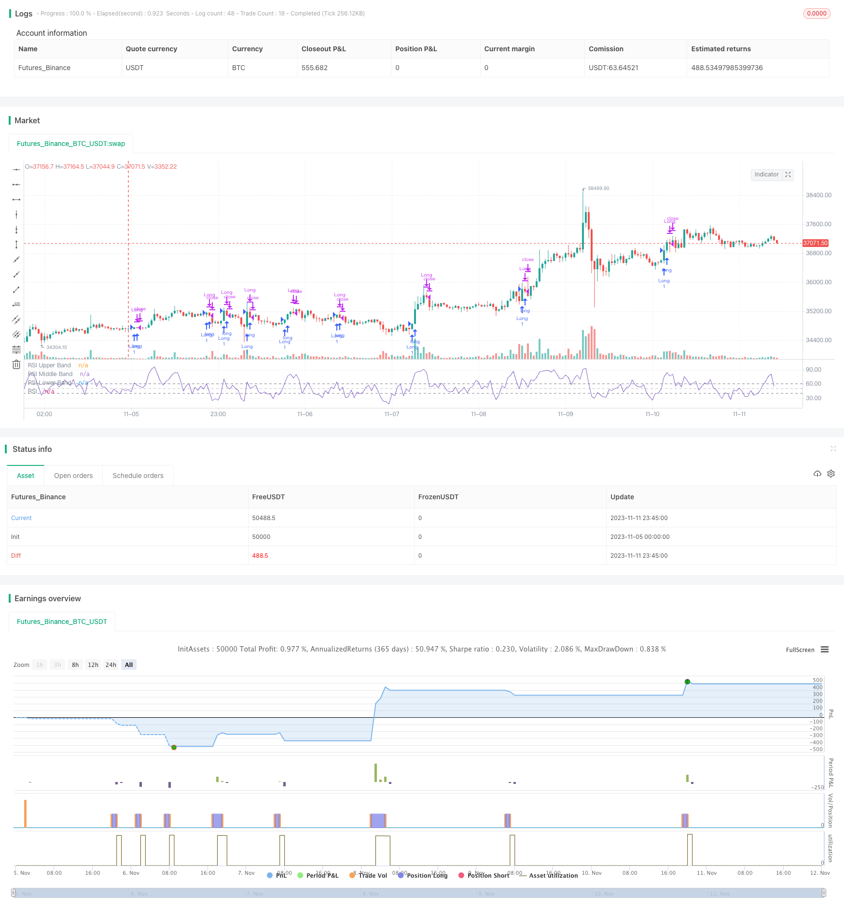

> Name

RSI Pullback Breakout Strategy RSI-Pullback-Breakout-Strategy
> Author

ChaoZhang

> Strategy Description


[trans]

## Overview
The RSI Pullback Breakout Strategy is a short-term trading strategy based on the Relative Strength Index (RSI). This strategy uses the RSI indicator to identify oversold and oversold opportunities. When the stock price is oversold and pulls back, it looks for opportunities for the RSI indicator to break through from a low level to enter the market, and gain profits by capturing the short-term rebound of the stock price.
## Strategy Principle
This strategy uses the RSI indicator to determine when to buy. The specific logic is:
1. Use the RSI indicator with length=5. When the RSI rises above 60 from the low level, it is regarded as a buy signal.
2. When the RSI exceeds 60, it means that the stock is seriously oversold in the short term, indicating that it is a weak stock. At this time, the RSI exceeds 60, which is expected to represent a rebound in the stock price.
3. Open a long position when the RSI exceeds 60, and use a market order to buy the entire position.
4. When RSI falls below its previous period value again, it is regarded as an exit signal, that is, RSI < RSI[1], and a closing order is issued.
This strategy mainly relies on the RSI indicator to identify short-term oversold callback opportunities and gain profits by capturing rebounds. When the stock price continues to fall and the RSI enters the oversold zone, the timing of the rebound can be judged by the callback breakthrough of the RSI indicator.
## Advantage Analysis
This strategy has the following advantages:
1. The strategic ideas are simple and clear, easy to understand and implement, and suitable for novices to learn;
2. It uses the mature indicator RSI, which has certain practicality;
3. Use RSI callback breakthrough to determine the buying point, and you can filtrate some oversold rebound opportunities;
4. The strategic operation frequency is high, suitable for short-term trading, and can capture severe short-term price fluctuations;
5. The strategic risk is controllable, and stop-loss methods are used to control losses.
## Risk Analysis
There are also some risks with this strategy:
1. The RSI indicator has a certain degree of lag, which may lead to deviations in the buying point;
2. The stock price rebound may not be sustainable, and there is a possibility that the stock price will fall below the stop loss point again;
3. The transaction frequency is high, and transaction costs may be relatively high;
4. Strategy parameters need to be continuously optimized, such as RSI length, buying conditions, etc.;
5. The judgment of long and short is based on a single basis. When the market continues to rise, the strategy may produce too many false signals.
## Optimization direction
This strategy can also be optimized from the following directions:
1. Combine with trend indicator filtering to avoid being trapped in volatile market conditions.
2. Add a machine learning model for multi-factor prediction to improve buying accuracy.
3. Optimize the stop loss strategy and lock in more profits by moving the stop loss.
4. Appropriately adjust the position holding time and distinguish between long-term and short-term positions.
5. Add volatility filtering and only consider buying when there are large fluctuations.
## Summarize
Overall, this strategy is relatively simple and direct, and the buying opportunity is judged through the pullback and breakthrough of the RSI indicator. The strategy has certain practicality and can be used to find short-term oversold rebound opportunities. However, the RSI indicator itself has problems such as hysteresis and single long and short judgments. In the future, the strategy effect can be improved through multi-factor prediction, stop loss optimization, trend filtering and other methods.
|| 

## Overview

The RSI pullback breakout strategy is a short-term trading strategy based on the Relative Strength Index (RSI) indicator. It identifies oversold pullback opportunities by looking for RSI breakouts on the upside after the price has declined sharply, aiming to capture rebounds for profits.

## Strategy Logic

The strategy determines entry signals based on the RSI indicator. The specific logic is:

1. Use RSI with a length of 5. A breakout above 60 on the RSI is considered a buy signal.

2. The RSI breaking above 60 represents the stock has declined significantly in the short term, performing weakly. The RSI crossing above 60 may signal a price bounce. 

3. When RSI breaks through 60, open a long position using market orders.

4. When RSI falls back below its value from the previous period, i.e. RSI < RSI[1], it is considered an exit signal to close positions.

The strategy mainly relies on RSI to identify short-term oversold pullback opportunities, capturing rebounds for profits. It uses RSI pullbacks to determine timing of rebounds after successive price declines have pushed RSI into oversold levels.

## Advantage Analysis 

The advantages of this strategy include:

1. The logic is simple and clear, easy to understand and implement, suitable for beginners.

2. It uses the mature RSI indicator, providing some practical utility.

3. RSI pullback breakouts help identify some oversold bounce opportunities. 

4. High trading frequency allows capturing short-term price swings.

5. Controllable risk due to use of stop losses.

## Risk Analysis

There are also some risks:

1. RSI has some lag, which may cause inaccurate entry signals.

2. Price bounces may not sustain and could re-break stop loss levels.

3. High trading frequency leads to possibly high transaction costs. 

4. Parameters like RSI length, entry criteria need continuous optimization.

5. Singular long/short basis means too many false signals in persistent uptrend/downtrend.

## Enhancement Opportunities

Some ways to enhance the strategy:

1. Add trend filter to avoid whipsaws in range-bound periods. 

2. Incorporate machine learning models for multifactor prediction to improve entry accuracy.

3. Optimize stop loss for locking in more profits using trailing stops.

4. Adjust holding period for long-term vs short-term holdings. 

5. Add volatility filter to only consider buying after sharp declines.

## Summary 

The strategy is relatively simple and direct, using RSI pullback breakouts to determine entries. It has some practical utility in identifying short-term oversold bounces. However, inherent lag in RSI and singular long/short basis are issues. Enhancements like multifactor prediction, stop loss optimization, trend filters can improve strategy performance.

[/trans]

> Strategy Arguments


|Argument|Default|Description|
|----|----|----|
|v_input_1|5|RSI Length|


> Source (PineScript)

``` pinescript
/*backtest
start: 2023-11-05 00:00:00
end: 2023-11-12 00:00:00
period: 45m
basePeriod: 5m
exchanges: [{"eid":"Futures_Binance","currency":"BTC_USDT"}]
*/

//@version=5
strategy("*RSI 5 - Long only- Daily charts & above*", overlay = false)

// Define inputs
rsi_length = input(5, "RSI Length")

// Calculate indicators
rsi = ta.rsi(close, rsi_length)

// Entry conditions
long = rsi[1] < 50 and rsi > 60

// Exit conditions
longExit = rsi < rsi[1] 


// Execute trade with adjusted position size
if (long) 
    strategy.entry("Long", strategy.long)
    
    
if  (longExit)
	strategy.close("LongExit")


// Close long position if long exit condition is met
if (longExit)
    strategy.close("Long", comment="Long exit")

rsiPlot = plot(rsi, "RSI", color=#7E57C2)
rsiUpperBand = hline(60, "RSI Upper Band", color=#787B86)
midline = hline(50, "RSI Middle Band", color=color.new(#787B86, 50))
rsiLowerBand = hline(40, "RSI Lower Band", color=#787B86)
fill(rsiUpperBand, rsiLowerBand, color=color.rgb(126, 87, 194, 90), title="RSI Background Fill")


```

> Detail

https://www.fmz.com/strategy/431889

> Last Modified

2023-11-13 10:15:48
