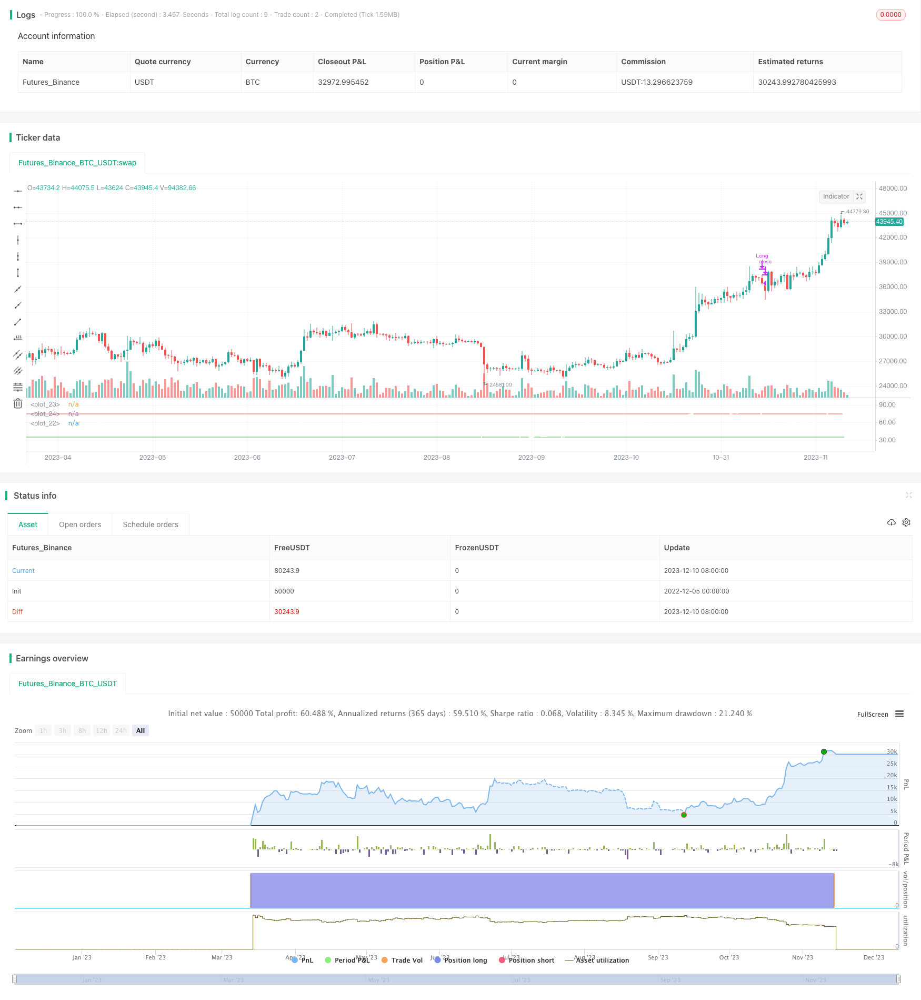

> Name

RSI Trend Following Cryptocurrency Strategy RSI-Trend-Following-Crypto-Strategy
> Author

ChaoZhang

> Strategy Description


[trans]

## Overview
The RSI Trend Following Cryptocurrency Strategy is a simple yet highly effective cryptocurrency trading strategy based on the Relative Strength Index (RSI). It uses the RSI indicator to determine the price trend of cryptocurrencies, longs the cryptocurrency when the RSI indicator appears a golden cross, and closes the position when the RSI indicator appears a dead cross. This strategy is suitable for tracking the medium and long-term trends of cryptocurrency and can obtain higher returns.
## Strategy Principle
The core indicator of the RSI trend-following cryptocurrency strategy is the 14-period RSI. It determines the long-short crossover of the RSI indicator to determine cryptocurrency price trends. The specific trading rules are as follows:
Long rule: go long when the RSI indicator crosses 35
Closing rules: Close the position when the RSI indicator crosses 75
Stop loss rule: Stop loss when the RSI indicator falls below 10 (this rule is optional)
This strategy assumes that when the RSI indicator crosses 35, it indicates that the cryptocurrency is in an oversold state, and the price may form a bottom and rebound and rise; when the RSI indicator crosses below 75, it indicates that the cryptocurrency is in an overbought state, and the price may peak and fall. By capturing overbought and oversold opportunities, you can follow the mid- and long-term trends of cryptocurrencies and gain greater profits.
## Strategic Advantages
The RSI trend following cryptocurrency strategy offers the following advantages:
1. The strategy logic is simple and clear, easy to understand and implement
2. Can effectively identify the medium and long-term trends of cryptocurrency prices
3. The RSI indicator parameters have been optimized and the performance is relatively reliable.
4. The return risk is relatively high, so it is suitable for investors who pursue high returns.
5. The strategy shows long-term sustained profitability and good stability.
## Strategy Risk
RSI trend-following cryptocurrency strategies also have certain risks:
1. Unable to cope with severe price fluctuations
2. Improper setting of entry and stop loss points may lead to unnecessary losses
3. Long-short crosses produce false signals, which may lead to trading errors.
4. When the market reverses sharply, large losses may occur
In order to resolve the above risks, you can consider optimizing strategies, such as adjusting parameter settings, setting stop loss points, adding filter conditions, etc., to make the strategy more stable.
## Strategy optimization direction
The RSI trend-following cryptocurrency strategy can be further optimized:
1. Adjust RSI parameters and optimize buying and selling parameter settings
2. Add trend filter indicators to avoid losses caused by sharp market reversals.
3. Combine with trading volume indicators to avoid false breakthroughs
4. Use the exponential moving average indicator to more reliably judge the long-term price trend
5. Use machine learning algorithms to dynamically optimize RSI trading parameters
Through the above optimization measures, transaction risks can be reduced, strategy stability can be improved, and better returns can be obtained.
## Summarize
The RSI trend following cryptocurrency strategy is a simple and practical strategy for judging price trends based on the RSI indicator. It trades with the trend by capturing overbought and oversold conditions, and can effectively obtain the mid- and long-term trend profits of cryptocurrency. Although there is a certain degree of market reversal risk, risks can be reduced and strategy stability improved through parameter optimization and adding filter conditions. This strategy is suitable for investors with certain quantitative trading foundation and risk tolerance.
||

## Overview

The RSI Trend Following Crypto Strategy is a simple yet effective crypto trading strategy based on the Relative Strength Index (RSI) indicator. It utilizes the RSI indicator to determine the price trend of cryptocurrencies, going long when the RSI crosses above 35 and closing positions when the RSI crosses below 75. This strategy is suitable for following medium- to long-term trends of cryptocurrencies and can generate decent profits.  

## Strategy Logic

The core indicator of the RSI Trend Following Crypto Strategy is the 14-period RSI. It determines the price trend of cryptocurrencies based on RSI crossovers. The specific trading rules are as follows:

Long entry rule: Go long when RSI crosses above 35  
Exit rule: Close long positions when RSI crosses below 75
Stop loss rule: Stop loss when RSI crosses below 10 (optional)

The strategy assumes that when RSI crosses above 35, it signals an oversold state and prices may bottom out and rebound upwards. When RSI crosses below 75, it indicates an overbought state and prices may top out and decline. By capturing overbought and oversold opportunities, decent profits can be made by following medium- to long-term cryptocurrency trends.

## Advantages

The RSI Trend Following Crypto Strategy has the following advantages:

1. The strategy logic is simple and easy to understand  
2. Can effectively identify medium- to long-term price trends of cryptocurrencies
3. The optimized RSI parameters lead to relatively reliable performance  
4. Higher risk-reward ratio, suitable for profit-seeking investors
5. Shows consistent long-term profitability and stability  

## Risks

There are also some risks associated with this strategy:  

1. Cannot handle extreme price swings  
2. Improper entry and stop loss levels may lead to unnecessary losses
3. RSI crossovers may generate false signals, causing trading mistakes
4. Severe trend reversals can lead to huge losses

To mitigate the above risks, the strategy can be optimized by adjusting parameters, setting stop losses, adding filters etc. to enhance stability.  

## Enhancement Areas

The RSI Trend Following Crypto Strategy can be further improved by:

1. Fine tuning RSI parameters and buying/selling levels  
2. Adding trend filtering indicators to avoid whipsaws 
3. Incorporating volume indicators to detect false breakouts
4. Using exponential moving averages for more reliable trend identification   
5. Employing machine learning to dynamically optimize RSI parameters  

With the above enhancements, trading risks can be reduced and stability improved to achieve better risk-adjusted returns.  

## Conclusion

The RSI Trend Following Crypto Strategy is an easy-to-use strategy that capitalizes on overbought/oversold RSI conditions to trade along the trend. Although exposed to some degree of trend reversal risks, parameter optimization and adding filters can lower risks and enhance stability. It is suitable for investors with adequate quant trading knowledge and risk appetite.

[/trans]

> Strategy Arguments


|Argument|Default|Description|
|----|----|----|
|v_input_1|false|Use Emergency Exit?|
|v_input_2|35|RSI Long Cross|
|v_input_3|75|RSI Close Position|
|v_input_4|10|RSI Emergency Close Position|


> Source (PineScript)

``` pinescript
/*backtest
start: 2022-12-05 00:00:00
end: 2023-12-11 00:00:00
period: 1d
basePeriod: 1h
exchanges: [{"eid":"Futures_Binance","currency":"BTC_USDT"}]
*/

// This source code is subject to the terms of the Mozilla Public License 2.0 at https://mozilla.org/MPL/2.0/
// © FieryTrading

//@version=4
strategy("RSI Trend Crypto", overlay=false, pyramiding=1, commission_value=0.2, default_qty_type=strategy.percent_of_equity, default_qty_value=100)

// Input
UseEmergency = input(false, "Use Emergency Exit?")
RSIlong = input(35, "RSI Long Cross")
RSIclose = input(75, "RSI Close Position")
Emergencyclose = input(10, "RSI Emergency Close Position")

// RSI
rsi = rsi(close, 14)

// Conditions
long = crossover(rsi, RSIlong)
longclose = crossunder(rsi, RSIclose)
emergency = crossunder(rsi, Emergencyclose)

// Plots
plot(rsi, color=color.white, linewidth=2)
plot(RSIlong, color=color.green)
plot(RSIclose, color=color.red)

// Alert messages 
// When using a bot remember to use "{{strategy.order.alert_message}}" in your alert
// You can edit the alert message freely to suit your needs

LongAlert = 'RSI Long Cross: LONG'
CloseAlert = 'RSI Close Position'
EmergencyAlert = 'RSI Emergency Close'

// Strategy
if long
    strategy.entry("Long", strategy.long, alert_message=LongAlert)

if longclose
    strategy.close("Long", alert_message=CloseAlert)

if emergency and UseEmergency==true
    strategy.close("Long", alert_message=EmergencyAlert)


```

> Detail

https://www.fmz.com/strategy/435146

> Last Modified

2023-12-12 16:26:49
