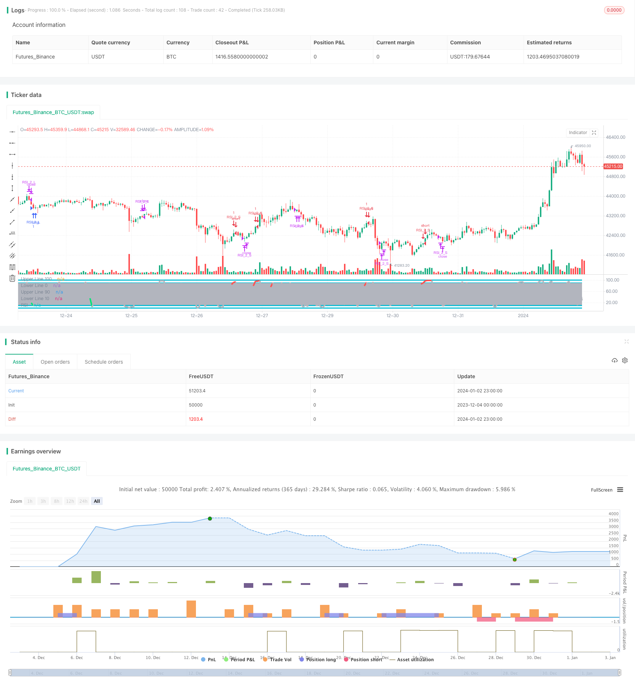

> Name

Resistance and Support Led Larim Cross RSI Strategy RSIndex-and-Moving-Average-Combination-Strategy
> Author

ChaoZhang

> Strategy Description


[trans]

### Overview
This strategy finds buying and selling points by calculating the moving average of the price and the relative strength indicator RSI. When the RSI indicator is in an overbought and oversold state, it sends buy and sell signals. It also uses Bollinger Bands to determine the support and resistance areas of the price, thereby filtering out some noise trading signals.
### Strategy Principles
This strategy is mainly based on the combined use of the RSI indicator and multiple moving averages with different periods. Specifically, it calculates multiple MAs from the 1-day line to the 200-day line, as well as the RSI indicator. A buy signal is generated when price crosses above the 200-day moving average and the RSI indicator is less than 10. A sell signal is generated when the price breaks below the 5-day moving average and the 1-day moving average crosses below the 3-day moving average.
This strategy uses both Bollinger Bands to identify support and resistance areas for price. Bollinger Bands consist of a middle rail, a top rail, and a bottom rail. When the price is close to the upper band, the stock is considered to be overvalued, and when the price is close to the lower band, the stock is undervalued. So Bollinger Bands are a good judge of the relative value of stocks right now.
### Advantage Analysis
1. Use the RSI indicator to determine overbought and oversold areas. This is a classic econometric strategy that can capture price reversal opportunities.
2. Combining multiple MA average lines can enhance the FILTER FILTERING function and avoid being trapped.
3. Add Bollinger Bands to determine support and resistance areas, which can further avoid chasing high at high levels and chasing low at low levels, and filter out noisy trading signals.
### Risk Analysis
1. The RSI indicator is prone to produce error signals and needs to be judged based on the actual price trend.
2. The MA moving average is often used to determine the trend, but when the price diverges from the MA, the trend turning point will be misjudged.
3. Bollinger Bands have hysteresis in determining the support and resistance of the upper and lower rails, and cannot accurately determine the temporary high and low points of extrema.
4. This strategy adopts a short holding period and may be easily disturbed by short-term market noise.
### Optimization direction
1. You can test to appropriately extend the position period, such as changing the closing line to the 10-day line or the 20-day line.
2. You can test and adjust the RSI parameters, such as changing to (3,5) parameters or (2,8) parameters.
3. You can try to increase the Bollinger Bands parameter to obtain more obvious support and resistance zones.
4. You can test the combination of other indicators and RSI indicators, such as KDJ indicator, MACD indicator, etc.
5. The combination of RSI and OBV can be tested.
### Summarize
This strategy is generally more classic and robust. It uses the advantages of a variety of different indicators to make the buying and selling signals more accurate and reliable. There are also some directions that need to be optimized. The key is to grasp the trend judgment function of the RSI indicator and the Bollinger Bands judgment of support and resistance areas. Through appropriate parameter adjustment and indicator combination optimization, this strategy can achieve better results.
||

## Overview  

This strategy generates trading signals by calculating the moving average lines and the relative strength index (RSI) of prices to identify buying and selling points. It issues buy and sell signals when the RSI indicator reaches overbought or oversold levels. Meanwhile, it uses Bollinger Bands to determine the support and resistance levels of prices to filter out some noisy trading signals.

## Strategy Principle

This strategy is mainly based on the combination of the RSI indicator and multiple moving average lines with different periods. Specifically, it calculates multiple MAs from 1-day to 200-day and the RSI indicator. It generates a buy signal when the price crosses above the 200-day moving average and the RSI indicator drops below 10. It generates a sell signal when the price breaks below the 5-day moving average and the 1-day MA crosses below the 3-day MA.  

This strategy also uses Bollinger Bands to determine the support and resistance levels of prices. Bollinger Bands consist of a middle band, an upper band and a lower band. When the price approaches the upper band, the stock is viewed as overvalued. When the price approaches the lower band, the stock is viewed as undervalued. So Bollinger Bands can effectively judge the relative value of the stock.

## Advantage Analysis

1. Using the RSI indicator to determine overbought and oversold levels is a classic econometric strategy that can capture price reversal opportunities.

2. Combining multiple MA lines can enhance the filtering function and avoid being trapped.  

3. Adding Bollinger Bands to determine support and resistance levels can further avoid chasing high prices and chasing low prices, filtering out noisy trading signals.

## Risk Analysis  

1. RSI indicators can easily generate erroneous signals and need to be combined with price action to determine.

2. MA lines are often used to determine trends, but divergence between price and MA may wrongly judge turning points.  

3. Determining support and resistance levels using Bollinger Bands upper and lower rails has lagging features and may not accurately determine temporary high and low extrema points.

4. This strategy adopts a relatively short holding period and may be easily disturbed by short-term market noise.

## Optimization Directions   

1. Can test appropriately extending the holding period, such as changing the closing line to 10-day or 20-day line.

2. Can test adjusting RSI parameters, such as changing to (3,5) parameters or (2,8) parameters. 

3. Can try increasing Bollinger Bands parameters to obtain more obvious support and resistance intervals.  

4. Can test combinations of other indicators with RSI, such as KDJ indicator, MACD indicator, etc.

5. Can test the combination of RSI and the volume indicator OBV.  

## Summary  

The strategy is relatively classic and robust as a whole, taking advantage of different indicators to make trading signals more accurate and reliable. There are also some directions that need optimization. The key is to grasp the trend judgment function of the RSI indicator and Bollinger Bands' judgement on support and resistance levels. Through appropriate parameter adjustment and indicator combination optimization, this strategy can achieve better results.

[/trans]


> Source (PineScript)

``` pinescript
/*backtest
start: 2023-12-04 00:00:00
end: 2024-01-03 00:00:00
period: 1h
basePeriod: 15m
exchanges: [{"eid":"Futures_Binance","currency":"BTC_USDT"}]
*/

//@version=2
//Created by ChrisMoody
//Based on Larry Connors RSI-2 Strategy - Lower RSI
strategy(title="_CM_RSI_2_Strat_Low", shorttitle="_CM_RSI_2_Strategy_Lower", overlay=false)
src = close, 

//RSI CODE
up = rma(max(change(src), 0), 2)                
down = rma(-min(change(src), 0), 2)
rsi = down == 0 ? 100 : up == 0 ? 0 : 100 - (100 / (1 + up / down))
//Criteria for Moving Avg rules
ma1 = sma(close,1)
ma2 = sma(close,2)
ma3 = sma(close,3)
ma4 = sma(close,4)
ma5 = sma(close,5)
ma6 = sma(close,6)
ma7 = sma(close,7)
ma8 = sma(close,8)
ma9 = sma(close,9)
ma200= sma(close, 120)

//Rule for RSI Color
col = close > ma200 and close < ma5 and rsi < 10 ? lime : close < ma200 and close > ma5 and rsi > 90 ? red : silver

plot(rsi, title="RSI", style=line, linewidth=4,color=col)
plot(100, title="Upper Line 100",style=line, linewidth=3, color=aqua)
plot(0, title="Lower Line 0",style=line, linewidth=3, color=aqua)

band1 = plot(90, title="Upper Line 90",style=line, linewidth=3, color=aqua)
band0 = plot(10, title="Lower Line 10",style=line, linewidth=3, color=aqua)
fill(band1, band0, color=silver, transp=90)

///////////// RSI + Bollinger Bands Strategy


if (close > ma200 and rsi < 10 and rsi >1)
    strategy.entry("RSI_2_L", strategy.long, comment="Bullish")
if (close < ma200 and rsi > 90 and rsi <98)
    strategy.entry("RSI_2_S", strategy.short, comment="Bearish")


strategy.close("RSI_2_L", when = close > ma5 and ma1 < ma3)
strategy.close("RSI_2_S", when = close < ma5 and ma1 > ma2)

```

> Detail

https://www.fmz.com/strategy/437685

> Last Modified

2024-01-04 17:46:07
