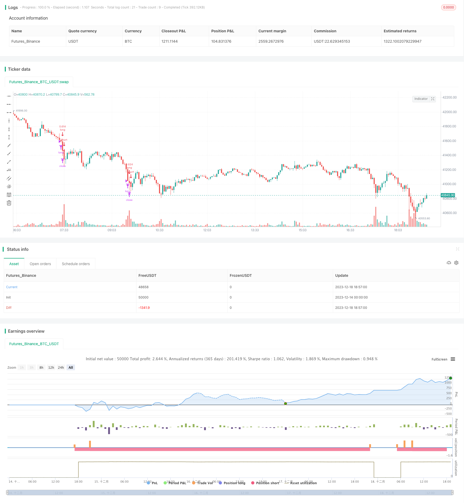

> Name

Reversal-Breakout-Oversold-RSI-Strategy
> Author

ChaoZhang

> Strategy Description


[trans]

## Overview
The reversal breakout RSI oversold strategy is an algorithmic trading strategy that uses the relative strength index (RSI) indicator to determine oversold conditions and enter a long position when the price reverses. This strategy sets the RSI threshold to 30. When the RSI is lower than 30, it is judged to be oversold, and a long position is opened at this time. The strategy locks in profits through strict stop-loss and take-profit rules.
## Strategy Principle
The Reversal Breakout RSI Oversold Strategy uses the 14-period RSI indicator. When the RSI indicator is below 30, it is judged to be oversold. This indicates that the price has continued to fall some time ago and is currently oversold. The market is about to reverse and the price is likely to turn upward. The strategy starts to go long at this time to seek reversal opportunities.
Specifically, when RSI <30 and it is in the backtesting time window, a long signal will be triggered to open a position. Then set the stop loss level to 1% below the entry price and the take profit level to 7% above the entry price. Close the position when the price is higher than the take-profit level or lower than the stop-loss level.
The entire strategy achieves capital growth by determining the oversold reversal point, entering the market, and setting stop loss and take profit to lock in profits.
## Advantage Analysis
The reversal breakout RSI oversold strategy has the following advantages:
1. Capturing the long opportunities brought by oversold reversals is a relatively reliable trading strategy.
2. Using the RSI indicator to identify entry points is more professional than directly judging the price to open a position.
3. Strict stop loss and take profit settings can effectively control the risk and profit of a single transaction.
4. Backtest data shows that this strategy has higher returns and winning rates.
5. It is easy to understand and can be used by newcomers.
## Risk Analysis
There are also some risks in the reversal breakout RSI oversold strategy, mainly as follows:
1. The probability of price reversal failure still exists. Although RSI below 30 will increase the probability of reversal, the market environment is complex and changeable, and reversal failure may also occur. At this time, stop loss will be triggered.
2. If the stop loss point is too close, the probability of stop loss collision is high. The stop loss range can be appropriately relaxed.
3. Improper setting of the backtest time window may bias the test results. The backtest cycle should be adjusted to comprehensively evaluate the effectiveness of the strategy.
4. Improper transaction currency will also have an impact on income. This strategy is best suited for trading volatile currencies.
## Optimization direction
There is still some room for optimization in the reversal breakout RSI oversold strategy:
1. Adjust RSI parameters and test the impact of different parameters on strategy returns.
2. Test different trading pairs and choose currencies with greater volatility.
3. Adjust the stop loss and take profit parameters to find the optimal parameter combination. Appropriately expanding the stop loss range is also a direction.
4. Add other indicator filters, such as entering the market only after the price breaks through a certain moving average.
5. Test different time period parameters to find the best entry opportunity.
## Summarize
The RSI oversold reversal breakthrough strategy is generally easy to understand and operate, and you can gain profits by capturing oversold reversal opportunities. The biggest advantage of the strategy is that it is easy to master and can be used by novices. At the same time, strict stop-loss and stop-profit mechanisms also make risks controllable. The next step can be to optimize the parameters by adjusting parameters and adding filtering indicators to make the strategy more effective.
||

## Overview

The Reversal Breakout Oversold RSI strategy is an algorithmic trading strategy that uses the Relative Strength Index (RSI) indicator to determine oversold situations and goes long when prices reverse. The strategy sets the RSI threshold at 30 - when the RSI is below 30, it is considered oversold, and at that time a long position is opened. The strategy locks in profits through strict stop loss and take profit rules.

## Strategy Logic

The Reversal Breakout Oversold RSI strategy uses a 14-period RSI indicator. When the RSI falls below 30, it is judged to be oversold. This indicates that prices have been falling continuously over the previous period and are currently in an oversold state, so the market is about to reverse and prices are likely to start rising. The strategy opens a long position at this time to seek reversal opportunities.

Specifically, when RSI <30 and within the backtest time window, a long signal is triggered to open a position. Then set the stop loss at 1% below the entry price and take profit at 7% above. When the price rises above the take profit or falls below the stop loss, close the position.

The whole strategy grows capital by identifying oversold reversal entry points and setting stop losses and take profits to lock in profits.

## Advantage Analysis 

The Reversal Breakout Oversold RSI Strategy has the following advantages:

1. Captures long opportunities brought about by oversold reversals, which is a relatively reliable trading strategy.

2. Uses the RSI indicator to identify entry points, which is more professional than direct price action.

3. Strict stop loss and take profit settings effectively control the risk and profit of each trade.

4. Backtest data shows that the strategy has high returns and win rate.  

5. Easy to understand, beginners can use it easily.

## Risk Analysis

The Reversal Breakout Oversold RSI strategy also has some risks:   

1. There is still a probability that the price reversal will fail. Although RSI below 30 increases the probability of reversal, market conditions are complex and changeable, and failures can still occur, triggering the stop loss at this time.

2. The stop loss point is too close with a high probability of stop loss clustering occurring. The stop loss amplitude can be appropriately relaxed.

3. Improper backtest time window settings can bias test results. The backtest period should be adjusted to fully evaluate strategy performance.  

4. Improper selection of trading tokens can also affect profits. This strategy works best on more volatile coins.

## Optimization

There is still room for optimization of the Reversal Breakout Oversold RSI Strategy:  

1. Adjust RSI parameters and test the impact of different parameters on strategy returns.

2. Test different trading pairs and select more volatile coins.  

3. Adjust stop loss and take profit parameters to find the optimal parameter combination. Appropriately widening the stop loss amplitude is also a direction.

4. Add other indicators filters, such as only entering after the price breaks a certain moving average.
  
5. Test different time period parameters to find the best entry timing.

## Summary

The Reversal Breakout Oversold RSI strategy is easy to understand and operate overall, capturing reversal opportunities from oversold situations to make profits. The biggest advantage of the strategy is that it is easy to grasp even for beginners. At the same time, the strict stop loss and take profit mechanism also makes the risk controllable. The next step is to optimize from directions like adjusting parameters and adding filter indicators to make the strategy performance even better.

[/trans]

> Strategy Arguments


|Argument|Default|Description|
|----|----|----|
|v_input_1|true|From Month|
|v_input_2|true|From Day|
|v_input_3|2020|From Year|
|v_input_4|true|Thru Month|
|v_input_5|true|Thru Day|
|v_input_6|2112|Thru Year|
|v_input_7|true|Show Date Range|
|v_input_8|30|oversold|
|v_input_9|true|v_input_9|
|v_input_10|7|v_input_10|


> Source (PineScript)

``` pinescript
/*backtest
start: 2023-12-14 00:00:00
end: 2023-12-18 19:00:00
period: 3m
basePeriod: 1m
exchanges: [{"eid":"Futures_Binance","currency":"BTC_USDT"}]
*/

// This source code is subject to the terms of the Mozilla Public License 2.0 at https://mozilla.org/MPL/2.0/
// © brodieCoinrule

//@version=4
strategy(shorttitle='Oversold RSI with tight SL',title='Oversold RSI with tight SL Strategy (by Coinrule)', overlay=true, initial_capital = 1000, process_orders_on_close=true, default_qty_type = strategy.percent_of_equity, default_qty_value = 50, commission_type=strategy.commission.percent, commission_value=0.1)
//Backtest dates
fromMonth = input(defval = 1,    title = "From Month",      type = input.integer, minval = 1, maxval = 12)
fromDay   = input(defval = 1,    title = "From Day",        type = input.integer, minval = 1, maxval = 31)
fromYear  = input(defval = 2020, title = "From Year",       type = input.integer, minval = 1970)
thruMonth = input(defval = 1,    title = "Thru Month",      type = input.integer, minval = 1, maxval = 12)
thruDay   = input(defval = 1,    title = "Thru Day",        type = input.integer, minval = 1, maxval = 31)
thruYear  = input(defval = 2112, title = "Thru Year",       type = input.integer, minval = 1970)

showDate  = input(defval = true, title = "Show Date Range", type = input.bool)

start     = timestamp(fromYear, fromMonth, fromDay, 00, 00)        // backtest start window
finish    = timestamp(thruYear, thruMonth, thruDay, 23, 59)        // backtest finish window
window()  => time >= start and time <= finish ? true : false       // create function "within window of time"

perc_change(lkb) =>
    overall_change = ((close[0] - close[lkb]) / close[lkb]) * 100


// RSI inputs and calculations
lengthRSI = 14
RSI = rsi(close, lengthRSI)
oversold= input(30)


//Entry 
strategy.entry(id="long", long = true, when = RSI< oversold and window())

//Exit
Stop_loss= ((input (1))/100)
Take_profit= ((input (7)/100))

longStopPrice  = strategy.position_avg_price * (1 - Stop_loss)
longTakeProfit = strategy.position_avg_price * (1 + Take_profit)

strategy.close("long", when = close < longStopPrice or close > longTakeProfit and window())


```

> Detail

https://www.fmz.com/strategy/436250

> Last Modified

2023-12-22 15:00:48
