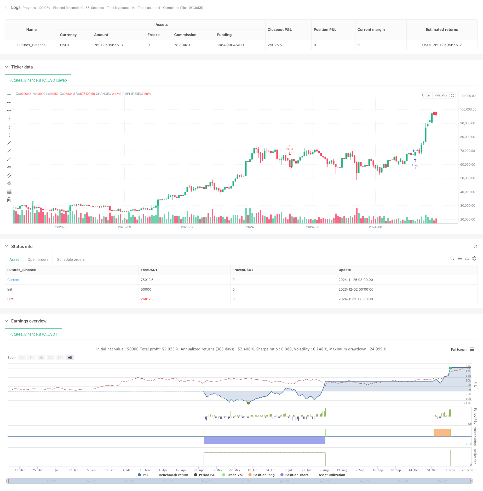

> Name

RSI-and-Supertrend-Trend-Following-Adaptive-Volatility-Strategy
> Author

ChaoZhang

> Strategy Description



[trans]
#### Overview
This strategy is a trend following system based on RSI and Supertrend indicators, combined with ATR volatility for risk management. The strategy determines entry timing by judging trend signals and overbought and oversold areas, and uses dynamic take-profit and stop-loss based on market volatility to manage risk. This strategy uses a 15-minute time period and uses a 15% money management rule by default.
#### Strategy Principle
The strategy is mainly based on the following core elements for trading:
1. Use the Supertrend indicator (parameter is 2.76) as the main trend judgment tool to generate trading signals when the direction changes.
2. Introduce the RSI indicator (period 12) as a filter to prevent counter-trend trading in overbought and oversold areas.
3. Use the ATR indicator (period 12) to dynamically calculate stop loss and take profit positions to provide a risk management framework
4. Long entry conditions: Supertrend instructions to buy and RSI below 70
5. Short entry conditions: Supertrend instructions to sell and RSI above 30
6. Stop loss is set to current price ±4 times ATR
7. Take profit is set to the current price ±2 or 2.237 times ATR
#### Strategic Advantages
1. Trend tracking combined with momentum filtering improves the reliability of trading signals
2. Dynamic stop-loss and stop-profit settings based on volatility, highly adaptable
3. Use percentage fund management to effectively control risk exposure
4. The indicator parameters have been optimized to reduce the impact of false signals.
5. The strategy logic is clear and easy to understand and implement.
6. Suitable for volatile market environments
#### Strategy Risk
1. A volatile market may produce frequent false breakthrough signals
2. RSI filtering may lead to missing some important trend starting points
3. The ATR stop loss position is relatively wide, which may bring about a larger retracement.
4. Fixed fund management ratios may be too risky under certain market conditions
5. The strategy relies on technical indicators and needs to be adjusted in time when the market structure changes.
#### Strategy optimization direction
1. Introduce more market environment filters, such as volatility range judgment
2. Optimize the fund management system and dynamically adjust positions according to market fluctuations
3. Add trend strength confirmation indicators to improve the quality of entry signals
4. Consider adding time filtering to avoid trading at inappropriate times.
5. Study the optimal parameter combination under different market environments
6. Explore a more flexible stop-loss and stop-profit mechanism
#### Summary
This is a trend following strategy with complete structure and clear logic. By organically combining the three indicators Supertrend, RSI and ATR, we can capture trends while also focusing on risk control. The core advantage of the strategy lies in its adaptability and risk management framework, but in practical application it still needs to be appropriately adjusted and optimized according to the market environment. ||
#### Overview
This strategy is a trend-following system based on RSI and Supertrend indicators, combined with ATR volatility for risk management. The strategy determines entry timing through trend signals and overbought/oversold zones, using dynamic stop-loss and take-profit levels based on market volatility. It operates on a 15-minute timeframe with a default 15% capital allocation rule.

#### Strategy Principles
The strategy operates on several core elements:
1. Uses Supertrend indicator (factor 2.76) as the primary trend determination tool, generating signals on direction changes
2. Incorporates RSI (period 12) as a filter to prevent counter-trend trading in overbought/oversold zones
3. Employs ATR (period 12) for dynamic calculation of stop-loss and take-profit levels
4. Long entry conditions: Supertrend indicates buy and RSI below 70
5. Short entry conditions: Supertrend indicates sell and RSI above 30
6. Stop-loss set at current price ±4 times ATR
7. Take-profit set at current price ±2 or 2.237 times ATR

#### Strategy Advantages
1. Combines trend following with momentum filtering for improved signal reliability
2. Volatility-based dynamic stop-loss and take-profit settings offer strong adaptability
3. Percentage-based money management effectively controls risk exposure
4. Optimized indicator parameters reduce false signals
5. Clear strategy logic, easy to understand and implement
6. Well-suited for highly volatile market conditions

#### Strategy Risks
1. May generate frequent false breakout signals in ranging markets
2. RSI filtering might miss important trend beginnings
3. Wide ATR-based stop-loss positions can lead to significant drawdowns
4. Fixed capital allocation percentage may be too risky under certain market conditions
5. Strategy relies on technical indicators, requiring adjustment when market structure changes

#### Strategy Optimization Directions
1. Introduce additional market environment filters, such as volatility range assessment
2. Optimize money management system with dynamic position sizing based on market volatility
3. Add trend strength confirmation indicators to improve entry signal quality
4. Consider adding time filters to avoid trading during unfavorable periods
5. Study optimal parameter combinations for different market environments
6. Explore more flexible stop-loss and take-profit mechanisms

#### Summary
This is a well-structured trend-following strategy with clear logic. By organically combining Supertrend, RSI, and ATR indicators, it achieves both trend capture and risk control. The strategy's core strengths lie in its adaptability and risk management framework, though practical application requires appropriate parameter adjustment and optimization based on market conditions.
[/trans]


> Source (PineScript)

``` pinescript
/*backtest
start: 2023-12-02 00:00:00
end: 2024-11-28 08:00:00
period: 3d
basePeriod: 3d
exchanges: [{"eid":"Futures_Binance","currency":"BTC_USDT"}]
*/

//@version=5
strategy("ETH Signal 15m", overlay=true)

// Backtest period
start_time = input(timestamp("2024-08-01 00:00"), title="Backtest Start Time")
end_time = input(timestamp("2054-01-01 00:00"), title="Backtest End Time")

atrPeriod = input(12, "ATR Length")
factor = input.float(2.76, "Factor", step=0.01)
rsiLength = input(12, title="RSI Length")
rsiOverbought = input(70, title="RSI Overbought Level")
rsiOversold = input(30, title="RSI Oversold Level")

[_, direction] = ta.supertrend(factor, atrPeriod)
rsi = ta.rsi(close, rsiLength)

// Ensure current time is within the backtest period
in_date_range = true

// Long condition: Supertrend buy signal and RSI not overbought
if in_date_range and ta.change(direction) < 0 and rsi < rsiOverbought
    strategy.entry("Long", strategy.long)

// Short condition: Supertrend sell signal and RSI not oversold
if in_date_range and ta.change(direction) > 0 and rsi > rsiOversold
    strategy.entry("Short", strategy.short)

// Optional: Add stop loss and take profit using ATR
atr = ta.atr(atrPeriod)
strategy.exit("Exit Long", "Long", stop=close - 4 * atr, limit=close + 2 * atr)
strategy.exit("Exit Short", "Short", stop=close + 4 * atr, limit=close - 2.237 * atr)

```

> Detail

https://www.fmz.com/strategy/473709

> Last Modified

2024-12-02 16:41:30
