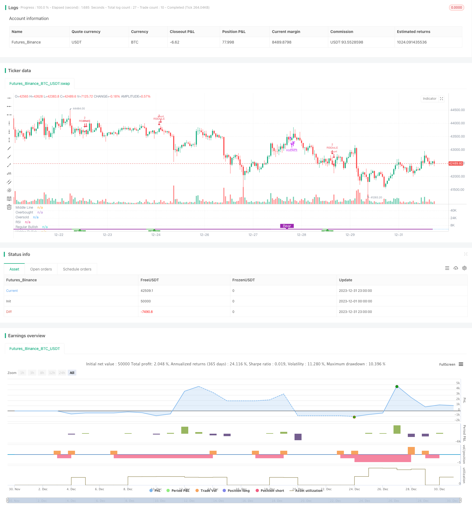

> Name

RSI Long and Short Divergence IndicatorThe-RSI-Divergence-Indicator-Strategy
> Author

ChaoZhang

> Strategy Description


 [trans]
### Overview
The RSI long-short divergence indicator is a quantitative trading strategy based on the relative strength index (RSI). By analyzing the divergence between the RSI indicator and the price, it finds opportunities for price trend reversal and achieves the purpose of buying low and selling high.
### Strategy Principles
The core indicator of this strategy is RSI. It analyzes the "divergence" between the RSI indicator and price. The so-called "divergence" is a reverse signal between the RSI indicator and the price.
Specifically, when RSI makes lower lows and price makes higher lows, it is a bullish divergence between RSI and price. This indicates that prices may reverse upward. The strategy will establish a long position at this point.
Conversely, when RSI forms higher highs and price forms lower highs, it is a bearish divergence between RSI and price. This indicates that the price may reverse downward. The strategy will establish a short position at this point.
By capturing these divergence points between RSI and price, the strategy can promptly detect price reversal opportunities and achieve buy low and sell high.
### Strategic Advantages
The RSI long-short divergence strategy has the following advantages:
1. Capture price reversal points accurately. The divergence between RSI and price often indicates an upcoming trend reversal and is a very effective prediction signal.
2. Buy low and sell high. By opening a position through the divergence point, you can buy at a relatively low point and sell at a relatively high point, which is in line with the best practices of quantitative trading.
3. Break through the limitations of conventional RSI strategies. Conventional RSI strategies only focus on overbought and oversold areas. This strategy uses the reversal properties of the RSI indicator itself to capture turning points in a more accurate way. The efficiency of the strategy is greatly improved.
4. Simple parameter setting. The main parameters are only the RSI period and the lookback interval, which are very simple and easy to optimize.
### Strategy Risk
The RSI long-short divergence strategy also has certain risks:
1. Divergence signals can be false signals. A divergence between RSI and price does not necessarily lead to a true price reversal. False reversals sometimes form. This can lead to losing trades. Stop losses can be set appropriately to control risks.
2. Underperform in trending markets. When the stock price shows a trend with a clear direction, the profit margin of this strategy will be relatively small. In this case, it is best to temporarily deactivate the strategy and wait for new volatile market conditions.
3. Compound interest risk. The strategy sets compound interest parameters, which may accelerate account losses if you encounter multiple losing transactions. This requires controlling position size and stop loss points to reduce risk.
### Strategy optimization
This strategy can also be optimized from the following aspects:
1. Filter signals in combination with other indicators. You can add MACD, KDJ and other other indicators to verify the RSI divergence point, filter out some false signals, and improve the strategy winning rate.
2. Optimize RSI parameters. You can test different RSI cycle parameters and find RSI cycle settings that better match the characteristics of the variety. Generally, the effect is better between 6-15.
3. Optimize the lookback interval. The lookback range directly affects the trading frequency of the strategy. Different parameters can be tested to find the optimal frequency. Generally, the effect is better between 5-15.
4. Add a stop loss strategy. Reasonable stop loss logic can be set based on ATR, trailing stop loss and other methods. Quickly stopping losses when losses occur can effectively control strategic risks.
### Summarize
The RSI long-short divergence strategy accurately captures the turning point of price changes by analyzing the reversal properties of the RSI indicator itself. Implemented the trading strategy of buying low and selling high. Compared with the traditional RSI overbought and oversold strategy, it uses more refined and original RSI characteristics, which greatly improves the efficiency of the strategy. Coupled with parameter optimization and risk control, it is very suitable for capturing short-term trading opportunities in volatile markets.
|| 

### Overview  

The RSI Divergence Indicator strategy is a quantitative trading strategy based on the Relative Strength Index (RSI) indicator. It detects opportunities for trend reversals by analyzing the divergence between the RSI indicator and price, aiming to buy low and sell high.  

### Strategy Logic  

The core indicator of this strategy is RSI. It analyzes the "divergence" between the RSI indicator and price. The so-called "divergence" refers to the opposite signals between RSI and price.  

Specifically, when the RSI forms a relatively lower low while the price forms a relatively higher low, it is a bullish divergence between the RSI and price. This implies that the price may reverse upwards. The strategy will establish a long position at this point.

Conversely, when the RSI forms a relatively higher high while the price forms a relatively lower high, it is a bearish divergence between the RSI and price. This implies that the price may reverse downwards. The strategy will establish a short position at this point.
  
By capturing these divergences between RSI and price, the strategy can timely detect opportunities for price reversals and achieve buying low and selling high.

### Advantages

The RSI Divergence strategy has the following advantages:

1. Accurate in capturing price reversal points. Divergences between RSI and price often imply an upcoming trend reversal, which is a very effective predictive signal.

2. Achieve buying low and selling high. By establishing positions at divergence points, it is able to buy at relatively low prices and sell at relatively high prices, aligning with the best practices of quantitative trading.  

3. Breakthrough the limitations of conventional RSI strategies. Conventional RSI strategies only focus on overbought and oversold areas. This strategy utilizes the intrinsic reversal properties of the RSI itself to capture turning points more precisely, greatly improving the efficiency of the strategy.  

4. Simple parameter settings. The main parameters are just the RSI period and lookback period, which is very simple and easy to optimize.

### Risks  

The RSI Divergence strategy also has some risks:  

1. Divergence signals could be false signals. The divergences between RSI and price do not necessarily lead to real price reversals. Sometimes they also form false reversals, leading to trading losses. Reasonable stop loss should be set to control risks.

2. Poor performance in trending markets. When the price shows a clear directional trend, the profit space of this strategy would be relatively small. It is better to temporarily disable the strategy in this case and wait for new ranging markets.  

3. Risk of pyramiding. The strategy has set pyramiding parameters. In case of consecutive losing trades, it may accelerate the account drawdown. Position sizing and stop loss should be controlled to mitigate the risk.

### Enhancements

The strategy can also be optimized in the following aspects:  

1. Combine other indicators for signal filtering. MACD, KDJ and other indicators can be added to verify the RSI divergence points, filtering out some false signals and improving the win rate of the strategy.
  
2. Optimize RSI parameters. Different RSI periods can be tested to find the one that best matches the characteristics of the product. Generally between 6-15 works well. 
  
3. Optimize lookback period. The lookback period directly affects the trading frequency of the strategy. Different values can be tested to find the optimal frequency, usually between 5-15 is a good range.
  
4. Add stop loss logic. Reasonable stop loss methods like ATR trailing stop loss can be implemented to quickly cut losses when incurred. This can effectively control the risk of the strategy.  

### Conclusion  

The RSI Divergence strategy accurately captures price turning points by analyzing the intrinsic reversal properties of the RSI indicator itself. It achieves a low-buy-high-sell trading approach. Compared to the traditional overbought-oversold RSI strategies, it utilizes more refined and intrinsic characteristics of RSI, greatly improving efficiency. With parameter optimization and risk control, it is very suitable for capturing short-term trading opportunities within ranging markets.

[/trans]

> Strategy Arguments


|Argument|Default|Description|
|----|----|----|
|v_input_1|9|RSI Period|
|v_input_2_close|0|RSI Source: close|high|low|open|hl2|hlc3|hlcc4|ohlc4|
|v_input_3|3|Pivot Lookback Right|
|v_input_4|true|Pivot Lookback Left|
|v_input_5|80|Take Profit at RSI Level|
|v_input_6|60|Max of Lookback Range|
|v_input_7|5|Min of Lookback Range|
|v_input_8|true|Plot Bullish|
|v_input_9|true|Plot Hidden Bullish|
|v_input_10|true|Plot Bearish|
|v_input_11|false|Plot Hidden Bearish|
|v_input_12|0|Trailing StopLoss Type: NONE|PERC|ATR|
|v_input_13|5|Stop Loss%|
|v_input_14|14|ATR Length (for Trailing stop loss)|
|v_input_15|3.5|ATR Multiplier (for Trailing stop loss)|
|v_input_16|timestamp(2019-01-01T00:00:00)|startDate|
|v_input_17|timestamp(2021-01-01T00:00:00)|finishDate|


> Source (PineScript)

``` pinescript
/*backtest
start: 2023-12-01 00:00:00
end: 2023-12-31 23:59:59
period: 1h
basePeriod: 15m
exchanges: [{"eid":"Futures_Binance","currency":"BTC_USDT"}]
*/

//@version=4
//study(title="Divergence Indicator", format=format.price)
//GOOGL setting  5 , close, 3 , 1  profitLevel at 75 shows win rate  87.21 %  profit factor 7.059
//GOOGL setting  8 , close, 3 , 1  profitLevel at 80 shows win rate  86.57 %  profit factor 18.96 
//SPY setting    5, close , 3, 3  profitLevel at 70  , shows win rate 80.34%  profit factor 2.348
strategy(title="RSI Divergence Indicator", overlay=false,pyramiding=2, default_qty_value=2,   default_qty_type=strategy.fixed, initial_capital=10000, currency=currency.USD)

len = input(title="RSI Period", minval=1, defval=9)
src = input(title="RSI Source", defval=close)
lbR = input(title="Pivot Lookback Right", defval=3)
lbL = input(title="Pivot Lookback Left", defval=1)
takeProfitRSILevel = input(title="Take Profit at RSI Level", minval=70, defval=80)

rangeUpper = input(title="Max of Lookback Range", defval=60)
rangeLower = input(title="Min of Lookback Range", defval=5)
plotBull = input(title="Plot Bullish", defval=true)
plotHiddenBull = input(title="Plot Hidden Bullish", defval=true)
plotBear = input(title="Plot Bearish", defval=true)
plotHiddenBear = input(title="Plot Hidden Bearish", defval=false)

//useTrailStopLoss = input(false, title="Use Trailing Stop Loss")

sl_type = input("NONE", title="Trailing StopLoss Type", options=['ATR','PERC', 'NONE'])

stopLoss = input(title="Stop Loss%", defval=5, minval=1)

atrLength=input(14, title="ATR Length (for Trailing stop loss)")
atrMultiplier=input(3.5, title="ATR Multiplier (for Trailing stop loss)")


bearColor = color.purple
bullColor = color.green
hiddenBullColor = color.new(color.green, 80)
hiddenBearColor = color.new(color.red, 80)
textColor = color.white
noneColor = color.new(color.white, 100)

osc = rsi(src, len)

plot(osc, title="RSI", linewidth=2, color=#8D1699)
hline(50, title="Middle Line", linestyle=hline.style_dotted)
obLevel = hline(70, title="Overbought", linestyle=hline.style_dotted)
osLevel = hline(30, title="Oversold", linestyle=hline.style_dotted)
fill(obLevel, osLevel, title="Background", color=#9915FF, transp=90)

plFound = na(pivotlow(osc, lbL, lbR)) ? false : true
phFound = na(pivothigh(osc, lbL, lbR)) ? false : true

_inRange(cond) =>
    bars = barssince(cond == true)
    rangeLower <= bars and bars <= rangeUpper

//------------------------------------------------------------------------------
// Regular Bullish

// Osc: Higher Low
oscHL = osc[lbR] > valuewhen(plFound, osc[lbR], 1) and _inRange(plFound[1])

// Price: Lower Low
priceLL = low[lbR] < valuewhen(plFound, low[lbR], 1)

bullCond = plotBull and priceLL and oscHL and plFound

plot(
	 plFound ? osc[lbR] : na,
	 offset=-lbR,
	 title="Regular Bullish",
	 linewidth=2,
	 color=(bullCond ? bullColor : noneColor),
	 transp=0
	 )


plotshape(
	 bullCond ? osc[lbR] : na,
	 offset=-lbR,
	 title="Regular Bullish Label",
	 text=" Bull ",
	 style=shape.labelup,
	 location=location.absolute,
	 color=bullColor,
	 textcolor=textColor,
	 transp=0
	 )

//------------------------------------------------------------------------------
// Hidden Bullish

// Osc: Lower Low
oscLL = osc[lbR] < valuewhen(plFound, osc[lbR], 1) and _inRange(plFound[1])

// Price: Higher Low
priceHL = low[lbR] > valuewhen(plFound, low[lbR], 1)

hiddenBullCond = plotHiddenBull and priceHL and oscLL and plFound

plot(
	 plFound ? osc[lbR] : na,
	 offset=-lbR,
	 title="Hidden Bullish",
	 linewidth=2,
	 color=(hiddenBullCond ? hiddenBullColor : noneColor),
	 transp=0
	 )

plotshape(
	 hiddenBullCond ? osc[lbR] : na,
	 offset=-lbR,
	 title="Hidden Bullish Label",
	 text=" H Bull ",
	 style=shape.labelup,
	 location=location.absolute,
	 color=bullColor,
	 textcolor=textColor,
	 transp=0
	 )

longCondition=bullCond or hiddenBullCond
//? osc[lbR] : na  
//hiddenBullCond
strategy.entry(id="RSIDivLE", long=true,  when=longCondition)


//Trailing StopLoss
////// Calculate trailing SL
/////////////////////////////////////////////////////
sl_val = sl_type == "ATR"      ? stopLoss * atr(atrLength) : 
         sl_type == "PERC" ? close * stopLoss / 100 : 0.00

trailing_sl = 0.0
trailing_sl :=   strategy.position_size>=1 ?  max(low  - sl_val, nz(trailing_sl[1])) :  na

//draw initil stop loss
//plot(strategy.position_size>=1 ? trailing_sl : na, color = color.blue , style=plot.style_linebr,  linewidth = 2, title = "stop loss")
//plot(trailing_sl, title="ATR Trailing Stop Loss", style=plot.style_linebr, linewidth=1, color=color.purple, transp=30)
//Trailing StopLoss
////// Calculate trailing SL
/////////////////////////////////////////////////////


//------------------------------------------------------------------------------
// Regular Bearish

// Osc: Lower High
oscLH = osc[lbR] < valuewhen(phFound, osc[lbR], 1) and _inRange(phFound[1])

// Price: Higher High
priceHH = high[lbR] > valuewhen(phFound, high[lbR], 1)

bearCond = plotBear and priceHH and oscLH and phFound

plot(
	 phFound ? osc[lbR] : na,
	 offset=-lbR,
	 title="Regular Bearish",
	 linewidth=2,
	 color=(bearCond ? bearColor : noneColor),
	 transp=0
	 )

plotshape(
	 bearCond ? osc[lbR] : na,
	 offset=-lbR,
	 title="Regular Bearish Label",
	 text=" Bear ",
	 style=shape.labeldown,
	 location=location.absolute,
	 color=bearColor,
	 textcolor=textColor,
	 transp=0
	 )

//------------------------------------------------------------------------------
// Hidden Bearish

// Osc: Higher High
oscHH = osc[lbR] > valuewhen(phFound, osc[lbR], 1) and _inRange(phFound[1])

// Price: Lower High
priceLH = high[lbR] < valuewhen(phFound, high[lbR], 1)

hiddenBearCond = plotHiddenBear and priceLH and oscHH and phFound

plot(
	 phFound ? osc[lbR] : na,
	 offset=-lbR,
	 title="Hidden Bearish",
	 linewidth=2,
	 color=(hiddenBearCond ? hiddenBearColor : noneColor),
	 transp=0
	 )

plotshape(
	 hiddenBearCond ? osc[lbR] : na,
	 offset=-lbR,
	 title="Hidden Bearish Label",
	 text=" H Bear ",
	 style=shape.labeldown,
	 location=location.absolute,
	 color=bearColor,
	 textcolor=textColor,
	 transp=0
	 )
longCloseCondition=crossover(osc,takeProfitRSILevel) or bearCond
strategy.close(id="RSIDivLE", comment="Close All="+tostring(close - strategy.position_avg_price, "####.##"), when= abs(strategy.position_size)>=1  and  sl_type == "NONE" and longCloseCondition)

//close all on stop loss
strategy.close(id="RSIDivLE", comment="TSL="+tostring(close - strategy.position_avg_price, "####.##"),  when=abs(strategy.position_size)>=1 and (sl_type == "PERC"   or sl_type == "ATR" ) and crossunder(close, trailing_sl)  )  //close<ema55 and rsi5Val<20 //ema34<ema55  //close<ema89


// Calculate start/end date and time condition
startDate  = input(timestamp("2019-01-01T00:00:00"), type = input.time)
finishDate = input(timestamp("2021-01-01T00:00:00"), type = input.time)
 
time_cond  = time >= startDate and time <= finishDate

```

> Detail

https://www.fmz.com/strategy/439954

> Last Modified

2024-01-25 11:49:36
