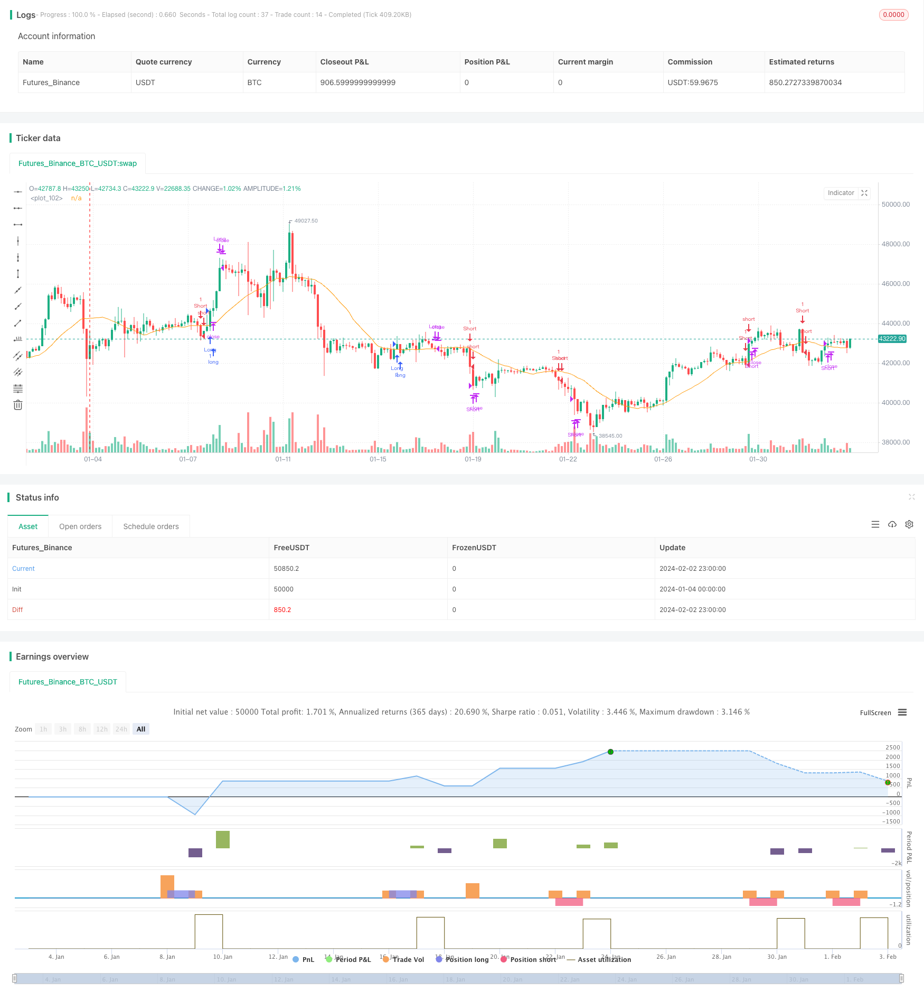

> Name

Trend-Riding-RSI-Swing-Capture-Strategy
> Author

ChaoZhang

> Strategy Description


[trans]

## Overview
Trend Riding RSI Swing Capture Strategy is a swing trading strategy that integrates RSI, MACD and trading volume analysis. This strategy achieves the purpose of buying low and selling high by identifying the support level of the market trend and opening reverse positions when overbought and oversold phenomena occur.
## Principle
The core indicators of this strategy are RSI, MACD and trading volume. The specific logic is:
1. Determine whether RSI has entered the overbought or oversold range to confirm the timing of an imminent reversal;
2. Use the golden cross and dead cross of MACD to judge changes in price trends and energy as an auxiliary condition for entry;
3. Use breakthroughs in trading volume to determine real breakthroughs and avoid false signals.
A trading signal will be issued only when the above three conditions are met at the same time. The direction of long and short depends on the direction of price breakthrough. This can effectively filter out false breakthroughs and improve signal reliability.
## Advantages
The biggest advantage of this strategy is its excellent risk management. The strategy sets strict fund management rules such as moving stop loss, fixed stop loss, and fixed transaction volume, which can effectively control the risk of a single transaction and ensure the safety of funds. In addition, the strategy will also combine trading volume to filter out false breakthroughs and avoid unnecessary reversal trades. Therefore, no matter what the market situation is, this strategy can make stable profits.
## Risk
No trading strategy can completely avoid market risks, and this strategy is no exception. The main risks are concentrated in:
1. Stop loss is breached. Under extreme market conditions, prices may fluctuate significantly in an instant. If the stop loss level is directly exceeded, you will face huge losses.
2. Improper parameter settings. Improper settings of parameters such as RSI and MACD may reduce the quality of trading signals and generate too many false signals.
In response to the above risks, the above risks can be mitigated by optimizing the stop loss algorithm and introducing trailing stop loss. At the same time, key parameters must be repeatedly tested and optimized to ensure their stability and reliability.
## Optimization direction
Based on the current strategic framework, there are the following main optimization directions:
1. Add machine learning algorithms to realize dynamic tracking of stop loss levels. Avoid the risk of your stop being breached.
2. Add more filtering indicators, such as Bollinger Bands, KD, etc., to improve the quality of signals. Reduce unnecessary reversal trades.
3. Optimize fund management strategies and adjust positions in real time. This enables them to better control the impact of emergencies.
4. Use advanced data analysis to automatically find optimal parameters. Reduce the workload of manual testing.
5. Add trading signals based on order flow. Leverage deeper market data to improve the effectiveness of your strategies.
## Summarize
The trend-following RSI fluctuation capturing strategy is generally a very practical short-term trading strategy. It not only takes into account the trend of price trends, but also pays attention to overbought and oversold phenomena, and cooperates with transaction volume filtering to form a relatively stable trading system. Under strict risk management, this strategy can achieve stable profits in various market conditions and is worthy of in-depth study and practice by investors.
||

## Overview   

The Trend Riding RSI Swing Capture Strategy is a swing trading strategy that combines RSI, MACD and volume analysis to capture market swings. It identifies support levels in market trends and takes counter-trend positions when overbought or oversold scenarios appear, in order to buy low and sell high.  

## Principles  

The core indicators of this strategy are RSI, MACD and volume. The logic is:  

1. Judge whether RSI has entered overbought or oversold zones to confirm impending reversals;  

2. Use MACD golden crosses and death crosses to determine price trend and momentum changes as supplementary entry conditions;  

3. Leverage volume breakouts to identify true breakouts and avoid false signals.  

Trading signals are generated only when all three conditions are met simultaneously. The direction of long or short depends on the direction of the price breakout. This effectively filters out false breakouts and improves signal reliability.   

## Advantages   

The biggest advantage of this strategy lies in its excellent risk management. Strict capital management rules such as moving stop loss, fixed stop loss, fixed trade size are set to effectively control the risk of individual trades and ensure capital security. In addition, the strategy also incorporates volume to filter out false breakouts and avoid unnecessary reverse trades. Therefore, this strategy can achieve steady profits regardless of market conditions.  

## Risks  

No trading strategies can completely avoid market risks and this strategy is no exception. The main risks concentrate on:  

1. Stop loss being taken out. Under extreme market conditions, prices may fluctuate sharply in an instant. If the stop loss level is directly penetrated, huge losses will be incurred.  

2. Improper parameter settings. Improper RSI, MACD parameter settings may lead to deteriorated signal quality and excessive erroneous signals.  

In response to the above risks, mitigations include optimizing stop loss algorithms by introducing tracking stop loss etc; meanwhile, repeatedly backtesting and optimization should be conducted on key parameters to ensure stability and reliability.  

## Optimization Directions   

The main optimization directions based on the current strategy framework:  

1. Introduce machine learning algorithms to achieve dynamic tracking of stop loss levels, avoiding risks associated with stop loss being taken out;  

2. Incorporate more filter indicators such as Bollinger Bands, KD to improve signal quality and reduce unnecessary reverse trades;  

3. Optimize capital management strategies by dynamically adjusting position sizes, enabling better control over the impacts of abrupt events;  

4. Leverage advanced data analytics to automatically locate optimal parameters, reducing manual testing workload;  

5. Incorporate transaction signals based on order flows, exploiting deeper level market data to enhance strategy efficacy.  

## Conclusion   

In summary, the Trend Riding RSI Swing Capture Strategy is a highly practical short-term trading strategy. It takes into account both price trend and overbought/oversold scenarios, and with volume filtering, forms a relatively stable trading system. Under strict risk control, this strategy can achieve steady profits across various market conditions, making itself worthy of in-depth research and practice for investors.

[/trans]

> Strategy Arguments


|Argument|Default|Description|
|----|----|----|
|v_input_int_1|20|Moving Average Period|
|v_input_float_1|true|STOP LOSS (%)|
|v_input_1|12|MACD Fast Length|
|v_input_2|26|MACD Slow Length|
|v_input_3|9|MACD Signal Smoothing|
|v_input_4|14|RSI Period|
|v_input_5|70|RSI OVERBOUGHT LEVEL|
|v_input_6|30|RSI OVERSOLD LEVEL|
|v_input_7|20|Volume MA Period|
|v_input_8|50|Volume Threshold (%)|
|v_input_9|true|Risk per Trade (%)|


> Source (PineScript)

``` pinescript
/*backtest
start: 2024-01-04 00:00:00
end: 2024-02-03 00:00:00
period: 3h
basePeriod: 15m
exchanges: [{"eid":"Futures_Binance","currency":"BTC_USDT"}]
*/

// SwingSync RSI Strategy
// This strategy combines RSI, MACD, and volume analysis to capture swing trading opportunities.
// It includes risk management features to protect your capital.
// Adjust the input parameters and backtest to optimize performance.// This Pine Script™ code is subject to the terms of the Mozilla Public License 2.0 at https://mozilla.org/MPL/2.0/
// © str0zzapreti

//@version=5
strategy('SwingSync RSI', overlay=true)
// Adjustable Parameters
// var custom_message = input.string('', title='Symbol')
ma_period = input.int(20, title='Moving Average Period')
stop_loss_percent = input.float(1, title='STOP LOSS (%)',step=0.1)
macd_fast_length = input(12, title='MACD Fast Length')
macd_slow_length = input(26, title='MACD Slow Length')
macd_signal_smoothing = input(9, title='MACD Signal Smoothing')
rsi_period = input(14, title='RSI Period')
rsi_overbought = input(70, title='RSI OVERBOUGHT LEVEL')
rsi_oversold = input(30, title='RSI OVERSOLD LEVEL')
volume_ma_period = input(20, title="Volume MA Period")
volume_threshold_percent = input(50, title="Volume Threshold (%)")
slippage = 0.5
risk_per_trade = input(1, title='Risk per Trade (%)')

// Calculating Indicators *
price = close
ma = ta.sma(price, ma_period)
rsi = ta.rsi(price, rsi_period)
vol_ma = ta.sma(volume, volume_ma_period)
[macdLine, signalLine, _] = ta.macd(price, macd_fast_length, macd_slow_length, macd_signal_smoothing)
volume_threshold = vol_ma * (1 + volume_threshold_percent / 100)

// Definitions
volumeCheck = volume > volume_threshold
longRsiCheck = rsi < rsi_overbought
longMovAvgCross = ta.crossover(price, ma)
longMovAvgCheck = price > ma
longMacdCross = ta.crossover(macdLine, signalLine)
longMacdCheck = macdLine > signalLine
shortRsiCheck = rsi > rsi_oversold
shortMovAvgCross = ta.crossunder(price, ma)
shortMovAvgCheck = price < ma
shortMacdCross = ta.crossunder(macdLine, signalLine)
shortMacdCheck = macdLine < signalLine

// Entry Conditions for Long and Short Trades
longCondition = volumeCheck and longRsiCheck and ((longMovAvgCross and longMacdCheck) or (longMacdCross and longMovAvgCheck)) 
shortCondition = volumeCheck and shortRsiCheck and  ((shortMovAvgCross and shortMacdCheck) or (shortMacdCross and shortMovAvgCheck)) 

// Tracking Last Trade Day
var int last_trade_day = na

if longCondition or shortCondition
    last_trade_day := dayofweek

// Calculate can_exit_trade based on day difference
can_exit_trade = dayofweek != last_trade_day

// Entry Orders
var float max_qty_based_on_equity = na
var float qty = na

if longCondition
    max_qty_based_on_equity := strategy.equity / price
    qty := (strategy.equity * risk_per_trade / 100) / price
    if qty > max_qty_based_on_equity
        qty := max_qty_based_on_equity
    strategy.entry('Long', strategy.long, 1)

if shortCondition
    max_qty_based_on_equity := strategy.equity / price
    qty := (strategy.equity * risk_per_trade / 100) / price
    if qty > max_qty_based_on_equity
        qty := max_qty_based_on_equity
    strategy.entry('Short', strategy.short, 1)

// Exit Conditions
exitLongCondition = ta.crossunder(price, ma) or rsi > rsi_overbought
exitShortCondition = ta.crossover(price, ma) or rsi < rsi_oversold

// Calculate take profit and stop loss levels
stopLossLevelLong = strategy.position_avg_price * (1 - stop_loss_percent / 100)
stopLossLevelShort = strategy.position_avg_price * (1 + stop_loss_percent / 100)

// Adjust for slippage
adjusted_stop_loss_long = stopLossLevelLong * (1 + slippage / 100)
adjusted_stop_loss_short = stopLossLevelShort * (1 - slippage / 100)

// Strategy Exit Orders for Long Positions
if strategy.position_size > 0 and can_exit_trade
    if (close < adjusted_stop_loss_long)
        strategy.close('Long', comment='Stop Loss Long')
    if exitLongCondition
        strategy.close('Long', comment='Exit Long')

// Strategy Exit Orders for Short Positions
if strategy.position_size < 0 and can_exit_trade
    if (close > adjusted_stop_loss_short)
        strategy.close('Short', comment='Stop Loss Short')
    if exitShortCondition
        strategy.close('Short', comment='Exit Short')

plot(ma)

```

> Detail

https://www.fmz.com/strategy/440962

> Last Modified

2024-02-04 10:48:38
