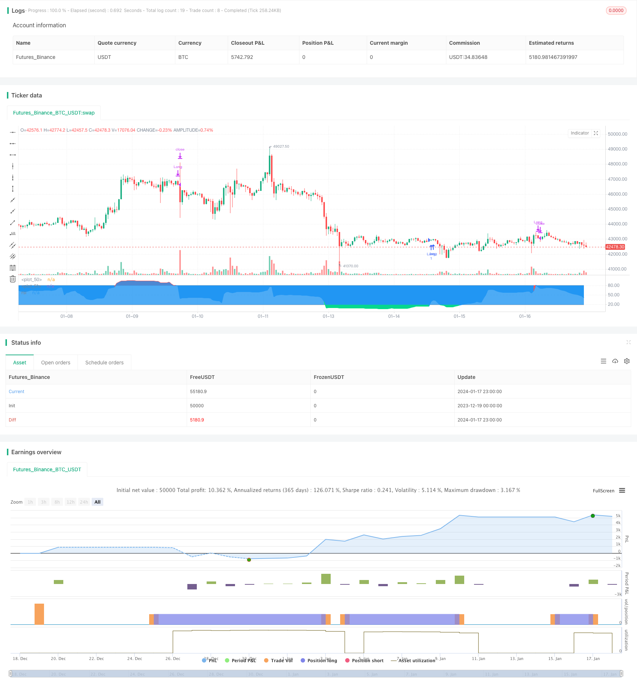

> Name

Short-term quantitative strategy RSI-VWAP-Short-term-Quant-Strategy based on RSI and VWAP
> Author

ChaoZhang

> Strategy Description


 [trans]
## Overview
This strategy is named "RSI-VWAP short-term strategy". This strategy uses the RSI indicator and the volume-weighted average price (VWAP) as technical indicators to set up long and short signals to generate buying and selling decisions. The strategy pursues to capture the overbought and oversold phenomenon of the market in the short term in order to obtain excess returns.
## Strategy Principle
1. Use the RSI indicator to determine whether the market is overbought or oversold. An RSI indicator value above 80 is an overbought zone, and a value below 20 is an oversold zone.  
2. The RSI indicator uses VWAP instead of closing price as the source data. VWAP can better reflect the average transaction price of the day.  
3. A buy signal is generated when the RSI indicator crosses 20 from the oversold zone. A sell signal is generated when the RSI indicator crosses 80 from the overbought zone.  
4. This strategy is only for long positions, not short positions. That is, only buy when it is oversold and sell when it is oversold.
## Advantage Analysis
1. Use VWAP as the data source of RSI to make the RSI indicator’s judgment of the market more accurate and avoid being misled by false breakthroughs.  
2. Only do long positions and reduce the frequency of operations, which is conducive to obtaining long-term stable returns.  
3. The RSI indicator parameter is 17, which is suitable for short-term operations.  
4. Use a short-term operation method with a low expected number of transactions to reduce transaction costs and help obtain higher returns.
## Risk Analysis
1. There is a risk of over-fitting in quantitative strategy backtesting, and the actual results may not match the backtesting.  
2. Only being long cannot seize the opportunity of falling market in time.  
3. The overbought and oversold judgment criteria may not be suitable for all varieties, and parameters need to be adjusted for different varieties.
4. Any technical indicator may produce wrong signals, and losses cannot be completely avoided.
Risks can be reduced by appropriately relaxing overbought and oversold standards, combining other indicators to confirm signals, and adjusting parameter ranges.
## Optimization direction
1. Test the impact of different parameters on the strategy effect, and optimize the RSI length and overbought and oversold thresholds.  
2. Add a stop-loss strategy to lock in some profits and reduce retracement through moving stop-loss, time-stop loss, etc. 
3. Combine with other indicators for signal filtering to improve signal accuracy.  
4. Set independent parameter intervals according to the characteristics of different varieties so that the strategy can better adapt to different varieties.
## Summarize
This strategy is generally a simple and practical short-term strategy. Use VWAP to make the RSI indicator judgment more accurate, and only do long positions to reduce the frequency of operations. The strategy is clear, easy to understand and implement, and is suitable for entry into quantitative trading. However, any single indicator strategy is difficult to be perfect, and it still needs to be continuously optimized to produce better real-time results.
||

## Overview  

This strategy is named "RSI-VWAP Short-term Strategy". It uses the RSI indicator and Volume Weighted Average Price (VWAP) as technical indicators to generate long and short signals and thus make buy and sell decisions. The strategy aims to capture the overbought and oversold phenomena in the short-term market in order to achieve excess returns.  

## Strategy Principle

1. Use the RSI indicator to determine if the market is overbought or oversold. RSI values above 80 indicate an overbought area and below 20 indicate an oversold area.   
2. The RSI indicator uses VWAP instead of closing price as source data. VWAP reflects the average trading price of the day better.
3. A buy signal is generated when the RSI crosses up through 20 from the oversold area. A sell signal is generated when the RSI crosses down through 80 from the overbought area.  
4. This strategy only goes long and does not go short. That is, only buy in oversold and sell in overbought.  

## Advantage Analysis  

1. Using VWAP as the data source for RSI makes the RSI indicator judge the market more accurately, avoiding being misled by false breakouts.  
2. Only going long reduces trading frequency and helps obtain long-term stable returns.
3. The RSI parameter is 17, which is suitable for short-term operations.  
4. The low frequency trading method expects fewer trades, reducing transaction costs and helping obtain higher return rates.  

## Risk Analysis  

1. There is overfitting risk in quant strategy backtesting and actual results may differ from backtest.  
2. Unable to seize opportunities in downtrends by only going long.  
3. The overbought and oversold criteria may not suit all products, parameters need to be adjusted for different products.  
4. Any technical indicator can generate false signals and losses can not be completely avoided.  

Risks can be reduced by appropriately relaxing overbought and oversold criteria, combining other indicators to confirm signals, adjusting parameter ranges, etc.

## Optimization Directions  

1. Test the effects of different parameters on strategy performance and optimize RSI length and overbought/oversold thresholds.
2. Add stop loss strategies to lock in some profits through moving stop loss, time stop loss etc, reducing drawdowns.  
3. Filter signals by combining other indicators to improve signal accuracy.
4. Set independent parameter ranges according to characteristics of different products so that the strategy can better suit different products.   

## Conclusion  

Overall this is a simple and practical short-term strategy. Using VWAP makes RSI judgement more accurate, only going long reduces trading frequency. The strategy idea is clear and easy to understand and implement, suitable for quant trading beginners. But any single indicator strategy can hardly be perfect and needs constant optimization for better live performance.

[/trans]

> Strategy Arguments


|Argument|Default|Description|
|----|----|----|
|v_input_1|true|RSI VOLUME WEIGHTED AVERAGE PRICE|
|v_input_2|17|RSI-VWAP LENGTH|
|v_input_3|19|RSI-VWAP OVERSOLD|
|v_input_4|80|RSI-VWAP OVERBOUGHT|


> Source (PineScript)

``` pinescript
/*backtest
start: 2023-12-19 00:00:00
end: 2024-01-18 00:00:00
period: 1h
basePeriod: 15m
exchanges: [{"eid":"Futures_Binance","currency":"BTC_USDT"}]
*/

// This source code is subject to the terms of the Mozilla Public License 2.0 at https://mozilla.org/MPL/2.0/
// © Xaviz

//#####©ÉÉÉɶN###############################################
//####*..´´´´´´,,,»ëN########################################
//###ë..´´´´´´,,,,,,''%©#####################################
//###'´´´´´´,,,,,,,'''''?¶###################################
//##o´´´´´´,,,,,,,''''''''*©#################################
//##'´´´´´,,,,,,,'''''''^^^~±################################
//#±´´´´´,,,,,,,''''''''^í/;~*©####æ%;í»~~~~;==I±N###########
//#»´´´´,,,,,,'''''''''^;////;»¶X/í~~/~~~;=~~~~~~~~*¶########
//#'´´´,,,,,,''''''''^^;////;%I^~/~~/~~~=~~~;=?;~~~~;?ë######
//©´´,,,,,,,''''''''^^~/////X~/~~/~~/~~»í~~=~~~~~~~~~~^;É####
//¶´,,,,,,,''''''''^^^;///;%;~/~~;í~~»~í?~?~~~?I/~~~~?*=íÑ###
//N,,,,,,,'''''''^^^^^///;;o/~~;;~~;£=»í»;IX/=~~~~~~^^^^'*æ##
//#í,,,,,''''''''^^^^^;;;;;o~»~~~~íX//~/»~;í?IíI»~~^/*?'''=N#
//#%,,,'''''''''^^^^^^í;;;;£;~~~//»I»/£X/X/»í*&~~~^^^^'^*~'É#
//#©,,''''''''^^^^^^^^~;;;;&/~/////*X;í;o*í»~=*?*===^'''''*£#
//##&''''''''^^^^^^^^^^~;;;;X=í~~~»;;;/~;í»~»±;^^^^^';=''''É#
//##N^''''''^^^^^^^^^^~~~;;;;/£;~~/»~~»~~///o~~^^^^''''?^',æ#
//###Ñ''''^^^^^^^^^^^~~~~~;;;;;í*X*í»;~~IX?~~^^^^/?'''''=,=##
//####X'''^^^^^^^^^^~~~~~~~~;;íííííí~~í*=~~~~Ií^'''=''''^»©##
//#####£^^^^^^^^^^^~~~~~~~~~~~íííííí~~~~~*~^^^;/''''='',,N###
//######æ~^^^^^^^^~~~~~~~~~~~~~~íííí~~~~~^*^^^'=''''?',,§####
//########&^^^^^^~~~~~~~~~~~~~~~~~~~~~~~^^=^^''=''''?,íN#####
//#########N?^^~~~~~~~~~~~~~~~~~~~~~~~~^^^=^''^?''';í@#######
//###########N*~~~~~~~~~~~~~~~~~~~~~~~^^^*'''^='''/É#########
//##############@;~~~~~~~~~~~~~~~~~~~^^~='''~?'';É###########
//#################É=~~~~~~~~~~~~~~^^^*~'''*~?§##############
//#####################N§£I/~~~~~~»*?~»o§æN##################

//@version=4
strategy("RSI-VWAP INDICATOR", overlay=false)

// ================================================================================================================================================================================
// RSI VWAP INDICATOR
// ================================================================================================================================================================================

// Initial inputs
Act_RSI_VWAP = input(true, "RSI VOLUME WEIGHTED AVERAGE PRICE")
RSI_VWAP_length = input(17, "RSI-VWAP LENGTH")
RSI_VWAP_overSold = input(19, "RSI-VWAP OVERSOLD", type=input.float)
RSI_VWAP_overBought = input(80, "RSI-VWAP OVERBOUGHT", type=input.float)

// RSI with VWAP as source
RSI_VWAP = rsi(vwap(close), RSI_VWAP_length)

// Plotting, overlay=false
r=plot(RSI_VWAP, color = RSI_VWAP > RSI_VWAP_overBought ? color.red : RSI_VWAP < RSI_VWAP_overSold ? color.lime : color.blue, title="rsi", linewidth=2, style=plot.style_line)
h1=plot(RSI_VWAP_overBought, color = color.gray, style=plot.style_stepline)
h2=plot(RSI_VWAP_overSold, color = color.gray, style=plot.style_stepline)
fill(r,h1, color = RSI_VWAP > RSI_VWAP_overBought ? color.red : na, transp = 60)
fill(r,h2, color = RSI_VWAP < RSI_VWAP_overSold ? color.lime : na, transp = 60)

// Long only Backtest
strategy.entry("Long", strategy.long, when = (crossover(RSI_VWAP, RSI_VWAP_overSold)))
strategy.close("Long", when = (crossunder(RSI_VWAP, RSI_VWAP_overBought)))
```

> Detail

https://www.fmz.com/strategy/439345

> Last Modified

2024-01-19 14:21:15
