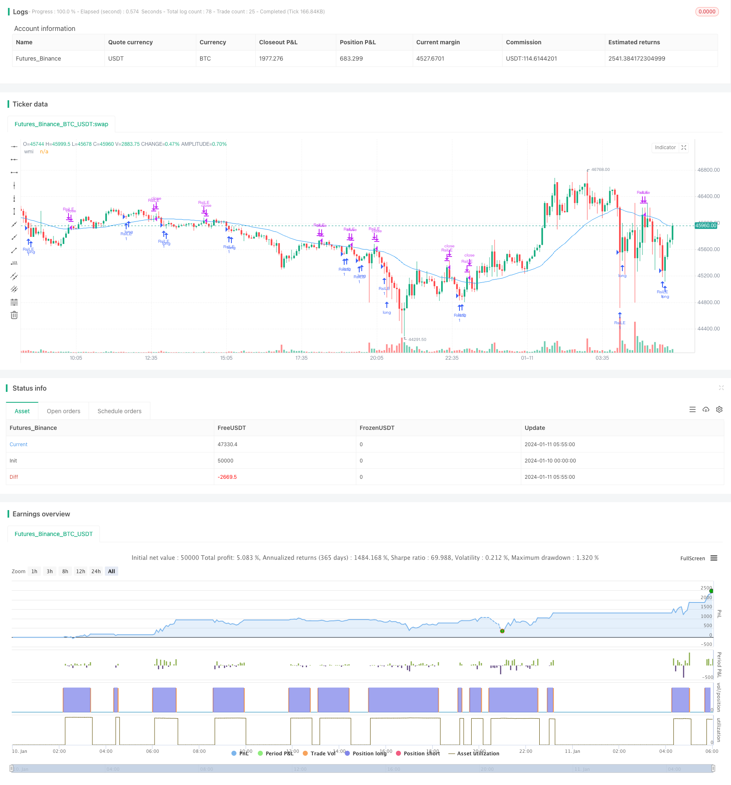

> Name

Trend tracking strategy based on RSI and WMA RSI-WMA-Trend-Tracking-Strategy
> Author

ChaoZhang

> Strategy Description


 [trans]
## Overview
This strategy is called "Trend Following Strategy Based on RSI and WMA". This strategy comprehensively utilizes the advantages of the relative strength index (RSI) and the weighted moving average (WMA). It uses the RSI indicator to determine the overbought and oversold areas, and combines the WMA indicator to determine the direction of the price trend to achieve effective tracking of the price trend.
## Strategy Principle
This strategy mainly uses the RSI indicator to determine whether a stock is overbought or oversold. When the RSI indicator is below the oversold line, the stock is considered to be oversold, diesem lange Positionenをöffnen können. When the RSI indicator is above the overbought line, it is considered that the stock is in an overbought state. Additionally, this strategy uses the WMA indicator to measure price trends. When the price crosses the WMA moving average, it indicates that the price has begun to rise; when the price crosses the WMA moving average, it indicates that the price has begun to fall. Using RSI to determine overbought and oversold and combining it with WMA to determine the price trend, you can effectively track the price trend, buy at relatively low points, and sell at relatively high points.
Specifically, the trading logic of this strategy is:
1. When the RSI indicator is below the oversold line, go long and set a take-profit order.  
2. When the RSI indicator is above the overbought line and there is a long position, close the long position.  
3. When the price crosses the WMA moving average, cancel the previously set long take-profit order.  
4. When the price falls below the WMA moving average and there is a long position, close the long position.
Through this trading logic, you can track the long trend at relatively low points and the short trend at relatively high points, effectively obtaining part of the profits in the price trend.
## Strategic Advantages
This strategy mainly has the following advantages:
1. Using the two indicators RSI and WMA at the same time, you can more accurately determine the price trend and overbought and oversold areas.  
2. By tracking the overbought and oversold areas to enter the market, you can enter at relatively high and low points.  
3. Using the take-profit order setting method, you can quickly exit when the trend reverses and obtain part of the profit.  
4. The strategy logic is simple and clear, making it easy to understand and adjust parameters.  
5. Can be long and short at the same time, suitable for any market environment.
## Strategy Risk
This strategy also has some risks, mainly including:
1. Both RSI and WMA indicators have time lag issues, and there may be a certain lag in identifying overbought and oversold areas and price trend reversals.  
2. Take-profit orders are easily hit and cannot be exited completely.  
3. Strategy parameters need to be constantly optimized and adjusted, such as overbought and oversold lines, moving average cycles, etc.  
4. Large market fluctuations will cause large losses to the strategy.
To address these risks, improvements and optimizations can be made by setting stop losses, adjusting parameter optimization, etc.
## Strategy optimization direction
This strategy also needs to be further optimized in the following aspects:
1. Add stop loss order function. Because a running stop-profit order may be quickly written off, a stop-loss order should be set at the same time.  
2. Optimize the parameters of RSI and WMA. The impact of different parameters on strategy returns can be tested through backtesting and simulated real trading.  
3. Add position management function. Control the risk exposure of a single position through position ratio, number of reinvestments, etc.  
4. Make judgments based on more indicators. In addition to RSI and WMA, other indicators such as MACD and KD can also be introduced to form an indicator combination strategy.  
5. Add machine learning algorithm and use the algorithm to automatically optimize parameters. achine learning algorithms can optimize the parameters automatically based on backtesting.
## Summarize
This strategy comprehensively uses two indicators, RSI and WMA, to identify overbought and oversold while identifying price trend reversals, so as to automatically track the price trend and obtain partial profits. There is still a lot of room for strategy optimization. By introducing more features, controlling position management, and using machine learning, the strategy profitability and stability can be further improved. Generally speaking, this strategy is a relatively simple and direct trend following strategy.
||

## Overview

The strategy is named "RSI/WMA Trend Tracking Strategy". It utilizes the advantages of both Relative Strength Index (RSI) and Weighted Moving Average (WMA) to determine overbought and oversold areas and price trend direction, thus effectively tracking price trends.

## Strategy Principle

The core idea is using RSI indicator to identify overbought/oversold situations. When RSI goes below the oversold line, it indicates oversold status and long positions can be opened. When RSI goes above the overbought line while long positions are opened, it presents good opportunities to close longs. In addition, WMA is used to measure price trend. Upward crossover of price and WMA shows uptrend while downward crossover shows downtrend. By combining judgment on overbought/oversold and price trend, price trends can be effectively tracked - go long at relative lows and close longs at relative highs.

Specifically, the trading logic is:

1. Enter long when RSI goes below the oversold line and set take profit. 

2. Close long when RSI goes above the overbought line while holding open long positions.

3. Cancel the take profit when price crosses above WMA.  

4. Close long when price crosses below WMA while holding open long positions.

This logic allows to track uptrend at relative lows and downtrend at relative highs, capturing part of the price move.

## Advantages

The main advantages are:

1. Utilize both RSI and WMA for better trend and overbought/oversold analysis.

2. Enter at relatively high/low levels by tracking overbought/oversold areas.  

3. Take profits quickly by setting exit orders, capturing parts of the price move.

4. Simple and easy-to-understand logic, easy to adjust parameters.

5. Allow both long and short, adaptable to all market conditions.

## Risks

There are some risks to note:

1. Lagging issues of RSI and WMA may lead to delayed signal.

2. Take profit orders may get stopped out prematurely. 

3. Parameters require constant optimization and tuning e.g. overbought/oversold levels.

4. Significant whipsaw may cause large losses.

The risks can be improved by incorporating stop loss, parameter tuning through optimization etc.

## Improvement Areas

The strategy can be further improved in the following areas:

1. Incorporate stop loss alongside take profits.

2. Optimize parameters like RSI/WMA periods through backtesting and paper trading.

3. Introduce position sizing for better risk management. 

4. Combine more indicators like MACD, KD to form indicator combos.

5. Utilize machine learning to auto-tune parameters for better performance.

## Conclusion

This strategy combines RSI and WMA to identify overbought/oversold levels and spot trend reversal, automatically tracking price trends and capturing part of the profits. There is good room for improvement by introducing more features, position sizing, machine learning etc. Overall a simple trend tracking strategy worth exploring.

[/trans]

> Strategy Arguments


|Argument|Default|Description|
|----|----|----|
|v_input_1|2|length|
|v_input_2|10|overSold|
|v_input_3|90|overBought|
|v_input_4|50|WMA Length|
|v_input_5|true|Enable Long Trades|
|v_input_6|true|Enable Long Exit|
|v_input_7|false|Enable Short Trades|
|v_input_8|false|Enable Short TradExites|


> Source (PineScript)

``` pinescript
/*backtest
start: 2024-01-10 00:00:00
end: 2024-01-11 06:00:00
period: 5m
basePeriod: 1m
exchanges: [{"eid":"Futures_Binance","currency":"BTC_USDT"}]
*/

//@version=5
//Lets connect on LinkedIn (https://www.linkedin.com/in/lets-grow-with-quality/)
//
//I use my indicator it in real life with a zero commision broker ob S&P500 Daily.
//Best performace when used with S&, lomg only and pyramiding on daily timeframe.
//
//Please.. still use your brain for entries and exits: higher timeframes, market structure, trend ... 
//If you obviously can see, like when corona started, that cubic tons of selling volume is going to punsh the markets, wait until selling climax is over and so on..

strategy("RSI/WMA Strategy", overlay=true)

length = input(2)
overSold = input(10)
overBought = input(90)
wmaLength = input(50, title="WMA Length")

enableLongTrades = input(true, title="Enable Long Trades")
longExit = input(true, title="Enable Long Exit")
enableShortTrades = input(false, title="Enable Short Trades")
shortExit = input(false, title="Enable Short TradExites")

price = close
vrsi = ta.wma(ta.rsi(price, length), 2)
wma = ta.wma(price, wmaLength)


co = ta.crossunder(vrsi, overSold)
cu = ta.crossunder(vrsi, overBought)

if (not na(vrsi))
    if (enableLongTrades and co) 
        strategy.entry("RsiLE", strategy.long, comment="RsiLE")
    if (enableShortTrades and cu) 
        strategy.entry("RsiSE", strategy.short, comment="RsiSE")

// Close long position if price crosses above SMA
if (longExit and ta.crossover(price, wma))
    strategy.close("RsiLE", comment="Close Long")

// Close short position if price crosses below SMA
if (shortExit and ta.crossunder(price, wma))
    strategy.close("RsiSE", comment="Close Short")

// Plot für visuelle Überprüfung
plot(wma, title="wmi", color=color.blue)
```

> Detail

https://www.fmz.com/strategy/439237

> Last Modified

2024-01-18 15:35:37
