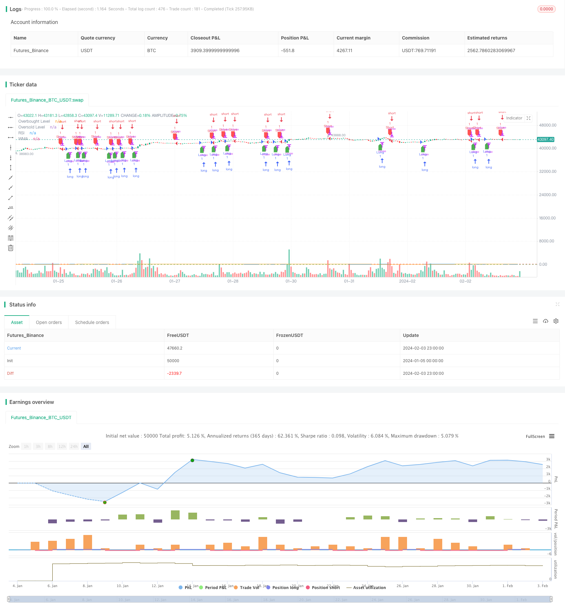

> Name

RSI-and-WMA-Crossover-Strategy
> Author

ChaoZhang

> Strategy Description


[trans]
## Overview
This article mainly introduces a quantitative trading strategy based on RSI and WMA. This strategy calculates the values ​​of RSI and WMA and sets the conditions for buy and sell signals to discover the stock price reversal point and achieve the purpose of buying low and selling high.
## Strategy Principle
The core indicators of this strategy include RSI and WMA. RSI (Relative Strength Index) is a volatility indicator that measures recent changes in the speed of a stock's rise and fall. WMA (Weighted Moving Average) is a weighted moving average.
The strategy's buy signal is generated when the RSI crosses above the WMA, which indicates that the stock price is reversing and may start to rise. The sell signal of the strategy is generated when the RSI crosses the WMA, indicating that the price reverses and may start to fall.
Specifically, the strategy first calculates the value of the 14-day RSI, and then calculates the value of the 45-day WMA. If the RSI crosses above the WMA, a buy signal is generated; if the RSI crosses below the WMA, a sell signal is generated. Through the combination of RSI and WMA, price reversal points can be captured more accurately.
## Strategic Advantages
This strategy has several advantages:
1. The strategy signals are clear, the buying and selling rules are clear, and they are easy to implement.
2. RSI and WMA indicators verify each other and can reduce false signals.
3. The parameters of RSI can be adjusted to adapt to stocks in different cycles.
4. WMA parameters can also be adjusted to capture price trends at different levels. 
5. The code is concise, easy to understand, and convenient for later optimization.
## Strategy Risk
This strategy also has the following risks:
1. Stock prices may fluctuate violently, leading to stop losses.
2. The parameters of RSI and WMA need to be repeatedly tested and optimized, and improper settings may fail.
3. The transaction frequency may be too high, increasing transaction costs and slippage costs.
4. Unable to effectively filter the overall market SYSTEMIC risk.
These risks can be avoided through parameter adjustment, stop loss setting, market risk filtering and other methods.
## Optimization direction
This strategy can be optimized from the following aspects:
1. Test the RSI and WMA parameters on different days to find the optimal parameters.
2. Add trading volume indicators for filtering to avoid false signals. 
3. Set a variable stop loss line to stop loss when the price moves in an unfavorable direction.
4. Combine with other indicators such as MACD and BOLL for filtering to improve signal quality.
5. Optimize the logic of opening and closing positions, and improve the entry and exit strategies.
## Summarize
This strategy integrates the use of two indicators, RSI and WMA, and captures their intersection to form trading signals to achieve simple and effective quantitative trading. This strategy is easy to implement and has a certain market-friendly effect. By continuing to test and optimize parameters, and setting appropriate stop-loss mechanisms, the stability and profitability of the strategy can be further improved.
||

## Overview

This article mainly introduces a quantitative trading strategy based on RSI and WMA. The strategy generates buy and sell signals by calculating the values of RSI and WMA to discover reversal points of stock prices, aiming to buy low and sell high.  

## Strategy Logic

The core indicators of this strategy include RSI and WMA. RSI (Relative Strength Index) is a volatility indicator used to measure the change in the speed of recent price rises and falls. WMA (Weighted Moving Average) is a weighted moving average.

The buy signal of the strategy is generated when the RSI crosses above the WMA, indicating a price reversal and a possible start of an upward trend. The sell signal is generated when the RSI crosses below the WMA, implying a price reversal and a possible start of a downward trend.  

Specifically, the strategy first calculates the 14-day RSI, then calculates the 45-day WMA. If the RSI crosses above the WMA, a buy signal is generated. If the RSI crosses below the WMA, a sell signal is generated. The combination of RSI and WMA can capture price reversal points more accurately.

## Advantages

This strategy has the following advantages:

1. Clear signals and easy rules facilitate implementation.  
2. RSI and WMA verifies each other to reduce false signals.
3. Adjustable RSI parameters suit stocks with different cycles.  
4. Adjustable WMA parameters capture trends at different levels.
5. Simple and clean code for easy optimization.

## Risks  

The risks include:  

1. Extreme price swings may trigger stop loss.
2. Inappropriate RSI and WMA parameters lead to failure. 
3. High trading frequency increases costs and slippage.  
4. Unable to filter systemic risks effectively.  

These risks can be mitigated by parameter tuning, stop loss, filtering market risks etc.

## Enhancement Opportunities

The strategy can be optimized from the following aspects:

1. Test RSI and WMA parameters for optimal values.  
2. Add volume filter to avoid false signals.   
3. Set variable stop loss lines against adverse price moves.
4. Integrate other indicators like MACD and BOLL for filtering.  
5. Improve entry and exit logic for timing optimization.  

## Conclusion  

This strategy integrates RSI and WMA to capture crossovers for trade signals, enabling simple and effective algo trading. It is easy to implement and profitable in bull markets. Further parameter testing, tuning, and proper stop loss mechanisms can enhance its stability and profitability.

[/trans]

> Strategy Arguments


|Argument|Default|Description|
|----|----|----|
|v_input_1|14|RSI Length|
|v_input_2|45|WMA Length|


> Source (PineScript)

``` pinescript
/*backtest
start: 2024-01-05 00:00:00
end: 2024-02-04 00:00:00
period: 1h
basePeriod: 15m
exchanges: [{"eid":"Futures_Binance","currency":"BTC_USDT"}]
*/

//@version=5
strategy("RSI WMA Strategy", overlay=true)

// Input parameters
rsiLength = input(14, title="RSI Length")
wmaLength = input(45, title="WMA Length")

// Calculate RSI and WMA
rsiValue = ta.rsi(close, rsiLength)
wmaValue = ta.wma(rsiValue, wmaLength)

// Define overbought and oversold levels for RSI
overboughtLevel = 70
oversoldLevel = 30

// Strategy logic
longCondition = ta.crossover(rsiValue, wmaValue)
shortCondition = ta.crossunder(rsiValue, wmaValue)

// Execute trades
if (longCondition)
    strategy.entry("Long", strategy.long, comment="BUY")
if (shortCondition)
    strategy.entry("Short", strategy.short, comment="SELL")

// Plotting for visualization
plot(rsiValue, title="RSI", color=color.blue)
plot(wmaValue, title="WMA", color=color.orange)
hline(overboughtLevel, "Overbought Level", color=color.red)
hline(oversoldLevel, "Oversold Level", color=color.green)

// Plot buy and sell signals on the chart
plotshape(series=longCondition, title="Buy Signal", color=color.green, style=shape.labelup, location=location.belowbar)
plotshape(series=shortCondition, title="Sell Signal", color=color.red, style=shape.labeldown, location=location.abovebar)
```

> Detail

https://www.fmz.com/strategy/441068

> Last Modified

2024-02-05 12:16:46
