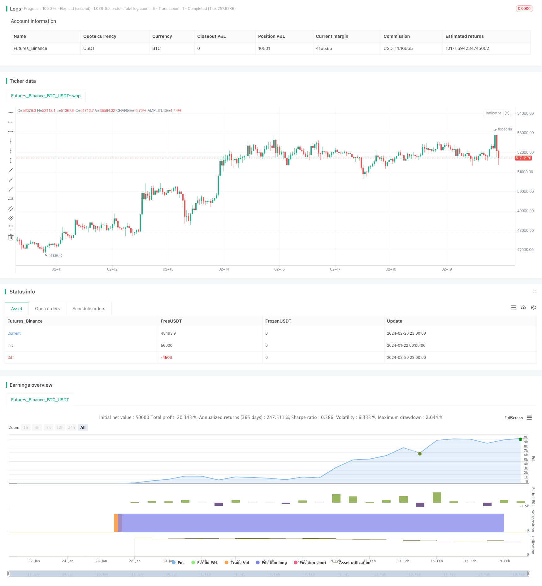

> Name

Trend-Tracking-Strategy-Based-on-RSI-and-ZigZag-Indicators Trend-Tracking-Strategy-Based-on-RSI-and-ZigZag-Indicators
> Author

ChaoZhang

> Strategy Description


[trans]

## Overview
The name of this strategy is "Cryptocurrency 15-minute trend following strategy based on RSI indicator and ZigZag indicator". This strategy is specifically designed for the cryptocurrency market (such as ETHUSD/T, BTCUSD/T, etc.) with a 15-minute time period. The strategy determines the trend direction by combining the RSI indicator to determine overbought and oversold and the ZigZag indicator to determine the price jump, which is a typical trend following strategy.
## Strategy Principle
The core logic of this strategy is to use both the RSI indicator and the ZigZag indicator to determine the price trend. Specifically, the RSI indicator determines whether the price is overbought or oversold, and the ZigZag indicator determines whether the price has jumped sharply by a specified percentage. When both send trading signals at the same time, we judge that the trend has turned and can perform reverse operations.
Regarding the RSI indicator, we set the overbought line to 75 and the oversold line to 25. When the RSI indicator line crosses 25 from bottom to top, the market is considered to have changed from oversold to bullish. When the RSI indicator line crosses 75 from top to bottom, the market is considered to have changed from bullish to oversold.
Regarding the ZigZag indicator, we set the price jump threshold to 1%. The ZigZag indicator line will send a signal when the price moves sharply by more than 1%. Combined with trend judgment, we can see the turning point of the price trend.
When the dual indicators send signals, if the previous trend direction was bullish, and now RSI is overbought and ZigZag shows a gap, then we determine that the market has reached a top, and you can consider going short at this time; conversely, if the previous trend direction was bearish, now RSI is oversold, and ZigZag shows a gap, then we determine that the market has bottomed out, and you can consider going long at this time. Through such logic, we can perform trend following operations.
## Strategic Advantages
The biggest advantage of this strategy is that combined with dual-index judgment, it can effectively filter out false signals and improve signal quality. It is easy to generate false signals by relying only on a single indicator, but this strategy can filter out some invalid signals through the verification of RSI indicator and ZigZag indicator, thereby improving the trading winning rate.
Another advantage is the flexible parameter setting. The RSI parameters and ZigZag parameters in this strategy can be customized. We can adjust the parameters according to the characteristics of different markets to achieve the best results. This gives the strategy a lot of flexibility.
## Strategy Risk
The main risk with this strategy is the probability of the indicator sending a false signal. Although we use dual indicator combination verification, when the market fluctuates violently, indicators may still fail, leading to trading errors. In addition, improper parameter settings will also affect the strategy effect.
In order to reduce risks, we can appropriately shorten the position holding time and stop losses in time. At the same time, it is very important to optimize parameter settings, and market characteristics need to be fully considered. When facing an abnormal market, manual intervention to stop trading is also necessary.
## Strategy optimization direction
This strategy can be optimized from the following aspects:
1. Increase the indicator combination and introduce more indicators for comprehensive judgment, such as KDJ, MACD, etc., to further filter signals.
2. Introduce machine learning algorithms and automatically optimize parameter settings through AI technology to adapt to market changes.
3. Add an adaptive stop-loss mechanism, which can dynamically adjust the stop-loss distance according to the amplitude of market fluctuations.
4. Optimize position management, such as allocating funds according to the strength of the trend.
5. Set alternative strategies to automatically switch in abnormal markets.
## Summarize
Overall, this strategy is a typical trend following strategy. The core idea is to combine the RSI indicator and the ZigZag indicator to determine the turning point of the price trend. The advantage of the strategy is that the dual indicator combination filters out misleading signals and improves trading efficiency. It is necessary to fully consider the risk of indicator failure and continue to further improve the strategy through parameter optimization, stop loss optimization, position optimization and other means. Overall, this strategy provides an effective trend following solution for the cryptocurrency market.
||

## Overview

The strategy is named "Crypto 15-minute Trend Tracking Strategy Based on RSI and ZigZag Indicators". It is specifically designed for 15-minute crypto markets like ETHUSD/T and BTCUSD/T. The strategy determines trend direction by combining RSI indicator to judge overbought/oversold levels and ZigZag indicator to detect price spikes. It belongs to a typical trend following strategy.  

## Strategy Logic  

The core logic of this strategy is to use both RSI and ZigZag indicators to determine price trend. Specifically, the RSI indicator judges whether price is overbought or oversold. The ZigZag indicator detects whether price has a significant percentage spike. When both indicators give trading signals simultaneously, we determine that there is a trend reversal for a counter position.   

For the RSI indicator, we set the overbought line at 75 and the oversold line at 25. When RSI rises from below 25 to above 25, it is considered a reversal from oversold to bullish. When RSI falls from above 75 to below 75, it indicates a reversal from bullish to oversold.

For the ZigZag indicator, we set the price spike threshold to 1% in percentage change. When price makes a spike over 1% in amplitude, the ZigZag line will give a signal. Combined with trend judgment, we can identify trend reversals.  

When both indicators give signals, if the previous trend is bullish and now RSI overbought while ZigZag shows price spike, we determine that price is topping and may consider shorting. On the contrary, if previous trend is bearish and now RSI oversold while ZigZag shows price spike, we determine that price is bottoming and may consider longing. Through this logic, we can follow the trend.  

## Strategy Strengths  

The biggest advantage of this strategy is improved signal quality through combining two indicators. A single indicator tends to give many false signals. But this strategy uses RSI and ZigZag for verification, filtering out many bogus signals and improving win rate.  

Another strength is flexible parameter tuning. The RSI and ZigZag parameters are customizable according to different market conditions for best results. This brings great adaptiveness to the strategy.  

## Strategy Risks  

The main risk is incorrect signals from the indicators. Despite the dual indicator validation, there can still be failures during high volatility leading to trading mistakes. Inappropriate parameter setting also impacts strategy performance.  

To reduce risks, we may shorten position holding period for timely stop loss. Parameter optimization is also very important catering to market characteristics. Manual intervention may be necessary when facing abnormal market conditions.  

## Optimization Directions

The strategy can be improved from the following aspects:  

1. Add more indicators like KDJ and MACD for combined judgment to further filter signals.  

2. Introduce machine learning algorithms for automatic parameter optimization adapting to market changes.  

3. Build an adaptive stop loss mechanism with dynamic protection based on market volatility.  

4. Optimize position sizing based on trend strengths.  

5. Set up alternative strategies to switch automatically in uncommon markets.  

## Conclusion  

In summary, this is a typical trend following strategy. The core idea is to identify trend reversals using RSI and ZigZag indicators in combination. The advantage lies in improved signal quality through dual indicator filtration. Risks of indicator failure need to be fully considered, and the strategy continuously improved through parameter tuning, stop loss optimization, position sizing and so on. Overall this provides an effective trend tracking solution for the crypto market.

[/trans]

> Strategy Arguments


|Argument|Default|Description|
|----|----|----|
|v_input_1|5|RSI Length|
|v_input_2|25|overSold|
|v_input_3|75|overBought|
|v_input_4|true|Minimum % Change|
|v_input_5|true|longa|
|v_input_6|false|shorta|


> Source (PineScript)

``` pinescript
/*backtest
start: 2024-01-22 00:00:00
end: 2024-02-21 00:00:00
period: 1h
basePeriod: 15m
exchanges: [{"eid":"Futures_Binance","currency":"BTC_USDT"}]
*/

// This source code is subject to the terms of the Mozilla Public License 2.0 at https://mozilla.org/MPL/2.0/
// © SoftKill21
//@version=4
strategy("Crypto ZigZag RSI strategy 15min",overlay=true)
length =input(5, title="RSI Length")
overSold = input(25)
overBought= input(75)

p =close

vrsi = rsi(p, length)
var bool long = na
var bool short = na

long :=crossover(vrsi,overSold) 
short := crossunder(vrsi,overBought)

var float last_open_long = na
var float last_open_short = na

last_open_long := long ? close : nz(last_open_long[1])
last_open_short := short ? close : nz(last_open_short[1])


entry_value =last_open_long
entry_value1=last_open_short

//
ZZPercent = input(1, title="Minimum % Change", type=input.float)
r1Level=entry_value
s1Level=entry_value1
trend = 0
trend := na(trend[1]) ? 1 : trend[1]
LL = 0.0
LL := na(LL[1]) ? s1Level : LL[1]
HH = 0.0
HH := na(HH[1]) ?r1Level : HH[1]

Pi = ZZPercent * 0.01
zigzag = float(na)

if trend > 0  
    if r1Level >= HH  
        HH := r1Level
        HH
    else
        if s1Level < HH * (1 - Pi)
            zigzag :=r1Level[1]
            trend := -1
            LL := s1Level
            LL
else
   
    if s1Level <= LL 
        LL := s1Level
        LL
    else
        if r1Level > LL * (1 + Pi)
            zigzag := s1Level[1]
            trend := 1
            HH := s1Level
            HH


shortc=crossunder(trend,0)
longc=crossover(trend,0)


longa =input(true)
shorta=input(false)

if(longa)
    strategy.entry("long",1,when=longc)
    strategy.close("long",when=shortc)
if(shorta)
    strategy.entry("short",0,when=shortc)
    strategy.close("long",when=longc)

```

> Detail

https://www.fmz.com/strategy/442536

> Last Modified

2024-02-22 16:15:18
