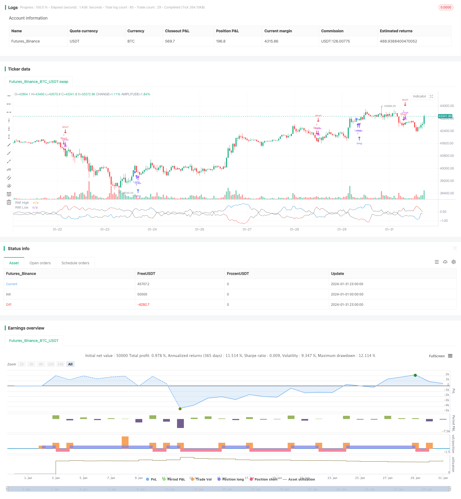

> Name

RWI Volatility Reversal Strategy RWI-Volatility-Contrarian-Strategy
> Author

ChaoZhang

> Strategy Description


[trans]
### Overview
The RWI volatility reversal strategy determines whether the market is in a reversal state by calculating the RWI highs and RWI lows within a certain period to discover reversal opportunities. It uses a reversal strategy to open short positions at high levels and long positions at low levels in order to make profits.
### Strategy Principles
This strategy first calculates the RWI high point and RWI low point within a certain length period (such as 14 K lines). The formula for calculating the high and low points of RWI is as follows:
RWI high point = (high point - lowest point before N periods)/(ATR of N periods* sqrt(N))
RWI low point = (highest point before N periods - lowest point)/(ATR of N periods* sqrt(N))
Then calculate the difference between the RWI high and low points and the threshold to determine whether it is less than the threshold (such as 1). If both the high and low points of RWI are less than the threshold, it is judged that the market is in a state of shock, and no operation is performed at this time.
If the RWI high point is greater than the RWI low point and exceeds the threshold, it is judged that the market is about to reverse, and you can consider going short at this time; if the RWI low point is greater than the RWI high point and exceeds the threshold, it is judged that the market is about to reverse, and you can consider going long at this time. In this way, a reversal trading strategy based on the RWI indicator to determine the market reversal status is formed.
### Advantage Analysis
The RWI Volatility Reversal Strategy offers the following advantages:
1. Use the RWI indicator to accurately determine the reversal point and have a higher winning rate.
2. Adopt a reversal strategy, suitable for market fluctuations
3. The strategy ideas are clear and easy to understand, and the parameters can be adjusted flexibly.
4. Configurable two cycle judgments, long and short, to improve signal quality
### Risk Analysis
The RWI volatility reversal strategy also has the following risks:
1. The reversal signal may have a false breakthrough, resulting in losses
2. When the market continues to trend, there will be more reversal signals, which will lead to losses.
3. Improper setting of RWI parameters may cause signal quality to decrease.
4. When volatility expands, the RWI indicator becomes invalid.
In order to control risks, you can appropriately adjust RWI parameters, configure filter conditions, limit the reversal range, etc.
### Optimization direction
The RWI volatility reversal strategy can also be optimized from the following aspects:
1. Add dual time axis judgment and configure long and short period RWI indicators to improve signal quality.
2. Combine with other indicators such as KD, MACD, etc. to determine reversal and avoid false breakthroughs
3. Configure a stop-loss strategy and strictly control single losses
4. Dynamically optimize RWI parameters to adapt to market changes
5. Optimize position management and increase or decrease positions according to market conditions
### Summarize
The overall idea of ​​the RWI volatility reversal strategy is clear. It uses the RWI indicator to determine the timing of reversal. The trading logic of the strategy is good and the effect is better in a volatile and consolidating market. Through parameter optimization, risk control and other means, this strategy can be used more stably and efficiently.
||

### Overview  

The RWI volatility contrarian strategy calculates the RWI highs and lows over a certain period to determine whether the market is in a reversal state in order to discover reversal opportunities. It adopts a contrarian strategy, going short at the highs and long at the lows, aiming for profit.

### Strategy Principle

The strategy first calculates the RWI highs and lows over a certain length period (such as 14 candles). The calculation formulas are as follows:  

RWI High = (High - Lowest of N Periods Ago) / (ATR of N Periods * sqrt(N))

RWI Low = (Highest of N Periods Ago - Low) / (ATR of N Periods * sqrt(N))

Then calculate the difference between the RWI highs/lows and the threshold to determine if it is below the threshold (such as 1). If both RWI highs and lows are below the threshold, the market is determined to be ranging. In this case, no action is taken.  

If the RWI high is above the RWI low by more than the threshold, it is determined that the price is about to reverse, and one may consider going short. If the RWI low is above the RWI high by more than the threshold, it is determined that the price is about to reverse, and one may consider going long. This forms a contrarian trading strategy based on RWI to determine market reversal states.

### Advantage Analysis   

The RWI volatility contrarian strategy has the following advantages:

1. Using the RWI indicator to determine reversal points is accurate with high winning rate  
2. Adopting contrarian strategies is suitable for ranging markets
3. The strategy logic is clear and easy to understand, parameters are flexible
4. Long and short cycles can be configured to improve signal quality

### Risk Analysis

The RWI volatility contrarian strategy also has the following risks:

1. Reversal signals may have false breakouts, resulting in losses  
2. More reversal signals occur during sustained trends, leading to losses  
3. Improper RWI parameter settings may reduce signal quality
4. RWI indicator fails when volatility increases  

To control risks, RWI parameters can be adjusted accordingly, filters can be added, reversal ranges can be limited, etc.

### Optimization Directions   

The strategy can be further optimized in the following ways:  

1. Add double time frame analysis using long and short RWI periods to improve signals 
2. Combine with other indicators like KD and MACD to avoid false breakouts  
3. Configure stop loss strategies to strictly control single loss
4. Dynamically optimize RWI parameters to adapt to market changes
5. Optimize position management, add or reduce positions based on market conditions

### Summary   

The RWI volatility contrarian strategy has clear logic using RWI to determine reversals. The trading logic is solid and works well in ranging markets. By optimizing parameters, controlling risks etc, the strategy can be applied more steadily and efficiently.

[/trans]

> Strategy Arguments


|Argument|Default|Description|
|----|----|----|
|v_input_1|14|Length|
|v_input_2|true|Threshold|


> Source (PineScript)

``` pinescript
/*backtest
start: 2024-01-01 00:00:00
end: 2024-01-31 23:59:59
period: 1h
basePeriod: 15m
exchanges: [{"eid":"Futures_Binance","currency":"BTC_USDT"}]
*/

//@version=4
// Copyright (c) 2020-present, JMOZ (1337.ltd)
strategy("RWI Strategy", overlay=false)


length = input(title="Length", type=input.integer, defval=14, minval=1)
threshold = input(title="Threshold", type=input.float, defval=1.0, step=0.1)


rwi(length, threshold) =>
    rwi_high = (high - nz(low[length])) / (atr(length) * sqrt(length))
    rwi_low = (nz(high[length]) - low) / (atr(length) * sqrt(length))
    is_rw = rwi_high < threshold and rwi_low < threshold
    [is_rw, rwi_high, rwi_low]


[is_rw, rwi_high, rwi_low] = rwi(length, threshold)


long = not is_rw and rwi_high > rwi_low
short = not is_rw and rwi_low > rwi_high


strategy.entry("Long", strategy.long, when=long)
strategy.entry("Short", strategy.short, when=short)


plot(rwi_high, title="RWI High", linewidth=1, color=is_rw?color.gray:color.blue, transp=0)
plot(rwi_low, title="RWI Low", linewidth=1, color=is_rw?color.gray:color.red, transp=0)

```

> Detail

https://www.fmz.com/strategy/440724

> Last Modified

2024-02-01 14:56:58
