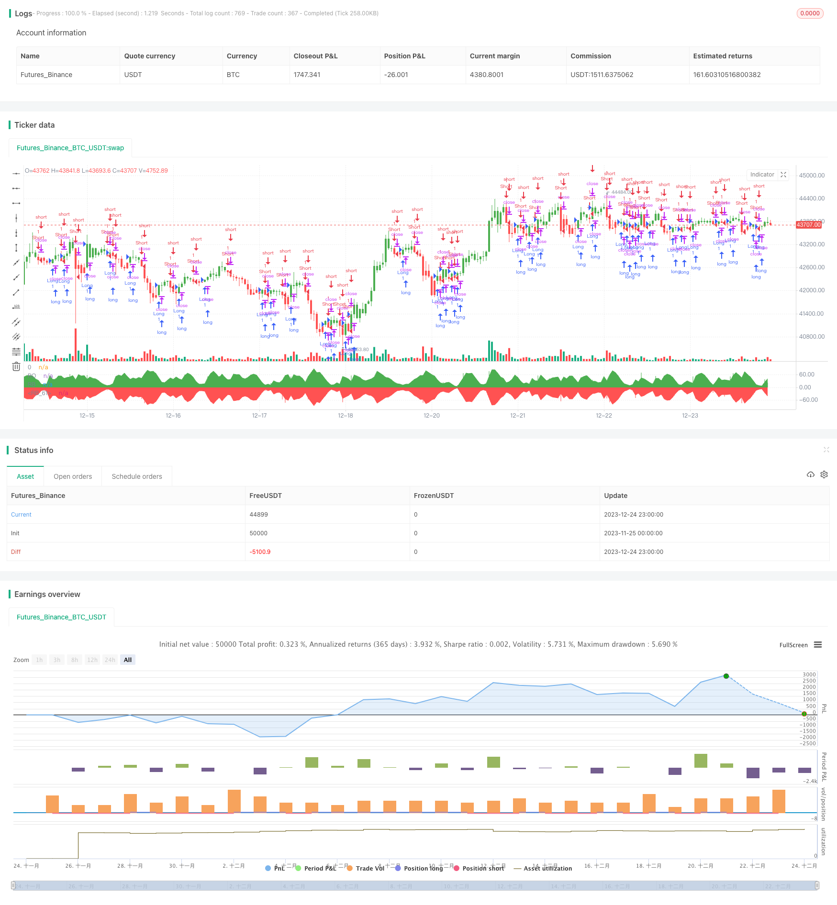

> Name

Rainbow-Oscillator-Backtesting-Strategy
> Author

ChaoZhang

> Strategy Description


[trans]

## Overview
The Rainbow Oscillator backtesting strategy is a quantitative trading strategy based on the Rainbow Oscillator indicator. This strategy determines the direction and strength of the market trend by calculating the deviation between the stock price and the moving average, and uses this to determine the direction of long and short positions.
## Strategy Principle
The core indicator of this strategy is the Rainbow Oscillator (RO), and its calculation formula is as follows:
```
RO = 100 * ((收盘价 - 10日移动平均线) / (最高价的最高值 - 最低价的最低值))
```

The 10-day moving average is a simple moving average of the closing prices of 10 periods. This indicator reflects the price's deviation from its own moving average. When RO > 0, it means the price is above the moving average, which is a bullish signal; when RO < 0, it means the price is below the moving average, which is a bearish signal.
This strategy also calculates an auxiliary indicator - bandwidth (Bandwidth, RB), whose calculation formula is as follows:
```
RB = 100 * ((均线的最高值 - 均线的最低值) / (最高价的最高值 - 最低价的最低值)) 
```

RB reflects the width between moving averages. The larger the RB, the greater the price fluctuation, and vice versa. The RB indicator can be used to judge the stability of the market.
Based on the values ​​of RO and RB indicators, this strategy determines the degree of price deviation and market stability, thereby generating long and short trading signals.
## Strategic Advantages
This strategy has the following advantages:
1. Based on dual-index judgment, it avoids the limitations of single-index judgment.
2. Can judge price trends and market stability at the same time.
3. The calculation is simple, easy to understand and implement.
4. Visual indicators form a "rainbow" effect, which is intuitive and easy to read.
## Strategy Risk
There are also some risks with this strategy:
1. Improper setting of RO and RB indicator parameters may lead to incorrect trading signals.
2. The double moving average strategy is prone to generating false signals and frequent trading.
3. Improper selection of backtest cycles and varieties will affect the effectiveness of the strategy.
4. Without considering transaction costs, the effect of real offer may not be good.
Countermeasures:
1. Optimize the parameters of RO and RB indicators. 
2. Add filter conditions to avoid frequent transactions.
3. Choose the appropriate backtest period and variety.
4. Calculate and consider transaction costs.
## Strategy optimization
This strategy can also be optimized from the following aspects:
1. Add the Smooth function to the RO indicator to avoid violent fluctuations in the indicator.
2. Add a stop-loss strategy to control single losses.
3. Combine transactions with other indicators to increase the probability of profit.
4. Add a machine learning model to predict and judge the effect of indicators.
5. Optimize parameters for different varieties to improve adaptability.
## Summarize
The Rainbow Oscillator backtesting strategy determines the market trend and stability by calculating the deviation between the price and the moving average, and uses it to conduct long and short positions. This strategy is intuitive and easy to read, simple to implement, and has certain practical value. However, there are also some risks, and parameters and trading rules need to be optimized to reduce risks and improve the effect of real offers.
||

## Overview

The Rainbow Oscillator backtesting strategy is a quantitative trading strategy based on the Rainbow Oscillator indicator. This strategy judges the trend direction and strength of the market by calculating the deviation between the price and moving average to determine long and short positions.

## Strategy Logic  

The core indicator of this strategy is the Rainbow Oscillator (RO), which is calculated as follows:  

```
RO = 100 * ((Close - 10-day Moving Average) / (HHV(High, N) - LLV(Low, N))) 
```

Where the 10-day moving average is the simple moving average of closing prices over the past 10 periods. This indicator reflects the deviation of the price relative to its own moving average. When RO > 0, it means the price is above the moving average, a bullish signal; when RO < 0, it means the price is below the moving average, a bearish signal.  

The strategy also calculates an auxiliary indicator - Bandwidth (RB), which is calculated as:

```
RB = 100 * ((Highest value of moving averages - Lowest value of moving averages) / (HHV(High, N) - LLV(Low, N)))
```

RB reflects the width between moving averages. The larger the RB, the greater the price fluctuation, and vice versa the price is more stable. The RB indicator can be used to judge the stability of the market.

According to the values of the RO and RB indicators, the strategy judges the degree of price deviation and market stability, and generates trading signals for long and short positions.


## Advantages  

The advantages of this strategy are:

1. Dual indicator judgment avoids the limitations of single indicator judgment.  
2. Can judge price trends and market stability simultaneously.
3. Simple to calculate, easy to understand and implement.  
4. Visualized indicators form a "rainbow" effect that is intuitive and easy to read.

## Risks   

There are also some risks with this strategy:   

1. Improper parameter settings of RO and RB indicators may cause wrong trading signals.
2. Dual moving average strategies tend to generate false signals and frequent trading. 
3. Inappropriate backtesting period and product selection will affect strategy effectiveness.  
4. Trading costs are not considered, actual results may be poor.

Countermeasures:  

1. Optimize parameters for RO and RB indicators.
2. Add filter conditions to avoid frequent trading.  
3. Select appropriate backtesting cycle and variety.
4. Calculate and consider transaction costs.

## Optimization

The strategy can also be optimized in the following ways:

1. Add Smooth feature to RO indicator to avoid dramatic fluctuations.  
2. Add stop loss strategy to control single loss.
3. Combine with other indicators for portfolio trading to increase profitability.
4. Add machine learning model for prediction and evaluate indicator effectiveness.   
5. Optimize parameters for different varieties to improve adaptability.

## Conclusion  

The Rainbow Oscillator backtesting strategy judges market trends and stability by calculating the deviation between prices and moving averages, and uses this information to make long/short trading decisions. This strategy is intuitive, easy to implement, and has some practical value. But there are also some risks that need to be mitigated by optimizing parameters and trading rules to reduce risk and improve real trading performance.

[/trans]

> Strategy Arguments


|Argument|Default|Description|
|----|----|----|
|v_input_1|2|Length|
|v_input_2|10|HHV/LLV Lookback|
|v_input_3|false|Trade reverse|


> Source (PineScript)

``` pinescript
/*backtest
start: 2023-11-25 00:00:00
end: 2023-12-25 00:00:00
period: 1h
basePeriod: 15m
exchanges: [{"eid":"Futures_Binance","currency":"BTC_USDT"}]
*/

//@version=2
////////////////////////////////////////////////////////////
//  Copyright by HPotter v1.0 18/03/2018
// Ever since the people concluded that stock market price movements are not 
// random or chaotic, but follow specific trends that can be forecasted, they 
// tried to develop different tools or procedures that could help them identify 
// those trends. And one of those financial indicators is the Rainbow Oscillator 
// Indicator. The Rainbow Oscillator Indicator is relatively new, originally 
// introduced in 1997, and it is used to forecast the changes of trend direction.
//
// As market prices go up and down, the oscillator appears as a direction of the 
// trend, but also as the safety of the market and the depth of that trend. As 
// the rainbow grows in width, the current trend gives signs of continuity, and 
// if the value of the oscillator goes beyond 80, the market becomes more and more 
// unstable, being prone to a sudden reversal. When prices move towards the rainbow 
// and the oscillator becomes more and more flat, the market tends to remain more 
// stable and the bandwidth decreases. Still, if the oscillator value goes below 20, 
// the market is again, prone to sudden reversals. The safest bandwidth value where 
// the market is stable is between 20 and 80, in the Rainbow Oscillator indicator value. 
// The depth a certain price has on a chart and into the rainbow can be used to judge 
// the strength of the move.
//
// You can change long to short in the Input Settings
// WARNING:
//  - For purpose educate only
//  - This script to change bars colors.
////////////////////////////////////////////////////////////
strategy(title="Rainbow Oscillator Backtest")
Length = input(2, minval=1)
LengthHHLL = input(10, minval=2, title="HHV/LLV Lookback")
reverse = input(false, title="Trade reverse")
xMA1 = sma(close, Length)
xMA2 = sma(xMA1, Length)
xMA3 = sma(xMA2, Length)
xMA4 = sma(xMA3, Length)
xMA5 = sma(xMA4, Length)
xMA6 = sma(xMA5, Length)
xMA7 = sma(xMA6, Length)
xMA8 = sma(xMA7, Length)
xMA9 = sma(xMA8, Length)
xMA10 = sma(xMA9, Length)
xHH = highest(close, LengthHHLL)
xLL = lowest(close, LengthHHLL)
xHHMAs = max(xMA1,max(xMA2,max(xMA3,max(xMA4,max(xMA5,max(xMA6,max(xMA7,max(xMA8,max(xMA9,xMA10)))))))))
xLLMAs = min(xMA1,min(xMA2,min(xMA3,min(xMA4,min(xMA5,min(xMA6,min(xMA7,min(xMA8,min(xMA9,xMA10)))))))))
xRBO = 100 * ((close - ((xMA1+xMA2+xMA3+xMA4+xMA5+xMA6+xMA7+xMA8+xMA9+xMA10) / 10)) / (xHH - xLL))
xRB = 100 * ((xHHMAs - xLLMAs) / (xHH - xLL))
clr = iff(xRBO >= 0, green, red)
pos = iff(xRBO > 0, 1,
       iff(xRBO < 0, -1, nz(pos[1], 0))) 
possig = iff(reverse and pos == 1, -1,
          iff(reverse and pos == -1, 1, pos))	   
if (possig == 1) 
    strategy.entry("Long", strategy.long)
if (possig == -1)
    strategy.entry("Short", strategy.short)	   	    
barcolor(possig == -1 ? red: possig == 1 ? green : blue ) 
plot(xRBO, color=clr, title="RO", style= histogram, linewidth=2)
p0 = plot(0, color = gray, title="0")
p1 = plot(xRB, color=green, title="RB")
p2 = plot(-xRB, color=red, title="RB")
fill(p1, p0, color=green)
fill(p2, p0, color=red)
```

> Detail

https://www.fmz.com/strategy/436640

> Last Modified

2023-12-26 15:08:17
