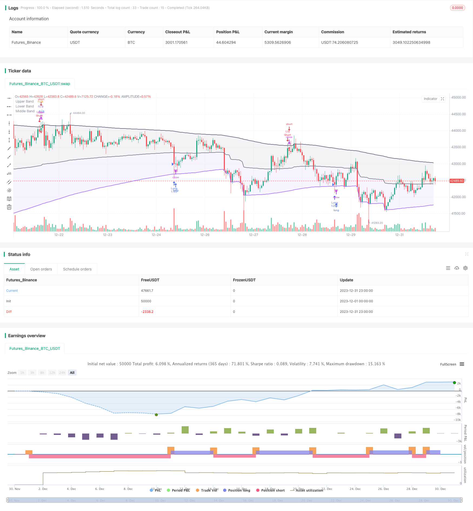

> Name

Recursive-Momentum-Trading-Strategy
> Author

ChaoZhang

> Strategy Description


 [trans]
## Overview
This strategy is based on the recursive trend following and breakout strategy with indicators developed by Alex Grover. The strategy uses the recursive band indicator to determine price trends and key support and resistance levels, and combines momentum conditions to filter out false breakthroughs to achieve low-frequency but high-quality entries.
## Strategy Principle
### Recursive calculation with indicators
The Recursive Band indicator consists of an upper band, a lower band and a midline. The indicator is calculated as:
Upper band = maximum value (upper band of the previous K line, closing price + n*volatility)
Lower band = minimum value (lower band of the previous K line, closing price - n*volatility)
Centerline = (upper band + lower band)/2
Where n is a scaling factor, and volatility can choose ATR, standard deviation, average price channel and special RFV method. The length parameter controls the sensitivity of the indicator. The larger the value, the less likely the indicator is to trigger.
### Strategic trading rules
The strategy first detects whether the downward band direction continues to rise and whether the upper band direction continues to fall, in order to filter out false breakthroughs.
When the price falls below the lower band, go long; when the price exceeds the upper band, go short.
In addition, the strategy also sets stop loss logic.
## Advantage Analysis
This strategy has the following advantages:
1. Using the recursive framework, the indicator calculation is efficient and avoids repeated calculations.
2. The indicator parameters are adjustable and can adapt to different market environments.
3. Combine trends and breakthroughs to avoid false breakthroughs
4. Momentum condition filtering to ensure the quality of trading signals
## Risk Analysis
There are also some risks with this strategy:
1. Improper parameter settings may lead to excessive trading frequency or poor signal quality.
2. When the general cycle trend changes, large losses may occur
3. Insufficient control of extreme market decline points may increase losses
These risks can be controlled by optimizing parameters, setting up stop losses, and increasing slippage.
## Optimization direction
This strategy can also be optimized from the following directions:
1. Combine multiple cycle indicators to achieve multi-time frame trading
2. Add machine learning module to realize parameter adaptive optimization
3. Add quantitative correlation analysis to find the best parameter combination
4. Use deep learning to predict price paths and improve signal accuracy
## Summarize
This strategy is overall a very practical and efficient trend following strategy. It combines a recursive framework to save computing resources, uses trend support and resistance to determine the direction of the general trend, and adds momentum conditions to filter out false breakthroughs, thereby ensuring the quality of trading signals. With parameter adjustment and risk control in place, better results can be achieved. It is worthy of further research and optimization to adapt it to a more complex market environment.
||

## Overview

This strategy is a trend-following and breakout strategy based on the Recursive Bands indicator developed by alexgrover. It uses the Recursive Bands indicator to determine price trends and key support/resistance levels, combined with momentum conditions to filter out false breakouts, achieving low-frequency but high-quality entry signals.

## Strategy Logic

### Recursive Bands Indicator Calculation

The Recursive Bands indicator consists of an upper band, lower band and middle line. The indicator is calculated as:

Upper Band = Max(Previous bar's upper band, Close price + n*Volatility) 
Lower Band = Min(Previous bar's lower band, Close price - n*Volatility)
Middle Line = (Upper Band + Lower Band)/2

Here n is a scaling coefficient, and volatility can be chosen from ATR, standard deviation, average true range or a special RFV method. The length parameter controls the sensitivity, larger values make the indicator trigger less frequently. 

### Trading Rules

The strategy first checks if the lower band and upper band are trending in the same direction to avoid false breakouts. 

When price breaks below the lower band, go long. When price breaks above the upper band, go short.  

In addition, stop loss logic is implemented.

## Advantage Analysis

The advantages of this strategy are:

1. Efficient indicator calculation using recursive framework, avoiding repeated computation
2. Flexible parameter tuning to adapt to different market regimes 
3. Combining trend and breakout, avoiding false breakouts
4. Momentum condition filters ensure signal quality

## Risk Analysis

There are also some risks with this strategy:

1. Improper parameter settings may lead to overtrading or poor signal quality
2. May face large losses when major trend changes
3. Insufficient slippage control in extreme moves may amplify losses

These risks can be managed by parameter optimization, implementing stop loss, increasing slippage threshold etc.

## Optimization Directions  

Some directions to optimize the strategy further:

1. Incorporate indicators across multiple timeframes for robustness
2. Add machine learning module for adaptive parameter optimization
3. Conduct quantitative correlation analysis to find optimal parameter combinations  
4. Use deep learning to forecast price paths and improve signal accuracy

## Conclusion

In summary, this is a very practical and efficient trend-following strategy. It combines the recursive framework for computational efficiency, uses trend support/resistance to determine major trends, adds momentum conditions to filter false breakouts and ensure signal quality. With proper parameter tuning and risk control, it can achieve good results. Worthy of further research and optimization to adapt to more complex market regimes.

[/trans]

> Strategy Arguments


|Argument|Default|Description|
|----|----|----|
|v_input_int_1|260|Length|
|v_input_1_close|0|Source: close|high|low|open|hl2|hlc3|hlcc4|ohlc4|
|v_input_string_1|0|Method: Classic|Atr|Stdev|Ahlr|Rfv|
|v_input_bool_1|true|Bands Hold Direction|
|v_input_2|3|lookback|


> Source (PineScript)

``` pinescript
/*backtest
start: 2023-12-01 00:00:00
end: 2023-12-31 23:59:59
period: 1h
basePeriod: 15m
exchanges: [{"eid":"Futures_Binance","currency":"BTC_USDT"}]
*/

// @version=5
// Original indicator by alexgrover
strategy('Extended Recursive Bands Strategy', overlay=true, commission_type=strategy.commission.percent,commission_value=0.06,default_qty_type =strategy.percent_of_equity,default_qty_value = 100,initial_capital =1000)
length = input.int(260, step=10, title='Length')
src = input(close, title='Source')
method = input.string('Classic', options=['Classic', 'Atr', 'Stdev', 'Ahlr', 'Rfv'], title='Method')
bandDirectionCheck = input.bool(true, title='Bands Hold Direction')
lookback = input(3)
//----
atr = ta.atr(length)
stdev = ta.stdev(src, length)
ahlr = ta.sma(high - low, length)
rfv = 0.
rfv := ta.rising(src, length) or ta.falling(src, length) ? math.abs(ta.change(src)) : rfv[1]
//-----
f(a, b, c) =>
    method == a ? b : c
v(x) =>
    f('Atr', atr, f('Stdev', stdev, f('Ahlr', ahlr, f('Rfv', rfv, x))))
//----
sc = 2 / (length + 1)
a = 0.
a := math.max(nz(a[1], src), src) - sc * v(math.abs(src - nz(a[1], src)))
b = 0.
b := math.min(nz(b[1], src), src) + sc * v(math.abs(src - nz(b[1], src)))
c = (a+b)/2

// Colors
beColor = #675F76
buColor = #a472ff

// Plots
pA = plot(a, color=color.new(beColor, 0), linewidth=2, title='Upper Band')
pB = plot(b, color=color.new(buColor, 0), linewidth=2, title='Lower Band')
pC = plot(c, color=color.rgb(120,123,134,0), linewidth=2, title='Middle Band')
fill(pC, pA, color=color.new(beColor,90))
fill(pC, pB, color=color.new(buColor,90))

// Band keeping direction
// By Adulari
longc = 0
shortc = 0
for i = 0 to lookback-1
    if b[i] > b[i+1]
        longc:=longc+1
    if a[i] < a[i+1]
        shortc:=shortc+1
bhdLong = if bandDirectionCheck
    longc==lookback
else
    true
bhdShort = if bandDirectionCheck
    shortc==lookback
else
    true

// Strategy
if b>=low and bhdLong
    strategy.entry(id='Long',direction=strategy.long)
if high>=a and bhdShort
    strategy.entry(id='Short',direction=strategy.short)

// TP at middle line
//if low<=c and strategy.position_size<0 and strategy.position_avg_price>close
    //strategy.exit(id="Short",limit=close)
//if high>=c and strategy.position_size>0 and strategy.position_avg_price<close
    //strategy.exit(id="Long",limit=close)
```

> Detail

https://www.fmz.com/strategy/440558

> Last Modified

2024-01-31 16:56:31
