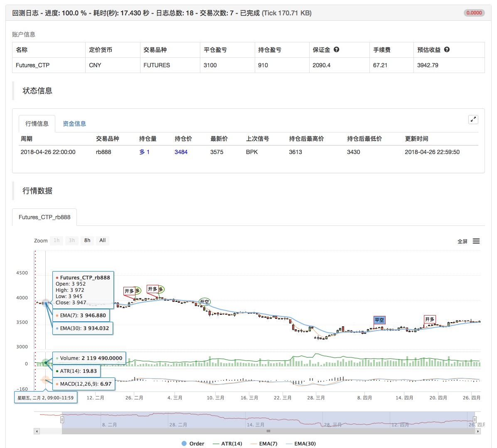
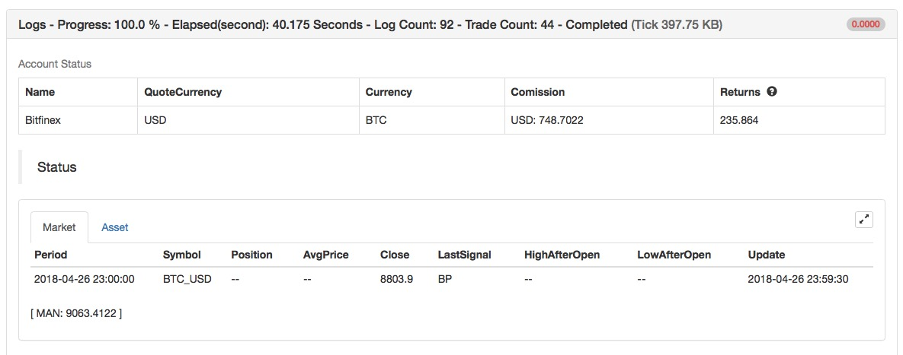
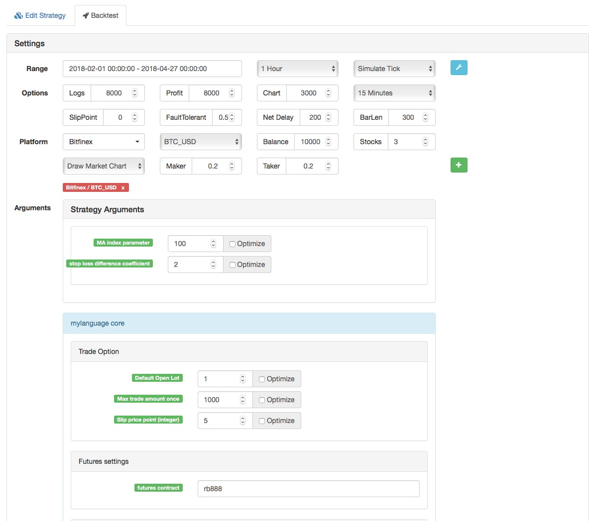

> Name

Relative-Strength-Strategy-Based-on-Price
> Author

Archimedes' bathtub
> Strategy Description

[trans]
- Strategy name: Weak strategy based on relative price strength
- Data cycle: 1H
- Support: commodity futures, digital currency, digital currency futures
- Official website: www.quantinfo.com

   


- Main picture:
  Moving average, formula: MAN^^MA(C,N);

- Sub-picture:
  None
||

- Strategy Name: Relative Strength Strategy Based on Price
- Data cycle: 1H
- Support: Commodity Futures, Digital Currency and Digital Currency Futures

    
   

- Main chart:
  MA, formula: MAN^^MA(C,N);
- Secondary chart:
  none

[/trans]

> Strategy Arguments


|Argument|Default|Description|
|----|----|----|
|N|100|MA index parameter|
|M|2|stop loss difference coefficient|stop loss difference coefficient|

> Source (MyLanguage)

``` pascal
(*backtest
start: 2018-02-01 00:00:00
end: 2018-04-27 00:00:00
period: 1h
exchanges: [{"eid":"Futures_CTP","currency":"FUTURES"}]
args: [["ContractType","rb888",126961]]
*)

MAN^^MA(C,N);
B_MA:=C>MAN;
S_MA:=C<MAN;

S_K1:=SUM((H-C)*V,N)/SUM((H-L)*V,N)>0.5;
B_K1:=SUM((C-L)*V,N)/SUM((H-L)*V,N)>0.5;

CO:=IF(C>O,C-O,0);
OC:=IF(C<O,O-C,0);
S_K2:=SUM(OC*V,N)/SUM(ABS(C-O)*V,N)>0.5;
B_K2:=SUM(CO*V,N)/SUM(ABS(C-O)*V,N)>0.5;

B_K1 AND B_K2 AND B_MA AND H>=HHV(H,N),BPK;
S_K1 AND S_K2 AND S_MA AND L<=LLV(L,N),SPK;

STOPLOSS:=M*MA(H-L,N);
C<BKPRICE-STOPLOSS,SP(BKVOL);
C>SKPRICE+STOPLOSS,BP(SKVOL);

S_MA AND BKHIGH>BKPRICE+STOPLOSS,SP(BKVOL);
B_MA AND SKLOW<SKPRICE-STOPLOSS,BP(SKVOL);
```

> Detail

https://www.fmz.com/strategy/129078

> Last Modified

2018-12-18 10:25:23
