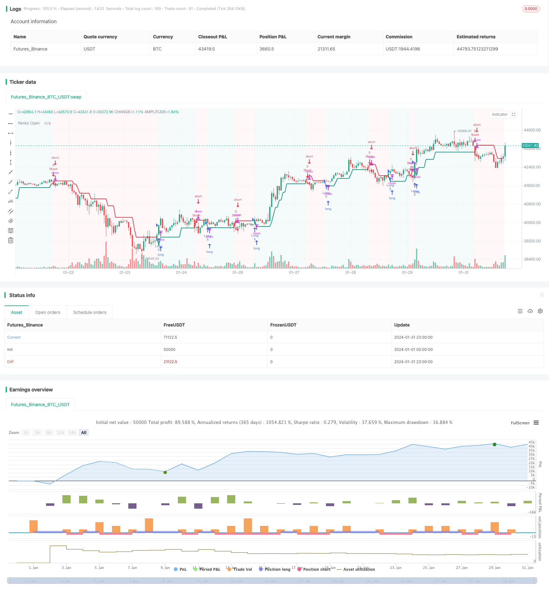

> Name

Trend reversal strategy Renko-ATR-Trend-Reversal-Strategy based on Renko average true amplitude
> Author

ChaoZhang

> Strategy Description


[trans]

## Overview
The Renko ATR Trend Reversal Strategy based on the Renko average true range (Renko ATR Trend Reversal Strategy) is a unique trading strategy designed to use the Renko chart combined with the average true range (ATR) indicator to identify trend reversal points in financial markets. This strategy eliminates the lag drawing problem of Renko charts, accurately captures turning points, and provides clear signals for trading decisions.
## Strategy Principle
### Renko brick generation
This strategy first calculates the value of ATR within a certain period, and sets the brick size of the Renko chart based on this ATR. When the price moves by more than one ATR, a new Renko brick is drawn. In this way, the Renko chart is able to automatically adapt to the volatility of the market, setting larger brick sizes during high volatility and smaller brick sizes during low volatility.
### Buy and sell signal generation
When Renko's opening price crosses below the closing price, a buy signal is generated; when Renko's opening price crosses above the closing price, a sell signal is generated. These signals mark potential trend reversal points.
### Stop loss and take profit settings
This strategy will dynamically set the stop-loss price and take-profit price of each order based on the Renko opening price based on the user-defined stop-loss percentage and take-profit percentage to control the risk and return of each transaction.
## Advantage Analysis
### Eliminate lagging drawing
This strategy eliminates the problem of lag drawing by manually calculating Renko's opening and closing prices, making signal generation more accurate and timely.
### Automatically adapt to market volatility
Renko brick size settings based on the ATR indicator allow the strategy to automatically adapt to price volatility under different market conditions.
### Dynamic stop loss and take profit setting
This strategy sets a dynamic stop-loss and take-profit mechanism for each transaction, which can control risks according to the degree of market fluctuations.
### Simplified chart view
The Renko chart itself can filter out market noise and provide clear and concise visual effects when identifying trend reversals.
## Risk Analysis
### Parameter optimization risk
Users need to optimize parameters such as ATR cycle, stop loss percentage and take profit percentage to adapt to different market environments. If parameters are set improperly, the strategy will be ineffective.
### Emergency risk
Major economic events or the introduction of policies may lead to rapid volume increases, causing the stop-loss or take-profit levels to be breached, resulting in greater losses.
### Risk of reversal failure
In some cases, the reversal determined by the trading signal may fail and fail to push the price in the reversal direction, resulting in losses.
## Optimization direction
### Combine multiple time periods
The general trend can be judged on a higher time period and counter-trend trading can be avoided. False signals can also be filtered at lower time periods.
### Combined with other indicators
Used in conjunction with momentum indicators, volatility indicators, etc., you can improve the quality of signals and avoid false signals.
### Dynamically adjust the take profit ratio
The take-profit ratio can be dynamically adjusted based on the degree of market volatility and the distance between the latest price and the entry point.
## Summarize
The trend reversal strategy based on Renko average true volatility successfully uses Renko charts combined with the ATR indicator to automatically identify turning points in financial markets. This strategy has the advantages of eliminating lag draw, automatically adapting to market volatility, and dynamic stop-loss and take-profit. At the same time, users also need to be wary of parameter setting and optimization risks, as well as the risks of emergencies and reversal failures. Through multi-time period analysis, indicator combination, and take-profit adjustment, the strategy can be continued to be optimized and the effect improved.
||

## Overview

The Renko ATR Trend Reversal Strategy is a unique trading approach that utilizes Renko charts in conjunction with Average True Range (ATR) indicator to identify trend reversal points in financial markets. By eliminating the repainting issue of Renko charts, this strategy is able to accurately capture turning points and provide clear signals for trading decisions.  

## Strategy Logic

### Renko Brick Generation  

The strategy first calculates the ATR value over a defined period and uses this ATR as the brick size for the Renko chart. New Renko bricks are drawn when price movements exceed one ATR. In this way, the Renko chart can automatically adapt to the volatility of the market, with larger brick sizes for higher volatility and smaller brick sizes for lower volatility periods.

### Buy and Sell Signal Generation   

A buy signal is generated when the open price of the Renko chart crosses below the close price. Conversely, a sell signal is generated when the open price crosses above the close price. These signals mark potential trend reversal points.

### Stop Loss and Take Profit Setting

The strategy dynamically sets stop-loss and take-profit levels for each trade as a percentage of the Renko open price, based on user-defined input parameters. This controls the risk and reward for every trade.

## Advantage Analysis 

### Eliminates Repainting 

By manually calculating the open and close prices, repainting is eliminated, making the signals more accurate and timely.   

### Auto-Adaptivity to Volatility

The ATR-based brick size allows the strategy to automatically adapt to different market volatility conditions.

### Dynamic Stop Loss and Take Profit  

The dynamic mechanism for setting stop loss and take profit levels allows better risk control based on market volatility. 

### Clean Chart View

The Renko chart filters out market noise and provides a clean visual for spotting trend reversals.

## Risk Analysis  

### Parameter Optimization Risks

Users need to optimize parameters like ATR period, stop loss % and take profit % for different market environments. Poor parameter settings can degrade strategy performance.

### Event Risks

Major news events or policy releases may cause rapid slippage beyond stop loss or take profit levels, leading to large losses. 

### Failed Reversal Risks  

In some cases, the signaled reversal pattern may fail to materialize, leading to losing trades.

## Enhancement Opportunities 

### Using Multiple Timeframes

Higher timeframes can be used to gauge the direction of the overall trend. Lower timeframes may filter out false signals.  

### Combining Other Indicators  

Using momentum, volatility or other indicators in combination can enhance signal quality and avoid false signals.

### Dynamic Take Profit Adjustment 

Take profit ratios can be dynamically adjusted based on market volatility and the distance between entry price and current price.

## Conclusion

The Renko ATR Trend Reversal Strategy successfully utilizes Renko charts with ATR indicator to automatically spot trend reversal points in financial markets. Key advantages include repainting elimination, auto-adaptivity to changing volatility, and dynamic stop loss/take profit. However, users need to be wary of parameter optimization risks, event risks and failed reversal risks. Further enhancements may include using multiple timeframes, combining other indicators, and dynamic take profit adjustment.

[/trans]

> Strategy Arguments


|Argument|Default|Description|
|----|----|----|
|v_input_int_1|10|ATR Length|
|v_input_float_1|3|Stop Loss Percentage|
|v_input_float_2|20|Take Profit Percentage|
|v_input_1|timestamp(01 July 2023 00:00)|Start Date|
|v_input_2|timestamp(31 Dec 2025 23:59)|End Date|
|v_input_bool_1|true|Enable Shorts|


> Source (PineScript)

``` pinescript
/*backtest
start: 2024-01-01 00:00:00
end: 2024-01-31 23:59:59
period: 1h
basePeriod: 15m
exchanges: [{"eid":"Futures_Binance","currency":"BTC_USDT"}]
*/

//@version=5
strategy(title='[tradinghook] - Renko Trend Reversal Strategy', shorttitle='[tradinghook] - Renko TRS', overlay=true ,initial_capital = 100, commission_value = 0.05, default_qty_value = 5)

// INPUTS
renkoATRLength = input.int(10, minval=1, title='ATR Length')
stopLossPct = input.float(3, title='Stop Loss Percentage', step=0.1)
takeProfitPct = input.float(20, title='Take Profit Percentage', step=0.1)
startDate = input(timestamp("01 July 2023 00:00"), title="Start Date")
endDate = input(timestamp("31 Dec 2025 23:59"), title="End Date")
enableShorts = input.bool(true, title="Enable Shorts")

var float stopLossPrice = na
var float takeProfitPrice = na

atr = ta.atr(renkoATRLength)

// thanks to https://www.tradingview.com/script/2vKhpfVH-Renko-XZ/ for manually calculating renkoClose and renkoOpen in order to remove repaint
getRenkoClose() =>
    p1 = 0.0
    p1 := close > nz(p1[1]) + atr ? nz(p1[1]) + atr : close < nz(p1[1]) - atr ? nz(p1[1]) - atr : nz(p1[1])
    p1

Renko3() =>
    p3 = 0.0
    p3 := open > nz(p3[1]) + atr ? nz(p3[1]) + atr : open < nz(p3[1]) - atr ? nz(p3[1]) - atr : nz(p3[1])
    p3

getRenkoOpen() =>
    open_v = 0.0
    Br_2 = Renko3()
    open_v := Renko3() != Renko3()[1] ? Br_2[1] : nz(open_v[1])
    open_v

renkoOpen = getRenkoOpen()
renkoClose = getRenkoClose()

// COLORS
colorGreen = #089981
colorRed = #F23645
bgTransparency = 95
bgColorRed = color.new(colorRed, bgTransparency)
bgColorGreen = color.new(colorGreen, bgTransparency)
lineColor = renkoClose < renkoOpen ?  colorRed : colorGreen 
bgColor = renkoClose < renkoOpen ?  bgColorRed : bgColorGreen 

// PLOTS
plot(renkoOpen, title="Renko Open", style=plot.style_line, linewidth=2, color=lineColor)
bgcolor(bgColor)

// SIGNALS
isWithinTimeRange = true
buySignal = ta.crossunder(renkoOpen, renkoClose) and isWithinTimeRange
sellSignal = ta.crossover(renkoOpen, renkoClose) and isWithinTimeRange and enableShorts

if (buySignal)
    stopLossPrice := renkoOpen * (1 - stopLossPct / 100)
    takeProfitPrice := renkoOpen * (1 + takeProfitPct / 100)
    strategy.entry("Long", strategy.long)
    strategy.exit("ExitLong", "Long", stop = stopLossPrice, limit = takeProfitPrice, comment="SL: " + str.tostring(stopLossPrice) + ", TP: " + str.tostring(takeProfitPrice))
if (sellSignal)
    stopLossPrice := renkoOpen * (1 + stopLossPct / 100)
    takeProfitPrice := renkoOpen * (1 - takeProfitPct / 100)
    strategy.entry("Short", strategy.short)
    strategy.exit("ExitShort", "Short", stop = stopLossPrice, limit = takeProfitPrice, comment="SL: " + str.tostring(stopLossPrice) + ", TP: " + str.tostring(takeProfitPrice))

```

> Detail

https://www.fmz.com/strategy/440713

> Last Modified

2024-02-01 14:30:24
