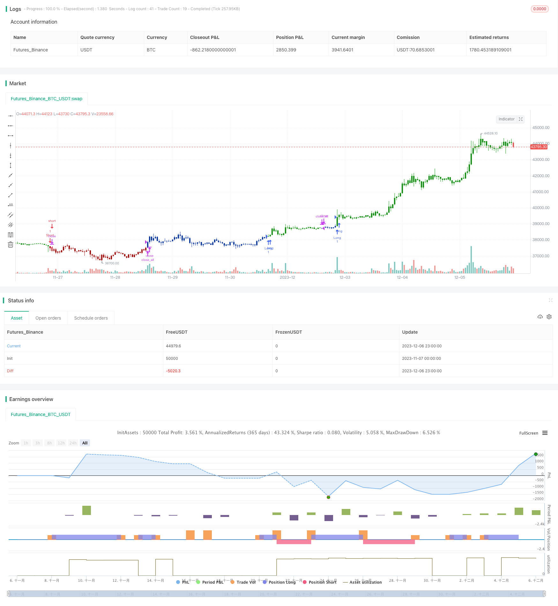

> Name

Reversal-Dynamic-Pivot-Points-Exponential-Moving-Average-Strategy
> Author

ChaoZhang

> Strategy Description


[trans]

## Overview
The Double Reversal Pivot Index Moving Average strategy is a strategy that combines reversal trading with dynamic support and resistance. It uses the Stoxx indicator to determine the market reversal point, and calculates dynamic support and resistance levels based on the day's high, low and closing prices, and places orders when the two strategy signals simultaneously send out buy or sell signals. This strategy is suitable for short to medium term trading.
## Strategy Principle
### Reversal strategy
Reversal strategies are based on this principle: when a market is overvalued or undervalued, prices tend to reverse back into a value range. Specifically, this reversal strategy is based on Ulf Jensen’s rules:
When the closing price is higher than the previous closing price for 2 consecutive days, and the 9-day Slow K-line is below 50, go long; when the closing price is lower than the previous closing price for 2 consecutive days, and the 9-day Fast K-line is above 50, go short.
### Dynamic Support and Resistance Strategy
The dynamic support and resistance strategy calculates the support and resistance levels of the day based on the highest price, lowest price and closing price of the previous day every day. The calculation method is:
Pivot point = (highest price + lowest price + closing price)/3
Support 1 = pivot point - (highest price - pivot point)
Resistance 1=pivot point+(pivot point-lowest price)
Go long when the closing price of the day is higher than the resistance line 1, and go short when the closing price of the day is lower than the support line 1.
### Dual signal
This strategy combines a reversal strategy and a dynamic support-resistance strategy. Only when both signals are sent out at the same time will the order be placed. This can filter out some noise transactions and improve stability.
## Advantage Analysis
The biggest advantage of the double reversal pivot index moving average strategy is that it combines the advantages of the reversal strategy and the dynamic support and resistance strategy. It can capture larger market trends at market turning points, and at the same time, it can also determine the direction based on the relationship between the day's price and key points. Compared with a single strategy, it can filter out some noise transactions and improve stability.
In addition, this strategy has fewer parameters and is easy to implement and optimize.
## Risk Analysis
The double reversal pivot index moving average strategy also has the following risks:
- Risk of reversal failure. The market price may be over-expanded. After the reversal signal is sent, the price continues to run without substantial reversal.
- Risk of support and resistance being breached. The day's price may break through calculated support or resistance levels, creating a false signal.
- Double signals are too conservative and risk missing the market. The dual signal mechanism may filter out more trading opportunities.
Countermeasures:
- Adjust parameters appropriately, identification of key support and resistance levels.
- Use Stop Loss to control losses.
- Appropriately adjust the dual signal rules to retain more trading opportunities.
## Optimization direction
This strategy can be optimized from the following aspects:
1. Test different Stoke indicator parameters to identify the sensitivity of reversal signals.
2. Test different moving average systems Tracking longer term trends.
3. Add other factors to determine the market structure, such as trading volume energy indicators.
4. Optimize the dual signal rules to allow more trading opportunities.
5. Add a stop-loss strategy to control risk.

## Summarize
The double reversal pivot index moving average strategy combines reversal trading and dynamic support and resistance judgment, which can make greater profits at market turning points. At the same time, the trend direction can also be judged based on the relationship between the day's price and key points. Compared with a single strategy, it can filter noise and has better stability. This strategy can appropriately optimize parameters, test other indicators, etc. to improve the effect.
|| 

## Overview

The Reversal Dynamic Pivot Points Exponential Moving Average strategy combines reversal trading and dynamic support resistance levels. It uses the Stochastic oscillator to identify market reversal points and calculates daily support/resistance based on previous day's high, low and close prices. It goes long or short when both the reversal and pivot points strategies generate buy or sell signals. The strategy is suitable for medium-term trading.

## Strategy Logic

### Reversal Strategy 

The reversal strategy is based on the rationale that when markets become overbought or oversold, prices tend to revert back to the value range. Specifically, this reversal strategy follows Ulf Jensen's rules:

Go long when close has been higher than previous close for 2 consecutive days and 9-day Slow K line is below 50; Go short when close has been lower than previous close for 2 consecutive days and 9-day Fast K line is above 50.

### Dynamic Pivot Points Strategy

The dynamic pivot points strategy calculates the current day's support and resistance levels based on previous day's high, low and close prices. The formulas are:

Pivot Point = (High + Low + Close) / 3

Support 1 = Pivot Point - (High - Pivot Point) 

Resistance 1 = Pivot Point + (Pivot Point - Low)

It goes long when close is higher than Resistance 1 and goes short when close is lower than Support 1.

### Dual Signals 

This strategy combines the reversal and dynamic pivot points strategies. It only enters positions when signals from both strategies align. This helps filter out some false signals and improves stability. 

## Advantages

The biggest advantage of this strategy is it combines the strengths of both reversal and dynamic S/R strategies - it can benefit from major trend reversals and also identify key support and resistance levels. Compared to individual strategies, it has better stability from filtering out some false signals.

Also, the strategy has few parameters and is easy to implement and optimize.

## Risks

The strategy also has the following risks:

- Failed reversal - prices may over-extend and continue to trend despite reversal signal.  

- Breach of support/resistance levels - prices may breakthrough calculated S/R levels resulting in wrong signals.

- Dual signals too conservative, missing runs. The dual signal mechanism may filter too many trades.

Countermeasures:

- Fine-tune parameters, combine other factors to confirm reversals.

- Use stop loss to control loss.  

- Adjust rules to allow more trading opportunities.

## Enhancement Opportunities

The strategy can be enhanced in the following areas:

1. Test different Stochastic parameters combinations to improve sensitivity in identifying reversals.  

2. Test different moving averages or longer term indicators to better gauge overall trend.

3. Add other factors to determine market structure, e.g. volume indicators.  

4. Optimize dual signal rules to capture more trades.

5. Incorporate stop loss to manage risks.

## Conclusion

The Reversal Dynamic Pivot Points Exponential Moving Average strategy combines the strengths of reversal trading and dynamic support resistance analysis. It can benefit from major trend turning points and also gauge intraday directionality against key levels. By utilizing dual-signal mechanism, it has good stability in filtering out false trades. The strategy can be further optimized by tuning parameters, testing additional filters etc. to enhance performance.

[/trans]

> Strategy Arguments


|Argument|Default|Description|
|----|----|----|
|v_input_1|14|Length|
|v_input_2|true|KSmoothing|
|v_input_3|3|DLength|
|v_input_4|50|Level|
|v_input_5|false|Trade reverse|


> Source (PineScript)

``` pinescript
/*backtest
start: 2023-11-07 00:00:00
end: 2023-12-07 00:00:00
period: 1h
basePeriod: 15m
exchanges: [{"eid":"Futures_Binance","currency":"BTC_USDT"}]
*/

//@version=4
////////////////////////////////////////////////////////////
//  Copyright by HPotter v1.0 25/03/2020
// This is combo strategies for get a cumulative signal. 
//
// First strategy
// This System was created from the Book "How I Tripled My Money In The 
// Futures Market" by Ulf Jensen, Page 183. This is reverse type of strategies.
// The strategy buys at market, if close price is higher than the previous close 
// during 2 days and the meaning of 9-days Stochastic Slow Oscillator is lower than 50. 
// The strategy sells at market, if close price is lower than the previous close price 
// during 2 days and the meaning of 9-days Stochastic Fast Oscillator is higher than 50.
//
// Second strategy
// This Pivot points is calculated on the current day.
// Pivot points simply took the high, low, and closing price from the previous period and 
// divided by 3 to find the pivot. From this pivot, traders would then base their 
// calculations for three support, and three resistance levels. The calculation for the most 
// basic flavor of pivot points, known as ‘floor-trader pivots’, along with their support and 
// resistance levels.
//
// WARNING:
// - For purpose educate only
// - This script to change bars colors.
////////////////////////////////////////////////////////////
Reversal123(Length, KSmoothing, DLength, Level) =>
    vFast = sma(stoch(close, high, low, Length), KSmoothing) 
    vSlow = sma(vFast, DLength)
    pos = 0.0
    pos := iff(close[2] < close[1] and close > close[1] and vFast < vSlow and vFast > Level, 1,
	         iff(close[2] > close[1] and close < close[1] and vFast > vSlow and vFast < Level, -1, nz(pos[1], 0))) 
	pos

DPP() =>
    pos = 0
    xHigh  = security(syminfo.tickerid,"D", high[1])
    xLow   = security(syminfo.tickerid,"D", low[1])
    xClose = security(syminfo.tickerid,"D", close[1])
    vPP = (xHigh+xLow+xClose) / 3
    vR1 = vPP+(vPP-xLow)
    vS1 = vPP-(xHigh - vPP)
    pos := iff(close > vR1, 1,
             iff(close < vS1, -1, nz(pos[1], 0))) 
    pos

strategy(title="Combo Backtest 123 Reversal & Dynamic Pivot Point", shorttitle="Combo", overlay = true)
Length = input(14, minval=1)
KSmoothing = input(1, minval=1)
DLength = input(3, minval=1)
Level = input(50, minval=1)
//-------------------------
reverse = input(false, title="Trade reverse")
posReversal123 = Reversal123(Length, KSmoothing, DLength, Level)
posDPP = DPP()
pos = iff(posReversal123 == 1 and posDPP == 1 , 1,
	   iff(posReversal123 == -1 and posDPP == -1, -1, 0)) 
possig = iff(reverse and pos == 1, -1,
          iff(reverse and pos == -1 , 1, pos))	   
if (possig == 1) 
    strategy.entry("Long", strategy.long)
if (possig == -1)
    strategy.entry("Short", strategy.short)	 
if (possig == 0) 
    strategy.close_all()
barcolor(possig == -1 ? #b50404: possig == 1 ? #079605 : #0536b3 )
```

> Detail

https://www.fmz.com/strategy/434678

> Last Modified

2023-12-08 11:37:36
