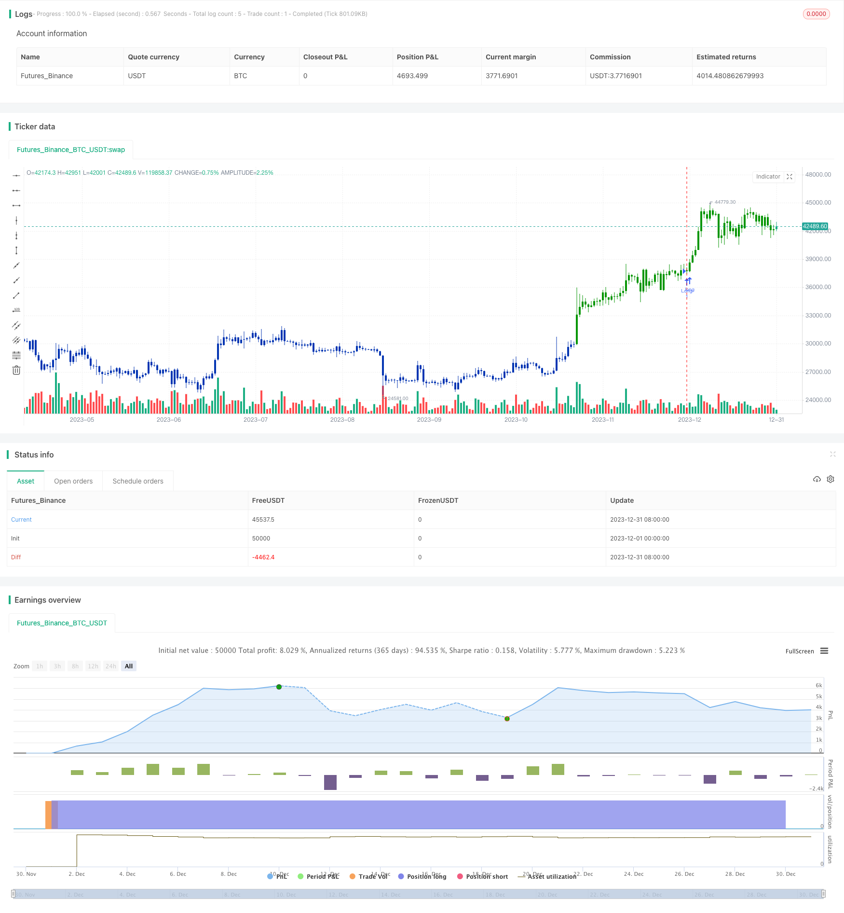

> Name

Reversal-Tracking-Strategy-with-Double-Mechanisms
> Author

ChaoZhang

> Strategy Description


[trans]

#### Overview
This strategy comprehensively utilizes the advantages of dual institutional indicators, using the 123 pattern to determine reversal signals, supplemented by the positive volume index to determine energy signals, to capture short-term reversal market conditions.
#### Strategy Principle
1. 123 pattern judgment reversal signal
- Fast and slow line construction using the 9-day Stoch indicator
- When the closing price falls for two consecutive days and the closing price rises on the third day, and the Stoch Express line is below 50, a buy signal is generated
- When the closing price rises for two consecutive days and falls on the third day, and the Stoch Express line is above 50, a sell signal is generated
2. Positive quantity index to judge quantity energy signal
- Positive Volume Index (PVI) determines volume performance by comparing the changes in trading volume between the previous day and today.
- When PVI crosses its N-day moving average, it indicates that the volume can be amplified and a buy signal is generated.
- When PVI falls below its N-day moving average, it indicates that volume can be reduced, generating a sell signal.
3. Comprehensive judgment of dual signals
- A trading signal is generated only when the 123 reversal signal and the PVI volume signal are sent in the same direction.
In summary, this strategy makes full use of the advantages of dual institutional indicators and can effectively identify short-term volume and price reversal opportunities.

#### Advantage Analysis
1. 123 pattern judgment can capture key short-term reversal points
2. PVI volume and energy indicator, determine the coordination of volume and price, and avoid false breakthroughs
3. Optimization of Stoch indicator parameters can filter out invalid signals in most restless areas
4. The combination of dual signals has higher reliability than a single signal.
5. Use intraday judgment to avoid overnight risks and are suitable for short-term operations.

#### Risk Analysis
1. Risk of reversal failure
- The 123 pattern reversal signal is not always effective, and there is a risk of pattern failure.
2. Risk of indicator failure
- In some abnormal market conditions, indicators such as Stoch and PVI will fail
3. Risk of missing double signals
- The conditions for dual signals in the same direction are relatively strict, and some unilateral signal opportunities may be missed.
4. Transaction frequency risk
- The strategic trading frequency is relatively high, and positions and risk control need to be closely monitored

#### Optimization direction
1. Large space for parameter optimization
- There is room for optimization in parameters such as the Stoch window period and the number of PVI cycles.
2. Stop loss strategy can be added
- Can be combined with moving stop loss to ensure the winning rate of the strategy
3. Consider adding filters
- Can be tested to add filter indicators such as moving average and volatility
4. Optimize dual signal combination
- Can test more dual-indicator combination arbitrage

#### Summarize
This strategy uses the combination of Stoch indicator and PVI indicator to form a highly reliable short-term volume and price reversal trading strategy. Compared with a single indicator, it has a higher winning rate and positive expectations. Through parameter optimization and risk control settings, the Sharpe ratio can be further expanded. Generally speaking, this strategy uses the advantages of dual agency indicators to effectively capture short-term reversal opportunities in the market, and is worthy of real-time verification and optimization.
|| 

#### Overview

This strategy combines the strengths of double mechanism indicators by using 123 pattern to determine reversal signals, and aided by Price Volume Index to determine momentum signals, in order to capture short-term reversal trends.

#### Strategy Logic

1. 123 pattern for reversal signal

    - Constructed with 9-day Stoch fast line and slow line

    - When close price falls for 2 consecutive days and rises on the 3rd day, and Stoch fast line is below 50, a buy signal is generated  

    - When close price rises for 2 consecutive days and falls on the 3rd day, and Stoch fast line is above 50, a sell signal is generated

2. Price Volume Index for momentum signal

    - PVI judges momentum by comparing volume change between previous and current day

    - When PVI crosses above its N-day moving average, momentum amplifies and a buy signal is generated

    - When PVI crosses below its N-day moving average, momentum declines and a sell signal is generated  

3. Dual signal combination

    - Trading signals are only generated when 123 reversal and PVI momentum signals agree

In summary, this strategy leverages the advantage of dual mechanism indicators to effectively identify short-term price-volume reversal opportunities.

#### Advantage Analysis  

1. 123 pattern catches key short-term reversal spots

2. PVI momentum judges coordinated price-volume action to avoid false breakouts

3. Parameter optimized Stoch filters out most noise signals in turbulent zones  

4. Dual signal reliability higher than single signals

5. Intraday design avoids overnight risks suitable for short-term trading

#### Risk Analysis

1. Failed reversal risk

    - 123 pattern reversal signals do not always succeed with pattern failure risks

2. Indicator failure risks  

    - Stoch, PVI and other indicators can fail in certain anomalous markets

3. Dual signal miss risk

    - Relatively stringent dual signal criteria may miss some single signal opportunities  

4. High trading frequency risks

    - Close monitoring of position sizing and risk control is needed for the high frequency strategy

#### Optimization Direction

1. Large parameter optimization space

    - Windows, cycles of Stoch, PVI etc. have optimization space

2. Can incorporate stop loss strategies

    - Mobile stop loss can ensure win rate  

3. Consider adding filter conditions

    - Tests can add moving average, volatility filters etc.  

4. Optimize dual signal portfolio

    - Test combinations of more dual indicator strategies

#### Summary

This strategy forms a high-reliability short-term price-volume reversal system through the combination of Stoch and PVI indicators. Compared to single indicators, it has higher win rate and positive expectancy. Sharpe ratio can be further improved via optimization and risk control. In conclusion, this strategy leverages the strengths of dual mechanism indicators to effectively capture short-term reversal opportunities in the market, and is worth live testing and optimization.[/trans]

> Strategy Arguments


|Argument|Default|Description|
|----|----|----|
|v_input_1|true|---- 123 Reversal ----|
|v_input_2|14|Length|
|v_input_3|true|KSmoothing|
|v_input_4|3|DLength|
|v_input_5|50|Level|
|v_input_6|true|---- Positive Volume Index ----|
|v_input_7|255|EMA_Len|
|v_input_8|false|Trade reverse|


> Source (PineScript)

``` pinescript
/*backtest
start: 2023-12-01 00:00:00
end: 2023-12-31 23:59:59
period: 1d
basePeriod: 1h
exchanges: [{"eid":"Futures_Binance","currency":"BTC_USDT"}]
*/

//@version=4
////////////////////////////////////////////////////////////
//  Copyright by HPotter v1.0 22/04/2021
// This is combo strategies for get a cumulative signal. 
//
// First strategy
// This System was created from the Book "How I Tripled My Money In The 
// Futures Market" by Ulf Jensen, Page 183. This is reverse type of strategies.
// The strategy buys at market, if close price is higher than the previous close 
// during 2 days and the meaning of 9-days Stochastic Slow Oscillator is lower than 50. 
// The strategy sells at market, if close price is lower than the previous close price 
// during 2 days and the meaning of 9-days Stochastic Fast Oscillator is higher than 50.
//
// Second strategy
// The theory behind the indexes is as follows: On days of increasing volume, 
// you can expect prices to increase, and on days of decreasing volume, you can 
// expect prices to decrease. This goes with the idea of the market being in-gear 
// and out-of-gear. Both PVI and NVI work in similar fashions: Both are a running 
// cumulative of values, which means you either keep adding or subtracting price 
// rate of change each day to the previous day`s sum. In the case of PVI, if today`s 
// volume is less than yesterday`s, don`t add anything; if today`s volume is greater, 
// then add today`s price rate of change. For NVI, add today`s price rate of change 
// only if today`s volume is less than yesterday`s.
//
// WARNING:
// - For purpose educate only
// - This script to change bars colors.
////////////////////////////////////////////////////////////
Reversal123(Length, KSmoothing, DLength, Level) =>
    vFast = sma(stoch(close, high, low, Length), KSmoothing) 
    vSlow = sma(vFast, DLength)
    pos = 0.0
    pos := iff(close[2] < close[1] and close > close[1] and vFast < vSlow and vFast > Level, 1,
	         iff(close[2] > close[1] and close < close[1] and vFast > vSlow and vFast < Level, -1, nz(pos[1], 0))) 
	pos


PVI(EMA_Len) =>
    pos = 0.0
    xROC = roc(close, 1)
    nRes = 0.0
    nResEMA = 0.0
    nRes := iff(volume > volume[1], nz(nRes[1], 0) + xROC, nz(nRes[1], 0))
    nResEMA := ema(nRes, EMA_Len)
    pos := iff(nRes > nResEMA, 1,
        	 iff(nRes < nResEMA, -1, nz(pos[1], 0))) 
    pos

strategy(title="Combo Backtest 123 Reversal & Positive Volume Index", shorttitle="Combo", overlay = true)
line1 = input(true, "---- 123 Reversal ----")
Length = input(14, minval=1)
KSmoothing = input(1, minval=1)
DLength = input(3, minval=1)
Level = input(50, minval=1)
//-------------------------
line2 = input(true, "---- Positive Volume Index ----")
EMA_Len = input(255, minval=1)
reverse = input(false, title="Trade reverse")
posReversal123 = Reversal123(Length, KSmoothing, DLength, Level)
posPVI = PVI(EMA_Len)
pos = iff(posReversal123 == 1 and posPVI == 1 , 1,
	   iff(posReversal123 == -1 and posPVI == -1, -1, 0)) 
possig = iff(reverse and pos == 1, -1,
          iff(reverse and pos == -1 , 1, pos))	   
if (possig == 1 ) 
    strategy.entry("Long", strategy.long)
if (possig == -1 )
    strategy.entry("Short", strategy.short)	 
if (possig == 0) 
    strategy.close_all()
barcolor(possig == -1 ? #b50404: possig == 1 ? #079605 : #0536b3 )
```

> Detail

https://www.fmz.com/strategy/437780

> Last Modified

2024-01-05 15:09:19
