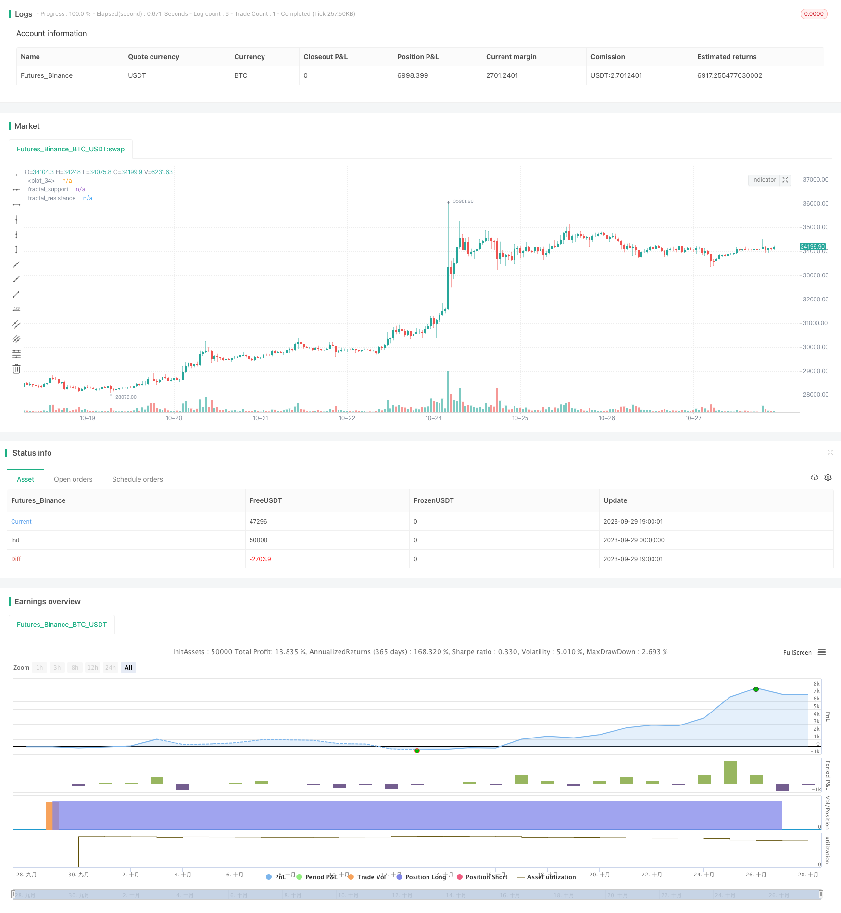

> Name

Reversal-Trading-Strategy-Based-on-Generalized-Support-Resistance
> Author

ChaoZhang

> Strategy Description



[trans]


### Overview
This strategy adopts reversal trading based on the indicator long and short factors, and also sets a target profit point. The core of the long-short factor is the expanded form "generalized support/resistance" based on trading volume, which is suitable for targets with high trading volume and volatility. The advantage of the strategy is that it can capture larger short- and medium-term trend reversal opportunities and make quick profits; however, there is also the risk of being trapped.
### Strategy Principles
1. Identify long and short factors based on "generalized support/resistance" based on trading volume
- Use K-line patterns to identify classic support/resistance and filter false breakthroughs with larger trading volume
- Generalized support/resistance is more inclusive than classic patterns
- Breaking through broad support is a multi-factor signal, breaking through broad resistance is a short factor signal
2. Reversal trade
- After the factor signal is sent, perform reverse operation
- If the position is already held, reverse position reduction or reverse position opening will be carried out
3. Set profit goals
- Set stop loss based on ATR
- Set multiple target profit points such as 1R/2R/3R
- Reduce positions in batches after reaching different profit targets
### Advantage Analysis
- Capable of capturing larger reversals in the short to medium term
A breakthrough of support and resistance represents a strong trend reversal signal, which has certain reliability and can capture a large reversal in the short to medium term.
- Quick profits with small drawdowns
Through stop loss and multi-level profit target setting, quick profits can be achieved and the retracement of individual stocks can be limited.
- Suitable for targets with large amounts of institutional funds and high volatility
This strategy relies on trading volume indicators and requires sufficient institutional capital inflows to support the trend; it also requires a certain amount of fluctuation space to achieve profitability.
### Risk Analysis
- Risk of being trapped in volatile market conditions
When the market fluctuates, the operation of stopping loss and exiting and then entering in the opposite direction may cause frequent traps.
- Risk of failure of support and resistance
Generalized support and resistance are not absolutely reliable, and there is a probability of failed test reversal.
- Unilateral position risk
The strategy is pure reversal and does not consider trend following, so it is possible to miss larger directional opportunities.
- Risk control
- The factor conditions for reversal trading can be appropriately relaxed, and it is not necessary to reverse every breakthrough
- Can be combined with other indicators to filter, such as volume and price divergence
- Optimize the stop loss strategy and reduce the probability of being trapped
### Optimization direction
- Optimize caliber parameters
Optimize the parameters of generalized support and resistance and identify more reliable factors
- Optimize profit strategies
Profit targets for more gears can be added, or non-fixed targets can be used for profit.
- Optimize stop loss strategy
Adjust ATR parameters or use istics stop loss to reduce transaction costs caused by unnecessary drastic stop loss.
- Incorporate trends and other factors
Trend judgments such as moving averages can be introduced to avoid serious confrontation with the trend; other auxiliary factors can also be introduced
### Summarize
The core of this strategy is to use reversal trading to capture large short- and medium-term fluctuations. The strategy idea is simple and direct, and good real-time results can be obtained through parameter adjustment. However, the reversal strategy is relatively radical, and there is a certain risk of retracement and trapping. Stop loss and profit strategies need to be further optimized, and appropriately combined with trend judgment to reduce unnecessary losses.
||


## Overview

This strategy adopts reversal trading based on bullish/bearish factors, with preset profit-taking levels. The core of the factors is the extended pattern "Generalized Support/Resistance" based on trading volume, suitable for stocks with high volume and volatility. The advantages lie in capturing larger reversal opportunities in medium-short terms and profiting quickly, while it bears the risk of being trapped.

## Strategy Logic  

1. Identifying bullish/bearish factors based on "Generalized Support/Resistance" with volume

   - Using candlestick patterns to identify classic S/R levels, filtered by significant volume  

   - Generalized S/R has better coverage than classic patterns

   - Breaking generalized support signals long factor, breaking generalized resistance signals short factor

2. Reversal trading

   - Take reverse position when factor signal triggers

   - If already in position, reduce or add reverse position  

3. Setting profit target levels

   - Set stop loss based on ATR

   - Set multiple profit levels like 1R, 2R, 3R

   - Partial profit taking when hitting different targets

## Advantages

- Capture decent mid-term reversals

  S/R breakouts represent strong reversal signals with some reliability, able to catch mid-term reversals

- Quick profit-taking, small drawdowns

  By setting stop loss and multiple profit targets, can achieve quick gains and limit drawdowns

- Suitable for stocks with significant institutional money and volatility

  The strategy relies on volume, requiring sizable institutional participation; also needs volatility to make profits 

## Risks

- Getting trapped in range-bound market

  Frequent stop loss exit and re-entry in opposite direction can result in whipsaws

- Failure of support/resistance

  Generalized S/R is not absolutely reliable, some failures exist

- One-sided holding risk

  The pure reversal logic may miss large trending opportunities

- Risk management:

  - Loosen factor conditions, not reverse on every breakout

  - Add other filters e.g. price/volume divergence

  - Optimize stop loss strategy to reduce traps

## Enhancement Directions

- Optimize S/R parameters  

  Find more reliable factors by tweaking generalized S/R settings

- Optimize profit-taking

  Add more profit levels, or use non-fixed targets

- Optimize stop loss 

  Adjust ATR parameters or use istics stop loss to reduce unnecessary stops

- Incorporate trend and other factors

  Add trend filters like moving average to avoid big trend conflicts; also add other assisting factors

## Summary

The core of the strategy is to capture decent mid-term swings via reversal trading. The logic is simple and direct, and can be practical with parameter tuning. But the aggressive nature of reversals leads to some drawdown and trapping risk. Further enhancements in stop loss, profit-taking and trend alignment will help reduce unnecessary losses.

[/trans]

> Strategy Arguments


|Argument|Default|Description|
|----|----|----|
|v_input_string_1|0|Confidence Interval: 95%|90%|99%|
|v_input_1|2|(?Stop loss)ATR Multiplier for trailing stop loss|
|v_input_2|14|Length of ATR for trailing stop loss|
|v_input_int_1|5|(?Order size and Profit taking)Allocation (%) of portfolio into this security|
|v_input_3|true|Take profit and different levels|
|v_input_float_1|true|First level profit|
|v_input_float_2|2|Second level profit|
|v_input_float_3|3|Third level profit|
|v_input_4|5|(?Entry)Length of ATR (fast) for diversion test|
|v_input_5|50|Length of ATR (slow) for diversion test|


> Source (PineScript)

``` pinescript
/*backtest
start: 2023-09-29 00:00:00
end: 2023-10-29 00:00:00
period: 1h
basePeriod: 15m
exchanges: [{"eid":"Futures_Binance","currency":"BTC_USDT"}]
*/

// This source code is subject to the terms of the Mozilla Public License 2.0 at https://mozilla.org/MPL/2.0/
// © DojiEmoji

//@version=5
strategy("Fractal Strat [KL] ", overlay=true, pyramiding=1, initial_capital=1000000000)
var string ENUM_LONG = "Long"
var string GROUP_ENTRY = "Entry"
var string GROUP_TSL = "Stop loss"
var string GROUP_TREND = "Trend prediction"
var string GROUP_ORDER = "Order size and Profit taking"

// backtest_timeframe_start = input.time(defval=timestamp("01 Apr 2000 13:30 +0000"), title="Backtest Start Time")
within_timeframe = true

// TSL: calculate the stop loss price. {
_multiple       = input(2.0, title="ATR Multiplier for trailing stop loss", group=GROUP_TSL)
ATR_TSL         = ta.atr(input(14, title="Length of ATR for trailing stop loss", group=GROUP_TSL, tooltip="Initial risk amount = atr(this length) x multiplier")) * _multiple
TSL_source      = low
TSL_line_color  = color.green
TSL_transp      = 100
var stop_loss_price = float(0)

var float initial_entry_p    = float(0)
var float risk_amt           = float(0)
var float initial_order_size = float(0)

if strategy.position_size == 0 or not within_timeframe
    TSL_line_color := color.black
    stop_loss_price := TSL_source - ATR_TSL
else if strategy.position_size > 0
    stop_loss_price := math.max(stop_loss_price, TSL_source - ATR_TSL)
    TSL_transp := 0

plot(stop_loss_price, color=color.new(TSL_line_color, TSL_transp))
// } end of "TSL" block


// Order size and profit taking {
pcnt_alloc = input.int(5, title="Allocation (%) of portfolio into this security", tooltip="Size of positions is based on this % of undrawn capital. This is fixed throughout the backtest period.", minval=0, maxval=100, group=GROUP_ORDER) / 100

// Taking profits at user defined target levels relative to risked amount (i.e 1R, 2R, 3R)
var bool  tp_mode = input(true, title="Take profit and different levels", group=GROUP_ORDER)
var float FIRST_LVL_PROFIT = input.float(1, title="First level profit", tooltip="Relative to risk. Example: entry at $10 and inital stop loss at $9. Taking first level profit at 1R means taking profits at $11", group=GROUP_ORDER)
var float SECOND_LVL_PROFIT = input.float(2, title="Second level profit", tooltip="Relative to risk. Example: entry at $10 and inital stop loss at $9. Taking second level profit at 2R means taking profits at $12", group=GROUP_ORDER)
var float THIRD_LVL_PROFIT = input.float(3, title="Third level profit", tooltip="Relative to risk. Example: entry at $10 and inital stop loss at $9. Taking third level profit at 3R means taking profits at $13", group=GROUP_ORDER)

// }

// Fractals {
// Modified from synapticEx's implementation: https://www.tradingview.com/script/cDCNneRP-Fractal-Support-Resistance-Fixed-Volume-2/

rel_vol_len = 6 // Relative volume is used; the middle candle has to have volume above the average (say sma over prior 6 bars)
rel_vol = ta.sma(volume, rel_vol_len)
_up = high[3]>high[4] and high[4]>high[5] and high[2]<high[3] and high[1]<high[2] and volume[3]>rel_vol[3]
_down = low[3]<low[4] and low[4]<low[5] and low[2]>low[3] and low[1]>low[2] and volume[3]>rel_vol[3]

fractal_resistance = high[3], fractal_support = low[3]   // initialize

fractal_resistance :=  _up ? high[3] : fractal_resistance[1]
fractal_support := _down ? low[3] : fractal_support[1]

plot(fractal_resistance, "fractal_resistance", color=color.new(color.red,50), linewidth=2, style=plot.style_cross, offset =-3, join=false)
plot(fractal_support, "fractal_support", color=color.new(color.lime,50), linewidth=2, style=plot.style_cross, offset=-3, join=false)
// }

// ATR diversion test {
// Hypothesis testing (2-tailed):
//
// Null hypothesis (H0) and Alternative hypothesis (Ha):
//     H0 : atr_fast equals atr_slow
//     Ha : atr_fast not equals to atr_slow; implies atr_fast is either too low or too high
len_fast    = input(5,title="Length of ATR (fast) for diversion test", group=GROUP_ENTRY)
atr_fast    = ta.atr(len_fast)
atr_slow    = ta.atr(input(50,title="Length of ATR (slow) for diversion test", group=GROUP_ENTRY, tooltip="This needs to be larger than Fast"))

// Calculate test statistic (test_stat)
std_error   = ta.stdev(ta.tr, len_fast) / math.pow(len_fast, 0.5)
test_stat = (atr_fast - atr_slow) / std_error

// Compare test_stat against critical value defined by user in settings
//critical_value = input.float(1.645,title="Critical value", tooltip="Strategy uses 2-tailed test to compare atr_fast vs atr_slow. Null hypothesis (H0) is that both should equal. Based on the computed test statistic value, if absolute value of it is +/- this critical value, then H0 will be rejected.", group=GROUP_ENTRY)
conf_interval = input.string(title="Confidence Interval", defval="95%", options=["90%","95%","99%"], tooltip="Critical values of 1.645, 1.96, 2.58, for CI=90%/95%/99%, respectively; Under 2-tailed test to compare atr_fast vs atr_slow. Null hypothesis (H0) is that both should equal. Based on the computed test statistic value, if absolute value of it is +/- critical value, then H0 will be rejected.")
critical_value = conf_interval == "90%" ? 1.645 : conf_interval == "95%" ? 1.96 : 2.58
reject_H0_lefttail = test_stat < -critical_value
reject_H0_righttail = test_stat > critical_value

// } end of "ATR diversion test" block

// Entry Signals
entry_signal_long = close >= fractal_support and reject_H0_lefttail

// MAIN {
// Update the stop limit if strategy holds a position.
if strategy.position_size > 0
    strategy.exit(ENUM_LONG, comment="SL", stop=stop_loss_price)

// Entry
if within_timeframe and entry_signal_long and strategy.position_size == 0
    initial_entry_p := close
    risk_amt := ATR_TSL
    initial_order_size := math.floor(pcnt_alloc * strategy.equity / close)
    strategy.entry(ENUM_LONG, strategy.long, qty=initial_order_size)

var int TP_taken_count = 0
if tp_mode and close > strategy.position_avg_price
    if close >= initial_entry_p + THIRD_LVL_PROFIT * risk_amt and TP_taken_count == 2
        strategy.close(ENUM_LONG, comment="TP Lvl3", qty=math.floor(initial_order_size / 3))
        TP_taken_count := TP_taken_count + 1
    else if close >= initial_entry_p + SECOND_LVL_PROFIT * risk_amt and TP_taken_count == 1
        strategy.close(ENUM_LONG, comment="TP Lvl2", qty=math.floor(initial_order_size / 3))
        TP_taken_count := TP_taken_count + 1
    else if close >= initial_entry_p + FIRST_LVL_PROFIT * risk_amt and TP_taken_count == 0
        strategy.close(ENUM_LONG, comment="TP Lvl1", qty=math.floor(initial_order_size / 3))
        TP_taken_count := TP_taken_count + 1
    
// Alerts
_atr = ta.atr(14)
alert_helper(msg) =>
    prefix = "[" + syminfo.root + "] "
    suffix = "(P=" + str.tostring(close, "#.##") + "; atr=" + str.tostring(_atr, "#.##") + ")"
    alert(str.tostring(prefix) + str.tostring(msg) + str.tostring(suffix), alert.freq_once_per_bar)

if strategy.position_size > 0 and ta.change(strategy.position_size)
    if strategy.position_size > strategy.position_size[1]
        alert_helper("BUY")
    else if strategy.position_size < strategy.position_size[1]
        alert_helper("SELL")

// Clean up - set the variables back to default values once no longer in use
if ta.change(strategy.position_size) and strategy.position_size == 0
    TP_taken_count := 0
    initial_entry_p := float(0)
    risk_amt := float(0)
    initial_order_size := float(0)
    stop_loss_price := float(0)
// } end of MAIN block

```

> Detail

https://www.fmz.com/strategy/430550

> Last Modified

2023-10-30 11:23:25
