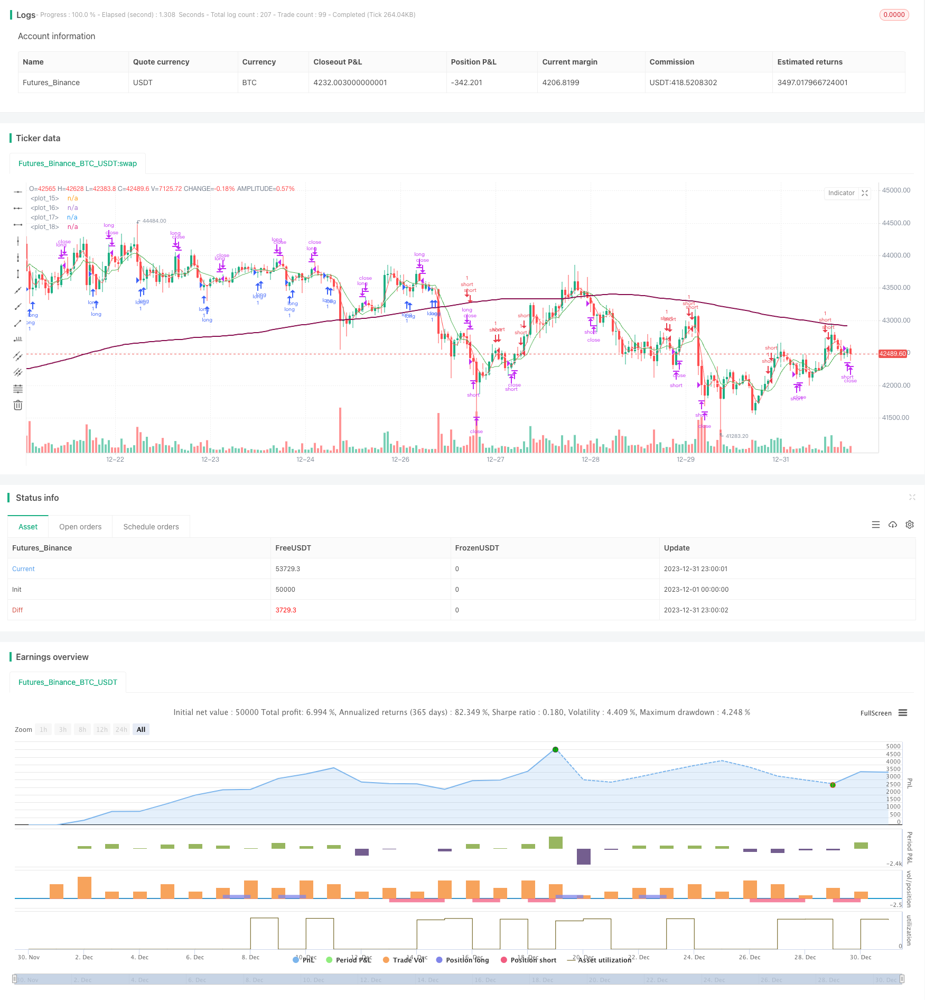

> Name

Reversal-Trading-Strategy-Based-on-Moving-Average-Range
> Author

ChaoZhang

> Strategy Description


 [trans]
## Overview
This strategy is named "Moving Average Span Reversal". It calculates the intersection between moving averages of different periods, determines the timing of market reversal, and takes appropriate long and short operations.
## Strategy Principle
This strategy calculates 3 moving averages at the same time, which are:
1. Fast moving average (period parameter flenght): reflects the latest price changes
2. Slow moving average (cycle parameter llenght): reflects the mid-term price trend
3. The slowest moving average (cycle parameter sslenght): reflects the long-term price trend
When the fast moving average crosses the slow moving average from below, it means that the short-term market has begun to reverse to the long position; when the fast moving average crosses the slow moving average from the top, it means that the short-term market has begun to reverse to the short position.
In order to filter out false breakthroughs, the strategy also introduces a fourth moving average, the long-term trend filter (cycle parameter tlenght). Only when the price is above the moving average, a long signal is considered; only when the price is below the moving average, a short signal is considered.
The specific trading rules are as follows:
1. When the fast moving average crosses the slow moving average, and the slow moving average crosses the slowest moving average (short-term bull signal), and when the price is higher than the long-term trend filter, go long and enter the market; when the fast moving average crosses below the slow moving average, close the long position.
2. When the fast moving average crosses the slow moving average, and the slow moving average crosses the slowest moving average (short-term short signal), and when the price is lower than the long-term trend filter, enter the market short; when the fast moving average crosses the slow moving average, close the short position.
## Advantage Analysis
This strategy has the following advantages:
1. Using multi-time frame analysis, it can effectively identify changes in short, medium and long-term price trends and reduce false signals. 
2. Introducing a long-term trend filter can avoid misaligned transactions before long-term trend changes.
3. The trading rules are simple and clear, easy to understand and implement, and are suitable for quantitative trading.
4. The reversal strategy has the advantage of positive skewed returns and profits.
5. The real simulation backtesting effect is good, and the income and profitability factors are both good.
## Risk Analysis
This strategy also has the following risks:
1. The moving average strategy is sensitive to parameters, and different parameters will produce different results.
2. The reversal signal may have a false breakthrough, resulting in trading losses.
3. The market may fluctuate for a long time, with multiple reversals causing profits to return to zero.
4. After the reversal, the price may have a strong breakthrough and be unable to stop the loss in time and exit.
Solution:
1. Optimize parameters and find the best parameter combination. 
2. Properly extend the confirmation time of the reversal signal to avoid false breakthroughs.
3. Increase the stop loss range to reduce the risk of loss.
## Optimization direction
This strategy can also be optimized from the following aspects:
1. Test more parameter combinations to find optimal parameters.
2. Increase trading volume filtering to avoid low-volume false breakthroughs. 
3. Combine with other indicators to confirm the entry signal.
4. Dynamically adjust the stop loss position and optimize the exit mechanism.
5. Optimize fund management strategies and control risks.
## Summarize
This strategy is based on the golden cross of the moving average for reversal trading, and introduces a long-term trend filter to guide the trading direction, which can effectively identify market reversal opportunities. Judging from the backtest results, this strategy has good profitability and has certain practical application value. Subsequent optimization can be carried out in terms of parameter selection, indicator filtering, stop loss mechanism, etc. to make the strategy more robust and practical.
||

## Overview  

This strategy is named "Moving Average Range Reversal". It identifies market reversal opportunities by calculating crossovers between moving averages of different timeframes and takes appropriate long/short positions.  

## Strategy Logic  

The strategy computes 3 moving averages simultaneously:  

1. Fast MA (flenght): Reflecting latest price changes  
2. Slow MA (llenght): Reflecting mid-term price trends  
3. Slowest MA (sslenght): Reflecting long-term price tendencies  

When fast MA crosses above slow MA, it signals a short-term trend reversal to bullish. When fast MA crosses below slow MA, it signals a short-term reversal to bearish.  

To avoid false signals, a 4th MA is introduced as the long-term filter (tlenght). Only above this filter long signals are considered. Only below this filter short signals are considered.  

The specific trading rules are:  

1. When fast MA crosses above slow MA, and slow MA also crosses above slowest MA (short-term bullish), while price is above the long-term filter, go long. When fast MA crosses below slow MA, close long position.  

2. When fast MA crosses below slow MA, and slow MA also crosses below slowest MA (short-term bearish), while price is below the long-term filter, go short. When fast MA crosses above slow MA, close short position.

## Advantage Analysis   

The advantages of this strategy include:  

1. Utilizing multiple timeframes to identify trend changes more precisely and reduce false signals.   
2. Long-term filter avoids mispositioned trades before major trend reversal.  
3. Simple and clear rules, easy to understand and automate.
4. Reversal strategies benefit from positive bias in returns and profits.  
5. Good backtest results in simulated live trading regarding returns and profit factor.

## Risk Analysis   

The risks of the strategy include:

1. MA strategies are sensitive to parameters. Different parameters lead to different results.  
2. False breakout of reversal signals may cause losses. 
3. Prolonged sideways may nullify profits from repeated reversals.   
4. Price may reverse and accelerate with strength, failing timely stop loss.

Solutions:  

1. Optimize parameters to find best combination.  
2. Increase signal confirmation time to avoid false signals.   
3. Expand stop loss range to control loss amount.  

## Optimization Directions   

The strategy can be improved in the following aspects:  

1. Test more parameter sets to find optimum values.  
2. Add volume filter to avoid false signals in low volume conditions.   
3. Incorporate other indicators to confirm entry signals.  
4. Implement dynamic adjustment of stop loss for better exit control.
5. Optimize risk management for tighter risk control.   

## Conclusion   

This strategy trades market reversals identified by MA crossovers, with direction guidance from the long-term filter. It effectively captures opportunities at turning points. The positive backtest results show good profitability for live application. Further optimizations on parameters, signal filtering, stop loss etc. can make the strategy more robust for practical use.  

[/trans]

> Strategy Arguments


|Argument|Default|Description|
|----|----|----|
|v_input_int_1|3|Fast MA Period|
|v_input_int_2|5|Slower MA Period|
|v_input_int_3|8|Slowest MA Period|
|v_input_int_4|200|Trend Filter MA Period|


> Source (PineScript)

``` pinescript
/*backtest
start: 2023-12-01 00:00:00
end: 2023-12-31 23:59:59
period: 1h
basePeriod: 15m
exchanges: [{"eid":"Futures_Binance","currency":"BTC_USDT"}]
*/

//@version=5

strategy("Moving Average Trap", overlay=true)

flenght = input.int(title="Fast MA Period", minval=1, maxval=2000, defval=3)
llenght = input.int(title="Slower MA Period", minval=1, maxval=2000, defval=5)
sslenght = input.int(title="Slowest MA Period", minval=1, maxval=2000, defval=8)
tlenght = input.int(title="Trend Filter MA Period", minval=1, maxval=2000, defval=200)

ssma = ta.sma(close, sslenght)
fma = ta.sma(close, flenght)
sma = ta.sma(close, llenght)
tma = ta.sma(close, tlenght)

plot(fma, color=color.red)
plot(sma, color=color.white)
plot(ssma, color=color.green)
plot(tma, color=color.maroon, linewidth=2)

short =  (fma > sma and sma > ssma) and close < tma
long = (fma < sma and sma < ssma) and close > tma
closeshort = fma < sma and sma < ssma
closelong = fma > sma and sma > ssma

if long
	strategy.entry("long", strategy.long)
if closelong
	strategy.close("long")
if short
	strategy.entry("short", strategy.short)
if closeshort
	strategy.close("short")

//plot(strategy.equity, title="equity", color=color.red, linewidth=2, style=plot.style_areabr)
```

> Detail

https://www.fmz.com/strategy/439973

> Last Modified

2024-01-25 14:16:28
