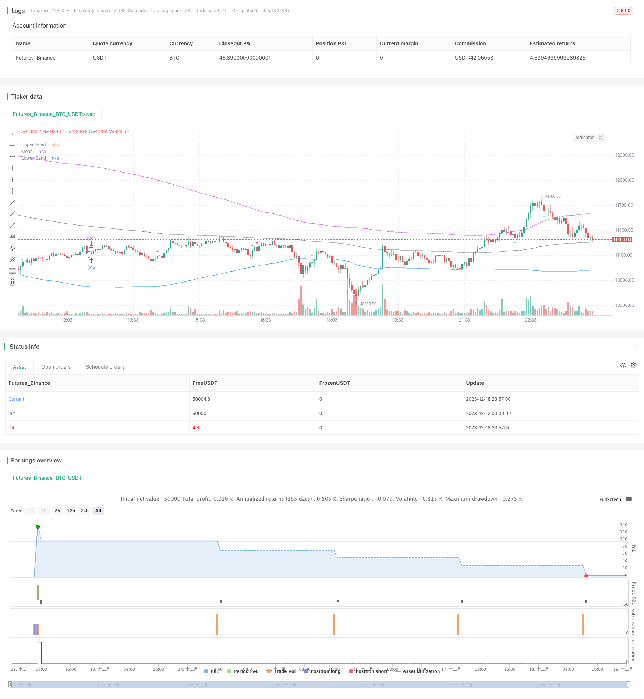

> Name

Reverse-Mean-Breakthrough-Strategy
> Author

ChaoZhang

> Strategy Description


 [trans]

## Overview
The reversal mean breakout strategy is a multi-factor trend reversal strategy. It combines moving averages, Bollinger Bands, CCI indicators, RSI indicators and other technical indicators to capture opportunities for price reversal from overbought and oversold areas. This strategy also combines canonical divergence analysis to detect whether the current trend is consistent with the previous trend, thereby avoiding false breakthroughs in trading.
## Strategy Principle
The core logic of this strategy is to take appropriate short positions and long positions when the price reverses from the overbought and oversold areas. Specifically, the strategy judges reversal opportunities from four aspects:
1. The CCI indicator or momentum indicator sends a golden cross signal to determine overbought or oversold.
2. The RSI indicator determines whether it is in the overbought and oversold area. It is stipulated that RSI above 65 is an overbought zone, and below 35 is an oversold zone.
3. Use the Bollinger Bands to determine whether the price deviates from the normal area. When the price re-enters the normal area, it may reverse.
4. Detect the regular divergence of the RSI indicator to avoid chasing false breakthroughs.
When the above conditions are met, the strategy will enter the market in the opposite direction. And set a stop loss position to control risks.
## Strategic Advantages
The biggest advantage of this strategy is that it combines multiple indicators to determine reversal opportunities, and the average winning rate is higher. Specifically, the main points are as follows:
1. Multi-factor judgment, high reliability. It will not rely solely on a single indicator, reducing the probability of misjudgment.
2. Reversal trading has a high probability of winning. Trend reversal is a more reliable trading method.
3. Detect divergence, avoid chasing false breakthroughs, and reduce systemic risks.
4. Stop-loss mechanism controls risks. Excessive losses in a single transaction can be avoided to the greatest extent.
## Risks and Solutions
This strategy also has some risks, mainly focusing on the following points:
1. The reversal time point is not accurately judged. causing the stop loss to be triggered. The stop loss range can be appropriately expanded.
2. The Bollinger Band parameters are improperly set, and normal prices are regarded as abnormal. Parameters should be set in conjunction with market volatility.
3. The number of transactions may be high. Appropriately expand the range of judgment parameters such as CCI and reduce the frequency of transactions.
4. The long-short balance may vary greatly. Whether the indicator parameters are reasonable should be judged based on historical data.
## Optimization direction
This strategy can be optimized from the following directions:
1. Use machine learning algorithms to automatically optimize indicator parameters. Avoid manual experience errors.
2. Add shale indicators, amplitude indicators, etc. to judge the intensity of overbought and oversold.
3. Increase the trading volume indicator to judge the reliability of reversal. For example, trading volume, position Daten, etc.
4. Determine market sentiment based on blockchain data. Improve the adaptability of the strategy.
5. Introduce an adaptive stop loss mechanism. Adjust the stop loss level according to changes in market volatility.
## Summarize
The reversal mean breakout strategy comprehensively uses a variety of indicators to determine reversal opportunities. On the premise of controlling risks, the probability of winning is higher. This strategy is highly practical and has room for further optimization. If the parameters are set properly, ideal results should be obtained.
|| 

## Overview

The Reverse Mean Breakthrough Strategy is a multi-factor trend reversal strategy. It combines moving average, Bollinger Bands, CCI, RSI and other technical indicators to capture price reversal opportunities from overbought and oversold areas. The strategy also incorporates regular divergence analysis to detect inconsistencies between current and previous trends, thus avoiding false breakouts.   

## Strategy Principle  

The core logic of this strategy is to take appropriate short or long positions when prices reverse from overbought or oversold zones. Specifically, the strategy judges reversal opportunities from four aspects:

1. CCI indicator or momentum indicator issues golden cross dead cross signals to determine overbought or oversold status.  

2. RSI indicator judges whether it is in overbought or oversold zone. Overbought above 65 and oversold below 35.

3. Use Bollinger Bands upper and lower rail to determine if price deviates from normal range. Prices may reverse when return to normal range.   

4. Detect regular divergence of RSI indicator to avoid chasing false breakouts.

When the above conditions are met, the strategy will take reverse direction entry. And set stop loss to control risk.

## Advantage Analysis   

The biggest advantage of this strategy is that it combines multiple indicators to determine reversal opportunities with relatively high winning rate. Specifically:  

1. Reliability is higher by using multiple factors. Avoid relying solely on single indicator thus reduce misjudgment.

2. Trend reversal has larger winning probability. It's a relatively reliable trading method.  

3. Detecting divergence avoids chasing false breakout and reduces systemic risk.  

4. Stop loss mechanism controls risk. Can minimize single ticket loss as much as possible.

## Risk Analysis

There are also some risks with this strategy:

1. Judgment inaccuracies on reversal timing point. Stop loss can be triggered. Expand stop loss range appropriately.  

2. Bollinger Bands parameters set inappropriately, takes normal price action as abnormal. Parameters should cater to market volatility.

3. Number of trades could be relatively high. Expand CCI etc. judgment range properly to reduce trading frequency.

4. Long short imbalance. Judge if parameters suit historical data.

## Optimization  

The strategy can be optimized in the following aspects:

1. Use machine learning algorithms to automatically optimize parameters. Avoid artificial empirical errors.

2. Increase shale index, amplitude index etc. to determine overbought & oversold strength.  

3. Add trading volume indicators to determine reversal reliability, e.g. volume, open interest etc.

4. Incorporate blockchain data to gauge market sentiment. Improve strategy adaptivity. 

5. Introduce adaptive stop loss mechanism based on market volatility.

## Summary   

The reverse mean breakthrough strategy integrates multiple indicators to determine reversal trades. With proper risk control, it has relatively large winning rate. The strategy is practical with room for further optimization. With proper parameter tuning, it should yield fairly ideal results.  
[/trans]

> Strategy Arguments


|Argument|Default|Description|
|----|----|----|
|v_input_int_1|10|Stop Loss (in Pips)|
|v_input_string_1|0|Entry Signal Source: CCI|Momentum|
|v_input_int_2|10|CCI/Momentum Length|
|v_input_bool_1|false|Find Regular Bullish/Bearish Divergence|
|v_input_int_3|65|RSI Overbought Level|
|v_input_int_4|35|RSI Oversold Level|
|v_input_int_5|14|RSI Length|
|v_input_bool_2|true|Plot Mean Reversion Bands on the chart|
|v_input_1|200|Lookback Period (EMA)|
|v_input_float_1|1.6|Outer Bands Multiplier|


> Source (PineScript)

``` pinescript
/*backtest
start: 2023-12-12 00:00:00
end: 2023-12-19 00:00:00
period: 3m
basePeriod: 1m
exchanges: [{"eid":"Futures_Binance","currency":"BTC_USDT"}]
*/

//@version=5
strategy(title='BroTheJo Strategy', shorttitle='BTJ INV', overlay=true)

// Input settings
stopLossInPips = input.int(10, minval=0, title='Stop Loss (in Pips)')
ccimomCross = input.string('CCI', 'Entry Signal Source', options=['CCI', 'Momentum'])
ccimomLength = input.int(10, minval=1, title='CCI/Momentum Length')
useDivergence = input.bool(false, title='Find Regular Bullish/Bearish Divergence')
rsiOverbought = input.int(65, minval=1, title='RSI Overbought Level')
rsiOversold = input.int(35, minval=1, title='RSI Oversold Level')
rsiLength = input.int(14, minval=1, title='RSI Length')
plotMeanReversion = input.bool(true, 'Plot Mean Reversion Bands on the chart')
emaPeriod = input(200, title='Lookback Period (EMA)')
bandMultiplier = input.float(1.6, title='Outer Bands Multiplier')

// CCI and Momentum calculation
momLength = ccimomCross == 'Momentum' ? ccimomLength : 10
mom = close - close[momLength]
cci = ta.cci(close, ccimomLength)
ccimomCrossUp = ccimomCross == 'Momentum' ? ta.cross(mom, 0) : ta.cross(cci, 0)
ccimomCrossDown = ccimomCross == 'Momentum' ? ta.cross(0, mom) : ta.cross(0, cci)

// RSI calculation
src = close
up = ta.rma(math.max(ta.change(src), 0), rsiLength)
down = ta.rma(-math.min(ta.change(src), 0), rsiLength)
rsi = down == 0 ? 100 : up == 0 ? 0 : 100 - 100 / (1 + up / down)
oversoldAgo = rsi[0] <= rsiOversold or rsi[1] <= rsiOversold or rsi[2] <= rsiOversold or rsi[3] <= rsiOversold
overboughtAgo = rsi[0] >= rsiOverbought or rsi[1] >= rsiOverbought or rsi[2] >= rsiOverbought or rsi[3] >= rsiOverbought

// Regular Divergence Conditions
bullishDivergenceCondition = rsi[0] > rsi[1] and rsi[1] < rsi[2]
bearishDivergenceCondition = rsi[0] < rsi[1] and rsi[1] > rsi[2]

// Mean Reversion Indicator
meanReversion = plotMeanReversion ? ta.ema(close, emaPeriod) : na
stdDev = plotMeanReversion ? ta.stdev(close, emaPeriod) : na
upperBand = plotMeanReversion ? meanReversion + stdDev * bandMultiplier : na
lowerBand = plotMeanReversion ? meanReversion - stdDev * bandMultiplier : na

// Entry Conditions
prevHigh = ta.highest(high, 1)
prevLow = ta.lowest(low, 1)
shortEntryCondition = ccimomCrossUp and oversoldAgo and (not useDivergence or bullishDivergenceCondition) and (prevHigh >= meanReversion) and (prevLow >= meanReversion)
longEntryCondition = ccimomCrossDown and overboughtAgo and (not useDivergence or bearishDivergenceCondition) and (prevHigh <= meanReversion) and (prevLow <= meanReversion)

// Plotting
oldShortEntryCondition = ccimomCrossUp and oversoldAgo and (not useDivergence or bullishDivergenceCondition)
oldLongEntryCondition = ccimomCrossDown and overboughtAgo and (not useDivergence or bearishDivergenceCondition)
plotshape(oldLongEntryCondition, title='BUY', style=shape.triangleup, text='B', location=location.belowbar, color=color.new(color.lime, 0), textcolor=color.new(color.white, 0), size=size.tiny)
plotshape(oldShortEntryCondition, title='SELL', style=shape.triangledown, text='S', location=location.abovebar, color=color.new(color.red, 0), textcolor=color.new(color.white, 0), size=size.tiny)

// Strategy logic
if (longEntryCondition)
    stopLoss = close - stopLossInPips
    strategy.entry("Buy", strategy.long)
    strategy.exit("exit", "Buy", stop=stopLoss)
if (shortEntryCondition)
    stopLoss = close + stopLossInPips
    strategy.entry("Sell", strategy.short)
    strategy.exit("exit", "Sell", stop=stopLoss)

// Close all open positions when outside of bands
closeAll = (high >= upperBand) or (low <= lowerBand)

if (closeAll)
    strategy.close_all("Take Profit/Cut Loss")

// Plotting
plot(upperBand, title='Upper Band', color=color.fuchsia, linewidth=1)
plot(meanReversion, title='Mean', color=color.gray, linewidth=1)
plot(lowerBand, title='Lower Band', color=color.blue, linewidth=1)

```

> Detail

https://www.fmz.com/strategy/435969

> Last Modified

2023-12-20 14:48:57
