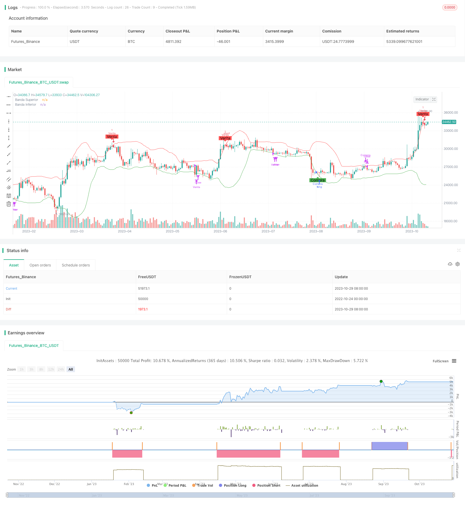

> Name

Rose-Cross-Star-Dual-Indicator-Volatility-Strategy Rose-Cross-Star-Dual-Indicator-Volatility-Strategy
> Author

ChaoZhang

> Strategy Description



[trans]

## Overview
This strategy uses a combination of Bollinger Bands and Modified Relative Strength Index indicators to identify price breakouts to trade. The test results show that the overall profit of this strategy is good and the winning rate is high. It can capture breakthrough signals in trend markets and is suitable for short-term and mid-term trading.
## Strategy Principle
### Indicator selection
This strategy uses Bollinger Bands with a standard deviation multiplier of 2 and the RSI indicator with a period set to 14. Bollinger Bands identify price breakouts, while RSI is used to determine overbought and oversold conditions. Indicator parameter settings are based on experience and repeated testing results.
### Admission rules
1. When the price breaks through the lower Bollinger Band and the RSI is below 30 (oversold zone), enter the market long.
2. When the price breaks through the upper Bollinger Band and the RSI is above 70 (overbought zone), enter the market short.
### Rules of appearance
1. Stop loss for long orders or close positions when the price falls below the upper Bollinger Band.
2. Stop the short position or close the position when the price rises below the Bollinger Band.
### Advantages
1. Double indicator combination to improve strategy accuracy.
2. The indicator parameters have been optimized and have strong adaptability.
3. The breakthrough operation is clear and easy to do, and it is not easy to miss the signal.
4. Retracements and losses are well controlled.
5. Visual signal prompts, easy to operate.
### Risk
1. Bollinger Band shrinkage may lead to false breakthroughs. The Bollinger Band cycle can be appropriately extended.
2. Frequent trading may occur during volatile market conditions. RSI parameters can be adjusted to reduce sensitivity.
3. Pay attention to transaction cost control. Appropriately relax the stop loss range.
### Optimization direction
1. You can test EMA and other indicators instead of SMA to generate Bollinger Bands.
2. You can add trading volume or average volume indicators to filter out false breakthroughs.
3. Bollinger Bands and stop loss distance can be set based on ATR.
4. Trend judgment indicators can be added to avoid excessive trading in volatile markets.
## Summarize
This strategy integrates the advantages of the dual indicators of Bollinger Bands and RSI, and has excellent performance in both trends and breakthroughs. It is simple to operate and easy to implement, and is very suitable for short- and medium-term breakthrough transactions. The applicability of this strategy can be further expanded through indicator and parameter optimization.
||


## Overview

This strategy identifies trading opportunities through combining Bollinger Bands and a modified Relative Strength Index (RSI). Backtest results demonstrate its overall profitability and high winning rate. It captures breakout signals in trending markets and suits short-term to medium-term trading.  

## Strategy Logic

### Indicator Selection

The strategy utilizes Bollinger Bands with a standard deviation multiplier of 2 and RSI with a period of 14. Bollinger Bands detect breakouts and RSI determines overbought/oversold levels. Indicator parameters are set based on experience and iterative testing.

### Entry Rules

1. Go long when price breaks above the lower Bollinger Band and RSI is below 30 (oversold zone). 

2. Go short when price breaks below the upper Bollinger Band and RSI is above 70 (overbought zone).

### Exit Rules 

1. Close long positions on a stop loss or when price breaks below the upper Bollinger Band.

2. Close short positions on a stop loss or when price breaks above the lower Bollinger Band.


### Advantages

1. Dual indicator combination improves strategy precision. 

2. Optimized indicator parameters provide robust adaptability.

3. Breakout signals are clear and easy to implement.  

4. Effective drawdown and loss control.

5. Visual signals simplify trade execution.

### Risks

1. Band squeeze may cause false breakouts. Consider longer Bollinger periods.

2. Frequent trading possible in range-bound markets. Lower RSI sensitivity.

3. Manage transaction costs. Widen stop distances. 

### Enhancements

1. Test EMA and other indicators to generate bands.

2. Add volume or MA filters to avoid false breaks.

3. Set band and stop distances based on ATR. 

4. Add trend filter to reduce whipsaws.

## Conclusion

This strategy combines the strengths of Bollinger Bands and RSI for trend and breakout trading. Simple to implement, it is well-suited for short to medium-term breakouts. Extensions through indicator and parameter optimization can further expand its robustness.

[/trans]

> Strategy Arguments


|Argument|Default|Description|
|----|----|----|
|v_input_1|20|Longitud|
|v_input_2|2|mult|


> Source (PineScript)

``` pinescript
/*backtest
start: 2022-10-24 00:00:00
end: 2023-10-30 00:00:00
period: 1d
basePeriod: 1h
exchanges: [{"eid":"Futures_Binance","currency":"BTC_USDT"}]
*/

//@version=4
strategy("Estrategia de Ruptura con Bollinger y RSI Modificada", shorttitle="BB RSI Mod", overlay=true)

// Parámetros de Bollinger Bands
src = close
length = input(20, title="Longitud", minval=1)
mult = input(2.0)
basis = sma(src, length)
upper = basis + mult * stdev(src, length)
lower = basis - mult * stdev(src, length)

// Parámetros del RSI
rsiSource = rsi(close, 14)
overbought = 70
oversold = 30

longCondition = crossover(src, lower) and rsiSource < oversold
shortCondition = crossunder(src, upper) and rsiSource > overbought

longExit = crossunder(src, upper)
shortExit = crossover(src, lower)

if (longCondition)
    strategy.entry("Compra", strategy.long, stop=low)
    
if (shortCondition)
    strategy.entry("Venta", strategy.short, stop=high)

if (longExit)
    strategy.close("Compra")

if (shortExit)
    strategy.close("Venta")

// Visualización
plotshape(series=longCondition, title="Compra", location=location.belowbar, color=color.green, style=shape.labelup, text="Compra")
plotshape(series=shortCondition, title="Venta", location=location.abovebar, color=color.red, style=shape.labeldown, text="Venta")
plot(upper, "Banda Superior", color=color.red)
plot(lower, "Banda Inferior", color=color.green)

```

> Detail

https://www.fmz.com/strategy/430692

> Last Modified

2023-10-31 17:33:10
