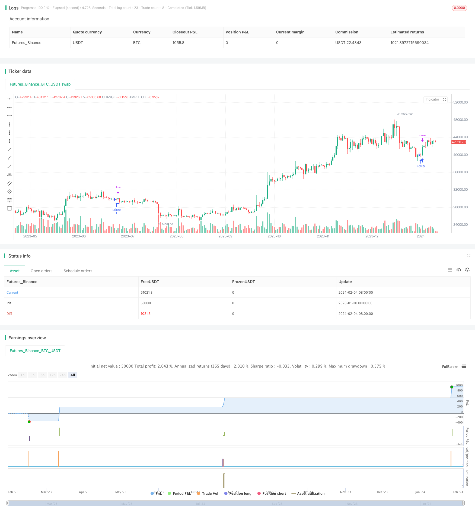

> Name

Quantitative trading two-way S-R strategy TD-Sequential-Dual-Direction-S-R-Trading-Strategy
> Author

ChaoZhang

> Strategy Description


[trans]
## Overview
This strategy identifies support and resistance levels by tracking the number of consecutive price increases or decreases, and then combines moving averages as entry and stop loss signals to construct long and short position trading strategies. This strategy can be long and short at the same time, or only unilateral.
## Principle
1. Identification of support and resistance levels
    - When the closing price is higher than the closing price of the previous 4 days for 4 consecutive days, this point is recorded as a downward support level
    - When the closing price is lower than the closing price of the previous 4 days for 4 consecutive days, this point is recorded as an upward resistance level
2. Signal generation
    - After identifying the support level, if the price rise period reaches the set long position threshold (default 9 days), a long signal will be generated
    - After identifying the resistance level, if the price decline period reaches the set short position threshold (default 9 days), a short signal will be generated
3. Moving average filtering and stop loss
    - When entering the market, the price is required to be higher or lower than the moving average of the set period, which is used to filter the signal.
    - Stop loss is set to the moving average on entry
## Advantages
1. It is more reliable to use support and resistance levels to judge, and you will not be misled by short-term fluctuations.
2. Combining moving average filtering can reduce false signals
3. Two-way trading can increase the frequency of operations and increase profit opportunities
4. The parameters are adjustable and can be optimized according to different varieties and market conditions.
## Risks and Solutions
1. In a trending market, multiple losing trades may occur in a short period of time
    - You can appropriately increase the moving average period and reduce the trading frequency
2. The probability of misjudgment of support or resistance levels
    - The length threshold for determining support and resistance levels can be appropriately adjusted
3. In a volatile market, stop loss may be triggered too frequently.
    - The stop loss range can be appropriately relaxed
    - Added trend judgment indicators
## Optimization direction
1. Add more technical indicators to judge and improve the stability of the strategy
    - Add trend, momentum and other judgment indicators
2. Optimize the judgment logic of support and resistance levels
    - Test the impact of different parameters on conclusions
3. Optimize parameters for specific varieties and cycles
    - Different varieties have different adjustable ranges of parameters
4. Develop adaptive stop loss mechanism
    - Dynamically adjust the stop loss width according to the degree of market volatility
## Summarize
This strategy is relatively simple and reliable overall. By correctly judging the support and resistance levels, you can capture price reversal opportunities with a high probability. At the same time, combined with the moving average, it ensures the timing of entry and avoids being trapped. Finally, the direction of this strategy is relatively conservative, but it has strong adaptability and scalability. Users can choose appropriate parameters for optimization based on their own understanding of the market, thereby achieving better performance.
||

## Overview  

This strategy identifies support and resistance levels by tracking the consecutive up and down bars of prices, and combines moving averages as entry and stop loss signals to construct long and short trading strategies. The strategy can go both long and short, or only one side.

## Principles  

1. S/R identification  
    - When the close price is higher than the close of 4 days ago for 4 consecutive days, mark the point as a downside support  
    - When the close price is lower than the close of 4 days ago for 4 consecutive days, mark the point as a upside resistance
2. Signal generation 
    - After identifying a support level, if the up bar count reaches the threshold (default 9 days), generate long signal
    - After identifying a resistance level, if the down bar count reaches the threshold (default 9 days), generate short signal  
3. MA filter and stop loss
    - Require price to cross the MA line on entry, to filter signals
    - Set stop loss to the MA line at entry  

## Advantages

1. Judgment based on S/R is relatively reliable, not easily misled by short-term fluctuations  
2. Combining MA filter can reduce false signals
3. Go both long and short to improve frequency and profit opportunities  
4. Parameters adjustable, can be optimized for different products and market situations

## Risks and Solutions

1. May suffer consecutive losses in trending markets
    - Increase MA period to reduce trade frequency
2. Probability of wrong S/R judgement 
    - Fine tune thresholds for S/R identification
3. Stop loss may be triggered too often in whipsaw markets
    - Loosen stop loss range 
    - Add trend indicator

## Optimization Directions   

1. Add more technical indicators to improve robustness
    - Trend, momentum etc.
2. Optimize S/R identification logic 
    - Test impact of different parameters  
3. Parameter tuning for specific products and timeframes
    - Adjustable range varies across products
4. Develop adaptive stop loss mechanism 
    - Dynamically adjust stop loss based on market volatility

## Conclusion

The strategy is relatively simple and reliable. By correctly identifying S/R levels it captures price reversal opportunities with high probability. Combining with MA ensures proper entry timing and avoids traps. Finally, the directional judgement is conservative but adaptable. Users can optimize parameters according to their market understanding and achieve even better results.

[/trans]

> Strategy Arguments


|Argument|Default|Description|
|----|----|----|
|v_input_1|0|Long Only or Short Only or Both?: Both|Long Only|Short Only|
|v_input_2|9|TD Sequential Long Price Flip|
|v_input_3|9|TD Sequential Short Price Flip|
|v_input_4|0|Long MA: SMA|EMA|VWMA|
|v_input_5|0|Short MA: SMA|EMA|VWMA|
|v_input_6|10|Long MA Exit Length|
|v_input_7|10|Short MA Exit Length|
|v_input_8|0|Long Trend Filter?: Above|Below|Don't Include|
|v_input_9|0|Short Trend Filter?: Below|Above|Don't Include|
|v_input_10|0|Trend MA: SMA|EMA|VWMA|
|v_input_11|200|Trend MA Length|
|v_input_12|true|Profit Target On/Off|
|v_input_13|true|Profit Target %|
|v_input_14|true|Stop Loss On/Off|
|v_input_15|-1|Stop Loss %|


> Source (PineScript)

``` pinescript
/*backtest
start: 2023-01-30 00:00:00
end: 2024-02-05 00:00:00
period: 1d
basePeriod: 1h
exchanges: [{"eid":"Futures_Binance","currency":"BTC_USDT"}]
*/

// This source code is subject to the terms of the Mozilla Public License 2.0 at https://mozilla.org/MPL/2.0/
// © GlobalMarketSignals

//@version=4
strategy("GMS: TD Sequential Strategy", overlay=true)

LongShort     = input(title="Long Only or Short Only or Both?", type=input.string, defval="Both", options=["Both", "Long Only", "Short Only"])
PriceFlipL    = input(title="TD Sequential Long Price Flip", type = input.integer ,defval=9)
PriceFlipS    = input(title="TD Sequential Short Price Flip", type = input.integer ,defval=9)
MAs1          = input(title="Long MA", type=input.string, defval="SMA", options=["SMA", "EMA", "VWMA"])
MAs2          = input(title="Short MA", type=input.string, defval="SMA", options=["SMA", "EMA", "VWMA"])
SMAlenL       = input(title="Long MA Exit Length", type = input.integer ,defval=10)
SMAlenS       = input(title="Short MA Exit Length", type = input.integer ,defval=10)
AboveBelowL   = input(title="Long Trend Filter?", type=input.string, defval="Above", options=["Above", "Below", "Don't Include"])
AboveBelowS   = input(title="Short Trend Filter?", type=input.string, defval="Below", options=["Above", "Below", "Don't Include"])
TLma          = input(title="Trend MA", type=input.string, defval="SMA", options=["SMA", "EMA", "VWMA"])
TrendLength   = input(title="Trend MA Length", type = input.integer ,defval=200)
PTbutton      = input(title="Profit Target On/Off", type=input.bool, defval=true)
ProfitTarget  = input(title="Profit Target %", type=input.float, defval=1, step=0.1, minval=0)
SLbutton      = input(title="Stop Loss On/Off", type=input.bool, defval=true)
StopLoss      = input(title="Stop Loss %", type=input.float, defval=-1, step=0.1, maxval=0)

//PROFIT TARGET & STOPLOSS

if PTbutton == true and SLbutton == true
    strategy.exit("EXIT", profit=((close*(ProfitTarget*0.01))/syminfo.mintick), loss=((close*(StopLoss*-0.01))/syminfo.mintick))
else
    if PTbutton == true and SLbutton == false
        strategy.exit("PT EXIT", profit=((close*(ProfitTarget*0.01))/syminfo.mintick))
    else
        if PTbutton == false and SLbutton == true
            strategy.exit("SL EXIT", loss=((close*(StopLoss*-0.01))/syminfo.mintick))
        else    
            strategy.cancel("PT EXIT")

// S/R Code By johan.gradin (lines 36-46)
// Buy setup//
priceflip1 = barssince(close>close[4])
buysetup = close<close[4] and priceflip1
buy = buysetup and barssince(priceflip1!=9)
buyovershoot = barssince(priceflip1!=13) and buysetup
// Sell Setup //
priceflip = barssince(close<close[4])
sellsetup = close>close[4] and priceflip
sell = sellsetup and barssince(priceflip!=9)
sellovershoot = sellsetup and barssince(priceflip!=13)


///////
/////// SMA
///////

if LongShort =="Long Only" and AboveBelowL == "Above" and MAs1 == "SMA" and TLma == "SMA"
    strategy.entry("LONG", true, when = buysetup and barssince(priceflip1!=PriceFlipL) and close<sma(close,SMAlenL) and close>sma(close,TrendLength))
    strategy.close("LONG", when = close>sma(close,SMAlenL))
    
if LongShort =="Long Only" and  AboveBelowL == "Below" and MAs1 == "SMA" and TLma == "SMA"
    strategy.entry("LONG", true, when = buysetup and barssince(priceflip1!=PriceFlipL) and close<sma(close,SMAlenL) and  close<sma(close,TrendLength))
    strategy.close("LONG", when = close>sma(close,SMAlenL))

if LongShort =="Long Only" and  AboveBelowL == "Don't Include" and MAs1 == "SMA" and TLma == "SMA"
    strategy.entry("LONG", true, when = buysetup and barssince(priceflip1!=PriceFlipL) and close<sma(close,SMAlenL) )
    strategy.close("LONG", when = close>sma(close,SMAlenL))
    
///////
    
if LongShort =="Short Only" and  AboveBelowS == "Above" and MAs2 == "SMA" and TLma == "SMA"
    strategy.entry("SHORT", false, when = sellsetup and barssince(priceflip!=PriceFlipS) and close>sma(close,SMAlenS) and close>sma(close,TrendLength))
    strategy.close("SHORT", when = close<sma(close,SMAlenS))
    
if LongShort =="Short Only" and  AboveBelowS == "Below" and MAs2 == "SMA" and TLma == "SMA"
    strategy.entry("SHORT", false, when = sellsetup and barssince(priceflip!=PriceFlipS) and close>sma(close,SMAlenS) and close<sma(close,TrendLength))
    strategy.close("SHORT",  when = close<sma(close,SMAlenS))

if LongShort =="Short Only" and  AboveBelowS == "Don't Include" and MAs2 == "SMA" and TLma == "SMA"
    strategy.entry("SHORT", false, when = sellsetup and barssince(priceflip!=PriceFlipS) and close>sma(close,SMAlenS) )
    strategy.close("SHORT",  when = close<sma(close,SMAlenS))

///////
    
if LongShort =="Both" and AboveBelowL == "Above" and MAs1 == "SMA" and TLma == "SMA"
    strategy.entry("LONG", true, when = buysetup and barssince(priceflip1!=PriceFlipL) and close<sma(close,SMAlenL) and close>sma(close,TrendLength))
    strategy.close("LONG", when = close>sma(close,SMAlenL))
    
if LongShort =="Both" and  AboveBelowL == "Below" and MAs1 == "SMA" and TLma == "SMA"
    strategy.entry("LONG", true, when = buysetup and barssince(priceflip1!=PriceFlipL) and close<sma(close,SMAlenL) and  close<sma(close,TrendLength))
    strategy.close("LONG", when = close>sma(close,SMAlenL))

if LongShort =="Both" and  AboveBelowL == "Don't Include" and MAs1 == "SMA" and TLma == "SMA"
    strategy.entry("LONG", true, when = buysetup and barssince(priceflip1!=PriceFlipL) and close<sma(close,SMAlenL) )
    strategy.close("LONG", when = close>sma(close,SMAlenL))
    
    
if LongShort =="Both" and  AboveBelowS == "Above" and MAs2 == "SMA" and TLma == "SMA"
    strategy.entry("SHORT", false, when = sellsetup and barssince(priceflip!=PriceFlipS) and close>sma(close,SMAlenS) and close>sma(close,TrendLength))
    strategy.close("SHORT", when = close<sma(close,SMAlenS))
    
if LongShort =="Both" and  AboveBelowS == "Below" and MAs2 == "SMA" and TLma == "SMA"
    strategy.entry("SHORT", false, when = sellsetup and barssince(priceflip!=PriceFlipS) and close>sma(close,SMAlenS) and close<sma(close,TrendLength))
    strategy.close("SHORT",  when = close<sma(close,SMAlenS))

if LongShort =="Both" and  AboveBelowS == "Don't Include" and MAs2 == "SMA" and TLma == "SMA"
    strategy.entry("SHORT", false, when = sellsetup and barssince(priceflip!=PriceFlipS) and close>sma(close,SMAlenS) )
    strategy.close("SHORT",  when = close<sma(close,SMAlenS))  

///////
/////// EMA
///////

if LongShort =="Long Only" and AboveBelowL == "Above" and MAs1 == "EMA" and TLma == "SMA"
    strategy.entry("LONG", true, when = buysetup and barssince(priceflip1!=PriceFlipL) and close<ema(close,SMAlenL) and close>sma(close,TrendLength))
    strategy.close("LONG", when = close>ema(close,SMAlenL))
    
if LongShort =="Long Only" and  AboveBelowL == "Below" and MAs1 == "EMA" and TLma == "SMA"
    strategy.entry("LONG", true, when = buysetup and barssince(priceflip1!=PriceFlipL) and close<ema(close,SMAlenL) and  close<sma(close,TrendLength))
    strategy.close("LONG", when = close>ema(close,SMAlenL))

if LongShort =="Long Only" and  AboveBelowL == "Don't Include" and MAs1 == "EMA" and TLma == "SMA"
    strategy.entry("LONG", true, when = buysetup and barssince(priceflip1!=PriceFlipL) and close<ema(close,SMAlenL) )
    strategy.close("LONG", when = close>ema(close,SMAlenL))
    
///////
    
if LongShort =="Short Only" and  AboveBelowS == "Above" and MAs2 == "EMA" and TLma == "SMA"
    strategy.entry("SHORT", false, when = sellsetup and barssince(priceflip!=PriceFlipS) and close>ema(close,SMAlenS) and close>sma(close,TrendLength))
    strategy.close("SHORT", when = close<ema(close,SMAlenS))
    
if LongShort =="Short Only" and  AboveBelowS == "Below" and MAs2 == "EMA" and TLma == "SMA"
    strategy.entry("SHORT", false, when = sellsetup and barssince(priceflip!=PriceFlipS) and close>ema(close,SMAlenS) and close<sma(close,TrendLength))
    strategy.close("SHORT",  when = close<ema(close,SMAlenS))

if LongShort =="Short Only" and  AboveBelowS == "Don't Include" and MAs2 == "EMA" and TLma == "SMA"
    strategy.entry("SHORT", false, when = sellsetup and barssince(priceflip!=PriceFlipS) and close>ema(close,SMAlenS) )
    strategy.close("SHORT",  when = close<ema(close,SMAlenS))

///////
    
if LongShort =="Both" and AboveBelowL == "Above" and MAs1 == "EMA" and TLma == "SMA"
    strategy.entry("LONG", true, when = buysetup and barssince(priceflip1!=PriceFlipL) and close<ema(close,SMAlenL) and close>sma(close,TrendLength))
    strategy.close("LONG", when = close>ema(close,SMAlenL))
    
if LongShort =="Both" and  AboveBelowL == "Below" and MAs1 == "EMA" and TLma == "SMA"
    strategy.entry("LONG", true, when = buysetup and barssince(priceflip1!=PriceFlipL) and close<ema(close,SMAlenL) and  close<sma(close,TrendLength))
    strategy.close("LONG", when = close>ema(close,SMAlenL))

if LongShort =="Both" and  AboveBelowL == "Don't Include" and MAs1 == "EMA" and TLma == "SMA"
    strategy.entry("LONG", true, when = buysetup and barssince(priceflip1!=PriceFlipL) and close<ema(close,SMAlenL) )
    strategy.close("LONG", when = close>ema(close,SMAlenL))
    
    
if LongShort =="Both" and  AboveBelowS == "Above" and MAs2 == "EMA" and TLma == "SMA"
    strategy.entry("SHORT", false, when = sellsetup and barssince(priceflip!=PriceFlipS) and close>ema(close,SMAlenS) and close>sma(close,TrendLength))
    strategy.close("SHORT", when = close<ema(close,SMAlenS))
    
if LongShort =="Both" and  AboveBelowS == "Below" and MAs2 == "EMA" and TLma == "SMA"
    strategy.entry("SHORT", false, when = sellsetup and barssince(priceflip!=PriceFlipS) and close>ema(close,SMAlenS) and close<sma(close,TrendLength))
    strategy.close("SHORT",  when = close<ema(close,SMAlenS))

if LongShort =="Both" and  AboveBelowS == "Don't Include" and MAs2 == "EMA" and TLma == "SMA"
    strategy.entry("SHORT", false, when = sellsetup and barssince(priceflip!=PriceFlipS) and close>ema(close,SMAlenS) )
    strategy.close("SHORT",  when = close<ema(close,SMAlenS)) 


///////
/////// VWMA
///////

if LongShort =="Long Only" and AboveBelowL == "Above" and MAs1 == "VWMA" and TLma == "SMA"
    strategy.entry("LONG", true, when = buysetup and barssince(priceflip1!=PriceFlipL) and close<vwma(close,SMAlenL) and close>sma(close,TrendLength))
    strategy.close("LONG", when = close>vwma(close,SMAlenL))
    
if LongShort =="Long Only" and  AboveBelowL == "Below" and MAs1 == "VWMA" and TLma == "SMA"
    strategy.entry("LONG", true, when = buysetup and barssince(priceflip1!=PriceFlipL) and close<vwma(close,SMAlenL) and  close<sma(close,TrendLength))
    strategy.close("LONG", when = close>vwma(close,SMAlenL))

if LongShort =="Long Only" and  AboveBelowL == "Don't Include" and MAs1 == "VWMA" and TLma == "SMA"
    strategy.entry("LONG", true, when = buysetup and barssince(priceflip1!=PriceFlipL) and close<vwma(close,SMAlenL) )
    strategy.close("LONG", when = close>vwma(close,SMAlenL))
    
///////
    
if LongShort =="Short Only" and  AboveBelowS == "Above" and MAs2 == "VWMA" and TLma == "SMA"
    strategy.entry("SHORT", false, when = sellsetup and barssince(priceflip!=PriceFlipS) and close>vwma(close,SMAlenS) and close>sma(close,TrendLength))
    strategy.close("SHORT", when = close<vwma(close,SMAlenS))
    
if LongShort =="Short Only" and  AboveBelowS == "Below" and MAs2 == "VWMA" and TLma == "SMA"
    strategy.entry("SHORT", false, when = sellsetup and barssince(priceflip!=PriceFlipS) and close>vwma(close,SMAlenS) and close<sma(close,TrendLength))
    strategy.close("SHORT",  when = close<vwma(close,SMAlenS))

if LongShort =="Short Only" and  AboveBelowS == "Don't Include" and MAs2 == "VWMA" and TLma == "SMA"
    strategy.entry("SHORT", false, when = sellsetup and barssince(priceflip!=PriceFlipS) and close>vwma(close,SMAlenS) )
    strategy.close("SHORT",  when = close<vwma(close,SMAlenS))

///////
    
if LongShort =="Both" and AboveBelowL == "Above" and MAs1 == "VWMA" and TLma == "SMA"
    strategy.entry("LONG", true, when = buysetup and barssince(priceflip1!=PriceFlipL) and close<vwma(close,SMAlenL) and close>sma(close,TrendLength))
    strategy.close("LONG", when = close>vwma(close,SMAlenL))
    
if LongShort =="Both" and  AboveBelowL == "Below" and MAs1 == "VWMA" and TLma == "SMA"
    strategy.entry("LONG", true, when = buysetup and barssince(priceflip1!=PriceFlipL) and close<vwma(close,SMAlenL) and  close<sma(close,TrendLength))
    strategy.close("LONG", when = close>vwma(close,SMAlenL))

if LongShort =="Both" and  AboveBelowL == "Don't Include" and MAs1 == "VWMA" and TLma == "SMA"
    strategy.entry("LONG", true, when = buysetup and barssince(priceflip1!=PriceFlipL) and close<vwma(close,SMAlenL) )
    strategy.close("LONG", when = close>vwma(close,SMAlenL))
    
    
if LongShort =="Both" and  AboveBelowS == "Above" and MAs2 == "VWMA" and TLma == "SMA"
    strategy.entry("SHORT", false, when = sellsetup and barssince(priceflip!=PriceFlipS) and close>vwma(close,SMAlenS) and close>sma(close,TrendLength))
    strategy.close("SHORT", when = close<vwma(close,SMAlenS))
    
if LongShort =="Both" and  AboveBelowS == "Below" and MAs2 == "VWMA" and TLma == "SMA"
    strategy.entry("SHORT", false, when = sellsetup and barssince(priceflip!=PriceFlipS) and close>vwma(close,SMAlenS) and close<sma(close,TrendLength))
    strategy.close("SHORT",  when = close<vwma(close,SMAlenS))

if LongShort =="Both" and  AboveBelowS == "Don't Include" and MAs2 == "VWMA" and TLma == "SMA"
    strategy.entry("SHORT", false, when = sellsetup and barssince(priceflip!=PriceFlipS) and close>vwma(close,SMAlenS) )
    strategy.close("SHORT",  when = close<vwma(close,SMAlenS)) 

    
//////////////////////////////////////////////////////////////////////////////////////////////////////////////////////////////////////////////////////////
//////////////////////////////////////////////////////////////////////////////////////////////////////////////////////////////////////////////////////////
//////////////////////////////////////////////////////////////////////////////////////////////////////////////////////////////////////////////////////////

///////
/////// SMA
///////


if LongShort =="Long Only" and AboveBelowL == "Above" and MAs1 == "SMA" and TLma == "EMA"
    strategy.entry("LONG", true, when = buysetup and barssince(priceflip1!=PriceFlipL) and close<sma(close,SMAlenL) and close>ema(close,TrendLength))
    strategy.close("LONG", when = close>sma(close,SMAlenL))
    
if LongShort =="Long Only" and  AboveBelowL == "Below" and MAs1 == "SMA" and TLma == "EMA"
    strategy.entry("LONG", true, when = buysetup and barssince(priceflip1!=PriceFlipL) and close<sma(close,SMAlenL) and  close<ema(close,TrendLength))
    strategy.close("LONG", when = close>sma(close,SMAlenL))

if LongShort =="Long Only" and  AboveBelowL == "Don't Include" and MAs1 == "SMA" and TLma == "EMA"
    strategy.entry("LONG", true, when = buysetup and barssince(priceflip1!=PriceFlipL) and close<sma(close,SMAlenL) )
    strategy.close("LONG", when = close>sma(close,SMAlenL))
    
///////
    
if LongShort =="Short Only" and  AboveBelowS == "Above" and MAs2 == "SMA" and TLma == "EMA"
    strategy.entry("SHORT", false, when = sellsetup and barssince(priceflip!=PriceFlipS) and close>sma(close,SMAlenS) and close>ema(close,TrendLength))
    strategy.close("SHORT", when = close<sma(close,SMAlenS))
    
if LongShort =="Short Only" and  AboveBelowS == "Below" and MAs2 == "SMA" and TLma == "EMA"
    strategy.entry("SHORT", false, when = sellsetup and barssince(priceflip!=PriceFlipS) and close>sma(close,SMAlenS) and close<ema(close,TrendLength))
    strategy.close("SHORT",  when = close<sma(close,SMAlenS))

if LongShort =="Short Only" and  AboveBelowS == "Don't Include" and MAs2 == "SMA" and TLma == "EMA"
    strategy.entry("SHORT", false, when = sellsetup and barssince(priceflip!=PriceFlipS) and close>sma(close,SMAlenS) )
    strategy.close("SHORT",  when = close<sma(close,SMAlenS))

///////
    
if LongShort =="Both" and AboveBelowL == "Above" and MAs1 == "SMA" and TLma == "EMA"
    strategy.entry("LONG", true, when = buysetup and barssince(priceflip1!=PriceFlipL) and close<sma(close,SMAlenL) and close>ema(close,TrendLength))
    strategy.close("LONG", when = close>sma(close,SMAlenL))
    
if LongShort =="Both" and  AboveBelowL == "Below" and MAs1 == "SMA" and TLma == "EMA"
    strategy.entry("LONG", true, when = buysetup and barssince(priceflip1!=PriceFlipL) and close<sma(close,SMAlenL) and  close<ema(close,TrendLength))
    strategy.close("LONG", when = close>sma(close,SMAlenL))

if LongShort =="Both" and  AboveBelowL == "Don't Include" and MAs1 == "SMA" and TLma == "EMA"
    strategy.entry("LONG", true, when = buysetup and barssince(priceflip1!=PriceFlipL) and close<sma(close,SMAlenL) )
    strategy.close("LONG", when = close>sma(close,SMAlenL))
    
    
if LongShort =="Both" and  AboveBelowS == "Above" and MAs2 == "SMA" and TLma == "EMA"
    strategy.entry("SHORT", false, when = sellsetup and barssince(priceflip!=PriceFlipS) and close>sma(close,SMAlenS) and close>ema(close,TrendLength))
    strategy.close("SHORT", when = close<sma(close,SMAlenS))
    
if LongShort =="Both" and  AboveBelowS == "Below" and MAs2 == "SMA" and TLma == "EMA"
    strategy.entry("SHORT", false, when = sellsetup and barssince(priceflip!=PriceFlipS) and close>sma(close,SMAlenS) and close<ema(close,TrendLength))
    strategy.close("SHORT",  when = close<sma(close,SMAlenS))

if LongShort =="Both" and  AboveBelowS == "Don't Include" and MAs2 == "SMA" and TLma == "EMA"
    strategy.entry("SHORT", false, when = sellsetup and barssince(priceflip!=PriceFlipS) and close>sma(close,SMAlenS) )
    strategy.close("SHORT",  when = close<sma(close,SMAlenS))  

///////
/////// EMA
///////

if LongShort =="Long Only" and AboveBelowL == "Above" and MAs1 == "EMA" and TLma == "EMA"
    strategy.entry("LONG", true, when = buysetup and barssince(priceflip1!=PriceFlipL) and close<ema(close,SMAlenL) and close>ema(close,TrendLength))
    strategy.close("LONG", when = close>ema(close,SMAlenL))
    
if LongShort =="Long Only" and  AboveBelowL == "Below" and MAs1 == "EMA" and TLma == "EMA"
    strategy.entry("LONG", true, when = buysetup and barssince(priceflip1!=PriceFlipL) and close<ema(close,SMAlenL) and  close<ema(close,TrendLength))
    strategy.close("LONG", when = close>ema(close,SMAlenL))

if LongShort =="Long Only" and  AboveBelowL == "Don't Include" and MAs1 == "EMA" and TLma == "EMA"
    strategy.entry("LONG", true, when = buysetup and barssince(priceflip1!=PriceFlipL) and close<ema(close,SMAlenL) )
    strategy.close("LONG", when = close>ema(close,SMAlenL))
    
///////
    
if LongShort =="Short Only" and  AboveBelowS == "Above" and MAs2 == "EMA" and TLma == "EMA"
    strategy.entry("SHORT", false, when = sellsetup and barssince(priceflip!=PriceFlipS) and close>ema(close,SMAlenS) and close>ema(close,TrendLength))
    strategy.close("SHORT", when = close<ema(close,SMAlenS))
    
if LongShort =="Short Only" and  AboveBelowS == "Below" and MAs2 == "EMA" and TLma == "EMA"
    strategy.entry("SHORT", false, when = sellsetup and barssince(priceflip!=PriceFlipS) and close>ema(close,SMAlenS) and close<ema(close,TrendLength))
    strategy.close("SHORT",  when = close<ema(close,SMAlenS))

if LongShort =="Short Only" and  AboveBelowS == "Don't Include" and MAs2 == "EMA" and TLma == "EMA"
    strategy.entry("SHORT", false, when = sellsetup and barssince(priceflip!=PriceFlipS) and close>ema(close,SMAlenS) )
    strategy.close("SHORT",  when = close<ema(close,SMAlenS))

///////
    
if LongShort =="Both" and AboveBelowL == "Above" and MAs1 == "EMA" and TLma == "EMA"
    strategy.entry("LONG", true, when = buysetup and barssince(priceflip1!=PriceFlipL) and close<ema(close,SMAlenL) and close>ema(close,TrendLength))
    strategy.close("LONG", when = close>ema(close,SMAlenL))
    
if LongShort =="Both" and  AboveBelowL == "Below" and MAs1 == "EMA" and TLma == "EMA"
    strategy.entry("LONG", true, when = buysetup and barssince(priceflip1!=PriceFlipL) and close<ema(close,SMAlenL) and  close<ema(close,TrendLength))
    strategy.close("LONG", when = close>ema(close,SMAlenL))

if LongShort =="Both" and  AboveBelowL == "Don't Include" and MAs1 == "EMA" and TLma == "EMA"
    strategy.entry("LONG", true, when = buysetup and barssince(priceflip1!=PriceFlipL) and close<ema(close,SMAlenL) )
    strategy.close("LONG", when = close>ema(close,SMAlenL))
    
    
if LongShort =="Both" and  AboveBelowS == "Above" and MAs2 == "EMA" and TLma == "EMA"
    strategy.entry("SHORT", false, when = sellsetup and barssince(priceflip!=PriceFlipS) and close>ema(close,SMAlenS) and close>ema(close,TrendLength))
    strategy.close("SHORT", when = close<ema(close,SMAlenS))
    
if LongShort =="Both" and  AboveBelowS == "Below" and MAs2 == "EMA" and TLma == "EMA"
    strategy.entry("SHORT", false, when = sellsetup and barssince(priceflip!=PriceFlipS) and close>ema(close,SMAlenS) and close<ema(close,TrendLength))
    strategy.close("SHORT",  when = close<ema(close,SMAlenS))

if LongShort =="Both" and  AboveBelowS == "Don't Include" and MAs2 == "EMA" and TLma == "EMA"
    strategy.entry("SHORT", false, when = sellsetup and barssince(priceflip!=PriceFlipS) and close>ema(close,SMAlenS) )
    strategy.close("SHORT",  when = close<ema(close,SMAlenS)) 


///////
/////// VWMA
///////

if LongShort =="Long Only" and AboveBelowL == "Above" and MAs1 == "VWMA" and TLma == "EMA"
    strategy.entry("LONG", true, when = buysetup and barssince(priceflip1!=PriceFlipL) and close<vwma(close,SMAlenL) and close>ema(close,TrendLength))
    strategy.close("LONG", when = close>vwma(close,SMAlenL))
    
if LongShort =="Long Only" and  AboveBelowL == "Below" and MAs1 == "VWMA" and TLma == "EMA"
    strategy.entry("LONG", true, when = buysetup and barssince(priceflip1!=PriceFlipL) and close<vwma(close,SMAlenL) and  close<ema(close,TrendLength))
    strategy.close("LONG", when = close>vwma(close,SMAlenL))

if LongShort =="Long Only" and  AboveBelowL == "Don't Include" and MAs1 == "VWMA" and TLma == "EMA"
    strategy.entry("LONG", true, when = buysetup and barssince(priceflip1!=PriceFlipL) and close<vwma(close,SMAlenL) )
    strategy.close("LONG", when = close>vwma(close,SMAlenL))
    
///////
    
if LongShort =="Short Only" and  AboveBelowS == "Above" and MAs2 == "VWMA" and TLma == "EMA"
    strategy.entry("SHORT", false, when = sellsetup and barssince(priceflip!=PriceFlipS) and close>vwma(close,SMAlenS) and close>ema(close,TrendLength))
    strategy.close("SHORT", when = close<vwma(close,SMAlenS))
    
if LongShort =="Short Only" and  AboveBelowS == "Below" and MAs2 == "VWMA" and TLma == "EMA"
    strategy.entry("SHORT", false, when = sellsetup and barssince(priceflip!=PriceFlipS) and close>vwma(close,SMAlenS) and close<ema(close,TrendLength))
    strategy.close("SHORT",  when = close<vwma(close,SMAlenS))

if LongShort =="Short Only" and  AboveBelowS == "Don't Include" and MAs2 == "VWMA" and TLma == "EMA"
    strategy.entry("SHORT", false, when = sellsetup and barssince(priceflip!=PriceFlipS) and close>vwma(close,SMAlenS) )
    strategy.close("SHORT",  when = close<vwma(close,SMAlenS))

///////
    
if LongShort =="Both" and AboveBelowL == "Above" and MAs1 == "VWMA" and TLma == "EMA"
    strategy.entry("LONG", true, when = buysetup and barssince(priceflip1!=PriceFlipL) and close<vwma(close,SMAlenL) and close>ema(close,TrendLength))
    strategy.close("LONG", when = close>vwma(close,SMAlenL))
    
if LongShort =="Both" and  AboveBelowL == "Below" and MAs1 == "VWMA" and TLma == "EMA"
    strategy.entry("LONG", true, when = buysetup and barssince(priceflip1!=PriceFlipL) and close<vwma(close,SMAlenL) and  close<ema(close,TrendLength))
    strategy.close("LONG", when = close>vwma(close,SMAlenL))

if LongShort =="Both" and  AboveBelowL == "Don't Include" and MAs1 == "VWMA" and TLma == "EMA"
    strategy.entry("LONG", true, when = buysetup and barssince(priceflip1!=PriceFlipL) and close<vwma(close,SMAlenL) )
    strategy.close("LONG", when = close>vwma(close,SMAlenL))
    
    
if LongShort =="Both" and  AboveBelowS == "Above" and MAs2 == "VWMA" and TLma == "EMA"
    strategy.entry("SHORT", false, when = sellsetup and barssince(priceflip!=PriceFlipS) and close>vwma(close,SMAlenS) and close>ema(close,TrendLength))
    strategy.close("SHORT", when = close<vwma(close,SMAlenS))
    
if LongShort =="Both" and  AboveBelowS == "Below" and MAs2 == "VWMA" and TLma == "EMA"
    strategy.entry("SHORT", false, when = sellsetup and barssince(priceflip!=PriceFlipS) and close>vwma(close,SMAlenS) and close<ema(close,TrendLength))
    strategy.close("SHORT",  when = close<vwma(close,SMAlenS))

if LongShort =="Both" and  AboveBelowS == "Don't Include" and MAs2 == "VWMA" and TLma == "EMA"
    strategy.entry("SHORT", false, when = sellsetup and barssince(priceflip!=PriceFlipS) and close>vwma(close,SMAlenS) )
    strategy.close("SHORT",  when = close<vwma(close,SMAlenS)) 

    
//////////////////////////////////////////////////////////////////////////////////////////////////////////////////////////////////////////////////////////
//////////////////////////////////////////////////////////////////////////////////////////////////////////////////////////////////////////////////////////
//////////////////////////////////////////////////////////////////////////////////////////////////////////////////////////////////////////////////////////

///////
/////// SMA
///////


if LongShort =="Long Only" and AboveBelowL == "Above" and MAs1 == "SMA" and TLma == "VWMA"
    strategy.entry("LONG", true, when = buysetup and barssince(priceflip1!=PriceFlipL) and close<sma(close,SMAlenL) and close>vwma(close,TrendLength))
    strategy.close("LONG", when = close>sma(close,SMAlenL))
    
if LongShort =="Long Only" and  AboveBelowL == "Below" and MAs1 == "SMA" and TLma == "VWMA"
    strategy.entry("LONG", true, when = buysetup and barssince(priceflip1!=PriceFlipL) and close<sma(close,SMAlenL) and  close<vwma(close,TrendLength))
    strategy.close("LONG", when = close>sma(close,SMAlenL))

if LongShort =="Long Only" and  AboveBelowL == "Don't Include" and MAs1 == "SMA" and TLma == "VWMA"
    strategy.entry("LONG", true, when = buysetup and barssince(priceflip1!=PriceFlipL) and close<sma(close,SMAlenL) )
    strategy.close("LONG", when = close>sma(close,SMAlenL))
    
///////
    
if LongShort =="Short Only" and  AboveBelowS == "Above" and MAs2 == "SMA" and TLma == "VWMA"
    strategy.entry("SHORT", false, when = sellsetup and barssince(priceflip!=PriceFlipS) and close>sma(close,SMAlenS) and close>vwma(close,TrendLength))
    strategy.close("SHORT", when = close<sma(close,SMAlenS))
    
if LongShort =="Short Only" and  AboveBelowS == "Below" and MAs2 == "SMA" and TLma == "VWMA"
    strategy.entry("SHORT", false, when = sellsetup and barssince(priceflip!=PriceFlipS) and close>sma(close,SMAlenS) and close<vwma(close,TrendLength))
    strategy.close("SHORT",  when = close<sma(close,SMAlenS))

if LongShort =="Short Only" and  AboveBelowS == "Don't Include" and MAs2 == "SMA" and TLma == "VWMA"
    strategy.entry("SHORT", false, when = sellsetup and barssince(priceflip!=PriceFlipS) and close>sma(close,SMAlenS) )
    strategy.close("SHORT",  when = close<sma(close,SMAlenS))

///////
    
if LongShort =="Both" and AboveBelowL == "Above" and MAs1 == "SMA" and TLma == "VWMA"
    strategy.entry("LONG", true, when = buysetup and barssince(priceflip1!=PriceFlipL) and close<sma(close,SMAlenL) and close>vwma(close,TrendLength))
    strategy.close("LONG", when = close>sma(close,SMAlenL))
    
if LongShort =="Both" and  AboveBelowL == "Below" and MAs1 == "SMA" and TLma == "VWMA"
    strategy.entry("LONG", true, when = buysetup and barssince(priceflip1!=PriceFlipL) and close<sma(close,SMAlenL) and  close<vwma(close,TrendLength))
    strategy.close("LONG", when = close>sma(close,SMAlenL))

if LongShort =="Both" and  AboveBelowL == "Don't Include" and MAs1 == "SMA" and TLma == "VWMA"
    strategy.entry("LONG", true, when = buysetup and barssince(priceflip1!=PriceFlipL) and close<sma(close,SMAlenL) )
    strategy.close("LONG", when = close>sma(close,SMAlenL))
    
    
if LongShort =="Both" and  AboveBelowS == "Above" and MAs2 == "SMA" and TLma == "VWMA"
    strategy.entry("SHORT", false, when = sellsetup and barssince(priceflip!=PriceFlipS) and close>sma(close,SMAlenS) and close>vwma(close,TrendLength))
    strategy.close("SHORT", when = close<sma(close,SMAlenS))
    
if LongShort =="Both" and  AboveBelowS == "Below" and MAs2 == "SMA" and TLma == "VWMA"
    strategy.entry("SHORT", false, when = sellsetup and barssince(priceflip!=PriceFlipS) and close>sma(close,SMAlenS) and close<vwma(close,TrendLength))
    strategy.close("SHORT",  when = close<sma(close,SMAlenS))

if LongShort =="Both" and  AboveBelowS == "Don't Include" and MAs2 == "SMA" and TLma == "VWMA"
    strategy.entry("SHORT", false, when = sellsetup and barssince(priceflip!=PriceFlipS) and close>sma(close,SMAlenS) )
    strategy.close("SHORT",  when = close<sma(close,SMAlenS))  

///////
/////// EMA
///////

if LongShort =="Long Only" and AboveBelowL == "Above" and MAs1 == "EMA" and TLma == "VWMA"
    strategy.entry("LONG", true, when = buysetup and barssince(priceflip1!=PriceFlipL) and close<ema(close,SMAlenL) and close>vwma(close,TrendLength))
    strategy.close("LONG", when = close>ema(close,SMAlenL))
    
if LongShort =="Long Only" and  AboveBelowL == "Below" and MAs1 == "EMA" and TLma == "VWMA"
    strategy.entry("LONG", true, when = buysetup and barssince(priceflip1!=PriceFlipL) and close<ema(close,SMAlenL) and  close<vwma(close,TrendLength))
    strategy.close("LONG", when = close>ema(close,SMAlenL))

if LongShort =="Long Only" and  AboveBelowL == "Don't Include" and MAs1 == "EMA" and TLma == "VWMA"
    strategy.entry("LONG", true, when = buysetup and barssince(priceflip1!=PriceFlipL) and close<ema(close,SMAlenL) )
    strategy.close("LONG", when = close>ema(close,SMAlenL))
    
///////
    
if LongShort =="Short Only" and  AboveBelowS == "Above" and MAs2 == "EMA" and TLma == "VWMA"
    strategy.entry("SHORT", false, when = sellsetup and barssince(priceflip!=PriceFlipS) and close>ema(close,SMAlenS) and close>vwma(close,TrendLength))
    strategy.close("SHORT", when = close<ema(close,SMAlenS))
    
if LongShort =="Short Only" and  AboveBelowS == "Below" and MAs2 == "EMA" and TLma == "VWMA"
    strategy.entry("SHORT", false, when = sellsetup and barssince(priceflip!=PriceFlipS) and close>ema(close,SMAlenS) and close<vwma(close,TrendLength))
    strategy.close("SHORT",  when = close<ema(close,SMAlenS))

if LongShort =="Short Only" and  AboveBelowS == "Don't Include" and MAs2 == "EMA" and TLma == "VWMA"
    strategy.entry("SHORT", false, when = sellsetup and barssince(priceflip!=PriceFlipS) and close>ema(close,SMAlenS) )
    strategy.close("SHORT",  when = close<ema(close,SMAlenS))

///////
    
if LongShort =="Both" and AboveBelowL == "Above" and MAs1 == "EMA" and TLma == "VWMA"
    strategy.entry("LONG", true, when = buysetup and barssince(priceflip1!=PriceFlipL) and close<ema(close,SMAlenL) and close>vwma(close,TrendLength))
    strategy.close("LONG", when = close>ema(close,SMAlenL))
    
if LongShort =="Both" and  AboveBelowL == "Below" and MAs1 == "EMA" and TLma == "VWMA"
    strategy.entry("LONG", true, when = buysetup and barssince(priceflip1!=PriceFlipL) and close<ema(close,SMAlenL) and  close<vwma(close,TrendLength))
    strategy.close("LONG", when = close>ema(close,SMAlenL))

if LongShort =="Both" and  AboveBelowL == "Don't Include" and MAs1 == "EMA" and TLma == "VWMA"
    strategy.entry("LONG", true, when = buysetup and barssince(priceflip1!=PriceFlipL) and close<ema(close,SMAlenL) )
    strategy.close("LONG", when = close>ema(close,SMAlenL))
    
    
if LongShort =="Both" and  AboveBelowS == "Above" and MAs2 == "EMA" and TLma == "VWMA"
    strategy.entry("SHORT", false, when = sellsetup and barssince(priceflip!=PriceFlipS) and close>ema(close,SMAlenS) and close>vwma(close,TrendLength))
    strategy.close("SHORT", when = close<ema(close,SMAlenS))
    
if LongShort =="Both" and  AboveBelowS == "Below" and MAs2 == "EMA" and TLma == "VWMA"
    strategy.entry("SHORT", false, when = sellsetup and barssince(priceflip!=PriceFlipS) and close>ema(close,SMAlenS) and close<vwma(close,TrendLength))
    strategy.close("SHORT",  when = close<ema(close,SMAlenS))

if LongShort =="Both" and  AboveBelowS == "Don't Include" and MAs2 == "EMA" and TLma == "VWMA"
    strategy.entry("SHORT", false, when = sellsetup and barssince(priceflip!=PriceFlipS) and close>ema(close,SMAlenS) )
    strategy.close("SHORT",  when = close<ema(close,SMAlenS)) 


///////
/////// VWMA
///////

if LongShort =="Long Only" and AboveBelowL == "Above" and MAs1 == "VWMA" and TLma == "VWMA"
    strategy.entry("LONG", true, when = buysetup and barssince(priceflip1!=PriceFlipL) and close<vwma(close,SMAlenL) and close>vwma(close,TrendLength))
    strategy.close("LONG", when = close>vwma(close,SMAlenL))
    
if LongShort =="Long Only" and  AboveBelowL == "Below" and MAs1 == "VWMA" and TLma == "VWMA"
    strategy.entry("LONG", true, when = buysetup and barssince(priceflip1!=PriceFlipL) and close<vwma(close,SMAlenL) and  close<vwma(close,TrendLength))
    strategy.close("LONG", when = close>vwma(close,SMAlenL))

if LongShort =="Long Only" and  AboveBelowL == "Don't Include" and MAs1 == "VWMA" and TLma == "VWMA"
    strategy.entry("LONG", true, when = buysetup and barssince(priceflip1!=PriceFlipL) and close<vwma(close,SMAlenL) )
    strategy.close("LONG", when = close>vwma(close,SMAlenL))
    
///////
    
if LongShort =="Short Only" and  AboveBelowS == "Above" and MAs2 == "VWMA" and TLma == "VWMA"
    strategy.entry("SHORT", false, when = sellsetup and barssince(priceflip!=PriceFlipS) and close>vwma(close,SMAlenS) and close>vwma(close,TrendLength))
    strategy.close("SHORT", when = close<vwma(close,SMAlenS))
    
if LongShort =="Short Only" and  AboveBelowS == "Below" and MAs2 == "VWMA" and TLma == "VWMA"
    strategy.entry("SHORT", false, when = sellsetup and barssince(priceflip!=PriceFlipS) and close>vwma(close,SMAlenS) and close<vwma(close,TrendLength))
    strategy.close("SHORT",  when = close<vwma(close,SMAlenS))

if LongShort =="Short Only" and  AboveBelowS == "Don't Include" and MAs2 == "VWMA" and TLma == "VWMA"
    strategy.entry("SHORT", false, when = sellsetup and barssince(priceflip!=PriceFlipS) and close>vwma(close,SMAlenS) )
    strategy.close("SHORT",  when = close<vwma(close,SMAlenS))

///////
    
if LongShort =="Both" and AboveBelowL == "Above" and MAs1 == "VWMA" and TLma == "VWMA"
    strategy.entry("LONG", true, when = buysetup and barssince(priceflip1!=PriceFlipL) and close<vwma(close,SMAlenL) and close>vwma(close,TrendLength))
    strategy.close("LONG", when = close>vwma(close,SMAlenL))
    
if LongShort =="Both" and  AboveBelowL == "Below" and MAs1 == "VWMA" and TLma == "VWMA"
    strategy.entry("LONG", true, when = buysetup and barssince(priceflip1!=PriceFlipL) and close<vwma(close,SMAlenL) and  close<vwma(close,TrendLength))
    strategy.close("LONG", when = close>vwma(close,SMAlenL))

if LongShort =="Both" and  AboveBelowL == "Don't Include" and MAs1 == "VWMA" and TLma == "VWMA"
    strategy.entry("LONG", true, when = buysetup and barssince(priceflip1!=PriceFlipL) and close<vwma(close,SMAlenL) )
    strategy.close("LONG", when = close>vwma(close,SMAlenL))
    
    
if LongShort =="Both" and  AboveBelowS == "Above" and MAs2 == "VWMA" and TLma == "VWMA"
    strategy.entry("SHORT", false, when = sellsetup and barssince(priceflip!=PriceFlipS) and close>vwma(close,SMAlenS) and close>vwma(close,TrendLength))
    strategy.close("SHORT", when = close<vwma(close,SMAlenS))
    
if LongShort =="Both" and  AboveBelowS == "Below" and MAs2 == "VWMA" and TLma == "VWMA"
    strategy.entry("SHORT", false, when = sellsetup and barssince(priceflip!=PriceFlipS) and close>vwma(close,SMAlenS) and close<vwma(close,TrendLength))
    strategy.close("SHORT",  when = close<vwma(close,SMAlenS))

if LongShort =="Both" and  AboveBelowS == "Don't Include" and MAs2 == "VWMA" and TLma == "VWMA"
    strategy.entry("SHORT", false, when = sellsetup and barssince(priceflip!=PriceFlipS) and close>vwma(close,SMAlenS) )
    strategy.close("SHORT",  when = close<vwma(close,SMAlenS)) 

    
//////////////////////////////////////////////////////////////////////////////////////////////////////////////////////////////////////////////////////////
//////////////////////////////////////////////////////////////////////////////////////////////////////////////////////////////////////////////////////////
//////////////////////////////////////////////////////////////////////////////////////////////////////////////////////////////////////////////////////////
    
```

> Detail

https://www.fmz.com/strategy/441163

> Last Modified

2024-02-06 12:13:22
