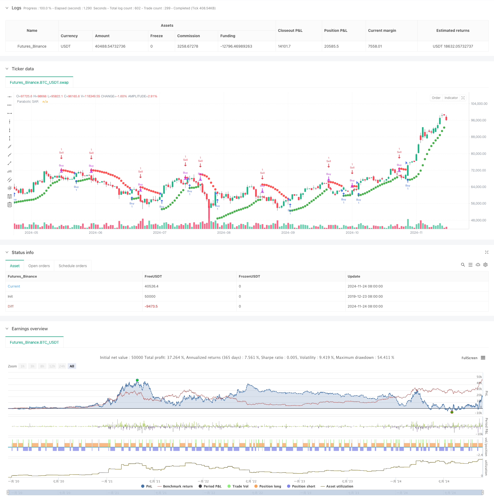

> Name

Dynamic-Trading-Strategy-System-Based-on-Parabolic-SAR-Indicator
> Author

ChaoZhang

> Strategy Description



[trans]
#### Overview
This strategy is a complete trading system based on the Parabolic SAR (Stop and Reverse) indicator, which makes buying and selling decisions by dynamically tracking price trends. The system adopts the classic trend tracking method and combines the long and short two-way trading mechanism to capture price trends in different market environments. The core of the strategy is to use the intersection of the SAR indicator and price to identify trend turning points and carry out position operations at the appropriate time.
#### Strategy Principle
The strategy operates based on the following core principles:
1. Use the Parabolic SAR indicator as the main trend judgment tool. The indicator will dynamically adjust its position according to the price trend.
2. When the SAR indicator falls below the price (crossunder) from above the price, the system recognizes that the upward trend has begun and triggers a long signal.
3. When the SAR indicator breaks through the price from below (crossover), the system recognizes that the downward trend has begun and triggers a short signal.
4. The strategy controls the sensitivity of the SAR indicator through three key parameters: starting value (0.02), step increment (0.02) and maximum value (0.2).
5. The system will automatically draw the SAR point on the chart, which will be displayed in green during an upward trend and in red during a downward trend.
#### Strategic Advantages
1. Systematic trend tracking: The strategy is completely systematic, avoiding the emotional interference caused by subjective judgment.
2. Dynamic stop loss mechanism: The SAR indicator will automatically adjust as the price changes, providing a dynamic stop loss level.
3. Two-way trading: supports long and short selling, and can make profits in various market environments.
4. Visual support: Through color-coded SAR point display, traders can intuitively understand the market status.
5. Adjustable parameters: By adjusting the three core parameters, it can adapt to different market fluctuation characteristics.
#### Strategy Risk
1. Risk of volatile market: Frequent false signals may occur in a volatile market, resulting in continuous stop losses.
2. Slippage risk: In a fast market, the actual transaction price may deviate greatly from the price when the signal is generated.
3. Parameter sensitivity: Different parameter settings will significantly affect the strategy performance and require careful optimization.
4. Trend reversal risk: When the trend suddenly reverses, a large retracement may occur.
#### Strategy optimization direction
1. Introducing trend filters: Additional trend judgment indicators, such as moving averages, can be added to reduce false signals.
2. Optimize parameter adjustment mechanism: SAR parameters can be dynamically adjusted according to market volatility.
3. Add risk control module: add fixed stop loss and profit target to improve risk management capabilities.
4. Add trading volume analysis: combine with trading volume indicators to improve the reliability of signals.
5. Develop market environment identification: add market status judgment function and use different parameter settings under different market conditions.
#### Summary
This is a complete trading strategy based on classic technical indicators, which is systematic and objective. Through reasonable parameter settings and strategy optimization, the system can achieve better performance in trending markets. However, users need to fully realize the limitations of the strategy, especially in volatile markets where performance may not be ideal. It is recommended to conduct sufficient backtesting and parameter optimization before using the real offer, combined with appropriate risk management measures.
||

#### Overview
This strategy is a comprehensive trading system based on the Parabolic SAR (Stop and Reverse) indicator, making buy and sell decisions through dynamic price trend tracking. The system adopts a classical trend-following method, combining both long and short trading mechanisms to capture price movements in different market conditions. The core of the strategy lies in using SAR indicator crossovers with price to identify trend reversal points and execute position operations at appropriate times.

#### Strategy Principles
The strategy operates based on the following core principles:
1. Uses the Parabolic SAR indicator as the primary trend determination tool, which dynamically adjusts its position according to price movements.
2. When the SAR indicator crosses under the price, the system identifies the beginning of an upward trend and triggers a long signal.
3. When the SAR indicator crosses over the price, the system identifies the beginning of a downward trend and triggers a short signal.
4. The strategy controls the SAR indicator's sensitivity through three key parameters: starting value (0.02), step increment (0.02), and maximum value (0.2).
5. The system automatically plots SAR points on the chart, displayed in green during uptrends and red during downtrends.

#### Strategy Advantages
1. Systematic Trend Following: The strategy is fully systematic, avoiding emotional interference from subjective judgments.
2. Dynamic Stop-Loss Mechanism: The SAR indicator automatically adjusts with price movements, providing dynamic stop-loss levels.
3. Bi-directional Trading: Supports both long and short positions, enabling profit potential in various market conditions.
4. Visual Support: Through color-differentiated SAR points display, traders can intuitively understand market conditions.
5. Adjustable Parameters: Can adapt to different market volatility characteristics through adjustment of three core parameters.

#### Strategy Risks
1. Choppy Market Risk: May generate frequent false signals in sideways markets, leading to consecutive stops.
2. Slippage Risk: In fast markets, actual execution prices may significantly deviate from signal generation prices.
3. Parameter Sensitivity: Different parameter settings significantly affect strategy performance, requiring careful optimization.
4. Trend Reversal Risk: May experience significant drawdowns during sudden trend reversals.

#### Strategy Optimization Directions
1. Introduce Trend Filters: Can add additional trend determination indicators, such as moving averages, to reduce false signals.
2. Optimize Parameter Adjustment Mechanism: Can dynamically adjust SAR parameters based on market volatility.
3. Enhance Risk Control Module: Add fixed stop-losses and profit targets to improve risk management capabilities.
4. Incorporate Volume Analysis: Combine volume indicators to improve signal reliability.
5. Develop Market Environment Recognition: Add market state identification functionality to use different parameter settings under different market conditions.

#### Summary
This is a complete trading strategy based on classic technical indicators, characterized by systematic and objective features. Through appropriate parameter settings and strategy optimization, this system can achieve good performance in trending markets. However, users need to fully recognize the strategy's limitations, especially its potentially suboptimal performance in choppy markets. It is recommended to conduct thorough backtesting and parameter optimization before live implementation, combined with appropriate risk management measures.
[/trans]


> Source (PineScript)

``` pinescript
/*backtest
start: 2019-12-23 08:00:00
end: 2024-11-25 08:00:00
period: 1d
basePeriod: 1d
exchanges: [{"eid":"Futures_Binance","currency":"BTC_USDT"}]
*/

//@version=5
strategy("LTJ Strategy", overlay=true)

// Parámetros del Parabolic SAR
start = input(0.02, title="Start")
increment = input(0.02, title="Increment")
maximum = input(0.2, title="Maximum")

// Calculando el Parabolic SAR
sar = ta.sar(start, increment, maximum)

// Condiciones para entrar y salir de la posición
longCondition = ta.crossunder(sar, close) // Compra cuando el Parabolic SAR cruza por debajo del precio de cierre
exitLongCondition = ta.crossover(sar, close) // Venta cuando el Parabolic SAR cruza por encima del precio de cierre

// Condiciones para entrar y salir de la posición
shortCondition = ta.crossover(sar, close) // Compra cuando el Parabolic SAR cruza por debajo del precio de cierre
exitShortCondition = ta.crossunder(sar, close) // Venta cuando el Parabolic SAR cruza por encima del precio de cierre

// Ejecutando las órdenes según las condiciones
if (longCondition)
    strategy.entry("Buy", strategy.long)

if (exitLongCondition)
    strategy.close("Buy")

// Ejecutar las órdenes de venta en corto
if (shortCondition)
    strategy.entry("Sell", strategy.short)

if (exitShortCondition)
    strategy.close("Sell")

// Opcional: Dibujar el Parabolic SAR en el gráfico para visualización
// Si el SAR está por debajo del precio, lo pintamos de verde; si está por encima, de rojo
colorSar = sar < close ? color.green : color.red
plot(sar, style=plot.style_circles, color=colorSar, linewidth=2, title="Parabolic SAR")

```

> Detail

https://www.fmz.com/strategy/473124

> Last Modified

2024-11-27 14:23:29
