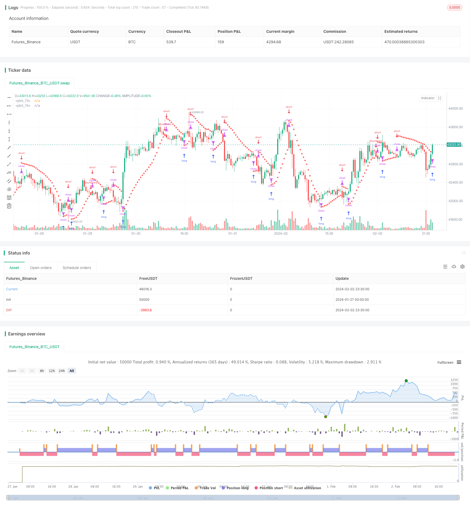

> Name

Based on SAR momentum reversal tracking strategy SAR-Momentum-Reversal-Tracking-Strategy
> Author

ChaoZhang

> Strategy Description


[trans]
## Overview
This article introduces a momentum reversal tracking strategy based on the Parabolic SAR indicator. This strategy utilizes the Parabolic SAR indicator to identify potential trend reversals in the Nifty futures market, enabling automated trend following trading.
This strategy is mainly suitable for traders who prefer a systematic trading approach, and it provides clear market entry and exit signals. By capturing market trends, this strategy helps achieve traders' financial goals.
## Strategy Principle
This strategy uses the Parabolic SAR indicator to determine the direction of price trends. In a bullish trend, the SAR value is below a price breakout and moves upward as new highs are made; in a bearish trend, the SAR value is above a price breakout and moves downward as new lows are made.
When the SAR value crosses above or below price, it indicates a potential trend reversal, and the strategy will go short or long accordingly to capture the new trend direction.
Specifically, after initially calculating the current SAR value and acceleration factor, the strategy continues to track new price highs or lows and adjusts the SAR value accordingly. On the confirmed K-line, if the trend is bullish, go short below the SAR value; if the trend is bearish, go long above the SAR value.
## Strategic advantage analysis
- Capture market reversals with the classic indicator Parabolic SAR
- Provide clear and systematic market entry and exit signals
- Helps track trends and get additional price moves
- Automated trading system without manual decision-making
## Risk Analysis
- The SAR indicator is not 100% reliable and may cause false signals
- A failed reversal may result in a stop loss
- The impact of contract expiration time on the strategy needs to be considered
- The impact of transaction costs on strategy profitability needs to be considered
## Strategy optimization direction
- Optimize SAR indicator parameters (step size, initial value, maximum value, etc.)
- Combine with other reversal signal indicators (such as RSI, MACD, etc.) to determine reversal
- Add conditional logic (trading volume, etc.) to filter error signals
- Consider adjusting fixed stop loss to trailing stop loss
- Consider automatic position sizing
## Summarize
This strategy provides a trading system that utilizes the Parabolic SAR indicator to automatically capture market trend reversals. It provides clear market entry and exit signals for trading decisions, helping to track trends and make profits. But at the same time, issues such as indicator error signals and stop loss risks also need to be considered. With continued optimization, this strategy has the potential to become a reliable trend following method.
||

## Overview

This article introduces a momentum reversal tracking strategy based on the Parabolic Stop and Reverse (SAR) indicator. This strategy utilizes the Parabolic SAR indicator to identify potential trend reversals in the Nifty Futures market for automated trend tracking trading.

The strategy is mainly suitable for traders who prefer a systematic trading approach, providing clear entry and exit signals. By capturing market trends, it helps traders achieve their financial goals.

## Strategy Logic

The strategy uses the Parabolic SAR indicator to determine the price trend direction. In an uptrend, the SAR value is below the price and gradually moves up as new highs occur; In a downtrend, the SAR value is above the price and gradually moves down as new lows occur.  

When the SAR value crosses above or below the price, it indicates a potential trend reversal and the strategy will take corresponding short or long positions to capture the new trend direction.

Specifically, after initially calculating the current SAR value and acceleration factor, the strategy keeps tracking new highs/lows and adjusts the SAR value accordingly. On a confirmed bar, if in an uptrend, it takes a short position below the SAR value; if in a downtrend, it takes a long position above the SAR value.  

## Advantage Analysis 

- Captures market reversals using the classic Parabolic SAR indicator
- Provides clear systematical entry and exit signals
- Helps tracking trends and capturing additional price movement  
- Automated trading system without manual decision-making 

## Risk Analysis

- SAR indicator signals may not be 100% reliable, false signals could occur
- Failed reversals can cause stop loss
- Impact of contract expiry needs consideration  
- Trading costs impact on strategy profitability  

## Optimization Directions 

- Optimize SAR parameters (step, initial value, maximum value, etc.) 
- Combine other reversal indicators (RSI, MACD etc.) to confirm reversals
- Add condition logics (volume etc.) to filter false signals
- Consider using trailing stops instead of fixed stops  
- Consider auto-adjusting position sizing

## Conclusion

The strategy provides an automated system to capture market trend reversals using the Parabolic SAR indicator. It gives clear entry and exit signals for trading decisions, helping profit from trend tracking. But issues like false signals, stop loss risks also need attention. With continuous optimization, it has the potential to become a reliable trend tracking method.  

[/trans]

> Strategy Arguments


|Argument|Default|Description|
|----|----|----|
|v_input_1|0.02|initial|
|v_input_2|0.02|step|
|v_input_3|0.2|cap|


> Source (PineScript)

``` pinescript
/*backtest
start: 2024-01-27 00:00:00
end: 2024-02-03 00:00:00
period: 30m
basePeriod: 15m
exchanges: [{"eid":"Futures_Binance","currency":"BTC_USDT"}]
*/

//@version=5
strategy("Positional Parabolic SAR Strategy", overlay=true)
initial = input(0.02)
step = input(0.02)
cap = input(0.2)
var bool isUptrend = na
var float Extremum = na
var float SARValue = na
var float Accelerator = initial
var float futureSAR = na

if bar_index > 0
    isNewTrendBar = false
    SARValue := futureSAR
    if bar_index == 1
        float pastSAR = na
        float pastExtremum = na
        previousLow = low[1]
        previousHigh = high[1]
        currentClose = close
        pastClose = close[1]
        if currentClose > pastClose
            isUptrend := true
            Extremum := high
            pastSAR := previousLow
            pastExtremum := high
        else
            isUptrend := false
            Extremum := low
            pastSAR := previousHigh
            pastExtremum := low
        isNewTrendBar := true
        SARValue := pastSAR + initial * (pastExtremum - pastSAR)
    if isUptrend
        if SARValue > low
            isNewTrendBar := true
            isUptrend := false
            SARValue := math.max(Extremum, high)
            Extremum := low
            Accelerator := initial
    else
        if SARValue < high
            isNewTrendBar := true
            isUptrend := true
            SARValue := math.min(Extremum, low)
            Extremum := high
            Accelerator := initial
    if not isNewTrendBar
        if isUptrend
            if high > Extremum
                Extremum := high
                Accelerator := math.min(Accelerator + step, cap)
        else
            if low < Extremum
                Extremum := low
                Accelerator := math.min(Accelerator + step, cap)
    if isUptrend
        SARValue := math.min(SARValue, low[1])
        if bar_index > 1
            SARValue := math.min(SARValue, low[2])
    else
        SARValue := math.max(SARValue, high[1])
        if bar_index > 1
            SARValue := math.max(SARValue, high[2])
    futureSAR := SARValue + Accelerator * (Extremum - SARValue)
    if barstate.isconfirmed
        if isUptrend
            strategy.entry("ShortEntry", strategy.short, stop=futureSAR, comment="ShortEntry")
            strategy.cancel("LongEntry")
        else
            strategy.entry("LongEntry", strategy.long, stop=futureSAR, comment="LongEntry")
            strategy.cancel("ShortEntry")
plot(SARValue, style=plot.style_cross, linewidth=3, color=color.white)
plot(futureSAR, style=plot.style_cross, linewidth=3, color=color.red)

```

> Detail

https://www.fmz.com/strategy/441011

> Last Modified

2024-02-04 17:40:20
