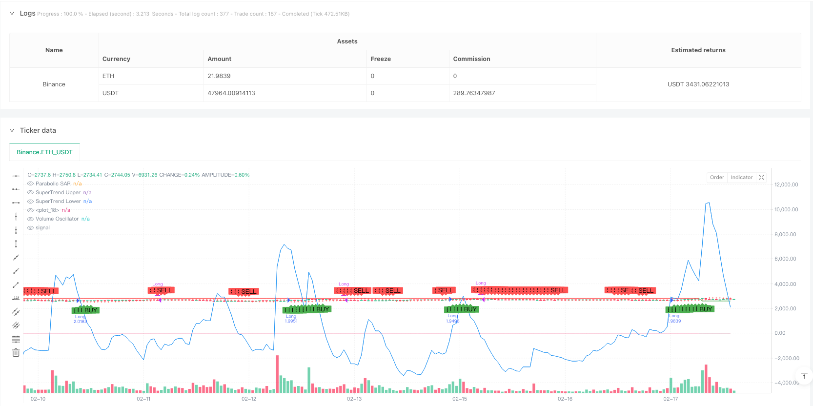
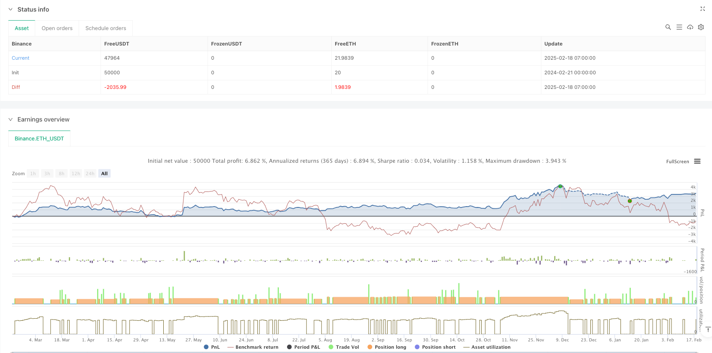

> Name

Multi-Indicator-Trend-Following-Trading-Strategy-with-Parabolic-SAR-and-SuperTrend-Cloud
> Author

ianzeng123

> Strategy Description





[trans]
#### Overview
This strategy is a comprehensive trading system that combines the Parabolic SAR indicator, SuperTrend indicator and Volume Oscillator. This strategy mainly uses multi-dimensional technical indicators to confirm market trends, and improves the reliability of trading signals through mutual verification between indicators. The core idea of ​​strategy design is to confirm signals in the three dimensions of trend, momentum and trading volume, and only trade when consistent signals appear in all three dimensions.
#### Strategy Principle
The strategy uses three core indicators:
1. Parabolic SAR (starting value 0.02, acceleration factor 0.02, maximum value 0.2): used to identify the reversal point of the price trend. When the price is above the SAR point, it is bullish, otherwise it is bearish.
2. SuperTrend (period 10, multiplier 3): Combined with the ATR volatility indicator, a dynamic trend channel is generated. When the price breaks through the upper band, a long signal is generated, and when the price breaks through the lower band, a short signal is generated.
3. Trading volume oscillator (short-term 14, long-term 28): Measures trading activity by comparing the short-term and long-term moving averages of trading volume. Positive values ​​indicate an increase in trading volume, and negative values ​​indicate a decrease in trading volume.
Trading signal generation logic:
- Long conditions: price above SAR + SuperTrend bullish (price above lower track) + volume oscillator is positive
- Conditions for closing: price below SAR + SuperTrend bearish (price below upper track) + volume oscillator negative
#### Strategic Advantages
1. Multi-dimensional confirmation: Confirming trading signals through the resonance of three dimensions: price trend, dynamic channel and trading volume, greatly reducing the risk of false breakthroughs.
2. Dynamic adaptation: SuperTrend indicator dynamically adjusts the channel width based on ATR, which can better adapt to different market fluctuation environments.
3. Risk control: Use percentage position management (set to 10% of the account net value) to effectively control the risk exposure of each transaction.
4. Visualization: The strategy provides clear visual feedback, including SAR points, trend clouds and trading signal markers.
#### Strategy Risk
1. Risk of volatile markets: False signals may appear frequently in a volatile market, resulting in continuous stop losses.
2. Lagging risk: Due to the use of multiple moving average indicators, there is a certain lag in the signal and the best entry point may be missed.
3. Parameter sensitivity: The strategy effect is more sensitive to parameter settings, and different market environments may require different parameter combinations.
4. Cost impact: Frequent transactions may bring higher transaction costs and affect overall returns.
#### Strategy optimization direction
1. Market environment filtering: It is recommended to add a market environment identification module to automatically reduce positions or suspend transactions in volatile markets.
2. Dynamic parameter optimization: SuperTrend parameters can be automatically adjusted according to market volatility to improve strategy adaptability.
3. Stop loss optimization: It is recommended to add a trailing stop loss function to lock in profits in time when the trend reverses.
4. Period optimization: According to the characteristics of different trading periods, the threshold requirements for signal triggering can be adjusted.
5. Cost control: You can increase the position limit to avoid too frequent transactions.
#### Summary
This strategy builds a relatively complete trading system by combining trend tracking and volume analysis. The main feature of the strategy is to use multiple indicator confirmations to improve the reliability of transactions, and at the same time provide traders with an intuitive decision-making reference through visual design. Although there are certain hysteresis and parameter sensitivity issues, this strategy has good practical value through reasonable optimization and risk control measures. It is recommended that traders first find a parameter combination that suits them through backtesting when using it in real trading, and make flexible adjustments based on market experience.
|| 

#### Overview
This strategy is a comprehensive trading system that combines the Parabolic SAR indicator, SuperTrend indicator, and Volume Oscillator. The strategy confirms market trends through multiple technical indicators, enhancing trading signal reliability through cross-validation. The core design philosophy is to confirm signals across three dimensions: trend, momentum, and volume, only executing trades when all three dimensions show consistent signals.

#### Strategy Principles
The strategy employs three core indicators:
1. Parabolic SAR (Start 0.02, Acceleration 0.02, Maximum 0.2): Identifies trend reversal points. Bullish when price is above SAR points, bearish when below.
2. SuperTrend (Period 10, Multiplier 3): Generates dynamic trend channels using ATR volatility. Produces buy signals on upper band breakouts and sell signals on lower band breakouts.
3. Volume Oscillator (Short 14, Long 28): Measures trading activity by comparing short-term and long-term volume moving averages. Positive values indicate increasing volume, negative values indicate decreasing volume.

Signal Generation Logic:
- Buy Condition: Price above SAR + Bullish SuperTrend (price above lower band) + Positive Volume Oscillator
- Exit Condition: Price below SAR + Bearish SuperTrend (price below upper band) + Negative Volume Oscillator

#### Strategy Advantages
1. Multi-dimensional Confirmation: Validates trading signals through price trend, dynamic channels, and volume, significantly reducing false breakout risks.
2. Dynamic Adaptation: SuperTrend adjusts channel width based on ATR, better adapting to varying market volatility conditions.
3. Risk Control: Implements percentage-based position sizing (set at 10% of equity), effectively controlling risk exposure per trade.
4. Visualization: Provides clear visual feedback including SAR points, trend clouds, and trade signal markers.

#### Strategy Risks
1. Ranging Market Risk: May generate frequent false signals in sideways markets, leading to consecutive stops.
2. Lag Risk: Due to multiple moving average-based indicators, signals have inherent lag, potentially missing optimal entry points.
3. Parameter Sensitivity: Strategy performance is sensitive to parameter settings, different market conditions may require different parameter combinations.
4. Cost Impact: Frequent trading may incur high transaction costs, affecting overall returns.

#### Strategy Optimization Directions
1. Market Environment Filter: Recommend adding market environment recognition module to reduce position size or pause trading in ranging markets.
2. Dynamic Parameter Optimization: Automatically adjust SuperTrend parameters based on market volatility to improve adaptability.
3. Stop Loss Optimization: Add trailing stop functionality to secure profits during trend reversals.
4. Time-based Optimization: Adjust signal trigger thresholds based on characteristics of different trading sessions.
5. Cost Control: Implement holding time restrictions to avoid excessive trading frequency.

#### Summary
This strategy builds a relatively complete trading system by combining trend following and volume analysis. Its main feature is using multiple indicator confirmation to enhance trading reliability while providing traders with intuitive decision references through visualization. Although it has certain lag and parameter sensitivity issues, the strategy has good practical value through proper optimization and risk control measures. Traders are advised to find suitable parameter combinations through backtesting before live trading and make flexible adjustments based on market experience.
[/trans]


> Source (PineScript)

``` pinescript
//@version=5
strategy("Parabolic SAR + SuperTrend + Volume Oscillator Strategy", overlay=true, default_qty_type=strategy.percent_of_equity, default_qty_value=10)

// --- Parabolic SAR Parameters ---
sar_start = 0.02
sar_increment = 0.02
sar_max = 0.2
sar = ta.sar(sar_start, sar_increment, sar_max)
plot(sar, color=color.red, style=plot.style_cross, title="Parabolic SAR")

// --- SuperTrend Parameters ---
st_length = 10
st_multiplier = 3
[st_upper, st_lower] = ta.supertrend(st_length, st_multiplier)
st_color = close > st_upper ? color.green : color.red
plot(st_upper, color=color.new(st_color, 0), title="SuperTrend Upper")
plot(st_lower, color=color.new(st_color, 0), title="SuperTrend Lower")
fill(plot(st_upper), plot(st_lower), color=color.new(st_color, 90), title="SuperTrend Cloud")

// --- Volume Oscillator Parameters ---
vo_short_length = 14
vo_long_length = 28
vo = ta.ema(volume, vo_short_length) - ta.ema(volume, vo_long_length)
plot(vo, color=color.blue, title="Volume Oscillator")

// --- Buy and Sell Conditions ---
// Buy Condition:
// - Price is above Parabolic SAR
// - SuperTrend is bullish (price above SuperTrend lower line)
// - Volume Oscillator is positive (indicating increasing volume)
buyCondition = close > sar and close > st_lower and vo > 0

// Sell Condition:
// - Price is below Parabolic SAR
// - SuperTrend is bearish (price below SuperTrend upper line)
// - Volume Oscillator is negative (indicating decreasing volume)
sellCondition = close < sar and close < st_upper and vo < 0

// Plot Buy/Sell Signals
plotshape(series=buyCondition, title="Buy Signal", location=location.belowbar, color=color.green, style=shape.labelup, text="BUY")
plotshape(series=sellCondition, title="Sell Signal", location=location.abovebar, color=color.red, style=shape.labeldown, text="SELL")

// --- Execute Trades ---
if (buyCondition)
    strategy.entry("Long", strategy.long)

if (sellCondition)
    strategy.close("Long")

```

> Detail

https://www.fmz.com/strategy/482874

> Last Modified

2025-02-21 15:02:58
