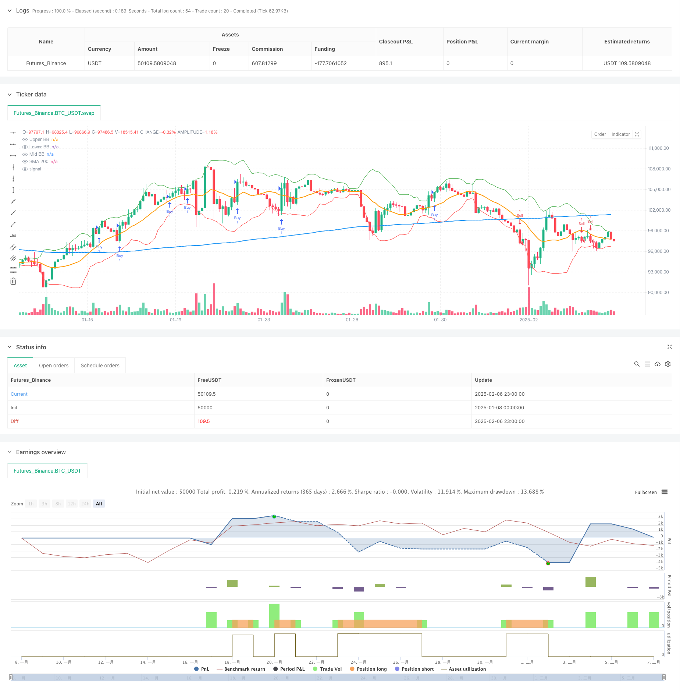

> Name

Engulfing pattern indicator combination trading strategy based on SMA and Bollinger Bands-Combined-SMA-and-Bollinger-Bands-Engulfing-Pattern-Trading-Strategy
> Author

ChaoZhang

> Strategy Description



[trans]
#### Overview
This strategy is a trend following trading system that combines moving averages (SMA), Bollinger Bands (BB) and K-line patterns. This strategy mainly controls risks by identifying engulfing patterns as trading signals, combining the 200-day moving average and the Bollinger Band mid-track as trend confirmation indicators, and using a risk-return ratio of 1:2.
#### Strategy Principle
The core logic of the strategy is to confirm trading signals through the combination of multiple technical indicators. Specifically:
1. Use the 200-day moving average to determine overall trend direction
2. Use the middle Bollinger Band track as secondary trend confirmation
3. Find specific entry opportunities through engulfing patterns
4. Set stop loss and profit targets using a fixed 1:2 risk-to-benefit ratio
The system opens a long position when the price develops a bullish engulfing pattern above the 200-day moving average and the middle Bollinger Bands track. Accordingly, the system opens a short position when the price develops a bearish engulfing pattern below the 200-day moving average and the middle Bollinger Bands.
#### Strategic Advantages
1. The combination of multiple technical indicators improves the reliability of trading signals
2. Use classic trend tracking indicators, which are easy to understand and use.
3. A fixed risk-return ratio is conducive to long-term stable profits.
4. Clear entry and exit rules to reduce subjective judgments
5. Combines trend and momentum analysis to improve trading success rate
#### Strategy Risk
1. Frequent false signals may occur in volatile markets
2. Moving averages and Bollinger Bands are lagging indicators and may miss some trading opportunities.
3. A fixed risk-benefit ratio may not be suitable for all market environments
4. Stops may be wider in rapidly volatile markets
5. A larger sample size is needed to reflect the advantages of the strategy
#### Strategy optimization direction
1. Consider dynamically adjusting the risk-return ratio based on market volatility
2. Add trading volume indicators as auxiliary confirmation
3. Other technical indicators can be added to filter out false signals
4. Consider optimizing entry timing based on signal synergy in different time periods
5. Adaptive indicator parameters can be introduced to improve strategy adaptability
#### Summary
This is a trend following strategy with complete structure and clear logic. Through the combined use of moving averages, Bollinger Bands and engulfing patterns, it not only ensures the reliability of trading signals, but also provides a clear risk control method. Although there is a certain lag, overall it is a trading system with strong operability and controllable risks. ||
#### Overview
This strategy is a trend-following trading system that combines Moving Average (SMA), Bollinger Bands (BB), and candlestick patterns. It primarily identifies trading signals through engulfing patterns, confirmed by the 200-day moving average and Bollinger Bands middle line, while implementing a 1:2 risk-reward ratio for risk management.

#### Strategy Principles
The core logic relies on the combination of multiple technical indicators to confirm trading signals. Specifically:
1. Uses 200-day SMA to determine the overall trend direction
2. Employs Bollinger Bands middle line as secondary trend confirmation
3. Identifies specific entry points through engulfing patterns
4. Implements a fixed 1:2 risk-reward ratio for stop-loss and take-profit levels

The system enters long positions when bullish engulfing patterns appear above both the 200-day SMA and Bollinger Bands middle line. Conversely, it enters short positions when bearish engulfing patterns form below these levels.

#### Strategy Advantages
1. Multiple technical indicators increase signal reliability
2. Uses classic trend-following indicators that are easy to understand and implement
3. Fixed risk-reward ratio promotes long-term profitable trading
4. Clear entry and exit rules minimize subjective judgment
5. Combines trend and momentum analysis for improved success rate

#### Strategy Risks
1. May generate frequent false signals in ranging markets
2. SMA and Bollinger Bands are lagging indicators, potentially missing opportunities
3. Fixed risk-reward ratio might not suit all market conditions
4. Stop-loss levels may be wide in highly volatile markets
5. Requires a large sample size to demonstrate strategy effectiveness

#### Strategy Optimization
1. Consider implementing dynamic risk-reward ratios based on market volatility
2. Add volume indicators for additional confirmation
3. Incorporate additional technical indicators to filter false signals
4. Optimize entry timing through multi-timeframe signal coordination
5. Introduce adaptive indicator parameters to improve strategy flexibility

#### Summary
This is a well-structured trend-following strategy with clear logic. The combination of moving averages, Bollinger Bands, and engulfing patterns ensures reliable trading signals while providing explicit risk management methods. Despite some inherent lag, it represents a highly operable trading system with controllable risk.[/trans]


> Source (PineScript)

``` pinescript
/*backtest
start: 2025-01-08 00:00:00
end: 2025-02-07 00:00:00
period: 3h
basePeriod: 3h
exchanges: [{"eid":"Futures_Binance","currency":"BTC_USDT"}]
*/

// This Pine Script™ code is subject to the terms of the Mozilla Public License 2.0 at https://mozilla.org/MPL/2.0/
// © ardhankurniawan

//@version=5
//@version=5
strategy("Engulfing Candles Strategy with Risk-Reward 1:2 by ardhankurniawan", overlay = true)

// Menyimpan harga pembukaan dan penutupan dari candle sebelumnya dan saat ini
openBarPrevious = open[1]
closeBarPrevious = close[1]
openBarCurrent = open
closeBarCurrent = close

// Menghitung SMA 200
sma200 = ta.sma(close, 200)

// Menghitung Bollinger Bands (BB) dengan periode 14 dan standar deviasi 2
length = 14
src = close
mult = 2.0
basis = ta.sma(src, length)  // Mid Bollinger Band (SMA)
dev = mult * ta.stdev(src, length)  // Standard deviation
upperBB = basis + dev
lowerBB = basis - dev
midBB = basis  // Mid Bollinger Band adalah SMA

// Kondisi Bullish Engulfing: harga pembukaan saat ini lebih rendah dari harga penutupan sebelumnya, 
// harga pembukaan saat ini lebih rendah dari harga pembukaan sebelumnya, dan harga penutupan saat ini lebih tinggi dari harga pembukaan sebelumnya.
bullishEngulfing = (openBarCurrent <= closeBarPrevious) and (openBarCurrent < openBarPrevious) and (closeBarCurrent > openBarPrevious)

// Kondisi Bearish Engulfing: harga pembukaan saat ini lebih tinggi dari harga penutupan sebelumnya, 
// harga pembukaan saat ini lebih tinggi dari harga pembukaan sebelumnya, dan harga penutupan saat ini lebih rendah dari harga pembukaan sebelumnya.
bearishEngulfing = (openBarCurrent >= closeBarPrevious) and (openBarCurrent > openBarPrevious) and (closeBarCurrent < openBarPrevious)

// Kondisi untuk membeli (buy) hanya jika Bullish Engulfing terjadi di atas SMA 200 dan Mid Bollinger Band
buyCondition = bullishEngulfing and close > sma200 and close > midBB

// Kondisi untuk menjual (sell) hanya jika Bearish Engulfing terjadi di bawah SMA 200 dan Mid Bollinger Band
sellCondition = bearishEngulfing and close < sma200 and close < midBB

// Menghitung Stop Loss dan Take Profit dengan Risk-Reward Ratio 1:2
longSL = low  // SL di low candle bullish engulfing (prev low)
longRR = (close - low) * 2  // TP dengan Risk-Reward 1:2
longTP = close + longRR  // TP untuk posisi long

shortSL = high  // SL di high candle bearish engulfing (prev high)
shortRR = (high - close) * 2  // TP dengan Risk-Reward 1:2
shortTP = close - shortRR  // TP untuk posisi short

// Strategi Buy ketika kondisi beli terpenuhi dengan SL dan TP
if buyCondition
    strategy.entry("Buy", strategy.long)  // Perintah beli ketika Bullish Engulfing terjadi di atas SMA 200 dan Mid Bollinger Band
    strategy.exit("Sell Exit", from_entry = "Buy", stop = longSL, limit = longTP)  // SL dan TP untuk posisi long

// Strategi Sell ketika kondisi jual terpenuhi dengan SL dan TP
if sellCondition
    strategy.entry("Sell", strategy.short)  // Perintah jual ketika Bearish Engulfing terjadi di bawah SMA 200 dan Mid Bollinger Band
    strategy.exit("Buy Exit", from_entry = "Sell", stop = shortSL, limit = shortTP)  // SL dan TP untuk posisi short

// Menambahkan kondisi untuk keluar dari posisi
if sellCondition
    strategy.close("Buy")  // Menutup posisi beli jika Bearish Engulfing terjadi di bawah SMA 200 dan Mid Bollinger Band
if buyCondition
    strategy.close("Sell")  // Menutup posisi jual jika Bullish Engulfing terjadi di atas SMA 200 dan Mid Bollinger Band

// Plotting SMA 200 dan Bollinger Bands
plot(sma200, color = color.blue, linewidth = 2, title = "SMA 200")
plot(upperBB, color = color.green, linewidth = 1, title = "Upper BB")
plot(lowerBB, color = color.red, linewidth = 1, title = "Lower BB")
plot(midBB, color = color.orange, linewidth = 2, title = "Mid BB")

// Alert condition
alertcondition(buyCondition, title = "Bullish Engulfing Above SMA 200 and Mid BB", message = "[CurrencyPair] [TimeFrame], Bullish Engulfing above SMA 200 and Mid Bollinger Band")
alertcondition(sellCondition, title = "Bearish Engulfing Below SMA 200 and Mid BB", message = "[CurrencyPair] [TimeFrame], Bearish Engulfing below SMA 200 and Mid Bollinger Band")

```

> Detail

https://www.fmz.com/strategy/481100

> Last Modified

2025-02-08 15:06:49
