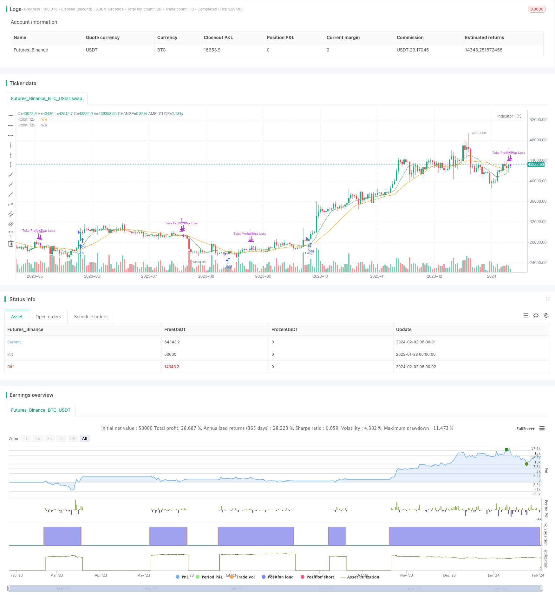

> Name

Long-term chasing strategy SMA-Crossover-Bullish-Trend-Following-Strategy based on moving average crossover
> Author

ChaoZhang

> Strategy Description


[trans]
## Overview
This strategy is a long-term chasing strategy based on the crossover of the simple moving average (SMA). It calculates the SMA of different periods, generates a buy signal when the short-term SMA crosses the long-term SMA, and performs chasing operations. At the same time, it will also set take-profit and stop-loss levels based on a certain proportion of the entry price to manage the risk of the position.
## Strategy Principle
This strategy is mainly based on the "golden cross" cross signal of the SMA indicator to determine the timing of market entry. Specifically, it calculates the SMAs of two different periods, the 9-day line and the 21-day line respectively. When the short-term 9-day moving average crosses the longer-term 21-day moving average from below, it means that the stock price has entered the rising wave stage from the consolidation stage, which is a good time to chase the rise. At this time, the strategy will generate a buy signal and perform the chase operation.
In addition, the strategy will also dynamically set the take-profit and stop-loss levels based on the two ratios of 1.5% and 1% of the entry price. In other words, the take-profit position will be 1.5% higher than the entry price, and the stop-loss position will be 1% lower than the entry price. In this way, the risk management of the position can be carried out by setting the profit and loss ratio.
## Strategic Advantages
- Use the SMA indicator to determine the timing of entry, filter out short-term market noise, and capture mid- and long-term trends.
- The cycle parameters are adjustable, and the cycle can be adjusted to adapt to the market conditions of different bands.  
- The risk management mechanism is perfect and single losses can be controlled by adjusting the profit-loss ratio.
- Simple to implement, easy to understand, and suitable for beginners in quantitative trading.
## Risks and Solutions
- The SMA cross signal may have a false breakout, resulting in unnecessary losses. Signals can be filtered in combination with other indicators.
- The positions of take-profit and stop-loss are relatively single, and it may happen that the take-profit is expected but the actual loss is achieved. You can consider dynamic tracking of stop-profit and stop-loss levels. 
- The profit-loss ratio is fixed and cannot be adjusted according to market volatility. The profit-loss ratio can be dynamically set in conjunction with the ATR indicator.
- There is a certain time lag problem. You can consider reducing the period parameters of SMA or introducing other leading indicators.
## Optimization direction
- Add other indicators to filter SMA cross signals to avoid false breakthroughs. For example, KDJ indicator, volatility indicator, etc.
- Dynamic tracking of stop-profit and stop-loss levels. For example, use the Chandelier Exit algorithm.
- Use ATR indicators and other indicators to dynamically adjust the profit-loss ratio based on market volatility.
- Reduce the SMA cycle or introduce other leading indicators to reduce hysteresis.
## Summarize
This strategy is a medium and long-term chasing strategy based on SMA crossover. It uses SMA indicators to judge market trends and set stop-profit and stop-loss controls to control risks. The advantage is that it is simple and easy to implement and suitable for beginners in quantitative trading. At the same time, there is also some room for optimization, such as adding other indicators to filter signals, dynamically tracking stop-profit and stop-loss, and adjusting the profit-loss ratio according to market volatility. Through continuous optimization, the strategy can be made more robust and adaptable to more market environments.
||

## Overview

This strategy is a long-term trend following strategy based on the crossover of Simple Moving Averages (SMA). It generates buy signals when the short period SMA crosses over the long period SMA and follows the uptrend. At the same time, it also sets take profit and stop loss based on certain percentages of the entry price to manage risks.

## Strategy Logic

The strategy mainly uses the "golden cross" crossover signals of the SMA indicator to determine entry timing. Specifically, it calculates the 9-period and 21-period SMA respectively. When the short term 9-period SMA crosses over the longer term 21-period SMA from below, it indicates the price is shifting from consolidation to an uptrend, which is a good timing for trend following. The strategy will then generate a buy signal to follow the trend.  

In addition, the strategy also dynamically sets the take profit and stop loss based on 1.5% and 1% of the entry price. That means the take profit will be 1.5% above the entry price and the stop loss will be 1% below. Through this approach, it manages risks by setting a predefined risk-reward ratio.

## Advantages

- Using SMA to determine entry filters out short-term market noise and catches mid-long term trends.
- The SMA periods are adjustable and can be tuned to adapt to trends over different time horizons.
- The risk management mechanism is comprehensive and can control single trade loss by adjusting risk-reward ratio. 
- The strategy is simple to understand, suitable for beginners in quantitative trading.

## Risks and Solutions

- SMA crossover signals may have false breakouts, causing unnecessary losses. Other indicators can be used to filter the signals.
- The take profit and stop loss are relatively fixed, which may lead to expected profit but actual loss. Consider dynamically trailing take profit and stop loss.
- The risk-reward ratio is fixed and cannot adapt to changing market volatility. Consider using ATR and other indicators to dynamically adjust risk-reward levels.  
- There is a certain time lag. Can consider reducing SMA periods or introducing leading indicators.  

## Enhancement Opportunities 

- Add other indicators to filter SMA crossover signals and avoid false signals, e.g. KDJ, volatility indicators etc.
- Dynamically trail take profit and stop loss, e.g. using Chandelier Exit algorithms.
- Use ATR and other indicators to dynamically adjust risk-reward ratio based on market volatility. 
- Reduce SMA periods or introduce leading indicators to lower time lags.

## Conclusion
This is a medium-long term trend following strategy based on SMA crossover. It identifies trends with SMA and controls risks by setting take profit and stop loss. The advantage is it is simple and easy to implement, suitable for beginners in quantitative trading. Meanwhile, there are also rooms for enhancement, such as adding other signal filters, trailing take profit/stop loss dynamically, adjusting risk-reward ratios based on volatility etc. Through continuous improvements, the strategy can become more robust and adapt to more market environments.  
[/trans]


> Source (PineScript)

``` pinescript
/*backtest
start: 2023-01-28 00:00:00
end: 2024-02-03 00:00:00
period: 1d
basePeriod: 1h
exchanges: [{"eid":"Futures_Binance","currency":"BTC_USDT"}]
*/

// This Pine Script™ code is subject to the terms of the Mozilla Public License 2.0 at https://mozilla.org/MPL/2.0/
// © Masterdata

//@version=5
strategy("Simple MA Crossover Long Strategy v5", overlay=true)

// Define the short and long moving averages
shortMa = ta.sma(close, 9)
longMa = ta.sma(close, 21)

// Plot the moving averages on the chart
plot(shortMa, color=color.green)
plot(longMa, color=color.orange)

// Generate a long entry signal when the short MA crosses over the long MA
longCondition = ta.crossover(shortMa, longMa)
if (longCondition)
    strategy.entry("Long", strategy.long)

// Define the take profit and stop loss as a percentage of the entry price
takeProfitPerc = 1.5 / 100 // Take profit at 1.5% above entry price

stopLossPerc = 1.0 / 100 // Stop loss at 1.0% below entry price

// Calculate the take profit and stop loss price levels dynamically
takeProfitLevel = strategy.position_avg_price * (1 + takeProfitPerc)
stopLossLevel = strategy.position_avg_price * (1 - stopLossPerc)

// Set the take profit and stop loss for the trade
if (longCondition)
    strategy.exit("Take Profit/Stop Loss", "Long", limit=takeProfitLevel, stop=stopLossLevel)
```

> Detail

https://www.fmz.com/strategy/440978

> Last Modified

2024-02-04 14:56:00
