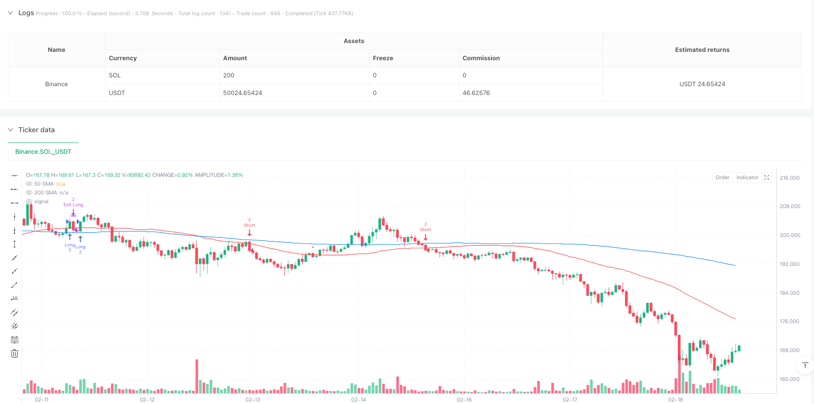
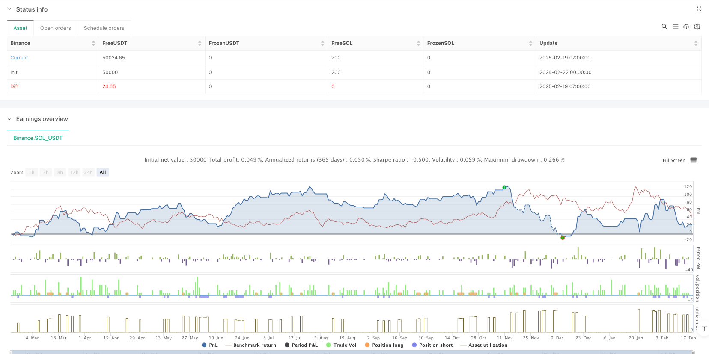

> Name

Dynamic position tracking stop-loss SMA cross retracement strategy-Dynamic-Position-Size-and-Trailing-Stop-SMA-Rebound-Strategy
> Author

ianzeng123

> Strategy Description





[trans]
#### Overview
This strategy is an automated trading system based on moving average crossover and dynamic position management. It uses the 50-day and 200-day simple moving averages (SMA) as the main indicators, combined with dynamic position adjustment and trailing stop loss mechanisms, to find trading opportunities in market trends. The core of the strategy is to judge the market direction through the relationship between price and moving average, while using fund management and risk control to ensure the stability of transactions.
#### Strategy Principle
The strategy operates based on the following core principles:
1. The entry signal is based on the intersection of the price and the 50-day moving average, and the general trend is determined by referring to the relative position of the 50-day moving average and the 200-day moving average.
2. When the price breaks upward from below the moving average, a long signal is triggered; otherwise, a short signal is triggered.
3. Position management adopts a dynamic adjustment mechanism. When the account profit exceeds 4,000, the number of positions will be increased.
4. The stop loss adopts a trailing stop loss mechanism, and the stop loss position is dynamically adjusted as profits increase.
5. The risk-return ratio is set to 1:2.5 to ensure that the expected return of each transaction is greater than the risk
#### Strategic Advantages
1. The trading logic is clear and clear, and the timing of entry is determined based on technical indicators and price behavior.
2. Using dynamic position management, you can appropriately increase the transaction size when making profits and improve the efficiency of capital utilization.
3. The trailing stop loss mechanism can effectively lock in profits and avoid large retracements.
4. Set up trading time filtering to only run during main trading periods to avoid risks during periods of low liquidity
5. Have a complete risk control mechanism, including stop loss, profit target and position management
#### Strategy Risk
1. In a volatile market, false breakthrough signals may be triggered frequently, resulting in continuous stop losses.
2. Dynamic position management may cause large losses when the market suddenly turns.
3. Systems that rely on moving averages may lag behind in rapidly fluctuating markets.
4. A fixed risk-benefit ratio may miss some potential big trend opportunities
5. Trading time restrictions may miss some important market opportunities
#### Strategy optimization direction
1. Volatility indicators can be introduced to dynamically adjust parameters under different market environments.
2. Consider adding market sentiment indicators to improve the accuracy of entry signals
3. Optimize trailing stop loss parameters to better adapt to different market environments
4. Add multiple time period analysis to improve the stability of the trading system
5. Introduce trading volume analysis to improve signal reliability
#### Summary
This strategy builds a relatively complete trading system by combining the moving average system, dynamic position management and trailing stop loss mechanism. The advantage of the strategy is that it has clear trading logic and a complete risk control mechanism, but there are also some areas that need optimization. Through continuous improvement and optimization, the strategy is expected to achieve better performance in actual trading.
||

#### Overview
This strategy is an automated trading system based on moving average crossovers and dynamic position management. It utilizes 50-day and 200-day Simple Moving Averages (SMA) as primary indicators, combined with dynamic position sizing and trailing stop mechanisms to identify trading opportunities in market trends. The core of the strategy lies in determining market direction through price-MA relationships while employing money management and risk control to ensure trading stability.

#### Strategy Principles
The strategy operates on the following core principles:
1. Entry signals are based on price crossovers with the 50-day MA, while using the relative position of 50-day and 200-day MAs to judge the broader trend
2. Long signals are triggered when price breaks above the MA from below; short signals occur in the opposite scenario
3. Position management employs a dynamic adjustment mechanism, increasing position size when account profits exceed 4000
4. Stop-loss uses a trailing stop mechanism, dynamically adjusting stop positions as profits increase
5. Risk-reward ratio is set at 1:2.5, ensuring expected returns exceed risks for each trade

#### Strategy Advantages
1. Clear and explicit trading logic, combining technical indicators and price action for entry timing
2. Dynamic position management allows for increased trading size during profitable periods, improving capital efficiency
3. Trailing stop mechanism effectively locks in profits and prevents significant drawdowns
4. Includes trading session filters, operating only during major trading sessions to avoid low liquidity risks
5. Comprehensive risk control mechanisms including stop-loss, profit targets, and position management

#### Strategy Risks
1. May trigger frequent false breakout signals in ranging markets, leading to consecutive stops
2. Dynamic position sizing could result in larger losses during sudden market reversals
3. Reliance on moving averages may lead to delayed reactions in rapidly volatile markets
4. Fixed risk-reward ratio might miss potential larger trend opportunities
5. Trading time restrictions could miss important market opportunities

#### Strategy Optimization Directions
1. Introduce volatility indicators to dynamically adjust parameters in different market conditions
2. Consider adding market sentiment indicators to improve entry signal accuracy
3. Optimize trailing stop parameters for better adaptation to different market environments
4. Add multiple timeframe analysis to enhance system stability
5. Incorporate volume analysis to improve signal reliability

#### Summary
The strategy builds a relatively complete trading system by combining moving average systems, dynamic position management, and trailing stop mechanisms. Its strengths lie in clear trading logic and comprehensive risk control mechanisms, though there are areas for optimization. Through continuous improvement and optimization, the strategy shows promise for better performance in actual trading.[/trans]


> Source (PineScript)

``` pinescript
/*backtest
start: 2024-02-22 00:00:00
end: 2025-02-19 08:00:00
period: 1h
basePeriod: 1h
exchanges: [{"eid":"Binance","currency":"SOL_USDT"}]
*/

//@version=5
strategy("15m - Rebound 50SMA with Dynamic Lots & Trailing Stop, RRR 2:1, Date Filter (Closed Bars Only)", 
     overlay=true, 
     initial_capital=50000, 
     default_qty_type=strategy.fixed, 
     default_qty_value=1, 
     pyramiding=0, 
     calc_on_order_fills=true)

// ===== INPUTS =====
sma50Period  = input.int(50, "50 SMA Period", minval=1)
sma200Period = input.int(200, "200 SMA Period", minval=1)

// ===== CALCULATE SMAs =====
sma50  = ta.sma(close, sma50Period)
sma200 = ta.sma(close, sma200Period)

// ===== PLOT SMAs =====
plot(sma50, color=color.red, title="50 SMA")
plot(sma200, color=color.blue, title="200 SMA")

// ===== DEFINE TRADING SESSIONS =====
// Trading is allowed 15 minutes after market open:
//   - New York: 09:45–16:00 (America/New_York)
//   - London:   08:15–16:00 (Europe/London)
nySession     = not na(time("15", "0945-1600", "America/New_York"))
londonSession = not na(time("15", "0815-1600", "Europe/London"))
inSession     = nySession or londonSession

// ===== DEFINE DATE RANGE =====
// Only allow orders on or after January 1, 2024.
// (We include seconds in the timestamp for proper parsing.)
startDate   = timestamp("UTC", 2024, 1, 1, 0, 0, 0)
inDateRange = time >= startDate

// ===== DEFINE ENTRY CONDITIONS =====
// ----- LONG ENTRY CONDITION -----
// A long entry is triggered when:
//   - The previous candle closed below the 50 SMA and the current candle closes above it,
//   - And the 50 SMA is above the 200 SMA.
longCondition = (close[1] < sma50[1]) and (close > sma50) and (sma50 > sma200)

// ----- SHORT ENTRY CONDITION -----
// A short entry is triggered when:
//   - The previous candle closed above the 50 SMA and the current candle closes below it,
//   - And the 50 SMA is below the 200 SMA.
shortCondition = (close[1] > sma50[1]) and (close < sma50) and (sma50 < sma200)

// ===== DEBUG PLOTS =====
plotshape(longCondition and barstate.isconfirmed, title="Long Signal", location=location.belowbar, color=color.green, style=shape.triangleup, size=size.tiny)
plotshape(shortCondition and barstate.isconfirmed, title="Short Signal", location=location.abovebar, color=color.red, style=shape.triangledown, size=size.tiny)

// ===== VARIABLES FOR STOP LOSS MANAGEMENT =====
// For long positions.
var float initialLongStop = na   // Set at entry: low of the rebound candle.
var float trailStopLong   = na   // Updated trailing stop for long.
// For short positions.
var float initialShortStop = na  // Set at entry: high of the rebound candle.
var float trailStopShort   = na  // Updated trailing stop for short.

// ===== DYNAMIC LOT SIZE =====
// If current profit (strategy.equity - 50000) exceeds 4000, lot size becomes 3; otherwise, 2.
lotSize = (strategy.equity - 50000 > 4000) ? 3 : 2

// ===== ENTRY LOGIC (EXECUTED ON CONFIRMED BARS) =====
if barstate.isconfirmed and inSession and inDateRange and longCondition and strategy.position_size <= 0
    initialLongStop := low
    trailStopLong   := initialLongStop
    if strategy.position_size < 0
        strategy.close("Short", comment="Close Short before Long")
    // Submit a market order entry (no offset).
    strategy.entry("Long", strategy.long, qty=lotSize, comment="Enter Long")
    
if barstate.isconfirmed and inSession and inDateRange and shortCondition and strategy.position_size >= 0
    initialShortStop := high
    trailStopShort   := initialShortStop
    if strategy.position_size > 0
        strategy.close("Long", comment="Close Long before Short")
    // Submit a market order entry (no offset).
    strategy.entry("Short", strategy.short, qty=lotSize, comment="Enter Short")
    
// ===== TRAILING STOP LOGIC & EXIT ORDERS (ON CLOSED BARS) =====

if barstate.isconfirmed and strategy.position_size > 0
    // For Long Positions:
    floatingProfitLong = (close - strategy.position_avg_price) / syminfo.mintick
    newTrailLong = trailStopLong  // Default: no change.
    if floatingProfitLong >= 20 and floatingProfitLong < 30
        newTrailLong := initialLongStop + 5 * syminfo.mintick
    else if floatingProfitLong >= 31 and floatingProfitLong < 40
        newTrailLong := initialLongStop + 10 * syminfo.mintick
    else if floatingProfitLong >= 41 and floatingProfitLong < 50
        newTrailLong := initialLongStop + 15 * syminfo.mintick
    // Update trailing stop only if the new value is more favorable.
    trailStopLong := math.max(trailStopLong, newTrailLong)
    
    longRisk = strategy.position_avg_price - trailStopLong
    tpLong   = strategy.position_avg_price + 2.5 * longRisk
    strategy.exit("Exit Long", from_entry="Long", stop=trailStopLong, limit=tpLong)

if barstate.isconfirmed and strategy.position_size < 0
    // For Short Positions:
    floatingProfitShort = (strategy.position_avg_price - close) / syminfo.mintick
    newTrailShort = trailStopShort  // Default: no change.
    if floatingProfitShort >= 20 and floatingProfitShort < 30
        newTrailShort := initialShortStop - 5 * syminfo.mintick
    else if floatingProfitShort >= 31 and floatingProfitShort < 40
        newTrailShort := initialShortStop - 10 * syminfo.mintick
    else if floatingProfitShort >= 41 and floatingProfitShort < 50
        newTrailShort := initialShortStop - 15 * syminfo.mintick
    // Update trailing stop only if the new value is more favorable.
    trailStopShort := math.min(trailStopShort, newTrailShort)
    
    shortRisk = trailStopShort - strategy.position_avg_price
    tpShort = strategy.position_avg_price - 2.5 * shortRisk
    strategy.exit("Exit Short", from_entry="Short", stop=trailStopShort, limit=tpShort)

```

> Detail

https://www.fmz.com/strategy/483109

> Last Modified

2025-02-21 13:51:50
