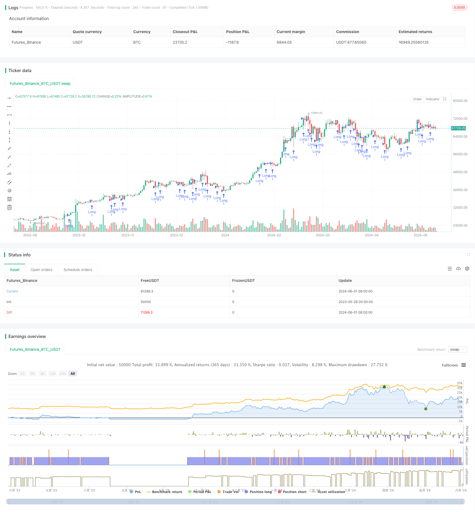

> Name

SMA Trend Following Strategy-SMA-Trend-Following-Strategy-with-Trailing-Stop-Loss-and-Disciplined-Re-Entry
> Author

ChaoZhang

> Strategy Description


[trans]
#### Overview
This strategy is based on the slope of the Simple Moving Average (SMA) to identify an uptrend and open a long position when certain conditions are met. At the same time, an optional trailing stop loss mechanism is introduced to protect profits by dynamically adjusting the stop loss price. In addition, this strategy also sets conditions for re-entering the market after stop loss to prevent re-opening when the price is too high. Through these features, the strategy can effectively capture rising trends, control risks, and achieve disciplined trading.
#### Strategy Principle
1. Calculate the SMA for the specified period and determine whether its slope within the given window period is greater than the minimum slope threshold to determine the upward trend.
2. When the SMA slope is positive and the current price is higher than the SMA, the strategy opens a long position.
3. If trailing stop is enabled, the trailing stop price is calculated based on the current market price and the specified trailing stop percentage. The trailing stop price will continuously adjust as the price rises, thus protecting profits.
4. When the price falls below the SMA or the trailing stop is triggered, the strategy closes the position.
5. After the stop loss is triggered, if the price is higher than the SMA by a specified percentage, the strategy will not re-enter the market to avoid buying when the price is too high.
#### Strategic Advantages
1. Trend following: Use the SMA slope to determine the upward trend and effectively capture trend opportunities.
2. Risk management: The optional trailing stop function can dynamically protect profits and limit potential losses.
3. Disciplined re-entry: The re-entry conditions after stop loss prevent buying when the price is too high and ensure trading discipline.
4. Flexible parameters: Provides multiple adjustable parameters, such as SMA length, minimum slope, trailing stop loss percentage, etc., which can be tuned according to different markets and trading styles.
#### Strategy Risk
1. Parameter sensitivity: Strategy performance is more sensitive to parameter selection, and improper parameter settings may lead to suboptimal results.
2. Volatile market: Under volatile market conditions, frequent transactions may lead to high transaction costs and potential losses.
3. Unexpected events: Unexpected events and abnormal fluctuations in the market may cause strategy failure or unexpected losses.
#### Strategy optimization direction
1. Dynamic parameter optimization: Introduce an adaptive mechanism to dynamically adjust parameters such as SMA length and minimum slope according to market conditions to adapt to different market environments.
2. Enhanced risk control: Combined with other risk management technologies, such as position adjustment based on volatility, dynamic stop loss, etc., to further control risk exposure.
3. Long-short two-way trading: Expand the strategy to support short trading and make profits in a downward trend.
4. Multi-time frame confirmation: Combine signals from multiple time frames to improve the reliability and robustness of trend judgment.
#### Summary
This strategy uses mechanisms such as SMA trend following, trailing stop loss, and disciplined re-entry to capture the upward trend while controlling risks. By optimizing parameter settings, enhancing risk management, supporting two-way trading and multi-time frame confirmation, the adaptability and robustness of the strategy can be further improved.
|| 

#### Overview
This strategy identifies upward trends based on the slope of the Simple Moving Average (SMA) and enters long positions when specific conditions are met. It incorporates an optional trailing stop-loss mechanism to protect profits by dynamically adjusting the stop-loss price. Furthermore, the strategy sets a condition for re-entry after a stop-loss event to prevent entering positions at excessively high prices. With these features, the strategy effectively captures upward trends, manages risk, and ensures disciplined trading.

#### Strategy Logic
1. Calculate the SMA over the specified period and determine if its slope within a given window size is greater than the minimum slope threshold to identify an upward trend.
2. When the SMA slope is positive and the current price is above the SMA, the strategy enters a long position.
3. If the trailing stop-loss is enabled, the trailing stop price is calculated based on the current market price and the specified trailing stop percentage. The trailing stop price adjusts upwards as the price moves in favor of the position, protecting profits.
4. The strategy exits the position when the price crosses below the SMA or when the trailing stop-loss is triggered.
5. After a stop-loss exit, if the price is above the SMA by a specified percentage, the strategy will not re-enter the position to avoid buying at excessively high prices.

#### Strategy Advantages
1. Trend Following: By utilizing the SMA slope to identify upward trends, the strategy effectively captures trending opportunities.
2. Risk Management: The optional trailing stop-loss feature dynamically protects profits and limits potential losses.
3. Disciplined Re-Entry: The re-entry condition after a stop-loss prevents buying at overextended prices, ensuring trading discipline.
4. Parameter Flexibility: The strategy provides multiple adjustable parameters, such as SMA length, minimum slope, trailing stop percentage, etc., allowing for optimization based on different markets and trading styles.

#### Strategy Risks
1. Parameter Sensitivity: The strategy's performance is sensitive to parameter selection, and suboptimal parameter settings may lead to subpar results.
2. Choppy Markets: In choppy market conditions, frequent trades may result in high transaction costs and potential losses.
3. Unforeseen Events: Unexpected market events and abnormal price movements can cause the strategy to fail or incur unexpected losses.

#### Strategy Optimization Directions
1. Dynamic Parameter Optimization: Introduce adaptive mechanisms to dynamically adjust parameters such as SMA length, minimum slope, etc., based on market conditions to adapt to different market environments.
2. Enhanced Risk Control: Incorporate additional risk management techniques, such as volatility-based position sizing, dynamic stop-loss, etc., to further control risk exposure.
3. Long-Short Trading: Extend the strategy to support short selling, allowing for profiting from downward trends as well.
4. Multi-Timeframe Confirmation: Combine signals from multiple timeframes to improve the reliability and robustness of trend identification.

#### Summary
This strategy leverages SMA trend following, trailing stop-loss, and disciplined re-entry mechanisms to capture upward trends while managing risk. By optimizing parameter settings, enhancing risk management, supporting long-short trading, and incorporating multi-timeframe confirmation, the strategy's adaptability and robustness can be further improved.
[/trans]


> Source (PineScript)

``` pinescript
/*backtest
start: 2023-05-28 00:00:00
end: 2024-06-02 00:00:00
period: 1d
basePeriod: 1h
exchanges: [{"eid":"Futures_Binance","currency":"BTC_USDT"}]
*/

//@version=5
strategy("MA Incline Strategy with Optional Trailing Stop-Loss", overlay=true, calc_on_every_tick=true)

// Input parameters
windowSize = input.int(20, title="Window Size")
maLength = input.int(150, title="Moving Average Length")
minSlope = input.float(0.1, title="Minimum Slope")
useTrailingStop = input.bool(true, title="Use Trailing Stop-Loss")
trailingStopPercentage = input.float(2.8, title="Trailing Stop Percentage (%)") / 100

// Calculate the moving average
ma = ta.sma(close, maLength)

// Calculate the slope of the moving average over the window size
previousMa = ta.sma(close[windowSize], maLength)
slopeMa = (ma - previousMa) / windowSize

// Check conditions
isAboveMinSlope = slopeMa > minSlope
isAboveMa = close > ma

// Buy condition
buyCondition = isAboveMinSlope and isAboveMa

// Execute strategy
if (buyCondition and strategy.opentrades == 0)
    strategy.entry("Long", strategy.long)

// Trailing stop-loss (optional)
if (strategy.opentrades == 1 and useTrailingStop and isAboveMa)
    // Calculate the trailing stop price
    trailPrice = close * (1 - trailingStopPercentage)
    // Use the built-in strategy.exit function with the trailing stop
    strategy.exit("Trail Stop", "Long", stop=trailPrice)

// Exit condition
sellCondition = ta.crossover(ma, close)
if (sellCondition and strategy.opentrades == 1)
    strategy.close("Long")

```

> Detail

https://www.fmz.com/strategy/453268

> Last Modified

2024-06-03 16:25:32
