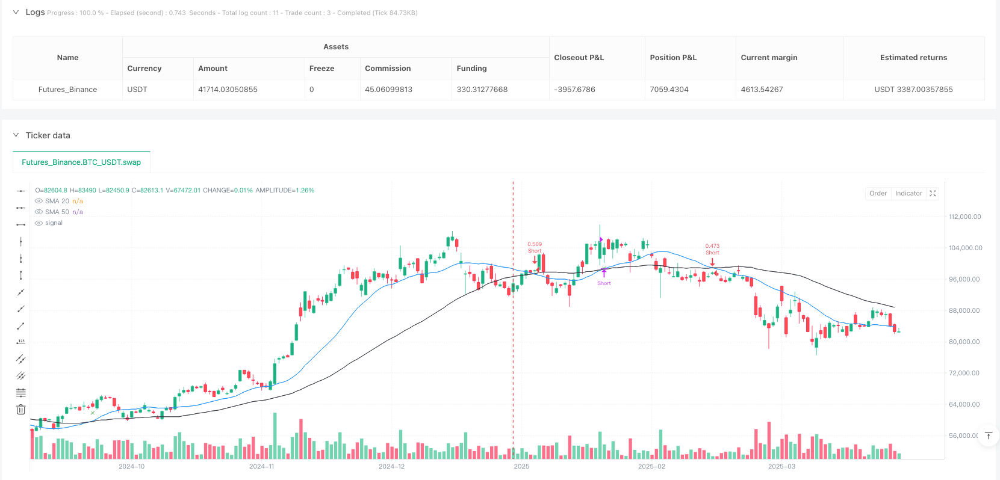
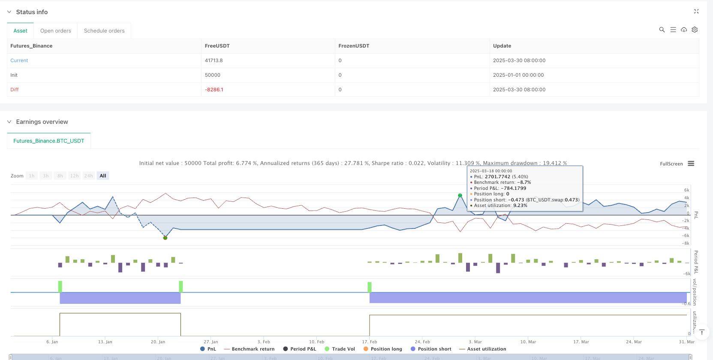

> Name

Moving Average Cross Short Reversal Quantitative Strategy SMA20-50-Smart Short Trading System-SMA20-50-Bearish-Trend-Reversal-Quantitative-Trading-System
> Author

ianzeng123

> Strategy Description





[trans]

#### Strategy Overview
This strategy is a short trading system based on a simple moving average (SMA) crossover that focuses on capturing market downtrends. This strategy uses the 20-period and 50-period simple moving averages as the core indicators. When the short-term SMA (20) crosses the long-term SMA (50) downwards, the system generates a short order signal; when the short-term SMA (20) crosses the long-term SMA (50) upwards, the system closes the position. This design is simple yet effective, and is particularly suitable for capturing short- to medium-term downward trends on the 15-minute time frame.
#### Strategy Principle
The strategy is based on the classic moving average crossover theory in technical analysis. Its core logic is as follows:
1. Calculate the 20-period simple moving average (SMA20) and the 50-period simple moving average (SMA50)
2. When SMA20 crosses below SMA50, it is deemed that the price momentum has turned negative and the trend has turned from long to short, triggering a short signal.
3. When SMA20 crosses SMA50, the downtrend is deemed to have weakened or ended, triggering a closing signal.
4. The strategy adopts a full position operation mode, and each transaction uses 100% of available funds.
From the perspective of code implementation, the strategy uses the ta.crossunder() and ta.crossover() functions of the Pine Script language to accurately capture moving average crossover events, and executes transactions through the strategy.entry() and strategy.close() functions. In addition, the strategy also visually displays trading signals on the chart to help traders understand the execution of trading logic instantly.
#### Strategic Advantages
1. **Simple and efficient**: The strategy uses only two technical indicators, with clear logic, easy to understand and implement, and reduces the risk of over-fitting.
2. **Trend following ability**: The combination of SMA20 and SMA50 can effectively capture mid-term trend changes. When the short-term moving average crosses the long-term moving average, it usually indicates greater room for decline.
3. **Improved risk management**: The strategy has built-in clear entry and exit conditions, which will not allow losses to expand indefinitely, and positions will be automatically closed when the trend reverses.
4. **Rich visual feedback**: Through shape marks and text labels on the chart, traders can clearly see each trading signal, which facilitates backtest analysis and real-time monitoring.
5. **Strong adaptability**: Although the strategy performs well on the 15-minute time frame, its core logic is also applicable to other time periods and has good adaptability across time frames.
6. **Trading against human nature**: Short-selling strategies can often make profits when the market is generally panic, helping traders stay calm and gain profits in falling markets.
#### Strategy Risk
1. **Concussive market risk**: In a sideways volatile market, frequent moving average crossings may lead to multiple false signals and continuous losing transactions. An improvement would be to add confirmation indicators such as a trend strength indicator or a volatility filter.
2. **Lagging problem**: The moving average itself has hysteresis, which may lead to less than ideal entry and exit timing and miss the best trading point. Consider using more sensitive indicators such as EMA or adjusted moving average periods to mitigate this problem.
3. **Single Direction Limitation**: The strategy only goes short but not long, and may miss a large number of rising opportunities in a long-term bull market. One solution is to develop a companion long strategy or extend the current strategy into a two-way trading system.
4. **Insufficient Fund Management**: The strategy uses 100% of funds for trading without considering position management, which may lead to rapid shrinkage of funds in the event of continuous losses. It is recommended to add a risk management module to dynamically adjust the position size based on market volatility.
5. **Lack of stop loss mechanism**: The current strategy relies on the moving average crossover as the exit point, without setting a stop loss, and may withstand a large retracement in extreme market conditions. A stop loss mechanism based on ATR or fixed percentage should be added.
#### Strategy optimization direction
1. **Add trend filter**: Introduce trend strength indicators such as ADX (Average Directional Index), and only execute transactions when ADX is greater than a specific threshold to avoid false signals that shock the market. Such optimization can significantly improve the winning rate and profit-loss ratio.
2. **Optimizing the moving average period**: The currently used 20/50 period is a classic setting, but you can find the optimal parameters for specific trading varieties by backtesting different parameter combinations to improve the strategy adaptability.
3. **Introducing multiple time frame analysis**: Add trend judgment in higher time frames, and only execute short orders on the 15-minute chart when the daily or 4-hour chart trends downward to avoid trading against the general trend.
4. **Add position management**: Dynamically adjust position size based on ATR (average true volatility), reduce positions in markets with high volatility, increase positions appropriately when volatility is low, and optimize the smoothness of the capital curve.
5. **Added stop-profit and stop-loss mechanism**: Set stop-loss based on ATR or key support levels, and take-profit based on risk-return ratio or previous lows to improve fund protection capabilities.
6. **Add trading time filter**: Analyze the performance of different trading periods and avoid inefficient or high-risk periods, such as handover times in Asian, European and American markets where volatility may increase.
7. **Consider cost factors**: Incorporate transaction fees and slippage factors into the strategy evaluation to more accurately evaluate the actual transaction effect.
#### Summary
The SMA20/50 smart short trading system is a simple and efficient quantitative trading strategy that executes short trades by capturing the crossover signals of the simple moving average. This strategy performs well in downtrends and has clear operational logic that is easy to understand and implement. Although there are inherent risks such as false signals in volatile markets and lagging moving averages, strategy performance can be significantly improved by adding trend filters, optimizing parameter settings, and improving fund management and stop-loss mechanisms. For traders looking to take advantage of falling prices, this strategy provides a reliable framework that is particularly suitable for trading on the 15-minute time frame. Through continuous optimization and adjustment, this strategy has the potential to become an important tool in a trading portfolio to deal with bear market environments. ||
#### Strategy Overview
This strategy is a short-only trading system based on Simple Moving Average (SMA) crossovers, designed to capture bearish market trends. The strategy utilizes 20-period and 50-period simple moving averages as core indicators, generating a short entry signal when the shorter SMA(20) crosses below the longer SMA(50), and closing positions when the shorter SMA(20) crosses above the longer SMA(50). This design is both elegant and effective, particularly suited for capturing medium-term downtrends in the 15-minute timeframe.

#### Strategy Principles
The strategy is built on the classic moving average crossover theory in technical analysis. Its core logic is as follows:
1. Calculate the 20-period Simple Moving Average (SMA20) and 50-period Simple Moving Average (SMA50)
2. When SMA20 crosses under SMA50, it signals negative price momentum and a shift from bullish to bearish trend, triggering a short entry
3. When SMA20 crosses over SMA50, it signals weakening or ending of the downtrend, triggering position closure
4. The strategy employs full position sizing, using 100% of available capital for each trade

From the code implementation, the strategy utilizes Pine Script's ta.crossunder() and ta.crossover() functions to precisely capture moving average crossover events, and executes trades through strategy.entry() and strategy.close() functions. Additionally, the strategy visually displays trading signals on the chart, helping traders understand the execution of trading logic in real-time.

#### Strategy Advantages
1. **Simplicity and Efficiency**: The strategy uses only two technical indicators with clear logic that is easy to understand and implement, reducing the risk of overfitting.
2. **Trend-Following Capability**: The combination of SMA20 and SMA50 effectively captures medium-term trend changes, with the short-term average crossing below the long-term average typically indicating greater downside potential.
3. **Robust Risk Management**: The strategy has built-in clear entry and exit conditions, preventing unlimited loss expansion by automatically closing positions when trends reverse.
4. **Rich Visual Feedback**: Through shape markers and text labels on the chart, traders can clearly see each trading signal, facilitating backtest analysis and real-time monitoring.
5. **Strong Adaptability**: While the strategy performs well on the 15-minute timeframe, its core logic is equally applicable to other time periods, demonstrating good cross-timeframe adaptability.
6. **Counter-Intuitive Trading**: Short strategies often profit during times of market panic, helping traders maintain calm and generate returns in falling markets.

#### Strategy Risks
1. **Consolidation Market Risk**: In range-bound, oscillating markets, frequent moving average crossovers may generate multiple false signals, resulting in consecutive losing trades. An improvement method is to add confirmation indicators such as trend strength indicators or volatility filters.
2. **Lagging Issues**: Moving averages inherently lag, potentially leading to less-than-ideal entry and exit timing and missing optimal trading points. Consider using more responsive indicators like EMAs or adjusting moving average periods to mitigate this issue.
3. **Single Direction Limitation**: The strategy only goes short without long positions, potentially missing significant upside opportunities in bull markets. One solution is to develop a complementary long strategy or extend the current strategy into a bidirectional trading system.
4. **Insufficient Capital Management**: The strategy uses 100% of capital for trading without position sizing considerations, which could lead to rapid capital depletion during consecutive losses. Adding a risk management module to dynamically adjust position size based on market volatility is recommended.
5. **Lack of Stop-Loss Mechanism**: The current strategy relies on moving average crossovers for exits without implementing stop-losses, potentially suffering large drawdowns in extreme market conditions. Consider adding stop-loss mechanisms based on ATR or fixed percentages.

#### Strategy Optimization Directions
1. **Add Trend Filters**: Introduce trend strength indicators such as ADX (Average Directional Index), executing trades only when ADX exceeds a specific threshold to avoid false signals in oscillating markets. This optimization can significantly improve win rates and profit factors.
2. **Optimize Moving Average Periods**: The current 20/50 period setting is classic, but testing different parameter combinations can help find optimal parameters for specific trading instruments, enhancing strategy adaptability.
3. **Implement Multi-Timeframe Analysis**: Add higher timeframe trend assessment, executing 15-minute short signals only when daily or 4-hour trends are downward, avoiding counter-trend trading.
4. **Add Position Management**: Dynamically adjust position size based on ATR (Average True Range), reducing positions in high-volatility markets and moderately increasing them in low-volatility conditions to optimize equity curve smoothness.
5. **Implement Take-Profit and Stop-Loss Mechanisms**: Set stop-losses based on ATR or key support levels, and take-profits based on risk-reward ratios or previous lows, improving capital protection.
6. **Add Trading Time Filters**: Analyze performance during different trading sessions, avoiding inefficient or high-risk periods, such as the transition times between Asian, European, and American markets when volatility may increase.
7. **Consider Cost Factors**: Incorporate trading fees and slippage into strategy evaluation for more accurate assessment of real trading performance.

#### Conclusion
The SMA20/50 Bearish Trend Reversal Quantitative Trading System is a concise and efficient quantitative trading strategy that executes short trades by capturing simple moving average crossover signals. The strategy performs excellently in downtrends with clear operational logic that is easy to understand and implement. Despite inherent risks such as false signals in oscillating markets and moving average lag, strategy performance can be significantly enhanced through adding trend filters, optimizing parameter settings, improving capital management, and implementing stop-loss mechanisms. For traders seeking to capitalize on bearish market opportunities, this strategy provides a reliable framework, particularly suited for trading in the 15-minute timeframe. Through continuous optimization and adjustment, this strategy has the potential to become an important tool in trading portfolios for navigating bearish market environments.[/trans]


> Source (PineScript)

``` pinescript
/*backtest
start: 2025-01-01 00:00:00
end: 2025-03-31 00:00:00
period: 1d
basePeriod: 1d
exchanges: [{"eid":"Futures_Binance","currency":"BTC_USDT"}]
*/

//@version=6
strategy("SMA20/50 Short-Only Strategy", overlay=true, initial_capital=5000, default_qty_type=strategy.percent_of_equity, default_qty_value=100)

// Input sources and calculations
src = close
sma20 = ta.sma(src, 20)
sma50 = ta.sma(src, 50)

// Generate sell signal when sma20 crosses below sma50
sellSignal = ta.crossunder(sma20, sma50)

// Generate exit signal when sma20 crosses above sma50
exitSignal = ta.crossover(sma20, sma50)

// Plot SMAs
plot(sma20, color = color.blue, title = "SMA 20")
plot(sma50, color = color.black, title = "SMA 50")

// Plot sell signal
plotshape(sellSignal, style = shape.triangledown, location = location.abovebar, color = color.red, size = size.tiny, title = "Sell Signal")

// Plot exit signal
plotshape(exitSignal, style = shape.xcross, location = location.belowbar, color = color.green, size = size.tiny, title = "Exit Signal")

// Add label for sell signals
if sellSignal
    label.new(bar_index, high, text="SELL", color = color.red, style = label.style_label_down, textcolor = color.white, size = size.small)

// Add label for exit signals
if exitSignal
    label.new(bar_index, low, text="EXIT", color = color.green, style = label.style_label_up, textcolor = color.white, size = size.small)

// Strategy entry and exit - SHORT ONLY
if sellSignal
    strategy.entry("Short", strategy.short)

if exitSignal
    strategy.close("Short")

// Strategy performance stats
var cumPnL = 0.0
if strategy.closedtrades > 0
    cumPnL := strategy.netprofit

```

> Detail

https://www.fmz.com/strategy/489034

> Last Modified

2025-04-01 13:45:34
