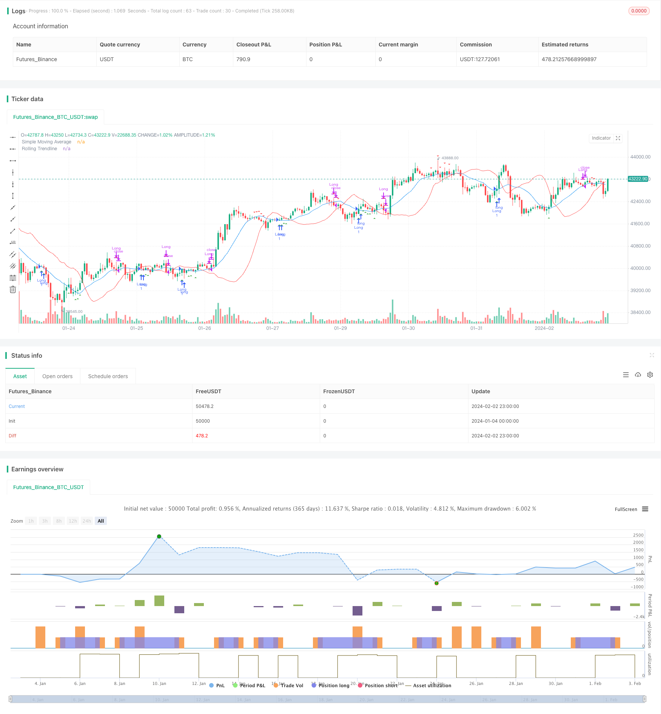

> Name

Quantitative-Trading-Strategy-Based-on-SMA-and-Rolling-Trendline
> Author

ChaoZhang

> Strategy Description


[trans]
## Overview
This strategy combines the simple moving average (SMA) and the rolling linear regression trend line. The buy condition is to go long when the closing price is higher than the SMA and the trend line, and the exit condition is to close the position when the closing price is lower than the SMA and the trend line. This strategy mainly uses the moving average trading signals of SMA and the support of the rolling trend line to enter the market when it breaks through the upward channel and exit when it breaks through the downward channel.
## Strategy Principle
The strategy is mainly based on the following components:
1. SMA: Simple moving average, which calculates the average of the closing prices in a certain period (smaPeriod) as the signal line.
2. Rolling trend line: Calculate the best-fitting straight line within a certain period (window) based on linear regression as a trend signal. The calculation method is the least squares method.
3. Entry conditions: When the closing price is higher than the SMA moving average and rolling trend line, enter long.
4. Exit conditions: When the closing price is lower than the SMA moving average and rolling trend line, close the position and exit.
In this way, this strategy mainly relies on moving average trading signal breakthroughs for entry and channel breakthroughs for exits. The trend tracking breakthrough operation is realized by utilizing the mean reversion characteristics of the moving average and the mean support of the linear regression channel.
## Strategic advantage analysis
This strategy integrates double filtering of moving averages and trend lines, which can effectively reduce false breakthrough operations. At the same time, the rolling trendline provides more accurate channel support, making trading decisions more reliable. The main advantages are as follows:
1. Double filtering mechanism to avoid false breakthroughs and improve decision-making accuracy.
2. The rolling trend line provides dynamic channels and supports more accurate channel trading.
3. Simple and intuitive transaction logic, easy to understand and implement.
4. Parameters can be customized to adapt to different market environments.
## Risk Analysis
This strategy also has some risks, mainly focusing on the following points:
1. Improper setting of SMA and trendline parameters may lead to missed trading opportunities or too many false breakthroughs.
2. In a volatile market, the channel support provided by SMA and trend line QIAN will weaken.
3. Failure to break through may result in losses, and strict stop loss is required.
To address these risks, you can optimize from the following points:
1. Optimize parameters. Different parameter combinations can be set for different varieties.
2. Increase the stop loss range to reduce single loss.
3. Suspend trading during volatile market conditions to avoid being trapped.
## Strategy optimization direction
This strategy can be optimized from the following dimensions:
1. Add the function of dynamically adjusting SMA cycle and slippage parameters. Automatically optimize parameters in different market environments.
2. Add a flexible stop loss mechanism. Stop loss when the price breaks through the trend line by a certain percentage.
3. Filter signals in combination with other indicators. For example, energy indicators, strength indicators, etc. Improve decision accuracy.
4. Develop an inverted version. Go long when the price is near the bottom and breaks out of the downtrend channel.
## Summarize
This strategy integrates moving average trading signals and rolling trendline channel support to achieve trend following operations. The double filtering mechanism reduces the probability of false breakthroughs and improves the quality of decision-making. Simple parameter setting, clear logic, easy to implement and optimize adjustments. Overall, this strategy forms a reliable, simple, and intuitive trend breakout trading system.
||

## Overview  

This strategy combines the Simple Moving Average (SMA) and rolling linear regression trendline. It sets the long entry condition when the close price is above both SMA and trendline, and exit condition when the close price is below them. The strategy mainly utilizes the SMA as trading signal and rolling trendline for channel support. It enters trade when breakout of the upside channel and exits when breakout of the downside channel.

## Strategy Logic  

The key components of this strategy include:  

1. SMA: Simple moving average, calculating average close price over a period (smaPeriod) as signal line.

2. Rolling Trendline: Fitting the best linear regression line over a window (window) as trend signal. Calculated by Ordinary Least Square method.

3. Entry Condition: Go long when close price > SMA and trendline. 

4. Exit Condition: Close position when close price < SMA and trendline.

So the strategy mainly relies on SMA signal breakout for entry, and channel breakout for exit. It utilizes the mean reversion attribute of MA and channel support by linear regression line to implement trend following breakout operations.

## Advantage Analysis   

This strategy integrates dual filter of MA and trendline, which can effectively reduce false breakout trades. Meanwhile, rolling trendline provides more precise channel support for reliable decisions. The main advantages include:

1. Dual filter mechanism avoids false breakout and improves decision accuracy.  
2. Rolling trendline offers dynamic channel support for more accurate channel trading.
3. Simple and intuitive trading logic, easy to understand and implement.  
4. Customizable parameters adapt to different market environments.

## Risk Analysis  

There are also some risks of this strategy:   

1. Improper parameters of SMA and trendline may lead to missing trades or too many false breakouts.  
2. In highly volatile markets, the channel support by SMA and trendline may weaken. 
3. Failed breakout can lead to losses, strict stop loss is required.

Some optimizing directions for these risks:

1. Optimize parameters for different products.
2. Increase stop loss range to reduce single loss.  
3. Suspend trading in volatile market to avoid being trapped.

## Strategy Optimization  

This strategy can be optimized in the following aspects:

1. Add dynamic adjustment functions for SMA period, slippage parameters based on market regimes.  

2. Develop elastic stop loss mechanism. Set stop loss when price breaks trendline at a ratio.
   
3. Add filter from other indicators e.g. Volume, RSI to improve decision accuracy.   

4. Develop reversal version. Go long when price approaches bottom and breaks the downside channel.  

## Conclusion  

This strategy integrates the trading signals from moving average and channel support from rolling trendline to implement trend following operations. The dual filter reduces false breakout probability and improves decision quality. It has simple parameters settings and clear logics, which is easy to implement and optimize. In summary, this strategy forms a reliable, simple and intuitive trend breakout trading system.

[/trans]

> Strategy Arguments


|Argument|Default|Description|
|----|----|----|
|v_input_1|14|SMA Period|
|v_input_2|20|Trendline Window|
|v_input_3|timestamp(2023-01-01)|Start Date|
|v_input_4|timestamp(2023-12-31)|End Date|


> Source (PineScript)

``` pinescript
/*backtest
start: 2024-01-04 00:00:00
end: 2024-02-03 00:00:00
period: 1h
basePeriod: 15m
exchanges: [{"eid":"Futures_Binance","currency":"BTC_USDT"}]
*/

//@version=4
strategy("SMA Strategy with Rolling Trendline", overlay=true)

// Input parameters
smaPeriod = input(14, title="SMA Period")
window = input(20, title="Trendline Window")
startDate = input(timestamp("2023-01-01"), title="Start Date")
endDate = input(timestamp("2023-12-31"), title="End Date")

// Calculating SMA
sma = sma(close, smaPeriod)

// Function to calculate linear regression trendline for a window
linreg_trendline(window) =>
    sumX = 0.0
    sumY = 0.0
    sumXY = 0.0
    sumX2 = 0.0
    for i = 0 to window - 1
        sumX := sumX + i
        sumY := sumY + close[i]
        sumXY := sumXY + i * close[i]
        sumX2 := sumX2 + i * i
    slope = (window * sumXY - sumX * sumY) / (window * sumX2 - sumX * sumX)
    intercept = (sumY - slope * sumX) / window
    slope * (window - 1) + intercept

// Calculating the trendline
trendline = linreg_trendline(window)

// Entry and Exit Conditions
longCondition = close > sma and close < trendline
exitLongCondition = close < sma and close > trendline

// Strategy logic
if (true)
    if (longCondition)
        strategy.entry("Long", strategy.long)
    if (exitLongCondition)
        strategy.close("Long")

// Plotting
plot(sma, title="Simple Moving Average", color=color.blue)
plot(trendline, title="Rolling Trendline", color=color.red)
plotshape(series=longCondition, title="Enter Trade", location=location.belowbar, color=color.green, style=shape.triangleup)
plotshape(series=exitLongCondition, title="Exit Trade", location=location.abovebar, color=color.red, style=shape.triangledown)

```

> Detail

https://www.fmz.com/strategy/440986

> Last Modified

2024-02-04 15:18:12
