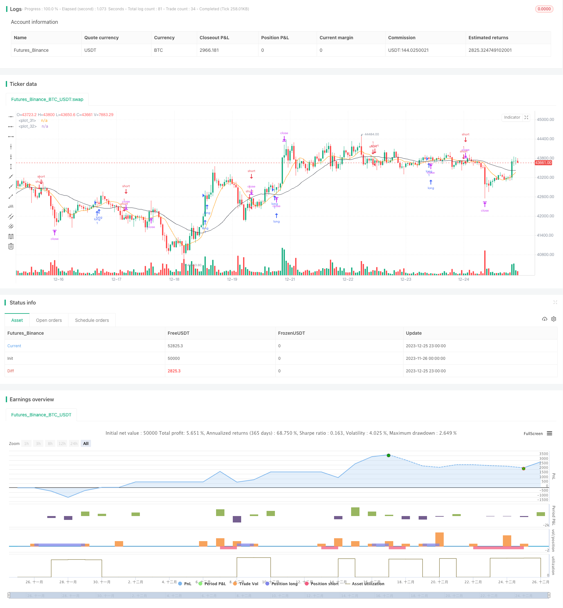

> Name

Short-Term-Silver-Trading-Strategy-Based-on-SMA-and-RSI-Indicators
> Author

ChaoZhang

> Strategy Description


[trans]

## Overview
This strategy is based on the 10-day simple moving average (SMA), 30-day SMA and relative strength index (RSI) indicators, combined with the average true range (ATR) indicator to set stop loss and take profit levels to achieve short-term trading of silver prices. This strategy is suitable for 1-hour online operations.
## Strategy Principle
When the 10-day SMA breaks through the 30-day SMA from bottom to top, it means that the price has formed a short-term upward trend. When the RSI is above 50, it is bullish to enter the market. When the 10-day SMA falls below the 30-day SMA from above, it means that the price has formed a short-term downward trend. When the RSI is below 50, enter the market bearishly.
The stop loss level is set to the recent low minus 3x ATR. The take profit level is set to the recent high plus 3x ATR. In this way, the characteristics of the ATR indicator can be used to achieve risk control by making the stop loss wider when market fluctuations increase and the stop loss wider when fluctuations decrease.
## Strategic advantage analysis
This strategy combines a variety of indicators to determine short-term trends and capital inflows and outflows, and can effectively filter false signals. At the same time, the ATR stop loss mechanism allows the stop loss level to be dynamically adjusted to control risks.
Compared with long-term trading strategies, short-term operations have the advantages of fast capital turnover and frequent opening of positions. This strategy uses the 1-hour moving average system to determine short-term trend changes, and cooperates with the RSI indicator to determine buying and selling opportunities, which can capture short-term price increases and decreases.
## Risk and Countermeasure Analysis
This strategy mainly faces the risks of stop loss being penetrated and frequent stop loss in the long market. For these risks, you can adjust the ATR multiple or set up price filters to avoid stop loss being penetrated. At the same time, it is recommended to use lock-up or increase positions to reduce frequent stop losses in the long market.
In addition, short-term operations require higher psychological quality of traders, and they need to be alert to the risks of over-trading and emotional operations. Traders are advised to appropriately control position size and establish strict risk management rules.
## Strategy optimization direction
This strategy can be further optimized by:
1. Add other indicator filters, such as the KDJ indicator to determine whether you have bought or sold.
2. Test different parameter combinations, such as SMA period, ATR multiple, RSI threshold, etc.
3. Add machine learning algorithms to achieve dynamic optimization of parameters
4. Combined with stock pool technology, expand to other varieties with similar models
5. Add automatic stop loss module to realize dynamic tracking of stop loss level
## Summarize
This strategy integrates multiple indicators to determine short-term trends and capital flows, and uses the ATR indicator to optimize the stop loss mechanism. This strategy has the advantages of fast capital turnover and frequent opening of positions, and is suitable for short-term operations of silver and other varieties. We also need to guard against the risks of excessive trading and emotional operations, and continue to optimize strategies to improve stability and winning rate.
||

## Overview

This strategy is based on the 10-day simple moving average (SMA), 30-day SMA and relative strength index (RSI) indicator, combined with the average true range (ATR) indicator to set stop loss and take profit levels for short-term silver trading. It is suitable for 1-hour timeframe operations.  

## Strategy Logic

When the 10-day SMA crosses above the 30-day SMA, it signals an uptrend in price in the short term. A long position is taken when RSI is above 50. When the 10-day SMA crosses below the 30-day SMA, it signals a downtrend in price in the short term. A short position is taken when RSI is below 50.

The stop loss level is set at the recent low minus 3 times ATR. The take profit level is set at the recent high plus 3 times ATR. This utilizes the characteristics of the ATR indicator to have wider stops when volatility increases and narrower stops when volatility decreases, thereby controlling risk.

## Advantage Analysis  

This strategy combines multiple indicators to determine short-term trend and capital inflows/outflows, which can effectively filter false signals. At the same time, the ATR stop loss mechanism allows stop levels to be dynamically adjusted to control risk.

Compared to long-term trading strategies, short-term operations have advantages like fast capital turnover and frequent position opening. This strategy uses the 1-hour moving average system to determine short-term trend changes and the RSI indicator to determine entry and exit timing, which can capture short-term price rises and falls.


## Risks and Mitigations   

The main risks this strategy faces are stop loss being hit, frequent stop outs in uptrends etc. To mitigate these risks, the ATR multiplier can be adjusted or price filters can be added to avoid stops being hit. At the same time, locking or adding to positions is recommended to reduce frequent stop outs in uptrends.

In addition, short-term trading requires high psychological endurance from traders, so risks like overtrading and emotional decisions should be avoided. It is recommended that traders control position sizing appropriately and establish strict risk management rules.  

## Optimization Directions

This strategy can be further optimized in the following ways:

1. Add other indicators for filtration, like the KDJ indicator to determine overbought and oversold conditions  
2. Test different parameter combinations, like SMA periods, ATR multiplier, RSI threshold etc.  
3. Incorporate machine learning algorithms to dynamically optimize the parameters
4. Expand this pattern to other assets using basket trading techniques
5. Add automatic stop loss module to dynamically trail the stop levels  

## Summary  

This strategy integrates multiple indicators to determine short-term trends and capital flows, and optimizes the stop loss mechanism using the ATR indicator. It has advantages like fast capital turnover and frequent position opening, making it suitable for short-term trading of assets like silver. We still need to guard against risks like overtrading and emotional decisions, and continue optimizing the strategy to improve robustness and win rate.

[/trans]


> Source (PineScript)

``` pinescript
/*backtest
start: 2023-11-26 00:00:00
end: 2023-12-26 00:00:00
period: 1h
basePeriod: 15m
exchanges: [{"eid":"Futures_Binance","currency":"BTC_USDT"}]
*/

// This Pine Script™ code is subject to the terms of the Mozilla Public License 2.0 at https://mozilla.org/MPL/2.0/
// © kapshamam

//@version=5
strategy("SMA 10 30 ATR RSI", overlay=true)

// Create Indicator's
shortSMA = ta.sma(close, 10)
longSMA = ta.sma(close, 30)
rsi = ta.rsi(close, 14)
atr = ta.atr(14)

// Specify crossover conditions
longCondition = ta.crossover(shortSMA, longSMA)
shortCondition = ta.crossunder(shortSMA, longSMA)

// Execute trade if condition is True
if (longCondition)
    stopLoss = low - atr * 3
    takeProfit = high + atr * 3
    strategy.entry("long", strategy.long, 1, when = rsi > 50)
    strategy.exit("exit", "long", stop=stopLoss, limit=takeProfit)

if (shortCondition)
    stopLoss = high + atr * 2
    takeProfit = low - atr * 2
    strategy.entry("short", strategy.short, 1, when = rsi < 50)
    strategy.exit("exit", "short", stop=stopLoss, limit=takeProfit)

// Plot Moving Average's to chart
plot(shortSMA)
plot(longSMA, color=color.black)
```

> Detail

https://www.fmz.com/strategy/436783

> Last Modified

2023-12-27 16:42:05
