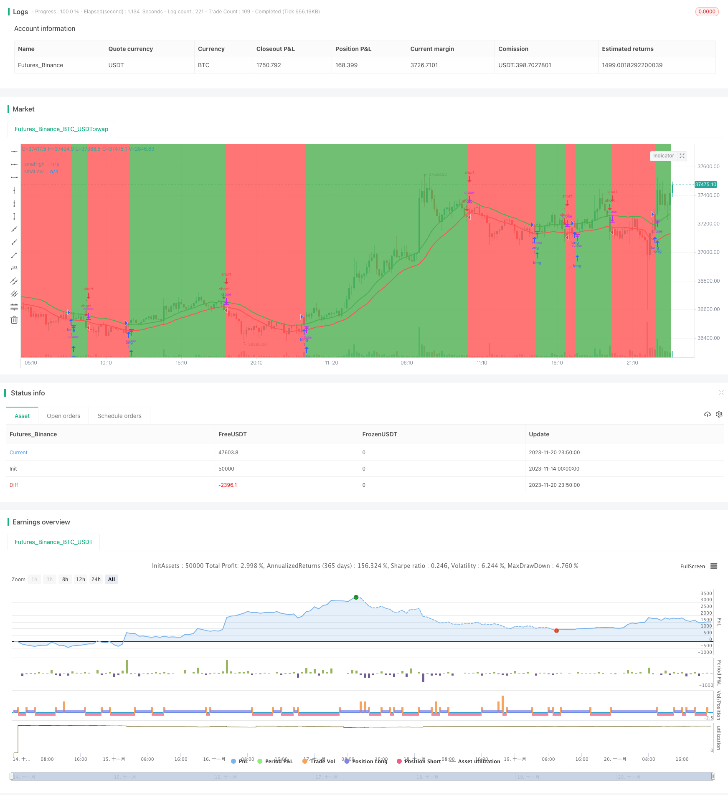

> Name

SMA-Based-Dual-Thrust-Strategy
> Author

ChaoZhang

> Strategy Description


[trans]

## Overview
This strategy builds a simple long-short strategy based on the SMA indicator. Go long when the price breaks above the 20-period high SMA, and go short when the price breaks below the 20-period SMA low. At the same time, a stop-loss exit mechanism is set up.
## Strategy Principle
This strategy uses the 20-period highest high price and lowest low price SMA as indicators for judging long and short. When the price crosses the highest SMA, it is considered that the current trend is up, so go long; when the price breaks below the lowest SMA, it is considered that the current trend is down, then go short.
Specifically, the strategy first calculates the SMA of the highest high price and the lowest low price in 20 periods, and draws the indicator line. Then set the following transaction logic:
Long entry: when the closing price crosses the highest SMA
Long exit: when the closing price falls below 0.99 times the highest SMA
Short entry: when the closing price breaks below the lowest SMA
Short exit: when the closing price crosses 1.01 times the lowest SMA
In this way, a long-short strategy that follows the trend is constructed.
## Advantage Analysis
This strategy has several advantages:
1. Using the SMA indicator to determine the trend direction is simple and practical
2. HIGHEST SMA and LOWEST SMA serve as support and resistance lines and play an important role as indicators.
3. Reasonable stop loss design to avoid huge losses to the greatest extent
4. Strong applicability, can be used in a variety of time periods and varieties
## Risk Analysis
This strategy also has certain risks:
1. The SMA indicator lags and may miss the turning point of the trend.
2. Preventive measures for unrelated market emergencies
3. Failure to consider the impact of transaction costs
These risks can be controlled and reduced by combining other indicators, setting stop losses, optimizing parameters, etc.
## Optimization direction
This strategy can also be optimized from the following aspects:
1. Combine with other indicators to determine the trend, such as MACD, KDJ, etc.
2. Add a prevention mechanism for emergencies, such as the handling of abnormal situations such as trading suspensions and price limits.
3. Optimize SMA cycle parameters and find the best parameter combination
4. Consider the best parameters for different varieties and different time periods
5. Evaluate the impact of transaction costs and set the best stop loss and take profit levels
## Summarize
The overall idea of ​​this strategy is clear and easy to implement. By judging the long and short trends through the SMA indicator and setting up a reasonable entry and exit mechanism, good results can be achieved. There is room for further optimization, and if combined with other indicators and techniques, it can become a strategy with good potential that is worthy of long-term tracking.
||

## Overview  

This strategy builds a simple dual thrust strategy based on the SMA indicator. It goes long when the price crosses above the 20-period highest SMA and goes short when the price crosses below the 20-period lowest SMA. Stop loss exits are also set.

## Strategy Logic  

This strategy uses the 20-period SMA of highest high price and lowest low price to determine the direction for trading. When price crosses above the highest SMA, it is considered as an uptrend, so go long. When price crosses below the lowest SMA, it is considered as a downtrend, so go short. 

Specifically, the strategy first calculates the 20-period SMA of highest high and lowest low prices, and plots the indicator lines. The following trading logic is then set:  

Long entry: Close price crosses above highest SMA  
Long exit: Close price crosses below 0.99 * highest SMA   

Short entry: Close price crosses below lowest SMA   
Short exit: Close price crosses above 1.01 * lowest SMA  

So an trend following dual thrust strategy is built.  

## Advantage Analysis   

This strategy has the following advantages:  

1. Using SMA to determine trend direction is simple and practical  
2. Highest SMA and Lowest SMA act as support/resistance lines  
3. Reasonable stop loss design to maximize protection from huge losses
4. Good adaptability, can be used on different products and timeframes  

## Risk Analysis  

There are also some risks with this strategy:   

1. SMA has lagging effect, may miss trend turning points  
2. No protection from market sudden events   
3. Trading cost impact not considered  

These risks can be controlled and reduced in ways like combining other indicators, setting stop loss, parameter tuning etc.  

## Improvement Directions   

This strategy can also be improved in the following aspects:  

1. Combine other indicators like MACD, KDJ to determine trend  
2. Add protection for sudden events like suspension, price limiting etc   
3. Optimize SMA periods, find the best parameter combination  
4. Find best parameters for different products and timeframes  
5. Estimate trading cost impact, set optimal stop loss and take profit  

## Conclusion  

The overall logic of this strategy is clear and easy to implement. By using SMA to determine trend direction, and setting reasonable entry/exit rules, good results can be achieved. There is room for further optimization, and by combining with other techniques, it can become a promising strategy worth long term tracking.  

[/trans]


> Source (PineScript)

``` pinescript
/*backtest
start: 2023-11-14 00:00:00
end: 2023-11-21 00:00:00
period: 10m
basePeriod: 1m
exchanges: [{"eid":"Futures_Binance","currency":"BTC_USDT"}]
*/

// This source code is subject to the terms of the Mozilla Public License 2.0 at https://mozilla.org/MPL/2.0/
// © AlanAntony

//@version=4


strategy("ma 20 high-low",overlay=true)

//compute the indicators

smaH = sma(high, 20)
smaL = sma(low, 20)


//plot the indicators
plot(smaH,title="smaHigh", color=color.green, linewidth=2)


plot(smaL,title="smaLow", color=color.red, linewidth=2)


//trading logic
enterlong = crossover(close,smaH) //positive ema crossover
exitlong = crossunder(close,0.99*smaH)  //exiting long


entershort = crossunder(close,smaL) //negative EMA Crossover
exitshort = crossover(close,1.01*smaH) //exiting shorts


notintrade = strategy.position_size<=0
bgcolor(notintrade ? color.red:color.green)

//execution logic

start = timestamp(2015,6,1,0,0)
//end = timestamp(2022,6,1,0,0)

if time >= start
    strategy.entry( "long", strategy.long,1, when = enterlong)
    strategy.entry( "short", strategy.short,1, when = entershort) 
    
    strategy.close("long", when = exitlong)
    strategy.close("short", when = exitshort)

//if time >= end
   // strategy.close_all()
```

> Detail

https://www.fmz.com/strategy/432896

> Last Modified

2023-11-22 15:42:29
