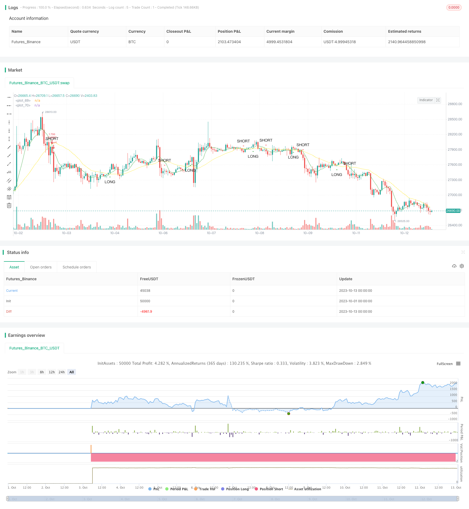

> Name

Based on SMA crossover strategy SMA-Crossover-Strategy
> Author

ChaoZhang

> Strategy Description




[trans]

## Overview
This strategy generates trading signals based on the crossover principle of a fast moving average and a slow moving average. When the fast moving average crosses above the slow moving average, a buy signal is generated; when the fast moving average crosses below the slow moving average, a sell signal is generated.
## Principle
This strategy uses the sma function to calculate the fast and slow moving averages. Among them, fast_SMA is the fast moving average, and the period length is fast_SMA_input; slow_SMA is the slow moving average, and the period length is slow_SMA_input.
The strategy uses the cross and crossunder functions to determine the intersection of the fast moving average and the slow moving average. When the fast moving average crosses the slow moving average, the LONG variable is true, generating a buy signal; when the fast moving average crosses below the slow moving average, the SHORT variable is true, generating a sell signal.
## Advantage Analysis
This strategy has the following advantages:
1. The strategy principle is simple, easy to understand and implement.
2. The moving average period can be customized and suitable for different market environments.
3. It can filter out some market noise and generate more reliable trading signals.
4. Capture the start and turning point of the trend at the same time.
## Risk Analysis
This strategy also has the following risks:
1. If the setting is improper, too many trading signals will be generated, resulting in frequent trading.
2. A large number of invalid signals may be generated in sideways markets.
3. Unable to judge the duration of the trend and may reverse prematurely.
Risk control methods:
1. Set the moving average parameters reasonably to balance the filtering effect and sensitivity.
2. Combine with trend indicators to filter out invalid signals.
3. Set a stop loss point to control single loss.
## Optimization direction
This strategy can be optimized from the following aspects:
1. Add filter conditions to check trading volume or volatility indicators when breaking through the moving average to avoid false breakthroughs.
2. Combine with trend indicators to identify the direction and strength of the trend.
3. Add a machine learning model to automatically optimize moving average parameters.
4. Combine support, resistance, Bollinger Bands and other technical indicators to draw trading areas to improve entry accuracy.
## Summarize
This strategy takes advantage of moving averages to generate trading signals simply and effectively. Although there are some risks, improvements can be made through parameter optimization and adding filtering conditions. The moving average crossover strategy deserves further study and application.
||

## Overview

This strategy generates trading signals based on the crossover between fast and slow moving averages. It produces buy signals when the fast moving average crosses above the slow moving average from below. It produces sell signals when the fast moving average crosses below the slow moving average from above.

## Principles 

This strategy uses the sma function to calculate the fast and slow moving averages. The fast_SMA is the fast moving average with period length fast_SMA_input. The slow_SMA is the slow moving average with period length slow_SMA_input.

The strategy uses the cross and crossunder functions to determine the crossover between the fast and slow moving averages. When the fast moving average crosses above the slow moving average, the LONG variable is true and a buy signal is generated. When the fast moving average crosses below the slow moving average, the SHORT variable is true and a sell signal is generated.

## Advantages

This strategy has the following advantages:

1. Simple principle, easy to understand and implement.
2. Customizable moving average periods, adaptable to different market environments.  
3. Filters out some market noise and generates relatively reliable trading signals.
4. Captures both the start and turning points of trends.

## Risks

This strategy also has the following risks:

1. Can generate excessive trading signals if the settings are improper, leading to overtrading.
2. May produce many false signals in sideways markets.
3. Cannot determine the duration of a trend, may reverse prematurely.

Risk management:

1. Set appropriate moving average parameters to balance filtering effect and sensitivity.
2. Add trend indicator filters to avoid false signals. 
3. Set stop loss points to control loss per trade.

## Optimization

This strategy can be optimized from the following aspects:

1. Add filtering conditions on volume or volatility when the breakout happens to avoid false breakouts.
2. Incorporate trend indicators to identify trend direction and strength.
3. Add machine learning models to auto-optimize the moving average parameters.  
4. Combine with support/resistance and Bollinger Bands to define trading ranges and improve entry accuracy.

## Summary

This strategy effectively generates trading signals by leveraging the advantages of moving averages. Although there are some risks, they can be improved by parameter optimization, adding filters etc. The moving average crossover strategy is worth further research and application.

[/trans]

> Strategy Arguments


|Argument|Default|Description|
|----|----|----|
|v_input_1|2018|Start Year|
|v_input_2|true|Start Month|
|v_input_3|true|Start Day|
|v_input_4|2019|End Year|
|v_input_5|true|End Month|
|v_input_6|true|End Day|
|v_input_7|7|SMA Fast|
|v_input_8|25|SMA Slow|


> Source (PineScript)

``` pinescript
/*backtest
start: 2023-10-01 00:00:00
end: 2023-10-13 00:00:59
period: 1h
basePeriod: 15m
exchanges: [{"eid":"Futures_Binance","currency":"BTC_USDT"}]
*/

//@author Jacques Grobler
//
//                  SIMPLE CROSS OVER BOT
//                  =====================
//
// This is a simple example of how to set up a strategy to go long or short
// If you make any modifications or have any suggestions, let me know
// When using this script, every section marked back testing should be 
// uncommented in order to use for back testing, same goes for using the script portion

///////////////////////////////////////////////////////////////////////////////////////
//// INTRO
//// -----
// BACKTESTING
//@version=4
strategy(title="SimpleCrossOver_Bot_V1_Backtester", overlay=true, default_qty_type=strategy.percent_of_equity, default_qty_value=100, pyramiding=0, commission_type=strategy.commission.percent, commission_value=0.1)

// SIGNALS
//study(title="SimpleCrossOver_Bot_V1_Signals", overlay = true)

///////////////////////////////////////////////////////////////////////////////////////
//// INPUTS
//// ------
// BACKTESTING
dateSart_Year = input(2018, title="Start Year", minval=2000)
dateSart_Month = input(1, title="Start Month", minval=1, maxval=12)
dateSart_Day = input(1, title="Start Day", minval=1, maxval=31)
dateEnd_Year = input(2019, title="End Year", minval=2000)
dateEnd_Month = input(1, title="End Month", minval=1, maxval=12)
dateEnd_Day = input(1, title="End Day", minval=1, maxval=31)

// BACKTESTING AND SIGNALS
fast_SMA_input = input(7, title="SMA Fast")
slow_SMA_input = input(25, title="SMA Slow")

///////////////////////////////////////////////////////////////////////////////////////
//// INDICATORS
//// ----------
fast_SMA = sma(close, fast_SMA_input)
slow_SMA = sma(close, slow_SMA_input)

///////////////////////////////////////////////////////////////////////////////////////
//// STRATEGY
//// --------
LONG = cross(fast_SMA, slow_SMA) and fast_SMA > slow_SMA
stratLONG() => crossover(fast_SMA, slow_SMA)
SHORT = cross(fast_SMA, slow_SMA) and fast_SMA < slow_SMA
stratSHORT() => crossunder(fast_SMA, slow_SMA)

///////////////////////////////////////////////////////////////////////////////////////
//// TRIGGERS
//// --------
// BACKTESTING
testPeriodStart = timestamp(dateSart_Year, dateSart_Month, dateSart_Day, 0, 0)
testPeriodStop = timestamp(dateEnd_Year, dateEnd_Month, dateEnd_Day, 0, 0)
timecondition = true

strategy.entry(id="LONG", long = true, when=timecondition and stratLONG())
strategy.entry(id="SHORT", long = false, when=timecondition and stratSHORT())

// SIGNALS
//alertcondition(LONG, title="LONG")
//alertcondition(SHORT, title="SHORT")

///////////////////////////////////////////////////////////////////////////////////////
//// PLOTS
//// -----
// BACKTESTING AND SIGNALS
plot(fast_SMA, color=green, linewidth=1)
plot(slow_SMA, color=yellow, linewidth=1)
plotshape(LONG, title="LONG", style=shape.triangleup, text="LONG", location=location.belowbar, size=size.small, color=green)
plotshape(SHORT, title="SHORT", style=shape.triangledown, text="SHORT", location=location.abovebar, size=size.small, color=red)
```

> Detail

https://www.fmz.com/strategy/431494

> Last Modified

2023-11-08 11:36:51
