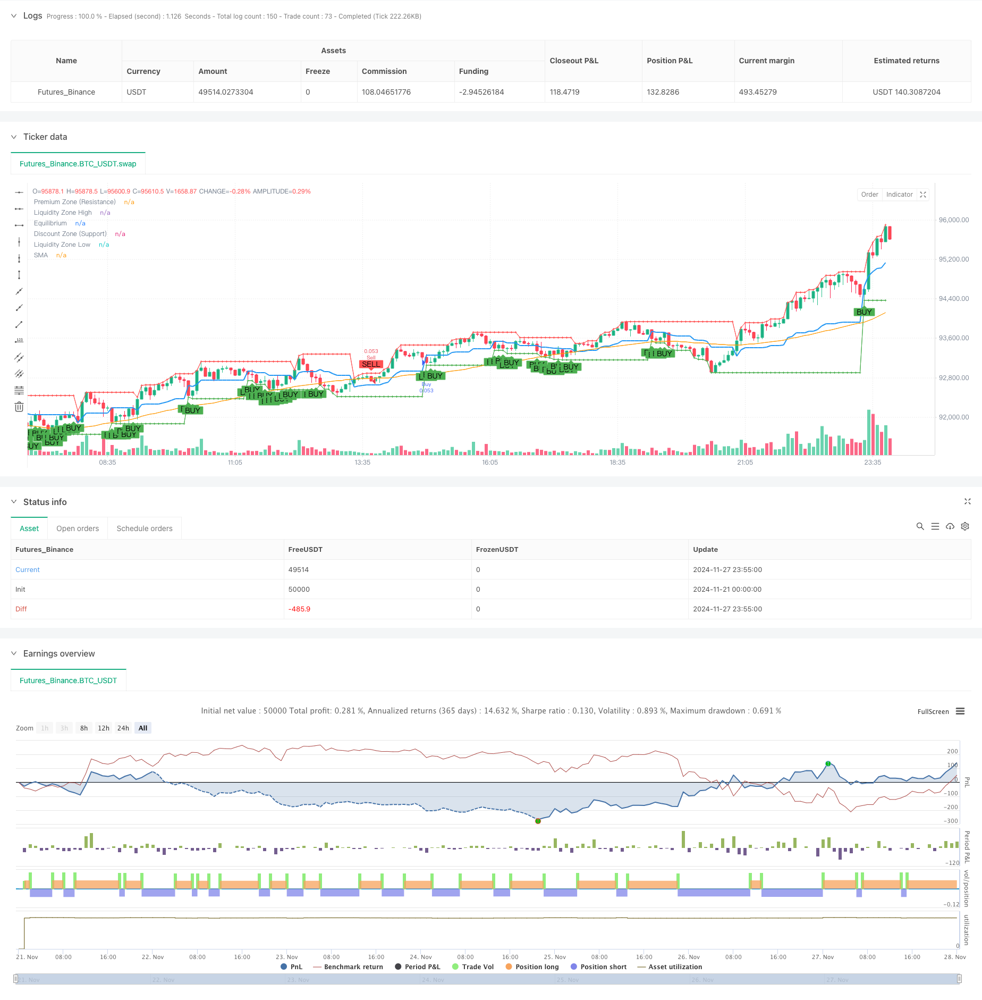

> Name

Multi-Zone-SMC-Theory-Based-Intelligent-Trend-Following-Strategy Based on Multi-Zone SMC Theory
> Author

ChaoZhang

> Strategy Description



[trans]
#### Overview
This strategy is based on the Smart Money Concept (SMC) theory, by dividing three key price areas (Equilibrium), Premium (Premium) and Discount (Discount), combined with 50-period Simple Moving Average (SMA) and Order Blocks (Order Blocks) analysis to build a complete trend following trading system. Strategies capture trading opportunities in price swings between different areas by identifying key support and resistance levels in the market structure.
#### Strategy Principle
The core logic of the strategy includes the following key elements:
1. Determine the market's fluctuation range by calculating the fluctuation highs and lows of the last 8 K lines.
2. The middle value of the high and low points of the fluctuation is regarded as the equilibrium area. The area above the equilibrium area is defined as the premium area, and the area below the equilibrium area is defined as the discount area.
3. Use the 50-period SMA to determine the overall trend direction. If the price is above the SMA, it is considered a bullish trend, and vice versa is a bearish trend.
4. A buy signal is generated when the price is in the discount zone and the price is above the SMA, and a sell signal is generated when the price is in the premium zone and falls below the SMA.
5. Identify order blocks by analyzing the highest and lowest prices within 20 K lines, which are used to confirm trading signals.
6. Mark volatility highs and lows as liquidity areas and predict possible price reversal points.
#### Strategic Advantages
1. A structured regional division method that can clearly locate the stage of the market.
2. Multiple signal confirmation mechanism, improving transaction accuracy through triple verification of area, trend and order block.
3. Dynamically adapt to market changes and update key price levels in real time.
4. Complete risk management system, including stop loss and position management.
5. The code implementation is simple and efficient, easy to maintain and optimize.
#### Strategy Risk
1. False breakthrough signals may appear in highly volatile markets.
2. Indicators that rely on historical data calculations may lag in rapidly moving markets.
3. Fixed period moving averages may not be suitable for all market environments.
4. Stop loss needs to be set appropriately to control risks.
The following measures are recommended to manage risk:
- Dynamically adjust parameters to adapt to different market environments
- Added volatility filter
- Implement strict money management rules
- Regular backtesting and optimization of strategy parameters
#### Strategy optimization direction
1. Introduce adaptive parameters:
- Dynamically adjust regional ranges based on market volatility
- Moving average using adaptive periods
2. Enhance signal filtering:
- Added transaction volume confirmation mechanism
- Introducing momentum indicators to assist judgment
3. Improve risk management:
- Implement dynamic stop loss mechanism
- Optimize position management algorithm
4. Improve execution efficiency:
- Optimize calculation logic to reduce resource consumption
- Improved signal generation mechanism to increase response speed
#### Summary
This strategy builds a robust trend tracking system through intelligent regional division and multiple signal confirmation mechanisms. The core advantage of the strategy lies in its clear market structure analysis method and complete risk management system. Through continuous optimization and improvement, the strategy is expected to maintain stable performance in different market environments. It is recommended that traders need to adjust parameters according to specific market characteristics and always maintain strict risk control when applying real trading.
|| 

#### Overview
This strategy, based on Smart Money Concepts (SMC) theory, constructs a comprehensive trend following trading system by dividing the market into three key price zones: Equilibrium, Premium, and Discount. It combines a 50-period Simple Moving Average (SMA) with Order Block analysis to identify trading opportunities through price movements between different zones.

#### Strategy Principles
The core logic includes several key elements:
1. Calculates swing highs and lows from the last 8 candles to determine market range.
2. Defines the equilibrium zone as the midpoint between swing high and low, with premium zone above and discount zone below.
3. Uses 50-period SMA to determine overall trend direction - bullish above SMA, bearish below.
4. Generates buy signals in discount zone when price is above SMA, and sell signals in premium zone when price is below SMA.
5. Identifies order blocks by analyzing highest and lowest prices within 20 candles to confirm trading signals.
6. Marks swing highs and lows as liquidity zones to predict potential price reversal points.

#### Strategy Advantages
1. Structured zone division method providing clear market phase identification.
2. Multiple signal confirmation mechanism through triple verification of zones, trends, and order blocks.
3. Dynamic adaptation to market changes with real-time key price level updates.
4. Comprehensive risk management system including stop-loss and position management.
5. Clean and efficient code implementation, easy to maintain and optimize.

#### Strategy Risks
1. Potential false breakout signals in volatile markets.
2. Indicator lag in rapid market reversals due to historical data dependence.
3. Fixed-period moving average may not suit all market environments.
4. Requires proper stop-loss settings for risk control.
Recommended risk management measures:
- Dynamic parameter adjustment for different market conditions
- Addition of volatility filters
- Implementation of strict money management rules
- Regular backtesting and parameter optimization

#### Optimization Directions
1. Introduce adaptive parameters:
- Dynamically adjust zone ranges based on market volatility
- Implement adaptive-period moving averages
2. Enhanced signal filtering:
- Add volume confirmation mechanism
- Incorporate momentum indicators
3. Improve risk management:
- Implement dynamic stop-loss mechanism
- Optimize position sizing algorithm
4. Increase execution efficiency:
- Optimize calculation logic to reduce resource consumption
- Improve signal generation mechanism for faster response

#### Summary
This strategy builds a robust trend following system through intelligent zone division and multiple signal confirmation mechanisms. Its core strengths lie in clear market structure analysis and comprehensive risk management. Through continuous optimization and improvement, the strategy shows promise for stable performance across different market conditions. Traders are advised to adjust parameters based on specific market characteristics and maintain strict risk control when implementing the strategy in live trading.
[/trans]


> Source (PineScript)

``` pinescript
/*backtest
start: 2024-11-21 00:00:00
end: 2024-11-28 00:00:00
period: 5m
basePeriod: 5m
exchanges: [{"eid":"Futures_Binance","currency":"BTC_USDT"}]
*/

//@version=5
//@version=5
strategy("SMC Strategy with Premium, Equilibrium, and Discount Zones", overlay=true, default_qty_type=strategy.percent_of_equity, default_qty_value=10)

// === Instellingen voor Swing High en Swing Low ===
swingHighLength = input.int(8, title="Swing High Length")
swingLowLength = input.int(8, title="Swing Low Length")

// Vind de recente swing highs en lows
var float swingHigh = na
var float swingLow = na

if (ta.highestbars(high, swingHighLength) == 0)
    swingHigh := high

if (ta.lowestbars(low, swingLowLength) == 0)
    swingLow := low

// Bereken Equilibrium, Premium en Discount Zones
equilibrium = (swingHigh + swingLow) / 2
premiumZone = swingHigh
discountZone = swingLow

// Plot de zones op de grafiek
plot(equilibrium, title="Equilibrium", color=color.blue, linewidth=2)
plot(premiumZone, title="Premium Zone (Resistance)", color=color.red, linewidth=1)
plot(discountZone, title="Discount Zone (Support)", color=color.green, linewidth=1)

// === Simple Moving Average om trendrichting te bepalen ===
smaLength = input.int(50, title="SMA Length")
sma = ta.sma(close, smaLength)
plot(sma, title="SMA", color=color.orange)

// === Entry- en Exitregels op basis van zones en trendrichting ===

// Koop- en verkoopsignalen
buySignal = close < equilibrium and close > discountZone and close > sma // Prijs in discount zone en boven SMA
sellSignal = close > equilibrium and close < premiumZone and close < sma // Prijs in premium zone en onder SMA

// Order Blocks (Eenvoudig: hoogste en laagste kaars binnen de laatste 20 kaarsen)
orderBlockLength = input.int(20, title="Order Block Length")
orderBlockHigh = ta.highest(high, orderBlockLength)
orderBlockLow = ta.lowest(low, orderBlockLength)

// Koop- en verkoopsignalen met order block bevestiging
buySignalOB = buySignal and close >= orderBlockLow // Koop in discount zone met ondersteuning van order block
sellSignalOB = sellSignal and close <= orderBlockHigh // Verkoop in premium zone met weerstand van order block

// === Uitvoeren van Trades ===
if (buySignalOB)
    strategy.entry("Buy", strategy.long)
    
if (sellSignalOB)
    strategy.entry("Sell", strategy.short)

// === Plots voor visuele feedback ===
plotshape(buySignalOB, title="Buy Signal", location=location.belowbar, color=color.green, style=shape.labelup, text="BUY")
plotshape(sellSignalOB, title="Sell Signal", location=location.abovebar, color=color.red, style=shape.labeldown, text="SELL")

// === Liquiditeitsjachten aangeven ===
// Simpel: markeer recente swing highs en lows als liquiditeitszones
liquidityZoneHigh = ta.valuewhen(high == swingHigh, high, 0)
liquidityZoneLow = ta.valuewhen(low == swingLow, low, 0)

// Markeer liquiditeitszones
plot(liquidityZoneHigh, title="Liquidity Zone High", color=color.red, linewidth=1, style=plot.style_cross)
plot(liquidityZoneLow, title="Liquidity Zone Low", color=color.green, linewidth=1, style=plot.style_cross)

```

> Detail

https://www.fmz.com/strategy/473371

> Last Modified

2024-11-29 15:38:01
