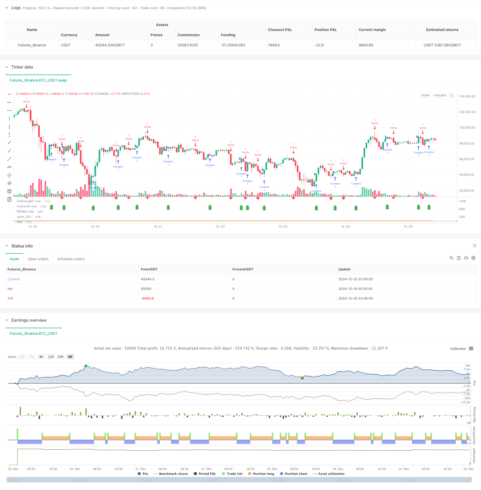

> Name

SMI Crossover Signal Adaptive Prediction Strategy Based on Momentum Indicator-Momentum-Based-SMI-Crossover-Signal-Adaptive-Prediction-Strategy
> Author

ChaoZhang

> Strategy Description



[trans]
#### Overview
This strategy is an adaptive trading system based on the Stochastic Momentum Indicator (SMI). It predicts market trends by analyzing the intersection of the SMI indicator and its signal line, and automatically issues buy and sell signals at key positions. The strategy uses a dual exponential moving average (EMA) to smooth the data and improve the reliability of the signal. This system is particularly suitable for medium and long-term transactions and can effectively capture the turning points of the main market trends.
#### Strategy Principle
The core of the strategy is to measure price momentum by calculating the Stochastic Momentum Index (SMI). First calculate the high and low price range for a specific period, and then normalize the closing price relative to that range. Get more stable SMI values ​​by applying double EMA smoothing to the relative range and price range. When the SMI line and its signal line (EMA of SMI) have a golden cross, a buy signal is triggered; when a death cross occurs, a sell signal is triggered. At the same time, an overbought and oversold range (+40/-40) is set to confirm the reliability of the signal.
#### Strategic Advantages
1. Strong signal clarity: using cross signals as trading trigger conditions avoids the subjectivity of judgment.
2. Good noise resistance: using double EMA smoothing processing, it can effectively filter market noise
3. Strong adaptability: can adapt to different market environments through parameter optimization
4. Improved risk control: set overbought and oversold ranges to avoid misjudgments in extreme market conditions
5. High degree of visualization: use gradient filling to visually display market status
#### Strategy Risk
1. Lagging risk: Due to the use of multiple moving average calculations, the signal will lag behind to a certain extent
2. Risk of market shock: False signals may occur in a volatile market.
3. Parameter sensitivity: Different parameter combinations may lead to completely different results
4. Dependence on the market environment: perform better in markets with obvious trends, but have poor results in volatile markets
#### Strategy optimization direction
1. Introduce trading volume indicators: verify the validity of signals based on changes in trading volume
2. Add trend filter: Use long-period moving averages to confirm overall trend direction
3. Optimization parameter adaptation: dynamically adjust parameters according to market volatility
4. Add a stop-loss mechanism: set a trailing stop-loss to protect existing profits
5. Improve risk management: add position management and fund management modules
#### Summary
This is a mature trading strategy based on the SMI indicator. It generates trading signals through the intersection of technical indicators and has strong practicality. The core advantages of the strategy are clear signals and strong noise immunity, but there is also a certain lag. By adding optimization methods such as trading volume verification and trend filtering, the stability and reliability of the strategy can be further improved. This strategy is particularly suitable for tracking mid- to long-term trends and is a good choice for investors who want to build a systematic trading system. ||
#### Overview
This strategy is an adaptive trading system based on the Stochastic Momentum Index (SMI). It predicts market trends by analyzing crossovers between the SMI indicator and its signal line, automatically generating buy and sell signals at key positions. The strategy employs double exponential moving averages (EMA) to smooth data and improve signal reliability. This system is particularly suitable for medium to long-term trading and effectively captures major market trend reversal points.

#### Strategy Principles
The core of the strategy lies in measuring price momentum through the SMI calculation. It first determines the highest and lowest price range within a specific period, then normalizes the closing price's position relative to this range. By applying double EMA smoothing to both the relative range and price range, it generates more stable SMI values. Buy signals are triggered when the SMI line makes a golden cross with its signal line (SMI's EMA), while death crosses trigger sell signals. Overbought and oversold zones (+40/-40) are set to confirm signal reliability.

#### Strategy Advantages
1. Clear Signal Generation: Uses crossover signals as trading triggers, eliminating subjective judgment
2. Strong Noise Resistance: Employs double EMA smoothing to effectively filter market noise
3. High Adaptability: Can adapt to different market environments through parameter optimization
4. Comprehensive Risk Control: Sets overbought/oversold zones to avoid misjudgments in extreme market conditions
5. High Visualization: Uses gradient fills to intuitively display market conditions

#### Strategy Risks
1. Lag Risk: Signal generation has some delay due to multiple moving average calculations
2. Oscillation Risk: May generate false signals in sideways markets
3. Parameter Sensitivity: Different parameter combinations can lead to drastically different results
4. Market Environment Dependence: Performs better in trending markets, less effective in ranging markets

#### Optimization Directions
1. Incorporate Volume Indicators: Validate signal effectiveness by combining volume changes
2. Add Trend Filters: Confirm overall trend direction using longer-period moving averages
3. Optimize Parameter Adaptation: Dynamically adjust parameters based on market volatility
4. Enhance Stop Loss Mechanism: Implement trailing stops to protect profits
5. Improve Risk Management: Add position sizing and money management modules

#### Summary
This is a mature trading strategy based on the SMI indicator, generating trading signals through technical indicator crossovers with strong practicality. The strategy's core advantages lie in its clear signals and strong noise resistance, though it does have some inherent lag. Through optimizations such as volume validation and trend filtering, the strategy's stability and reliability can be further enhanced. This strategy is particularly suitable for tracking medium to long-term trends and serves as an excellent choice for investors looking to build systematic trading systems.[/trans]


> Source (PineScript)

``` pinescript
/*backtest
start: 2024-12-19 00:00:00
end: 2024-12-26 00:00:00
period: 45m
basePeriod: 45m
exchanges: [{"eid":"Futures_Binance","currency":"BTC_USDT"}]
*/

// This Pine Script™ code is subject to the terms of the Mozilla Public License 2.0 at https://mozilla.org/MPL/2.0/
// © Iban_Boe

//@version=6
strategy("SMI Strategy with Signals", "SMI Strategy", overlay=false)

// Parámetros del SMI
lengthK   = input.int(14, "%K Length",  minval=1, maxval=15000)
lengthD   = input.int(3,  "%D Length",  minval=1, maxval=4999)
lengthEMA = input.int(3,  "EMA Length", minval=1, maxval=4999)

// Función de doble EMA
emaEma(source, length) => ta.ema(ta.ema(source, length), length)

// Cálculos del SMI
highestHigh = ta.highest(lengthK)
lowestLow = ta.lowest(lengthK)
highestLowestRange = highestHigh - lowestLow
relativeRange = close - (highestHigh + lowestLow) / 2
smi = 200 * (emaEma(relativeRange, lengthD) / emaEma(highestLowestRange, lengthD))
smiSignal = ta.ema(smi, lengthEMA)

// Gráficos del SMI
smiPlot = plot(smi, "SMI", color=color.blue)
plot(smiSignal, "SMI-based EMA", color=color.orange)

// Level lines
hline(40, "Overbought Line", color=color.green)
hline(-40, "Oversold Line", color=color.red)
hline(0, "Middle Line", color=color.gray)

midLinePlot = plot(0, color = na, editable = false, display = display.none)
fill(smiPlot, midLinePlot, 120,  40,   top_color = color.new(#4caf4f, 50),    bottom_color = color.new(color.green, 100), title = "Overbought Gradient Fill")
fill(smiPlot, midLinePlot, -40, -120,  top_color = color.new(color.red, 100), bottom_color = color.new(color.red, 50),    title = "Oversold Gradient Fill")

// Señales de compra y venta
buySignal = ta.crossover(smi, smiSignal) // Detect crossover
sellSignal = ta.crossunder(smi, smiSignal) // Detect crossover

// Graficar señales de compra/venta
plotshape(series=buySignal, style=shape.labelup, location=location.belowbar, color=color.green, size=size.tiny, title="Señal de Compra")
plotshape(series=sellSignal, style=shape.labeldown, location=location.abovebar, color=color.red, size=size.tiny, title="Señal de Venta")

// Lógica de la estrategia
if (buySignal)
    strategy.entry("Compra", strategy.long)

if (sellSignal)
    strategy.entry("Venta", strategy.short)

// Alertas
alertcondition(buySignal, title="Alerta de Compra", message="¡Señal de Compra Detectada!")
alertcondition(sellSignal, title="Alerta de Venta", message="¡Señal de Venta Detectada!")


```

> Detail

https://www.fmz.com/strategy/476269

> Last Modified

2024-12-27 15:38:01
