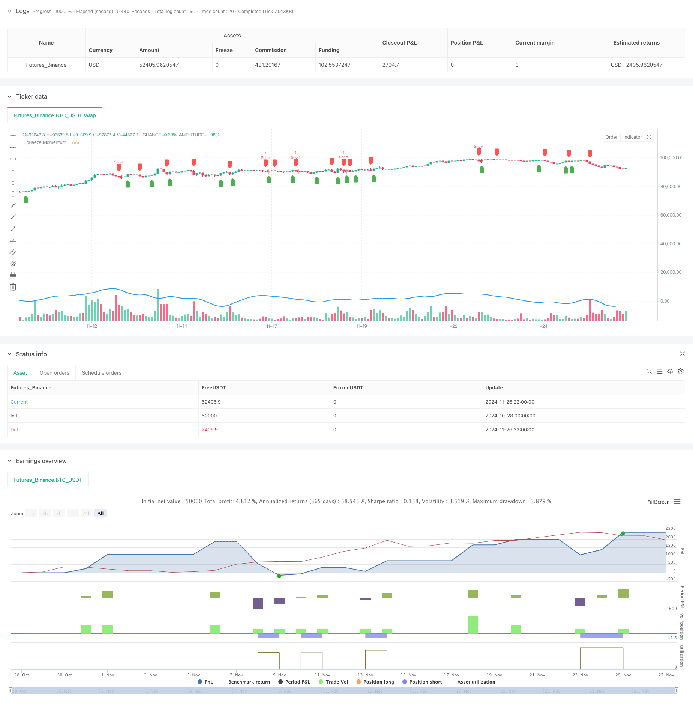

> Name

Dual-Momentum-Squeeze-Trading-System-SMIUBS-Indicator-Combination-Strategy
> Author

ChaoZhang

> Strategy Description



[trans]
#### Overview
This strategy is a short-term trading system that combines the Squeeze Momentum Indicator (SMI) and the Ultimate Buy/Sell (UBS) indicator. This strategy mainly captures shorting opportunities in the market by monitoring changes in price momentum and moving average crossover signals. The system has designed a stop-loss control mechanism based on percentage to protect the safety of funds while pursuing stable returns.
#### Strategy Principle
The core logic of the strategy is based on the cooperation of two main indicators:
1. Momentum Squeeze Index (SMI): By calculating the relationship between the closing price and the highest and lowest prices, combined with moving average smoothing, a momentum signal is generated. When the SMI turns from rising to falling, it indicates that the upward momentum has weakened and short selling opportunities may arise.
2. Ultimate Buying and Selling Indicator (UBS): Determines the timing of entry based on the intersection of price and its moving average. When the price crosses below the moving average, a short signal is confirmed.
3. The system automatically enters the market after confirming the short selling signal, and sets a profit target of 0.4% and a stop loss position of 2.5% to effectively control risks.
#### Strategic Advantages
1. Dual signal confirmation: Confirming the trading signal through the resonance of two independent indicators improves the reliability of the signal.
2. Perfect risk management: clear stop-profit and stop-loss conditions are set up to effectively control the risk of each transaction.
3. Adjustable parameters: Key parameters such as SMI length, smoothing period, UBS period, etc. can be optimized according to different market conditions.
4. High degree of automation: The strategy logic is clear and easy to implement automated transactions.
#### Strategy Risk
1. False breakthrough risk: Frequent false signals may appear in volatile markets.
2. Trend dependence: The strategy performs better in clearly trending markets, but may suffer frequent stop losses in sideways markets.
3. Parameter sensitivity: Different parameter settings may lead to large differences in strategy performance.
4. Impact of slippage: When the market fluctuates greatly, the actual transaction price may deviate greatly from the signal price.
#### Strategy optimization direction
1. Add market environment filtering: You can add volatility indicators or trend strength indicators to adjust strategy parameters under different market environments.
2. Optimize the stop loss mechanism: You can consider using dynamic stop loss, such as trailing stop loss or ATR-based stop loss.
3. Add trading time filtering: avoid high volatility periods and important news release times.
4. Introduce position management: dynamically adjust position size based on signal strength and market volatility.
#### Summary
This strategy builds a relatively complete short trading system by combining two technical indicators: momentum squeeze and ultimate buying and selling. The advantage of the strategy lies in high signal reliability and clear risk control, but it also has the characteristics of strong dependence on the market environment. By increasing market environment filtering and optimizing the stop-loss mechanism, the stability and profitability of the strategy are expected to be further improved. ||
#### Overview
This strategy is a short-term trading system that combines the Squeeze Momentum Indicator (SMI) and Ultimate Buy/Sell (UBS) indicator. The strategy primarily captures short-selling opportunities by monitoring momentum changes and moving average crossover signals. The system incorporates a percentage-based stop-loss mechanism to protect capital while pursuing stable returns.

#### Strategy Principles
The core logic is based on the combination of two main indicators:
1. Squeeze Momentum Indicator (SMI): Generates momentum signals by calculating the relationship between closing prices and high/low prices, smoothed with moving averages. When SMI turns from ascending to descending, it indicates weakening upward momentum and potential short opportunities.
2. Ultimate Buy/Sell Indicator (UBS): Determines entry timing based on price crossovers with moving averages. A short signal is confirmed when price crosses below the moving average.
3. The system automatically enters short positions upon signal confirmation, setting a 0.4% profit target and 2.5% stop-loss level for effective risk control.

#### Strategy Advantages
1. Dual Signal Confirmation: Enhances signal reliability through the resonance of two independent indicators.
2. Comprehensive Risk Management: Clear profit-taking and stop-loss conditions effectively control risk per trade.
3. Adjustable Parameters: Key parameters like SMI length, smoothing period, and UBS period can be optimized for different market conditions.
4. High Automation: Clear strategy logic facilitates automated trading implementation.

#### Strategy Risks
1. False Breakout Risk: Frequent false signals may occur in ranging markets.
2. Trend Dependency: Strategy performs better in trending markets but may face frequent stops in sideways markets.
3. Parameter Sensitivity: Different parameter settings can lead to significant performance variations.
4. Slippage Impact: Actual execution prices may deviate significantly from signal prices during high volatility.

#### Optimization Directions
1. Add Market Environment Filters: Incorporate volatility or trend strength indicators to adjust strategy parameters in different market conditions.
2. Optimize Stop-Loss Mechanism: Consider implementing dynamic stops, such as trailing stops or ATR-based stops.
3. Add Time Filters: Avoid high volatility periods and major news release times.
4. Implement Position Sizing: Dynamically adjust position size based on signal strength and market volatility.

#### Summary
The strategy constructs a relatively complete short-selling system by combining squeeze momentum and ultimate buy/sell technical indicators. Its strengths lie in high signal reliability and clear risk control, though it shows strong dependence on market conditions. Through improvements in market environment filtering and stop-loss optimization, the strategy's stability and profitability can be further enhanced.[/trans]


> Source (PineScript)

``` pinescript
/*backtest
start: 2024-10-28 00:00:00
end: 2024-11-27 00:00:00
period: 2h
basePeriod: 2h
exchanges: [{"eid":"Futures_Binance","currency":"BTC_USDT"}]
*/

// This Pine Script™ code is subject to the terms of the Mozilla Public License 2.0 at https://mozilla.org/MPL/2.0/
// © algostudio
// Code Generated using PineGPT - www.marketcalls.in

//@version=5
strategy("Squeeze Momentum and Ultimate Buy/Sell with Stop Loss", overlay=true, process_orders_on_close = false)

// Input settings
smiLength = input.int(20, title="SMI Length")
smiSmoothing = input.int(5, title="SMI Smoothing")
ultBuyLength = input.int(14, title="Ultimate Buy/Sell Length")
stopLossPerc = input.float(2.5, title="Stop Loss Percentage", step=0.1) / 100

// Define Squeeze Momentum logic
smi = ta.sma(close - ta.lowest(low, smiLength), smiSmoothing) - ta.sma(ta.highest(high, smiLength) - close, smiSmoothing)
squeezeMomentum = ta.sma(smi, smiSmoothing)
smiUp = squeezeMomentum > squeezeMomentum[1]
smiDown = squeezeMomentum < squeezeMomentum[1]

// Define Ultimate Buy/Sell Indicator logic (you can customize the conditions)
ultimateBuy = ta.crossover(close, ta.sma(close, ultBuyLength))
ultimateSell = ta.crossunder(close, ta.sma(close, ultBuyLength))


// Trading logic: Short entry (Squeeze Momentum from green to red and Ultimate Sell signal)
shortCondition = smiDown and ultimateSell
if (shortCondition)
    strategy.entry("Short", strategy.short)

//Set short target (exit when price decreases by 0.2%)
shortTarget = strategy.position_avg_price * 0.996

// Set stop loss for short (5% above the entry price)
shortStop = strategy.position_avg_price * (1 + stopLossPerc)

// Exit logic for short
if (strategy.position_size < 0)
    strategy.exit("Exit Short", "Short", limit=shortTarget, stop=shortStop)

// Plot the Squeeze Momentum for reference
plot(squeezeMomentum, color=color.blue, linewidth=2, title="Squeeze Momentum")

// Optional: Plot signals on the chart
plotshape(series=ultimateBuy, location=location.belowbar, color=color.green, style=shape.labelup, title="Ultimate Buy Signal")
plotshape(series=ultimateSell, location=location.abovebar, color=color.red, style=shape.labeldown, title="Ultimate Sell Signal")

// For more tutorials on Tradingview Pinescript visit https://www.marketcalls.in/category/tradingview

```

> Detail

https://www.fmz.com/strategy/473250

> Last Modified

2024-11-28 15:52:02
