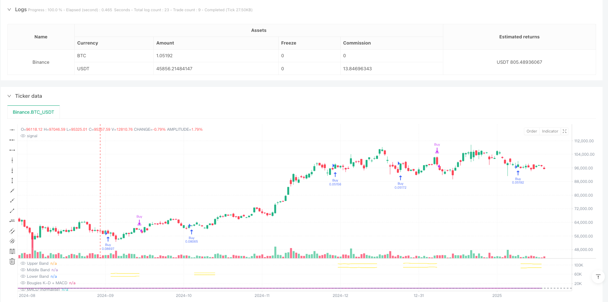
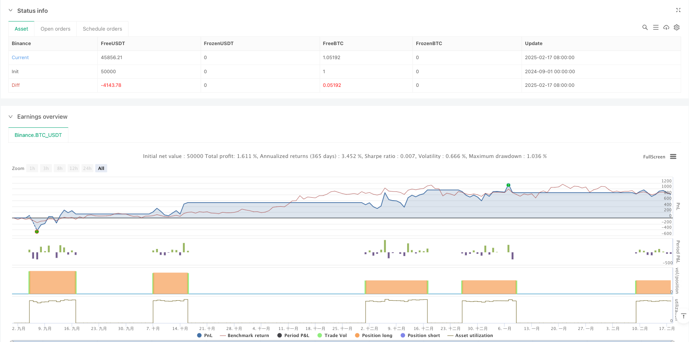

> Name

Dynamic-Adaptive-Multi-Indicator-Crossing-Strategy-with-SRSI-MACD-Smart-Risk-Control-System
> Author

ianzeng123

> Strategy Description





[trans]
#### Overview
This strategy is a dynamic trading system that combines the Stochastic Relative Strength Index (SRSI) and the Moving Average Convergence/Divergence Index (MACD). It dynamically adjusts the stop loss and take profit points through the ATR indicator to achieve intelligent risk management. The core of this strategy is to generate trading signals through the cross-confirmation of multiple technical indicators, and at the same time, combine market volatility for position management.
#### Strategy Principle
The operation of the strategy is based on the following core mechanisms:
1. Determine the market trend by calculating the difference between the K line and the D line in the SRSI indicator, and the difference between the K line and the normalized MACD.
2. The buying conditions must be met at the same time: the K-D difference is positive, the K-MACD difference is positive, and MACD is not in a downward trend.
3. The selling conditions must be met at the same time: the K-D difference is negative, the K-MACD difference is negative, and MACD is not in an upward trend.
4. Use ATR multiplied by the risk coefficient to dynamically calculate the stop loss and take profit distance, and adjust it adaptively according to market volatility.
#### Strategic Advantages
1. The multiple signal confirmation mechanism significantly improves the reliability of transactions and avoids false signals that may be caused by a single indicator.
2. Dynamic stop-loss and take-profit settings can be automatically adjusted according to market fluctuations, providing a better risk-benefit ratio.
3. The strategy has good adaptability and can maintain stable performance in different market environments.
4. The parameters are highly adjustable, allowing traders to optimize according to personal risk preferences.
#### Strategy Risk
1. In a volatile market, too many trading signals may be generated, leading to frequent entry and exit of the market.
2. The use of multiple indicators may cause signal lag and miss the best entry opportunity in a rapidly changing market.
3. ATR is calculated based on historical volatility and may not be able to adapt in time when market volatility changes suddenly.
4. The risk coefficient needs to be set appropriately. If it is too large or too small, it may affect the effect of the strategy.
#### Strategy optimization direction
1. Add a trend filter and use different signal confirmation standards in oscillating markets and trending markets.
2. Introduce trading volume indicators as auxiliary confirmation to improve the reliability of signals
3. Optimize the calculation method of stop loss and take profit, and consider combining support and resistance levels
4. Add market volatility prediction model and adjust risk parameters in advance
5. Consider signal confirmation on different time periods to increase the robustness of the strategy
#### Summary
This strategy builds a robust trading system by combining the advantages of SRSI and MACD. The dynamic risk management mechanism makes it highly adaptable, but it still requires traders to optimize parameters based on actual market conditions. The successful operation of the strategy requires an in-depth understanding of the market and reasonable position management combined with personal risk tolerance. ||
#### Overview
This strategy is a dynamic trading system that combines the Stochastic Relative Strength Index (SRSI) and Moving Average Convergence/Divergence (MACD). It implements intelligent risk management through dynamic stop-loss and take-profit levels adjusted by the Average True Range (ATR) indicator. The core of the strategy lies in generating trading signals through multiple technical indicator crossovers while managing positions based on market volatility.

#### Strategy Principles
The strategy operates based on the following core mechanisms:
1. Market trends are determined by calculating the difference between K-line and D-line of SRSI, as well as the difference between K-line and normalized MACD
2. Buy conditions require: positive K-D difference, positive K-MACD difference, and MACD not in downtrend
3. Sell conditions require: negative K-D difference, negative K-MACD difference, and MACD not in uptrend
4. Dynamic calculation of stop-loss and take-profit distances using ATR multiplied by a risk factor, adapting to market volatility

#### Strategy Advantages
1. Multiple signal confirmation mechanism significantly improves trading reliability, avoiding false signals from single indicators
2. Dynamic stop-loss and take-profit settings automatically adjust to market volatility, providing better risk-reward ratios
3. The strategy demonstrates good adaptability, maintaining stable performance across different market conditions
4. Strong parameter adjustability allows traders to optimize according to personal risk preferences

#### Strategy Risks
1. May generate excessive trading signals in ranging markets, leading to frequent market entries and exits
2. Multiple indicators might result in delayed signals, missing optimal entry points in rapidly changing markets
3. ATR calculations based on historical volatility may not adapt quickly to sudden market volatility changes
4. Requires appropriate risk factor settings, as both too high or too low values can affect strategy performance

#### Strategy Optimization Directions
1. Add trend filters to apply different signal confirmation standards in ranging and trending markets
2. Incorporate volume indicators as auxiliary confirmation to improve signal reliability
3. Optimize stop-loss and take-profit calculations, potentially incorporating support and resistance levels
4. Introduce market volatility prediction models for preemptive risk parameter adjustments
5. Consider signal confirmation across different timeframes to enhance strategy robustness

#### Summary
This strategy builds a robust trading system by combining the advantages of SRSI and MACD. Its dynamic risk management mechanism provides good adaptability, though traders still need to optimize parameters based on actual market conditions. Successful strategy implementation requires deep market understanding and appropriate position management aligned with individual risk tolerance.[/trans]


> Source (PineScript)

``` pinescript
/*backtest
start: 2024-09-01 00:00:00
end: 2025-02-18 08:00:00
period: 1d
basePeriod: 1d
exchanges: [{"eid":"Binance","currency":"BTC_USDT"}]
*/

//@version=6
strategy(title="SRSI + MACD Strategy with Dynamic Stop-Loss and Take-Profit", shorttitle="SRSI + MACD Strategy", overlay=false, default_qty_type=strategy.percent_of_equity, default_qty_value=10)

// User Inputs
smoothK = input.int(3, "K", minval=1) 
smoothD = input.int(3, "D", minval=1) 
lengthRSI = input.int(16, "RSI Length", minval=1) 
lengthStoch = input.int(16, "Stochastic Length", minval=1) 
src = input(close, title="RSI Source") 
enableStopLoss = input.bool(true, "Enable Stop-Loss")  
enableTakeProfit = input.bool(true, "Enable Take-Profit")  
riskFactor = input.float(2.5, "Risk Factor", minval=0.1, step=1)  

// Calculate K and D lines
rsi1 = ta.rsi(src, lengthRSI) 
k = ta.sma(ta.stoch(rsi1, rsi1, rsi1, lengthStoch), smoothK) 
d = ta.sma(k, smoothD) 
differenceKD = k - d 

// Calculate MACD and normalization
[macdLine, signalLine, _] = ta.macd(close, 12, 26, 9) 
lowestK = ta.lowest(k, lengthRSI) 
highestK = ta.highest(k, lengthRSI) 
normalizedMacd = (macdLine - ta.lowest(macdLine, lengthRSI)) / (ta.highest(macdLine, lengthRSI) - ta.lowest(macdLine, lengthRSI)) * (highestK - lowestK) + lowestK 
differenceKMacd = k - normalizedMacd 

// Sum both differences for a unique display
differenceTotal = (differenceKD + differenceKMacd) / 2

// Check if MACD is falling or rising
isMacdFalling = ta.falling(macdLine, 1)  
isMacdRising = ta.rising(macdLine, 1)  

// Check if K is falling or rising
isKFalling = ta.falling(k, 1)  
isKdRising = ta.rising(k, 1)  

// Calculate ATR and dynamic levels
atrValue = ta.atr(14)  
stopLossDistance = atrValue * riskFactor  
takeProfitDistance = atrValue * riskFactor  

// Variables for stop-loss and take-profit levels
var float longStopPrice = na
var float longTakeProfitPrice = na

// Buy and sell conditions with differenceKD added
buyCondition = ((differenceTotal > 0 or differenceKD > 0) and (isKdRising or isMacdRising) and k < 20 )  
sellCondition = ((differenceTotal <= 0 or differenceKD <= 0) and (isKFalling or isMacdFalling) and k > 80)  

// Execute strategy orders with conditional stop-loss and take-profit
if buyCondition and strategy.position_size == 0
    strategy.entry("Buy", strategy.long)

if strategy.position_size > 0
    longStopPrice := strategy.position_avg_price - stopLossDistance  
    longTakeProfitPrice := strategy.position_avg_price + takeProfitDistance  

    if enableStopLoss or enableTakeProfit
        strategy.exit("Sell/Exit", "Buy", stop=(enableStopLoss ? longStopPrice : na), limit=(enableTakeProfit ? longTakeProfitPrice : na))

if sellCondition
    strategy.close("Buy")  

// Hide lines when position is closed
stopLossToPlot = strategy.position_size > 0 ? longStopPrice : na
takeProfitToPlot = strategy.position_size > 0 ? longTakeProfitPrice : na

// Plot stop-loss and take-profit lines only when long positions are active
plot(enableStopLoss ? stopLossToPlot : na, title="Stop-Loss", color=color.yellow, linewidth=1, style=plot.style_linebr, offset=0, force_overlay=true) 
plot(enableTakeProfit ? takeProfitToPlot : na, title="Take-Profit", color=color.yellow, linewidth=1, style=plot.style_linebr, offset=0, force_overlay=true)

// Plot the MACD and candles

plot(normalizedMacd, "Normalized MACD", color=color.new(color.purple, 0), linewidth=1, display=display.all)

h0 = hline(80, "Upper Band", color=#787B86) 
hline(50, "Middle Band", color=color.new(#787B86, 50)) 
h1 = hline(20, "Lower Band", color=#787B86) 
fill(h0, h1, color=color.rgb(33, 150, 243, 90), title="Background")

// New candle based on the sum of differences
plotcandle(open=0, high=differenceTotal, low=0, close=differenceTotal, color=(differenceTotal > 0 ? color.new(color.green, 60) : color.new(color.red, 60)), title="K-D + MACD Candles")

```

> Detail

https://www.fmz.com/strategy/482816

> Last Modified

2025-02-27 17:44:09
