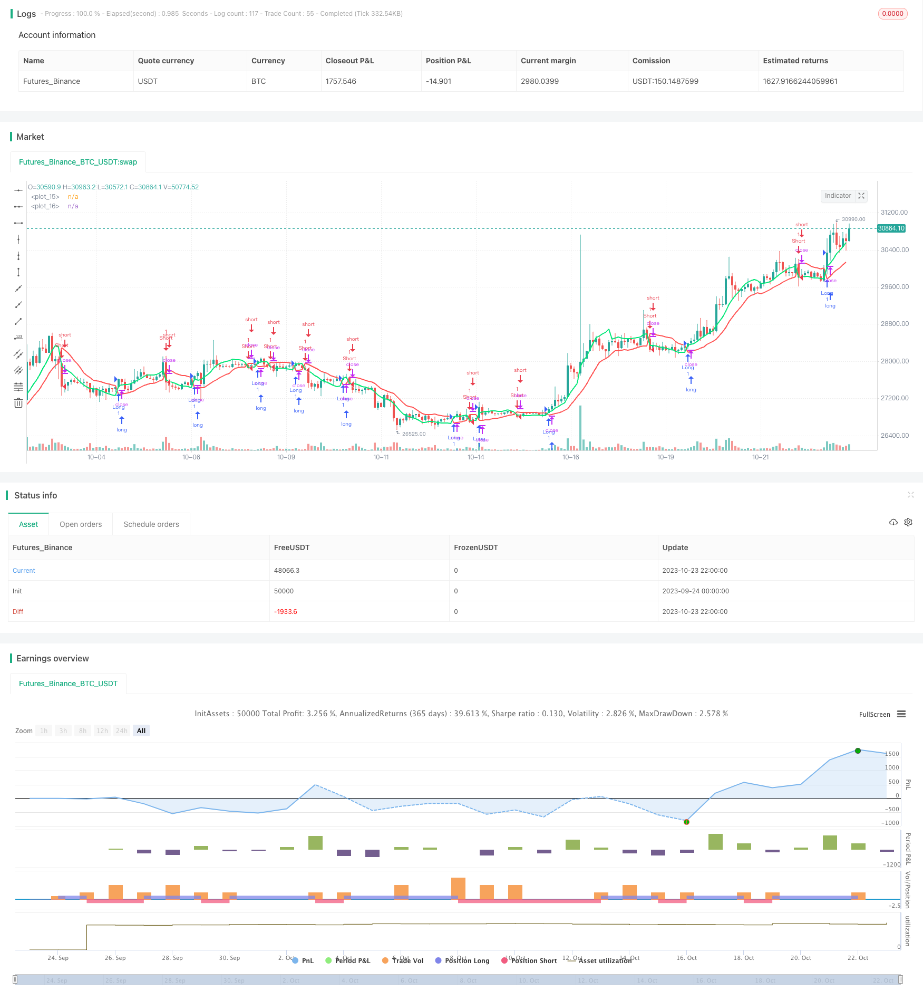

> Name

Ultra-Short-Term Momentum Breakout Trading Strategy SSL-Channel-Breakout-Strategy-with-Trailing-Stop-Loss
> Author

ChaoZhang

> Strategy Description



[trans]


## Overview
This strategy is based on the SSL channel indicator and combines breakout signals for ultra-short-term momentum trading. When the price breaks through the SSL upper track, go long; when the price breaks through the SSL lower track, go short. Set both trailing stop and trailing stop to control risk.
## Strategy Principle
1. Calculate the high price SMA and low price SMA of length N as the upper and lower rails of the SSL channel
2. When the closing price is greater than the upper track, a buy signal is set; when the closing price is less than the lower track, a sell signal is set.
3. After entering the market, set a fixed stop loss at the other end of the SSL channel to control risks.
4. Set a trailing stop after entering the market to lock in profits based on price fluctuations
5. When the price breaks through the trailing stop or fixed stop, close the position and leave the market
## Advantage Analysis
1. Determine the long and short directions based on channel indicators to avoid false breakthroughs
2. Combining two stop-loss methods can lock in profits and control risks.
3. High transaction frequency, suitable for ultra-short-term operations
4. Parameter settings are flexible and can be adjusted to your own trading style
5. Automatically identify long and short, no need to judge the direction
## Risk Analysis
1. Short-term operations are susceptible to emergencies and need to be wary of high volatility
2. The fixed stop loss is triggered after breaking through SSL, and the stop loss may be too large.
3. Improper setting of trailing stop may lead to premature exit.
4. Channel breakthroughs can easily form false signals and need to be filtered in combination with other indicators.
5. Only suitable for experienced short-term traders, not suitable for long-term investors
Solution:
1. Reasonably set a fixed stop loss ratio and control a single stop loss
2. Set a reasonable trailing stop loss to avoid leaving the market prematurely
3. Combine with filters such as volume and energy indicators to identify real trend breakthroughs
4. Manage funds well, open positions in batches, and control risk exposure
## Optimization direction
1. Optimize the SMA cycle parameters and adjust to the optimal length
2. Try other channel indicators, such as BB, KD, etc.
3. Increase the reliability of quantity and energy indicators to judge breakthroughs
4. Consider turnover rate and avoid false breakthroughs with low turnover rate
5. Test different holding times to find the best exit time
6. Test fixed and trailing stop settings
7. Adjust position management strategies and optimize capital utilization efficiency
## Summarize
This strategy integrates the SSL channel indicator to determine the trend direction, uses breakthroughs as signals to enter the market, and uses double stop loss to manage risks. The advantages are quick response, easy to grasp trends, and suitable for high-frequency trading. It is necessary to pay attention to prevent false breakthroughs, improve the stop loss mechanism, and control positions. It has the potential to become an effective strategy for ultra-short-term trading and deserves further testing and optimization.
|| 

## Overview

This strategy uses the SSL channel indicator to identify trend direction and trade breakouts with momentum. It goes long when price breaks above the SSL upper band and goes short when price breaks below the SSL lower band. Moving stop loss and trailing stop loss are used to control risks.

## Strategy Logic

1. Calculate upper and lower bands of SSL channel using SMA of high and low prices with N periods.

2. Generate long signal when close is above upper band, and short signal when close is below lower band.

3. Set fixed stop loss at the opposite band after entry, to limit losses.  

4. Set trailing stop loss that follows price movement, to lock in profits.

5. Exit when price hits either fixed stop loss or trailing stop loss.

## Advantages

1. Use channel indicator to determine trend direction, avoid false breakouts.

2. Dual stop loss combines profit taking and risk control.

3. High trading frequency fits ultra short-term trading. 

4. Flexible parameters adaptable to personal trading style.

5. Auto detect long/short, no directional judgement needed.

## Risks

1. Short-term trading prone to news shocks and high volatility.

2. Fixed stop loss may trigger oversized loss after breakout.

3. Improper trailing stop loss may lead to premature exit.

4. Channel breakouts susceptible to false signals.

5. Only suitable for experienced short-term traders.

Solutions:

1. Set reasonable fixed stop loss to limit loss per trade.

2. Optimize trailing stop loss levels to avoid early exit. 

3. Add volume filter to confirm true breakout. 

4. Manage position sizing, scale in to control risk exposure.

## Optimization

1. Optimize SMA periods to find best length.

2. Try other channel indicators like BB, KD etc.  

3. Add volume indicator to confirm breakout credibility.

4. Consider turnover rate to avoid low volume false breakout.

5. Test different holding periods to find optimal exit timing.

6. Test fixed and trailing stop loss parameters. 

7. Adjust position sizing strategy to maximize capital efficiency.

## Summary

This strategy combines SSL channel directional bias and breakout signals, with dual stop loss management. It reacts fast to capture trends, suitable for high frequency trading. Beware of false breakouts, refine stop loss mechanisms, and control position sizing. With further optimization, it has the potential to be an effective ultrashort-term trading strategy.

[/trans]

> Strategy Arguments


|Argument|Default|Description|
|----|----|----|
|v_input_1|10|Period|
|v_input_2|10|Length|
|v_input_3|10|Trailing Stop Size (in Points)|


> Source (PineScript)

``` pinescript
/*backtest
start: 2023-09-24 00:00:00
end: 2023-10-24 00:00:00
period: 2h
basePeriod: 15m
exchanges: [{"eid":"Futures_Binance","currency":"BTC_USDT"}]
*/

//@version=4
strategy("SSL Channel Cross with Trailing Stop and Stop Loss", overlay=true)

period = input(title="Period", defval=10)
len = input(title="Length", defval=10)
smaHigh = sma(high, len)
smaLow = sma(low, len)

Hlv = 0
Hlv := close > smaHigh ? 1 : close < smaLow ? -1 : Hlv[1]

sslDown = Hlv < 0 ? smaHigh : smaLow
sslUp = Hlv < 0 ? smaLow : smaHigh

plot(sslDown, linewidth=2, color=color.red)
plot(sslUp, linewidth=2, color=color.lime)

longCondition = crossover(sslUp, sslDown)
shortCondition = crossunder(sslUp, sslDown)

// Define el tamaño del trailing stop en puntos (ajusta según tu preferencia)
trailingStopSize = input(title="Trailing Stop Size (in Points)", defval=10)

var float trailingStopPrice = na
var float stopLossPrice = na

if (longCondition)
    // Si se cumple la condición de compra, configura la posición larga, el trailing stop y el stop loss
    strategy.entry("Long", strategy.long)
    trailingStopPrice := low - trailingStopSize
    stopLossPrice := sslDown

if (shortCondition)
    // Si se cumple la condición de venta corta, configura la posición corta, el trailing stop y el stop loss
    strategy.entry("Short", strategy.short)
    trailingStopPrice := high + trailingStopSize
    stopLossPrice := sslUp

// Calcula el trailing stop
if (strategy.position_size > 0)
    trailingStopPrice := max(trailingStopPrice, stopLossPrice)
    if (close < trailingStopPrice)
        strategy.close("ExitLong", comment="Trailing Stop Long")

if (strategy.position_size < 0)
    trailingStopPrice := min(trailingStopPrice, stopLossPrice)
    if (close > trailingStopPrice)
        strategy.close("ExitShort", comment="Trailing Stop Short")

```

> Detail

https://www.fmz.com/strategy/430171

> Last Modified

2023-10-25 17:40:37
