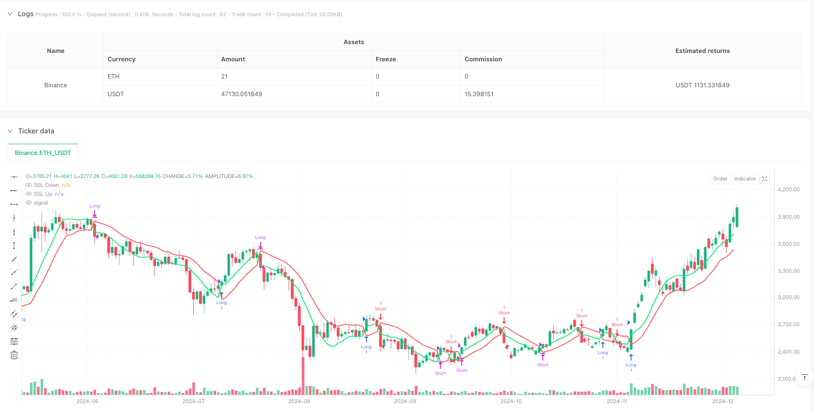
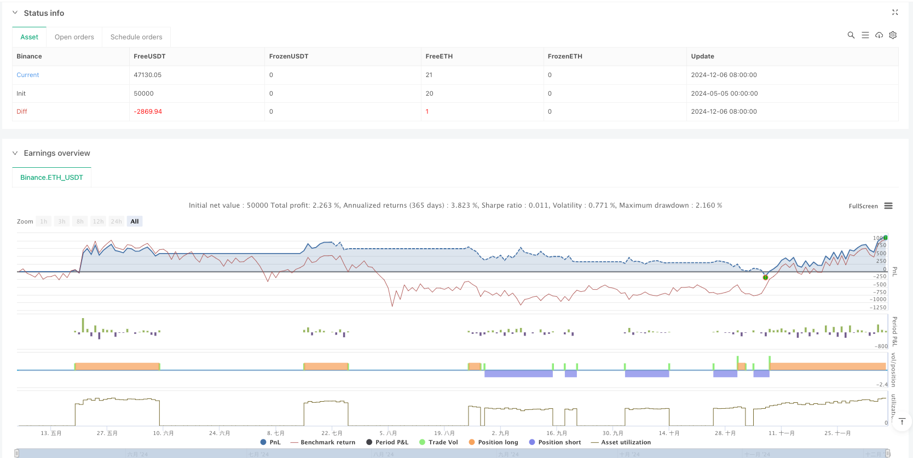

> Name

SSL Channel Dual-Tranche Profit-Strategy
> Author

ianzeng123

> Strategy Description





[trans]

### Overview
The SSL Channel Double Ladder Profit Strategy is a quantitative trading system based on the SSL Channel (Semantic SSL Channel) indicator. This strategy combines trend tracking with sophisticated position management methods. The core of this strategy is to determine the market trend direction through the crossing signal of the SSL channel, and enter the market when the trend reverses. Its unique feature is the use of a dual-step exit mechanism - dividing the position into two parts: the first part is exited when the fixed profit target is reached, and the second part is managed through a trailing stop loss to maximize the capture of trending markets. In addition, the strategy also integrates the average true volatility (ATR) indicator for dynamic risk management, making risk control more precise and adaptable to changes in market volatility.
### Strategy Principles
The technical principle of the SSL channel dual-ladder profit strategy mainly includes the following key components:
1. **SSL Channel Construction**: The strategy first calculates the simple moving average (SMA) of high prices and low prices, respectively, as the basis of the SSL channel. By setting the trend state variable Hlv (based on the relationship between the closing price and the high price SMA and low price SMA), the positions of the upward channel line and the downward channel line are determined.
2. **Trend identification mechanism**: When the closing price breaks through the high price SMA, the Hlv value is set to 1 (uptrend); when the closing price falls below the low price SMA, the Hlv value is set to -1 (downward trend). The strategy generates a buy signal when Hlv changes from -1 to 1 and a sell signal when Hlv changes from 1 to -1.
3. **Double ladder exit system**:
   - The first level (50% position): Set a fixed profit target of 1x ATR
   - The second level (remaining 50% position): After reaching the first level, the stop loss will be initially moved to the entry price (the breakeven level), and the trailing stop loss mechanism will be activated when the price reaches 2 times the ATR profit.
4. **Dynamic Risk Management**:
   - Set an initial stop loss of 1.5 times ATR when entering the market
   - After the first level of profit, the stop loss is moved to the capital preservation position.
   - After further price breakout, apply an ATR-based trailing stop (trail the high or low minus/plus 1x ATR)
5. **Trend Reversal Protection**: Regardless of whether the price reaches the stop loss or take profit condition, when the SSL channel reverses (that is, a signal in the opposite direction is generated), the strategy will immediately close the position to protect existing profits.
### Strategic Advantages
Through in-depth analysis of the code, this strategy shows many advantages:
1. **Trend Capturing Ability**: The strategy uses the SSL channel indicator to effectively identify the market trend turning point, and can capture the initial stage of the trend in a timely manner, and at the same time exit quickly when the trend reverses to avoid retracement.
2. **Risk diversification mechanism**: The dual-ladder exit design allows the strategy to strike a balance between conservatism and aggressiveness, which can not only lock in some profits, but also capture the continuity trend to the greatest extent.
3. **Dynamic adaptation to market fluctuations**: By integrating the ATR indicator, the strategy can automatically adjust the stop loss and take profit levels according to the actual market fluctuations, allowing it to maintain good performance in different volatility environments.
4. **Flexible Fund Management**: The phased management method of 50% of the position not only ensures stable income, but also creates conditions for maximizing potential profits, allowing the strategy to remain competitive in different market environments.
5. **Adaptive protection mechanism**: As the price moves in a favorable direction, the trailing stop loss system automatically increases the protection level to ensure that most of the profits can be retained when the market reverses.
6. **Clear entry and exit logic**: The signal system of the strategy is concise and clear, avoiding excessive optimization and complex parameter settings, and improving the reliability and stability of the strategy in the real trading environment.
### Strategy Risk
Although this strategy is well designed, it still has the following potential risks and limitations:
1. **Poor performance in volatile markets**: As a trend following strategy, frequent false signals may be generated in sideways volatile markets, resulting in continuous losing trades. Solution: Consider adding a range volatility indicator to filter signals, or suspend trading in volatile markets.
2. **Fixed ATR multiple risk**: The strategy uses fixed ATR multiples to set stop loss and take profit, which may not be flexible enough under extreme market conditions. Solution: Consider dynamically adjusting the ATR multiple based on historical volatility quantiles, or adding a volatility adaptation mechanism.
3. **Lack of market environment filtering**: The strategy does not differentiate between different market environments and may continue to trade at a stage that is not suitable for trend following. Solution: Introduce market environment classification indicators, such as ADX or volatility indicators, to reduce trading frequency in low trend intensity environments.
4. **The first step of premature exit risk**: The profit target of fixing 1 times ATR may prematurely exit 50% of the position in a strong trend, reducing overall returns. Solution: Consider dynamically adjusting the first-tier profit target based on trend strength.
5. **Lack of position size optimization**: There is no mechanism in the code to adjust position size according to risk, which may lead to uneven risk exposure. Solution: Introduce volatility-based position sizing calculations to ensure consistent risk exposure on each trade.
### Strategy optimization direction
Based on code analysis, the following are the optimization directions that this strategy can improve:
1. **Add market filter conditions**: Introduce ADX (Average Directional Index) or similar indicators to measure trend strength, only trade in market environments with obvious trends, and avoid false signals that shock the market. This significantly improves signal quality and overall win rate.
2. **Dynamic adjustment of ATR multiples**: Automatically adjust ATR multiples based on historical volatility levels, using larger multiples in low volatility environments and smaller multiples in high volatility environments to adapt to different market conditions.
3. **Optimize the exit mechanism of the first step**: Consider reducing the exit proportion of the first step after the strong trend is confirmed (such as the trend duration or intensity reaching a specific threshold), or setting a dynamic exit target instead of a fixed 50%.
4. **Add multi-time frame confirmation**: Integrate the trend direction of a longer time period as a filter condition to ensure that transactions are conducted in the main trend direction and improve the success rate.
5. **Introducing trading volume confirmation**: Use trading volume as an additional confirmation indicator. Only when trading volume increases will the trend change signal be confirmed to reduce false breakthroughs.
6. **Optimize the trailing stop loss mechanism**: The current trailing stop loss is based on the closing price. You can consider using more professional trailing stop loss systems such as Chandelier Exit or Parabolic SAR to improve the sensitivity and accuracy of the stop loss.
7. **Seasonality and time filtering**: Analyze the performance of strategies in different time periods and seasonal cycles, increase positions during the best historical performance periods, or only trade within specific time periods.
### Summarize
The SSL Channel Dual Ladder Profit Strategy is a comprehensive trading system that combines technical indicators and sophisticated position management. Its core advantage lies in its effective trend capturing ability and risk control mechanism, especially the design of the dual-step exit system, which achieves a good balance between protecting the safety of funds and maximizing trend returns.
By using the SSL channel indicator as a trend identification tool, combined with the ATR dynamic risk management system, the strategy can adapt to volatility changes under different market conditions. The dual-ladder exit design not only provides a stable profit locking mechanism, but also retains the possibility of capturing the general trend.
Although it may face challenges in a volatile market environment, this strategy has great room for improvement by introducing trend strength filtering, optimizing ATR parameter settings, and improving the trailing stop loss mechanism. In particular, the addition of multi-time frame confirmations and volume analysis can further improve signal quality and overall win rate.
Overall, the SSL channel dual-ladder profit strategy demonstrates the core elements of quantitative trading system design: clear entry and exit rules, systematic risk management and the ability to adapt to market changes. For traders looking for a trend following strategy, this strategy provides a solid foundational framework upon which it can be further customized and optimized based on personal risk appetite and trading objectives. ||
### Overview

The SSL Channel Dual-Tranche Profit Strategy is a quantitative trading system based on the SSL Channel (Semantic SSL Channel) indicator, combining trend following with sophisticated position management methods. The core of this strategy is to determine market trend direction through SSL channel crossover signals and enter trades when trends reverse. Its distinctive feature is the dual-tranche exit mechanism—dividing positions into two parts: the first part exits at a fixed profit target, while the second part is managed through a trailing stop to maximize capture of trending markets. Additionally, the strategy integrates the Average True Range (ATR) indicator for dynamic risk management, making risk control more precise and adaptable to changes in market volatility.

### Strategy Principles

The technical principles of the SSL Channel Dual-Tranche Profit Strategy include the following key components:

1. **SSL Channel Construction**: The strategy first calculates Simple Moving Averages (SMAs) of high and low prices, which serve as the foundation for the SSL channel. By setting a trend state variable Hlv (based on the relationship between closing price and high/low SMAs), it determines the positions of the upper and lower channel lines.

2. **Trend Identification Mechanism**: When the closing price breaks above the high price SMA, the Hlv value is set to 1 (uptrend); when the closing price falls below the low price SMA, the Hlv value is set to -1 (downtrend). The strategy generates a buy signal when Hlv changes from -1 to 1, and a sell signal when Hlv changes from 1 to -1.

3. **Dual-Tranche Exit System**:
   - First tranche (50% position): Sets a fixed profit target of 1x ATR
   - Second tranche (remaining 50%): After the first tranche is achieved, initially moves the stop-loss to entry price (breakeven), and activates a trailing stop mechanism when the price reaches 2x ATR profit

4. **Dynamic Risk Management**:
   - Sets initial stop-loss at 1.5x ATR at entry
   - Moves stop-loss to breakeven after first tranche profit
   - Implements ATR-based trailing stop (tracking highest/lowest points minus/plus 1x ATR) after further price breakout

5. **Trend Reversal Protection**: Regardless of whether price reaches stop-loss or take-profit conditions, when the SSL channel flips (generating an opposite signal), the strategy immediately closes positions to protect existing profits.

### Strategy Advantages

Through in-depth analysis of the code, this strategy demonstrates multiple advantages:

1. **Trend Capture Capability**: The strategy effectively identifies market trend turning points using the SSL Channel indicator, capturing the initial phase of trends in a timely manner while quickly exiting during trend reversals to avoid drawdowns.

2. **Risk Diversification Mechanism**: The dual-tranche exit design strikes a balance between conservative and aggressive approaches, both locking in partial profits and maximizing the capture of extended trends.

3. **Dynamic Adaptation to Market Volatility**: By integrating the ATR indicator, the strategy automatically adjusts stop-loss and take-profit levels according to actual market volatility, maintaining good performance in different volatility environments.

4. **Flexible Capital Management**: The 50% position stage management method both ensures stable returns and creates conditions for maximizing potential profits, enabling the strategy to remain competitive in different market environments.

5. **Adaptive Protection Mechanism**: As prices move favorably, the trailing stop system automatically elevates protection levels, ensuring that most gains are preserved when the market reverses.

6. **Clear Entry and Exit Logic**: The strategy's signal system is concise and straightforward, avoiding excessive optimization and complex parameter settings, enhancing the reliability and stability of the strategy in live trading environments.

### Strategy Risks

Despite its sophisticated design, the strategy still has the following potential risks and limitations:

1. **Poor Performance in Ranging Markets**: As a trend-following strategy, it may generate frequent false signals in sideways consolidating markets, leading to consecutive losing trades. Solution: Consider adding range-bound indicators to filter signals, or pause trading during consolidation phases.

2. **Fixed ATR Multiplier Risk**: The strategy uses fixed ATR multipliers for setting stop-losses and take-profits, which may not be flexible enough in extreme market conditions. Solution: Consider dynamically adjusting ATR multipliers based on historical volatility percentiles, or adding volatility adaptation mechanisms.

3. **Lack of Market Environment Filtering**: The strategy does not differentiate between different market environments, potentially continuing to trade during phases unsuitable for trend following. Solution: Introduce market environment classification indicators, such as ADX or volatility indicators, to reduce trading frequency in low trend-strength environments.

4. **Early Exit Risk for First Tranche**: The fixed 1x ATR profit target may exit 50% of the position too early in strong trends, reducing overall returns. Solution: Consider dynamically adjusting the first tranche profit target based on trend strength.

5. **Lack of Position Sizing Optimization**: The code lacks a mechanism to adjust position size based on risk, potentially leading to unbalanced risk exposure. Solution: Introduce volatility-based position size calculations to ensure consistent risk exposure for each trade.

### Strategy Optimization Directions

Based on code analysis, here are improvement directions for the strategy:

1. **Add Market Filtering Conditions**: Introduce ADX (Average Directional Index) or similar indicators to measure trend strength, trading only in obvious trending market environments to avoid false signals in ranging markets. This can significantly improve signal quality and overall win rate.

2. **Dynamic Adjustment of ATR Multipliers**: Automatically adjust ATR multipliers based on historical volatility levels, using larger multipliers in low-volatility environments and smaller multipliers in high-volatility environments to adapt to different market conditions.

3. **Optimize First Tranche Exit Mechanism**: Consider reducing the exit proportion of the first tranche after strong trend confirmation (such as when trend duration or strength reaches specific thresholds), or setting dynamic exit targets rather than a fixed 50%.

4. **Incorporate Multi-Timeframe Confirmation**: Integrate trend direction from longer timeframes as filtering conditions to ensure trading in the direction of the main trend, improving success rates.

5. **Introduce Volume Confirmation**: Use volume as an additional confirmation indicator, only confirming trend change signals when volume increases, reducing false breakouts.

6. **Optimize Trailing Stop Mechanism**: The current trailing stop is based on closing prices; consider using more professional trailing stop systems such as Chandelier Exit or Parabolic SAR to improve the sensitivity and precision of stops.

7. **Seasonality and Time Filtering**: Analyze strategy performance across different time periods and seasonal cycles, increasing position size during historically best-performing periods, or only trading during specific time periods.

### Summary

The SSL Channel Dual-Tranche Profit Strategy is a comprehensive trading system combining technical indicators with sophisticated position management. Its core strengths lie in effective trend capture capability and risk control mechanisms, particularly the dual-tranche exit system design, which achieves a good balance between protecting capital safety and maximizing trend returns.

By using the SSL Channel indicator as a trend identification tool, combined with an ATR dynamic risk management system, the strategy can adapt to volatility changes under different market conditions. The dual-tranche exit design not only provides a stable profit-locking mechanism but also retains the possibility of capturing major trends.

Although it may face challenges in ranging market environments, there is significant room for improvement through introducing trend strength filtering, optimizing ATR parameter settings, and improving trailing stop mechanisms. Particularly, adding multi-timeframe confirmation and volume analysis can further enhance signal quality and overall win rate.

Overall, the SSL Channel Dual-Tranche Profit Strategy demonstrates the core elements of quantitative trading system design: clear entry and exit rules, systematic risk management, and the ability to adapt to market changes. For traders seeking trend-following strategies, this strategy provides a solid foundational framework upon which further customization and optimization can be built according to individual risk preferences and trading objectives.[/trans]


> Source (PineScript)

``` pinescript
/*backtest
start: 2024-05-05 00:00:00
end: 2024-12-07 00:00:00
period: 1d
basePeriod: 1d
exchanges: [{"eid":"Binance","currency":"ETH_USDT"}]
*/

// This Pine Script™ code is subject to the terms of the Mozilla Public License 2.0 at https://mozilla.org/MPL/2.0/
// © AlanCaoShengJin

//@version=5
strategy("SSL Channel Strategy with Two-Tranche Exits", overlay=true)

// Inputs
len = input.int(10, title="Period")
atrPeriod = input.int(14, title="ATR Period")

// Calculate SMAs and ATR
smaHigh = ta.sma(high, len)
smaLow = ta.sma(low, len)
atrValue = ta.atr(atrPeriod)

// Trend state (Hlv)
var int Hlv = na
Hlv := close > smaHigh ? 1 : close < smaLow ? -1 : Hlv[1]

// SSL channel lines
sslDown = Hlv < 0 ? smaHigh : smaLow
sslUp   = Hlv < 0 ? smaLow : smaHigh

// Plot SSL lines
plot(sslDown, title="SSL Down", color=color.red, linewidth=2)
plot(sslUp, title="SSL Up", color=color.lime, linewidth=2)

// Trading signals
buySignal = Hlv[1] == -1 and Hlv == 1
sellSignal = Hlv[1] == 1 and Hlv == -1

// Plot signals for debugging
plotshape(buySignal, title="Buy Signal", style=shape.triangleup, location=location.belowbar, color=color.green, size=size.small)
plotshape(sellSignal, title="Sell Signal", style=shape.triangledown, location=location.abovebar, color=color.red, size=size.small)

// Variables for long trade management
var float longEntryPrice = na
var float longAtrAtEntry = na
var float longEntryQty = na
var bool longFirstTrancheTaken = false
var float longTrailingStopPrice = na
var int longTrailingStartBar = na

// Variables for short trade management
var float shortEntryPrice = na
var float shortAtrAtEntry = na
var float shortEntryQty = na
var bool shortFirstTrancheTaken = false
var float shortTrailingStopPrice = na
var int shortTrailingStartBar = na

// Reset variables when no position is open
if strategy.position_size == 0
    longEntryPrice := na
    longAtrAtEntry := na
    longEntryQty := na
    longFirstTrancheTaken := false
    longTrailingStopPrice := na
    longTrailingStartBar := na
    shortEntryPrice := na
    shortAtrAtEntry := na
    shortEntryQty := na
    shortFirstTrancheTaken := false
    shortTrailingStopPrice := na
    shortTrailingStartBar := na

// **Long Trade Logic**

// Entry for long trades
if buySignal and strategy.position_size == 0
    strategy.entry("Long", strategy.long)
    longEntryPrice := close
    longAtrAtEntry := atrValue
    longEntryQty := strategy.position_size
    longFirstTrancheTaken := false
    longTrailingStartBar := na
    // Set take-profit for first tranche (50%) at 1x ATR
    strategy.exit("Long TP1", "Long", limit=longEntryPrice + longAtrAtEntry, qty=longEntryQty / 2)
    // Set initial stop-loss at 1.5x ATR below entry
    strategy.exit("Long SL", "Long", stop=longEntryPrice - 1.5 * longAtrAtEntry)

// Manage long trade
if strategy.position_size > 0
    // Detect if first tranche has been taken
    if not longFirstTrancheTaken and strategy.position_size < longEntryQty
        longFirstTrancheTaken := true
        // Move stop-loss to breakeven
        strategy.exit("Long SL", "Long", stop=longEntryPrice)
        // Add a label for debugging
        label.new(bar_index, high, "First Tranche Taken", color=color.blue, style=label.style_label_down)
    
    // After first tranche, manage the remaining 50%
    if longFirstTrancheTaken
        // Initiate trailing stop at 2x ATR
        if close >= longEntryPrice + 2 * longAtrAtEntry and na(longTrailingStartBar)
            longTrailingStartBar := bar_index
            // Add a label for debugging
            label.new(bar_index, high, "Trailing Stop Initiated", color=color.purple, style=label.style_label_down)
        // Update trailing stop
        if not na(longTrailingStartBar)
            highestCloseSinceTrail = ta.highest(close, bar_index - longTrailingStartBar + 1)
            longTrailingStopPrice := highestCloseSinceTrail - longAtrAtEntry
            strategy.exit("Long SL", "Long", stop=longTrailingStopPrice)
            

// Exit long trade on SSL channel flip
if strategy.position_size > 0 and sellSignal
    strategy.close("Long", comment="SSL Flip")

// **Short Trade Logic**

// Entry for short trades
if sellSignal and strategy.position_size == 0
    strategy.entry("Short", strategy.short)
    shortEntryPrice := close
    shortAtrAtEntry := atrValue
    shortEntryQty := strategy.position_size
    shortFirstTrancheTaken := false
    shortTrailingStartBar := na
    // Set take-profit for first tranche (50%) at 1x ATR below entry
    strategy.exit("Short TP1", "Short", limit=shortEntryPrice - shortAtrAtEntry, qty=math.abs(shortEntryQty) / 2)
    // Set initial stop-loss at 1.5x ATR above entry
    strategy.exit("Short SL", "Short", stop=shortEntryPrice + 1.5 * shortAtrAtEntry)

// Manage short trade
if strategy.position_size < 0
    // Detect if first tranche has been taken
    if not shortFirstTrancheTaken and strategy.position_size > shortEntryQty
        shortFirstTrancheTaken := true
        // Move stop-loss to breakeven
        strategy.exit("Short SL", "Short", stop=shortEntryPrice)
        // Add a label for debugging
        label.new(bar_index, low, "First Tranche Taken", color=color.blue, style=label.style_label_up)
    
    // After first tranche, manage the remaining 50%
    if shortFirstTrancheTaken
        // Initiate trailing stop at 2x ATR
        if close <= shortEntryPrice - 2 * shortAtrAtEntry and na(shortTrailingStartBar)
            shortTrailingStartBar := bar_index
            // Add a label for debugging
            label.new(bar_index, low, "Trailing Stop Initiated", color=color.purple, style=label.style_label_up)
        // Update trailing stop
        if not na(shortTrailingStartBar)
            lowestCloseSinceTrail = ta.lowest(close, bar_index - shortTrailingStartBar + 1)
            shortTrailingStopPrice := lowestCloseSinceTrail + shortAtrAtEntry
            strategy.exit("Short SL", "Short", stop=shortTrailingStopPrice)
        

// Exit short trade on SSL channel flip
if strategy.position_size < 0 and buySignal
    strategy.close("Short", comment="SSL Flip")
```

> Detail

https://www.fmz.com/strategy/483937

> Last Modified

2025-04-03 15:25:40
