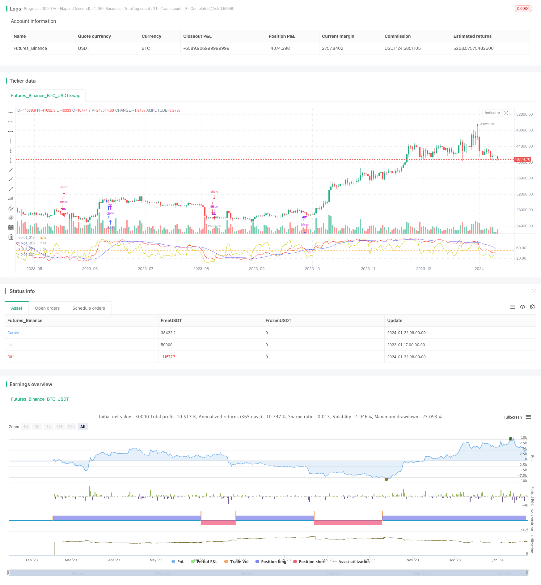

> Name

The application of profit capturing strategy in trend reversal market Scalping-Strategy-in-Trend-Reversal-Market
> Author

ChaoZhang

> Strategy Description


 [trans]

## Overview
This strategy aims to identify the low buying point after the long-term trend situation has been adjusted through short-term shocks, in order to capture the beginning of a new trend market. It integrates multiple technical indicators to determine key support areas and achieve risk-controllable entry.
## Strategy Principle
1. First, determine the long-term trend situation. The strategy uses the KD indicator to determine the long-term and short-term trend vector situation. When the long-term KD indicator remains above 50 for multiple consecutive cycles, it indicates a bullish market, which creates conditions for the strategy to determine the background of the large-scale market.
2. Secondly, identify the characteristics of short-term adjustment shocks. This strategy uses the RSI indicator to determine the depth of short-term corrections. When the RSI indicator continuously hits lower bottoms, it means accumulation and washout are underway. Combined with the KD indicator, you can judge whether the short-term shock is coming to an end.
3. Furthermore, determine the support area. The strategy identifies a recovery in the RSI indicator after a lower level, indicating the formation of a support area. The rebound of the KD indicator also verifies this point. These factors combined indicate that the time for reversal is ripe for intervention.
4. Finally, identify the reversal signal and complete the entry. When the above indicators meet the conditions, a long signal will be generated, prompting you to intervene in long positions. This is the best entry point for the trend to start.
## Advantage Analysis
The biggest advantage of this strategy is that it makes full use of short-term adjustment shocks to select the time point for reversal entry very accurately, the support strength is verified, and the risk is controllable. This provides huge reward potential on subsequent trending moves.
Secondly, the indicator parameters are set appropriately to avoid excessive noise trading. Only look for high-confidence support areas within the framework of large-scale markets to intervene, which greatly reduces the probability of wrong transactions.
## Risk Analysis
The main risk faced by this strategy is biased judgment of long-term trends. When the market is consolidating and diverging, the strategy will produce wrong signals. In addition, short-term support may fall below again, and it is necessary to stop losses and exit in time.
In order to reduce risks, it is first necessary to adjust parameters according to the background of large-scale markets and reduce the sensitivity of long signals. Secondly, you can set a stop loss line and exit quickly when the support is broken. Finally, if there are consecutive false signals, the strategy should be paused and the market situation re-evaluated.
## Optimization direction
There is room for further optimization of this strategy:
1. Increase the judgment of trading volume indicators to ensure the strength of support
2. Set a retracement stop loss to protect the profit of the strategy
3. Add breakthrough filtering to avoid being trapped by the trailing stop loss after the support breaks down.
4. Combine more indicators for comprehensive judgment to improve strategy stability
## Summarize
This profit capture strategy successfully takes advantage of the characteristics of short-term adjustment shocks, identifies reversal signals under the guidance of the large-scale market background, and enters the market based on the principle of buying low and selling high. By optimizing parameter settings and stop loss methods, trading risks can be reduced. This is a reliable, stable and efficient quantitative strategy.
||

## Overview

This strategy aims to identify low buying points after long-term trend adjustments through short-term fluctuations, in order to capture the start of new trend markets. It integrates multiple technical indicators to determine key support areas and achieve risk-controlled entry.

## Strategy Principle  

1. First, determine the long-term trend situation. The strategy adopts KD indicator to judge long and short term trend conditions. When the long-term KD indicator maintains above 50 for consecutive periods, it means a bullish market, which creates conditions for the strategy to determine the macro background.

2. Secondly, identify the characteristics of short-term adjustment fluctuations. This strategy uses the RSI indicator to determine the depth of short-term adjustments. When the RSI indicator creates relatively low troughs in succession, it means accumulation and wash plates are in progress. Combined with the KD indicator, we can judge whether the short-term fluctuation is nearing its end.

3. Furthermore, determine the support area. The strategy will identify the rise of the RSI indicator from lower levels, indicating the formation of support areas. The rise of the KD indicator also verifies this point. These factors together indicate that the timing for reversal is ripe for intervention.  

4. Finally, identify the reversal signal to complete the entry. When the above indicators meet the conditions, a buy signal will be generated, indicating that long intervention can be made. This is the best entry point as the trend begins.

## Advantage Analysis 

The biggest advantage of this strategy is that by fully utilizing the timing of reverse entry during short-term adjustment fluctuations, the support strength is verified, thus the risk is controllable. This provides huge return potential for the subsequent trend market.

Secondly, the parameter settings of indicators are appropriate to avoid excessive noisy trades. Only high-confidence support areas are sought under the macro market framework for involvement, which greatly reduces the probability of wrong trades.  

## Risk Analysis

The main risk faced by this strategy is that errors occur in judging long-term trends. When in consolidation and differentiation markets, the strategy will generate wrong signals. In addition, short-term support may break down again, requiring timely stop losses.

To reduce risks, parameters should first be adjusted according to the macro market background to reduce the sensitivity of long signals. Secondly, stop loss lines can be set to exit quickly when supports break down. Finally, if consecutive wrong signals occur, the strategy should be suspended and market conditions reevaluated.

## Optimization Directions

There is still room for further optimization of this strategy:

1. Add volume indicators to ensure support strength  

2. Set pullback stop loss to protect strategy profit  

3. Increase breakthrough filters to avoid tracing stop losses after support breakdowns

4. Integrate more indicators for comprehensive judgment to enhance strategy stability

## Conclusion  

This profit capturing strategy successfully utilizes the characteristics of short-term adjustment fluctuations under the guidance of macro backgrounds to identify reversal signals and enter the market according to the principle of buying low and selling high. By optimizing parameter settings and stop loss means, trading risks can be reduced. This is a reliable, stable and efficient quantitative strategy.

[/trans]

> Strategy Arguments


|Argument|Default|Description|
|----|----|----|
|v_input_1_hl2|0|Source: hl2|high|low|open|close|hlc3|hlcc4|ohlc4|
|v_input_2|5|short term trend|
|v_input_3|60|long term trend|
|v_input_4|13|smooth long term trend|
|v_input_5|15|clear short term pullback appears recently|
|v_input_6|35|threshold of short term pullback clear|
|v_input_7|50|threshold of short term pullback end|
|v_input_8|false|x_exit_if_reason_over|


> Source (PineScript)

``` pinescript
/*backtest
start: 2023-01-17 00:00:00
end: 2024-01-23 00:00:00
period: 1d
basePeriod: 1h
exchanges: [{"eid":"Futures_Binance","currency":"BTC_USDT"}]
*/

//@version=4
strategy("scalping against trapped countertrend", overlay=false , precision=5 )

x_src = input( hl2 , title="Source" )
x_len_a = input( 5 , title="short term trend" , minval=1 )
x_len_b = input( 60 , title="long term trend" , minval=1 )
x_k_b = input( 13 , title="smooth long term trend" , minval=1 )
x_changk = input( 15 , title="clear short term pullback appears recently" , minval=1 )
x_rsi_ct = input( 35.0 , title="threshold of short term pullback clear" , minval=0.0 , maxval=100.0 )
x_rsi_ft = input( 50.0 , title="threshold of short term pullback end" , minval=0.0 , maxval=100.0 )
x_exit_if_reason_over = input(false)

y_stoch = stoch( x_src , high , low , x_len_b )
y_k = sma( y_stoch , x_k_b )
y_rsi = rsi( x_src , x_len_a )

y_upper = min( y_k-50 , y_rsi-x_rsi_ft , x_changk>1?x_rsi_ct-lowest(y_rsi,x_changk):50 )
if ( y_upper>0 )
    strategy.entry("LE", strategy.long)
else if ( x_exit_if_reason_over and strategy.position_size>0 )
    strategy.close("LE", comment="x" )
y_lower = max( y_k-50 , y_rsi-x_rsi_ft , x_changk>1?100-x_rsi_ct-highest(y_rsi,x_changk):-50 )
if ( y_lower<0 )
    strategy.entry("SE", strategy.short)
else if ( x_exit_if_reason_over and strategy.position_size<0 )
    strategy.close("SE", comment="x" )

plot( y_stoch , color=#ff3333 )
plot( y_k , color=#6666ff )
plot( y_rsi , color=#cccc00 )
hline(50)
```

> Detail

https://www.fmz.com/strategy/439901

> Last Modified

2024-01-24 17:43:50
