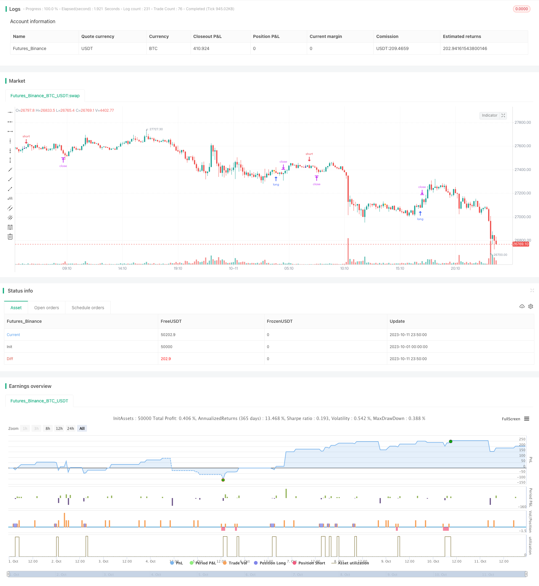

> Name

Shadow-Trading-Strategy
> Author

ChaoZhang

> Strategy Description



[trans]

## Overview
The shadow trading strategy identifies the K-line with a long lower shadow or a long upper shadow on the K-line to determine when the market may reverse. When a long lower shadow is identified, go long; when a long upper shadow is identified, go short. This strategy mainly uses the universal law of long shadow line reversal to conduct transactions.
## Strategy Principle
The core logic of the shadow trading strategy is to identify the long upper shadow line and long lower shadow line that appear in the K line. The strategy calculates the K-line entity size `corpo` and shadow line sizes `pinnaL`, `pinnaS`. When the shadow line size is greater than a certain multiple of the entity size, it is considered that a reversal opportunity may occur. Specifically, the strategy includes the following steps:
1. Calculate the K-line entity size `corpo`, that is, the absolute value of the difference between the opening price and the closing price.
2. Calculate the upper shadow line `pinnaL`, which is the absolute value of the difference between the highest price and the closing price.
3. Calculate the lower shadow `pinnaS`, which is the absolute value of the difference between the lowest price and the closing price. 
4. To determine whether the upper shadow line is greater than a certain multiple of the entity, pass `pinnaL > (corpo*size)`, `size` is an adjustable parameter.
5. To determine whether the lower shadow is greater than a certain multiple of the entity, pass `pinnaS > (corpo*size)`.
6. If the above conditions are true, when the K line where the shadow line appears closes, go short (long upper shadow line) or long (long lower shadow line).
In addition, the strategy also determines whether the K-line fluctuation size `dim` is greater than the minimum value `min` to filter out boring K-lines with too small fluctuations. After entering the market, set a stop loss and a take profit to exit.
## Strategic advantage analysis
- Utilizing the general rule of shadow line reversal is a more reliable trading signal
- The strategy logic is simple and clear, and the parameter settings are intuitive and easy to master.
- The frequency of entry can be controlled by adjusting parameters to flexibly control trading risks
- Further optimization can be achieved by combining factors such as trends, support and resistance, etc.
## Risks and Solutions
- If the long shadow line fails to reverse, there is a probability of failure to reverse. The risk can be reduced by adjusting parameters.
- Need to be combined with trend judgment to avoid counter-trend operations
- The parameters of specific varieties need to be optimized, and the parameters of different varieties may be different.
- Can be combined with other indicators to filter entry opportunities and reduce the profit rate in exchange for an increase in winning rate
## Strategy optimization direction
- Optimize the parameters of different varieties to improve the stability of the strategy
- Use indicators such as moving averages to determine trends and avoid counter-trend operations
- Increase the judgment of breaking through previous highs or lows and improve the effectiveness of the strategy
- Optimize and adjust stop-loss and stop-profit positions to minimize the risk of loss while maintaining profitability.
- Optimize position control, different positions can be set for different varieties
## Summarize
Shadow trading strategy is a relatively simple and practical short-term trading strategy. It uses the universal law of long shadow line reversal to generate trading signals. This strategy has simple logic, is easy to implement, and can be adjusted and optimized according to variety differences. At the same time, shadow trading strategies also have certain risks, and they need to be filtered based on trends and other factors to reduce the probability of wrong transactions. If used properly, shadow trading strategies can become an effective part of the quantitative trading system.
||

## Overview

The shadow trading strategy identifies K-line with long lower or upper shadows to determine potential market reversal opportunities. It goes long when a long lower shadow is identified and goes short when a long upper shadow is identified. The strategy mainly utilizes the general principle of shadow reversal for trading.

## Strategy Logic

The core logic of the shadow trading strategy is to identify long upper and lower shadows in K-lines. The strategy calculates the size of the K-line body `corpo` and the size of the shadows `pinnaL` and `pinnaS`. When the size of the shadow is larger than the body size by a certain multiplier, it considers there may be reversal opportunities. Specifically, the strategy includes the following steps:

1. Calculate K-line body size `corpo`, which is the absolute value of the difference between open and close price.
2. Calculate upper shadow `pinnaL`, which is the absolute value of the difference between highest price and close price.
3. Calculate lower shadow `pinnaS`, which is the absolute value of the difference between lowest price and close price.
4. Check if upper shadow is larger than body size by a multiplier, through `pinnaL > (corpo*size)`, where `size` is an adjustable parameter.  
5. Check if lower shadow is larger than body size by a multiplier, through `pinnaS > (corpo*size)`.
6. If above conditions are met, go short (long upper shadow) or long (long lower shadow) at the close of the K-line with shadow.

In addition, the strategy also checks if the K-line range `dim` is greater than the minimum value `min` to filter out trivial K-lines with negligible range. Stop loss and take profit are used for exit.

## Advantage Analysis 

- Utilizes the general principle of shadow reversal, which is a relatively reliable trading signal
- Simple and clear strategy logic, intuitive parameter settings, easy to grasp
- Flexible risk control by adjusting parameters to change entry frequency
- Can be further optimized by combining trend, support/resistance etc.

## Risks and Solutions

- Probability of failure in shadow reversal exists, can lower risk by adjusting parameters
- Needs combination with trend judgment to avoid counter trend trades  
- Parameters need optimization for different products, may vary across products
- Can combine other indicators to filter entries, lower win rate for higher profitability

## Optimization Directions

- Optimize parameters by product to improve stability
- Add trend judgment with moving averages etc. to avoid counter trend
- Add checks on breaking recent high/low points to improve efficacy 
- Optimize stop loss and take profit to maximize profit while minimizing loss
- Optimize position sizing, can vary across different products

## Conclusion

The shadow trading strategy is a simple and practical short-term trading strategy. It generates trading signals using the general principle of shadow reversals. The strategy logic is simple and easy to implement, and can be adjusted and optimized according to product differences. At the same time, shadow trading also carries certain risks. It needs to be combined with trend and other factors for filtration to reduce false trades. When used properly, shadow trading can become an effective component in a quant trading system.

[/trans]

> Strategy Arguments


|Argument|Default|Description|
|----|----|----|
|v_input_1|true|size|
|v_input_2|0.0018|Tail Tollerance|
|v_input_3|0.001|min|
|v_input_4|false|offset|
|v_input_5|true|monthBegin|
|v_input_6|2013|yearBegin|
|v_input_7|20|Target|
|v_input_8|70|Stop|
|v_input_9|false|Trailing|


> Source (PineScript)

``` pinescript
/*backtest
start: 2023-10-01 00:00:00
end: 2023-10-11 23:59:59
period: 10m
basePeriod: 1m
exchanges: [{"eid":"Futures_Binance","currency":"BTC_USDT"}]
*/

//@version=2
strategy("Shadow Trading", overlay=true)

size = input(1,type=float)
pinnaL = abs(high - close) 
pinnaS = abs(low-close)
scarto = input(title="Tail Tollerance", type=float, defval=0.0018)
corpo = abs(close - open)
dim = abs(high-low)
min = input(0.001)
shortE = (open + dim)

longE = (open - dim)
barcolor(dim > min and (close > open) and (pinnaL > (corpo*size)) and (open-low<scarto) ? navy : na)

longcond = (dim > min) and (close > open) and (pinnaL > (corpo*size)) and (open-low<scarto)
minimo=low+scarto
massimo=high+scarto
barcolor( dim > min and(close < open) and (pinnaS > (corpo*size)) and (high-open<scarto) ? orange: na)
shortcond = (dim > min) and(close < open) and (pinnaS > (corpo*size)) and (high-open<scarto)
//plot(shortE)
//plot(longE)
//plot(open)
ss= shortcond ? close : na
ll=longcond ? close : na
offset= input(0.00000)

DayClose = 2
closup = barssince(change(strategy.opentrades)>0)  >= DayClose 

longCondition = (close > open) and (pinnaL > (corpo*size)) and (open-low<scarto) 

crossFlag = longcond ? 1 : 0
monthBegin = input(1,maxval = 12)
yearBegin = input(2013, maxval= 2015, minval=2000)

if(month(time)>monthBegin and year(time) >yearBegin)
    if (longcond)
        strategy.entry("short", strategy.short, stop = low - offset)   
//strategy.close("short", when = closup)
shortCondition = (close < open) and (pinnaS > (corpo*size)) and (high-open<scarto)
if(month(time)>monthBegin and year(time) >yearBegin)
    if (shortcond)
        strategy.entry("long", strategy.long, stop = high + offset)
//strategy.close("long", when = closup)

Target =  input(20) 
Stop = input(70) //- 2
Trailing = input(0) 
CQ = 100

TPP = (Target > 0) ? Target*10: na
SLP = (Stop > 0) ? Stop*10 : na
TSP = (Trailing > 0) ? Trailing : na

strategy.exit("Close Long", "long", qty_percent=CQ, profit=TPP, loss=SLP, trail_points=TSP)
strategy.exit("Close Short", "short", qty_percent=CQ, profit=TPP, loss=SLP, trail_points=TSP)
```

> Detail

https://www.fmz.com/strategy/430994

> Last Modified

2023-11-03 16:03:59
