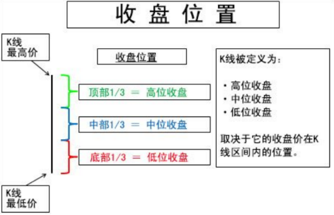
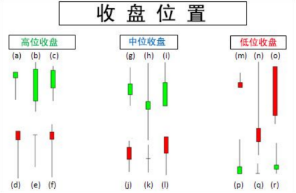
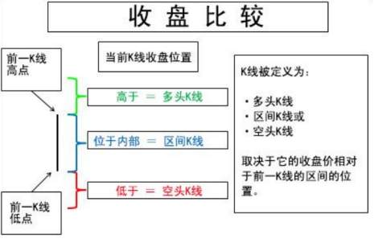
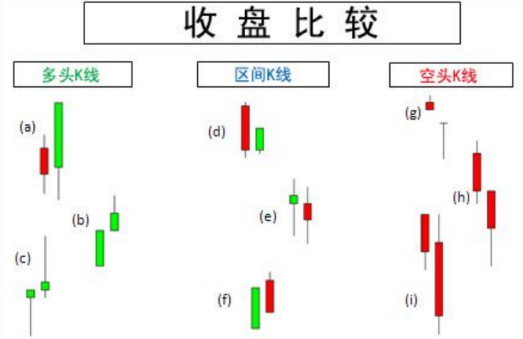
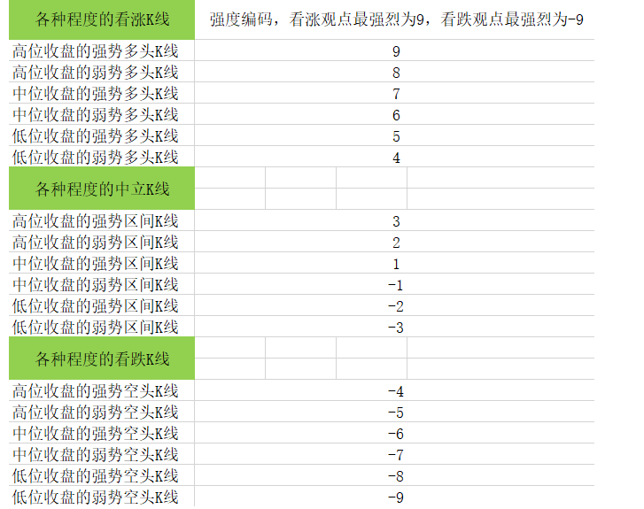

> Name

Share - Bar-by-bar analysis of long and short strength indicators
> Author

TradeMan
> Strategy Description

In order to give back to the FMZ platform and community, share strategies & codes & ideas & templates
Introduction:
The packaged function indicator can be called directly
K line by K line analysis
Measure the market's long and short strength by comparing the closing position of the K line itself with the relationship between the last two K lines.
In most cases, when we observe price movements, we only pay attention to the closing price or the shape of the underlying K line. How to read the K line in a better way and understand the strength of the long and short lines is the direction of more in-depth research. This study proposes a solution to code the long and short strength by comparing the type of the K line itself with the underlying K line and the upper and lower K line positions. As shown in the figure, this study defines K lines as 18 types. There are two main classification methods, one is the closing position (to help determine the view of a single K-line), and the other is the closing comparison (to help determine the view of the connected K-line). The closing position can help determine the view of a single K line. Based on the position of a K line's closing price in the range from its highest price to its lowest price, we define it as a high closing K line, a mid closing K line and a low closing K line. The K-line closing at each position is divided into a strong K-line (closing price > opening price) and a weak K-line (closing price < opening price). Therefore, there are a total of 6 categories of single K-line, namely: strong K-line closing at high level; weak K-line closing at high level; strong K-line closing at mid-range; weak K-line closing at mid-range; strong K-line closing at low level; weak K-line closing at low level.
 
  
   
    
In summary, combining 6 K-line closing relationships with 3 K-line closing comparisons, a total of 18 K-line strength relationships are generated. The strongest K-line for bulls is coded as 9, the weakest K-line is coded as -9, and the rest are progressively coded according to the strength relationship. The results are as shown in the figure.
 
Welcome to cooperate and exchange, learn and make progress together~
v：haiyanyydss


> Source (javascript)

``` javascript
$.getClosezhubang = function(rds){
    var arrclose = [];
    var arropen = [];
    var arrhigh = [];
    var arrlow = [];
    var arrzhubang = [];
    
    for(var i in rds){
        arrclose[i] = rds[i].Close;
        arropen[i] = rds[i].Open;
        arrhigh[i] = rds[i].High;
        arrlow[i] = rds[i].Low;
    
     if(i>1){
         
         if(arrclose[i] >= arrhigh[i-1]){
             
             if(arrclose[i] >= (arrhigh[i]-(arrhigh[i]-arrlow[i])/3) && arrclose[i] >= arropen[i]){
                 arrzhubang[i] = arrclose[i]*1.09;
             }else if(arrclose[i] >= (arrhigh[i]-(arrhigh[i]-arrlow[i])/3) && arrclose[i] < arropen[i]){
                 arrzhubang[i] = arrclose[i]*1.08;
             }else if(arrclose[i] > (arrlow[i]+(arrhigh[i]-arrlow[i])/3) && arrclose[i] < (arrhigh[i]-(arrhigh[i]-arrlow[i])/3) && arrclose[i] >= arropen[i]){
                 arrzhubang[i] = arrclose[i]*1.07;
             }else if(arrclose[i] > (arrlow[i]+(arrhigh[i]-arrlow[i])/3) && arrclose[i] < (arrhigh[i]-(arrhigh[i]-arrlow[i])/3) && arrclose[i] < arropen[i]){
                 arrzhubang[i] = arrclose[i]*1.06;
             }else if(arrclose[i] <= (arrlow[i]+(arrhigh[i]-arrlow[i])/3) && arrclose[i] >= arropen[i]){
                 arrzhubang[i] = arrclose[i]*1.05;
             }else if(arrclose[i] <= (arrlow[i]+(arrhigh[i]-arrlow[i])/3) && arrclose[i] < arropen[i]){
                 arrzhubang[i] = arrclose[i]*1.04;
             }
             
         }
         else if(arrclose[i] < arrhigh[i-1] && arrclose[i] > arrlow[i-1]){
             
             if(arrclose[i] >= (arrhigh[i]-(arrhigh[i]-arrlow[i])/3) && arrclose[i] >= arropen[i]){
                 arrzhubang[i] = arrclose[i]*1.03;
             }else if(arrclose[i] >= (arrhigh[i]-(arrhigh[i]-arrlow[i])/3) && arrclose[i] < arropen[i]){
                 arrzhubang[i] = arrclose[i]*1.02;
             }else if(arrclose[i] > (arrlow[i]+(arrhigh[i]-arrlow[i])/3) && arrclose[i] < (arrhigh[i]-(arrhigh[i]-arrlow[i])/3) && arrclose[i] >= arropen[i]){
                 arrzhubang[i] = arrclose[i]*1.01;
             }else if(arrclose[i] > (arrlow[i]+(arrhigh[i]-arrlow[i])/3) && arrclose[i] < (arrhigh[i]-(arrhigh[i]-arrlow[i])/3) && arrclose[i] < arropen[i]){
                 arrzhubang[i] = arrclose[i]*0.99;
             }else if(arrclose[i] <= (arrlow[i]+(arrhigh[i]-arrlow[i])/3) && arrclose[i] >= arropen[i]){
                 arrzhubang[i] = arrclose[i]*0.98;
             }else if(arrclose[i] <= (arrlow[i]+(arrhigh[i]-arrlow[i])/3) && arrclose[i] < arropen[i]){
                 arrzhubang[i] = arrclose[i]*0.97;
             }
             
         }
         else if(arrclose[i] <= arrlow[i-1]){
             
             if(arrclose[i] >= (arrhigh[i]-(arrhigh[i]-arrlow[i])/3) && arrclose[i] >= arropen[i]){
                 arrzhubang[i] = arrclose[i]*0.96;
             }else if(arrclose[i] >= (arrhigh[i]-(arrhigh[i]-arrlow[i])/3) && arrclose[i] < arropen[i]){
                 arrzhubang[i] = arrclose[i]*0.95;
             }else if(arrclose[i] > (arrlow[i]+(arrhigh[i]-arrlow[i])/3) && arrclose[i] < (arrhigh[i]-(arrhigh[i]-arrlow[i])/3) && arrclose[i] >= arropen[i]){
                 arrzhubang[i] = arrclose[i]*0.94;
             }else if(arrclose[i] > (arrlow[i]+(arrhigh[i]-arrlow[i])/3) && arrclose[i] < (arrhigh[i]-(arrhigh[i]-arrlow[i])/3) && arrclose[i] < arropen[i]){
                 arrzhubang[i] = arrclose[i]*0.93;
             }else if(arrclose[i] <= (arrlow[i]+(arrhigh[i]-arrlow[i])/3) && arrclose[i] >= arropen[i]){
                 arrzhubang[i] = arrclose[i]*0.92;
             }else if(arrclose[i] <= (arrlow[i]+(arrhigh[i]-arrlow[i])/3) && arrclose[i] < arropen[i]){
                 arrzhubang[i] = arrclose[i]*0.91;
             }
             
         }
     
     }else{
         arrzhubang[i] = arrclose[i];
     }    
    
    }
    return arrzhubang;
}
```

> Detail

https://www.fmz.com/strategy/396760

> Last Modified

2023-02-09 09:48:55
