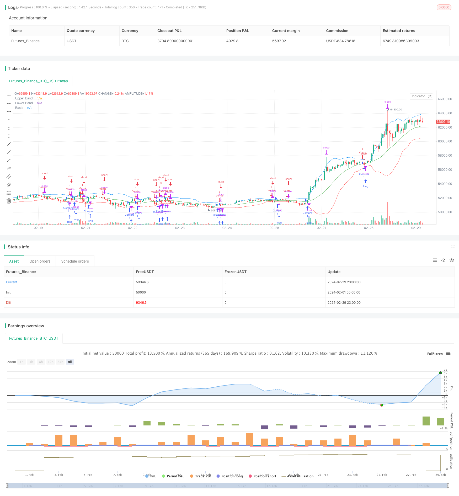

> Name

Short-Term-Trading-Strategy-Based-on-Bollinger-Bands
> Author

ChaoZhang

> Strategy Description


[trans]

## Overview
This strategy is based on the Bollinger Bands indicator for trading signal judgment and stop-profit and stop-loss settings. When the price touches the middle track of the Bollinger Bands, open a long or short position, and set a 0.5% take-profit and a 3% stop-loss, which is a short-term trading strategy.
## Strategy Principle
The middle track of the Bollinger Bands is the N-day simple moving average of the closing price. The upper rail is the middle rail + K times the standard deviation of N-day closing prices, and the lower rail is the middle rail - K times the standard deviation of N-day closing prices. Go long when the price crosses the middle rail from bottom to top, and go short when the price crosses the middle rail from top to bottom. A fixed quantity is opened for each transaction, and a 0.5% take profit and a 3% stop loss are set.
## Advantage Analysis
1. Using the Bollinger Bands indicator to judge trading signals can effectively capture price breakthroughs.
2. Adopt short-term trading method, each trading cycle is very short, and you can quickly switch between long and short directions.
3. Opening a position with a fixed quantity and setting a stop-profit and stop-loss can effectively control the risk of a single transaction.
## Risk Analysis
1. The Bollinger Bands indicator is sensitive to market volatility. Improper parameter settings may lead to an increase in trading signals but a low winning rate.
2. Short-term trading is frequent, and if there are relatively high handling fees, the profit margin will be greatly reduced.
3. If the stop-profit and stop-loss ranges are set improperly, the loss may be stopped prematurely or greater profits may be missed.
Risk resolution:
1. Optimize Bollinger Band parameters and find the best parameter combination.
2. Choose securities with lower handling fees for trading. 
3. Optimize the parameter settings of take profit and stop loss through backtesting.
## Optimization direction
1. Combine with other indicators to filter signals and improve the trading winning rate. For example, K-line pattern, MACD, etc.
2. Add take-profit methods, set up moving take-profit or batch take-profit, and expand the profit margin of each transaction.
3. Optimize Bollinger Band parameters and stop-profit and stop-loss ranges to find the optimal parameter combination.
## Summarize
The overall idea of ​​this strategy is clear, and using Bollinger Bands to judge trading signals is effective. However, transactions are frequent and profit margins are limited. It is recommended to combine trend judgment indicators to filter signals and optimize parameters to improve the strategy effect.
||

## Overview

This strategy uses Bollinger Bands indicator to determine trading signals and set stop profit/loss levels. It goes long when price touches the middle band from below and goes short when price touches the middle band from above. It sets 0.5% take profit and 3% stop loss, belonging to short-term trading strategy.

## Strategy Logic  

The middle band of Bollinger Bands is the N-day simple moving average of closing price. The upper band is middle band + K times N-day standard deviation of closing price. The lower band is middle band - K times N-day standard deviation of closing price. It goes long when price breaks above the middle band from below, and goes short when price breaks below the middle band from above. It opens fixed size for each trade and sets 0.5% take profit and 3% stop loss.

## Advantage Analysis

1. Using Bollinger Bands to determine trading signals can effectively capture price breakouts.  
2. Adopting short-term trading, the trading cycle is very short which allows quickly switching directions.
3. Fixed size position and stop profit/loss setting manage risks well per trade.

## Risk Analysis  

1. Bollinger Bands is sensitive to market volatility. Improper parameter settings may lead to more signals but lower win rate. 
2. High frequency trading can significantly reduce profit margin if commissions are comparatively high.  
3. Improper stop profit/loss setting may lead to premature stop loss or miss bigger profits.  

Solutions:

1. Optimize parameters to find best combination.  
2. Select securities with lower commissions.
3. Optimize stop profit/loss levels through backtesting.  

## Optimization  

1. Combine with other indicators like K line patterns and MACD to filter signals and improve win rate. 
2. Add more types of take profit like trailing stop or partial closing to expand profit potential.
3. Optimize parameters of Bollinger Bands and stop profit/loss levels to find best combination.  

## Conclusion  

The overall logic of this strategy is clear. Using Bollinger Bands to determine signals is effective. However, high trading frequency and limited profit space per trade. It's recommended to combine trend indicators to filter signals and optimize parameters to improve strategy performance.

[/trans]

> Strategy Arguments


|Argument|Default|Description|
|----|----|----|
|v_input_1|20|Longitud|
|v_input_2|2|Multiplicador|


> Source (PineScript)

``` pinescript
/*backtest
start: 2024-02-01 00:00:00
end: 2024-02-29 23:59:59
period: 1h
basePeriod: 15m
exchanges: [{"eid":"Futures_Binance","currency":"BTC_USDT"}]
*/

//@version=5
strategy("Estrategia Bollinger Bands", shorttitle="BB Strategy", overlay=true)

// Parámetros de las Bandas de Bollinger
length = input(20, title="Longitud")
mult = input(2.0, title="Multiplicador")

// Calcula las Bandas de Bollinger
basis = ta.sma(close, length)
upper_band = basis + mult * ta.stdev(close, length)
lower_band = basis - mult * ta.stdev(close, length)

// Condiciones para realizar operaciones
price_touches_basis_up = ta.crossover(close, basis)
price_touches_basis_down = ta.crossunder(close, basis)

// Lógica de la estrategia
if (price_touches_basis_up)
    strategy.entry("Compra", strategy.long, qty = 1)
    
if (price_touches_basis_down)
    strategy.entry("Venta", strategy.short, qty = 1)

// Lógica para cerrar la operación con un movimiento del 0,5% (take profit) o 3% (stop loss)
target_profit = 0.005 // Actualizado a 0.5%
stop_loss = 0.03

if (strategy.position_size > 0)
    strategy.exit("Take Profit/Close", from_entry = "Compra", profit = close * (1 + target_profit))
    strategy.exit("Stop Loss/Close", from_entry = "Compra", loss = close * (1 - stop_loss))

if (strategy.position_size < 0)
    strategy.exit("Take Profit/Close", from_entry = "Venta", profit = close * (1 - target_profit))
    strategy.exit("Stop Loss/Close", from_entry = "Venta", loss = close * (1 + stop_loss))

// Dibuja las Bandas de Bollinger en el gráfico
plot(upper_band, color=color.blue, title="Upper Band")
plot(lower_band, color=color.red, title="Lower Band")
plot(basis, color=color.green, title="Basis")

```

> Detail

https://www.fmz.com/strategy/443252

> Last Modified

2024-03-01 13:29:47
