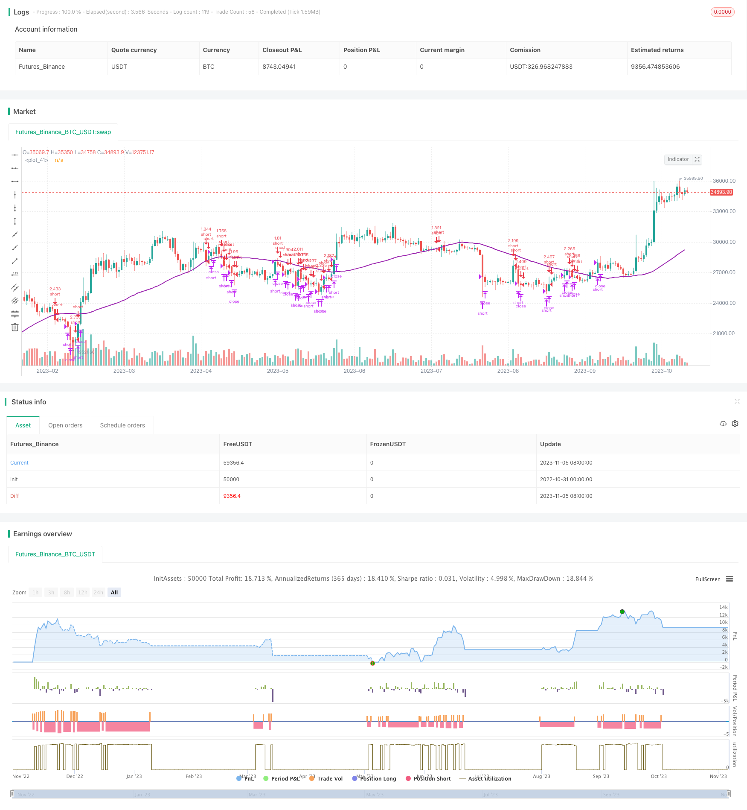

> Name

Short-Trading-Strategy-in-Downtrend
> Author

ChaoZhang

> Strategy Description



[trans]


### Overview
This strategy uses moving averages and relative strength indicators to determine the direction of the market trend, and gradually establish short positions in the downward trend to achieve profits.
### Strategy Principles
Enter short when the closing price is below the 100-day simple moving average and the RSI is greater than 30. Then set a stop-loss line and a take-profit line. The stop-loss line is more than 3% of the entry price, and the take-profit line is less than 2% of the entry price. This can give you a larger stop loss space to tolerate market fluctuations. The position is closed when the price is greater than the stop loss line or less than the take profit line.
On the Coinrule platform, you can set multiple sequential sell orders to gradually build a position. When the market continues to fall, gradually increase your position. Setting a certain time interval for placing orders can also help control the total position.
This strategy connects stop-loss and take-profit orders to each trade. Stop loss ratio and take profit ratio are optimized for mid-cap coins. You can adjust it based on the specific currency. Since the strategy is in line with the trend trading direction, the stop loss and take profit ratio can be set to 1:1.5.
The stop loss price is 3% of the entry price
The take profit price is 2% of the entry price
Slightly larger than the stop loss ratio, you can tolerate greater fluctuations and avoid unnecessary stop losses.
### Advantage Analysis
- Use moving averages to determine the direction of market trends and catch falling prices in time
- RSI filtering can avoid blind short selling
- Gradually increasing positions can control risks to the maximum extent and obtain a better risk-return ratio
- Set stop loss and take profit to ensure that each trade is affordable
### Risk Analysis
- When the market experiences a V-shaped reversal, it may result in larger losses.
- You need to pay close attention to the market and adjust stop loss and profit prices in a timely manner
- Position size needs to be controlled reasonably and excessive leverage should not be used
- This strategy can be suspended during market fluctuations to avoid unnecessary losses.
### Optimization direction
- Moving average indicator with different parameters can be tested
- Can test RSI indicator combinations with different parameters
- You can adjust the stop-loss and take-profit ratios to optimize the risk-return ratio
- You can test different order time intervals and control the position size
### Summarize
This strategy is based on the moving average to determine the trend direction, and the RSI indicator filter to determine the specific entry time, which can effectively capture the falling market. Gradually adding positions can control risks, and setting stop-loss and stop-profit can ensure the affordability of a single transaction. Optimizing the stop-loss and take-profit ratios can result in a better risk-return ratio. There is still room for optimization in terms of parameter adjustment and risk control, but overall it is a stable and reliable short-term short-selling strategy.
||


## Overview

This strategy takes advantage of downtrend by building short positions gradually based on moving average and RSI indicators. It aims for profit in falling market.

## Strategy Logic

When close price is below 100-day simple moving average and RSI is greater than 30, go short. Then set stop loss above entry price by 3% and take profit below entry price by 2%. The wider stop loss allows more volatility to avoid unnecessary stops. Close position when price surpasses stop loss or falls below take profit.

On Coinrule platform, set multiple sequential sell orders to build position gradually. When downtrend persists, increase position size. Setting a time interval between orders also helps controlling overall position size. 

Each trade is connected with a stop loss order and take profit order. The percentages are optimized for mid-cap coins. You can adjust based on specific coin. As it trades along with trend, stop loss and take profit ratio like 1:1.5 could work.

Stop loss at 3% above entry price
Take profit at 2% below entry price 
A slightly larger stop loss tolerates more volatility.

## Advantage Analysis

- MA judges trend direction well, catching downtrend in time
- RSI filter avoids blindly going short
- Gradual position build controls risk maximally with better risk-reward ratio
- Stop loss and take profit ensure endurance for each trade

## Risk Analysis

- Sharp V reversal could lead to major loss
- Need to monitor price closely to adjust stop loss and take profit
- Leverage needs to be reasonable to control position size 
- Pausing strategy in choppy market avoids unnecessary loss

## Optimization Directions 

- Test MA with different parameters
- Test RSI combinations with different parameters
- Adjust stop loss and take profit ratios to optimize risk-reward
- Test different time intervals between orders to control position size

## Summary

This strategy effectively captures downtrend based on MA and RSI. Gradual position build controls risk while stop loss and take profit ensure endurance. Further optimizing risk-reward ratio by adjusting stop loss/take profit parameters. There is room for improvements on parameters and risk control. But overall a solid short-term short strategy.

[/trans]

> Strategy Arguments


|Argument|Default|Description|
|----|----|----|
|v_input_1|true|From Month|
|v_input_2|10|From Day|
|v_input_3|2019|From Year|
|v_input_4|true|Thru Month|
|v_input_5|true|Thru Day|
|v_input_6|2112|Thru Year|
|v_input_7|true|Show Date Range|
|v_input_8|50|MASignal|
|v_input_9|14|RSI period|


> Source (PineScript)

``` pinescript
/*backtest
start: 2022-10-31 00:00:00
end: 2023-11-06 00:00:00
period: 1d
basePeriod: 1h
exchanges: [{"eid":"Futures_Binance","currency":"BTC_USDT"}]
*/

// This source code is subject to the terms of the Mozilla Public License 2.0 at https://mozilla.org/MPL/2.0/
// © Coinrule

//@version=4
strategy(shorttitle='Short In Downtrend',title='Short In Downtrend Below MA100', overlay=true, initial_capital = 1000, process_orders_on_close=true, default_qty_type = strategy.percent_of_equity, default_qty_value = 100)

//Backtest dates
fromMonth = input(defval = 1,    title = "From Month",      type = input.integer, minval = 1, maxval = 12)
fromDay   = input(defval = 10,    title = "From Day",        type = input.integer, minval = 1, maxval = 31)
fromYear  = input(defval = 2019, title = "From Year",       type = input.integer, minval = 1970)
thruMonth = input(defval = 1,    title = "Thru Month",      type = input.integer, minval = 1, maxval = 12)
thruDay   = input(defval = 1,    title = "Thru Day",        type = input.integer, minval = 1, maxval = 31)
thruYear  = input(defval = 2112, title = "Thru Year",       type = input.integer, minval = 1970)

showDate  = input(defval = true, title = "Show Date Range", type = input.bool)

start     = timestamp(fromYear, fromMonth, fromDay, 00, 00)        // backtest start window
finish    = timestamp(thruYear, thruMonth, thruDay, 23, 59)        // backtest finish window
window()  => true       // create function "within window of time"

//MA inputs and calculations
inSignal=input(50, title='MASignal')

MA= sma(close, inSignal)

// RSI inputs and calculations
lengthRSI = input(14, title = 'RSI period', minval=1)
RSI = rsi(close, lengthRSI)


//Entry 
strategy.entry(id="short", long = false, when = close < MA and RSI > 30)

//Exit
shortStopPrice  = strategy.position_avg_price * (1 + 0.03)
shortTakeProfit = strategy.position_avg_price * (1 - 0.02)

strategy.close("short", when = close > shortStopPrice or close < shortTakeProfit and window())


plot(MA, color=color.purple, linewidth=2)

```

> Detail

https://www.fmz.com/strategy/431428

> Last Modified

2023-11-07 17:06:59
