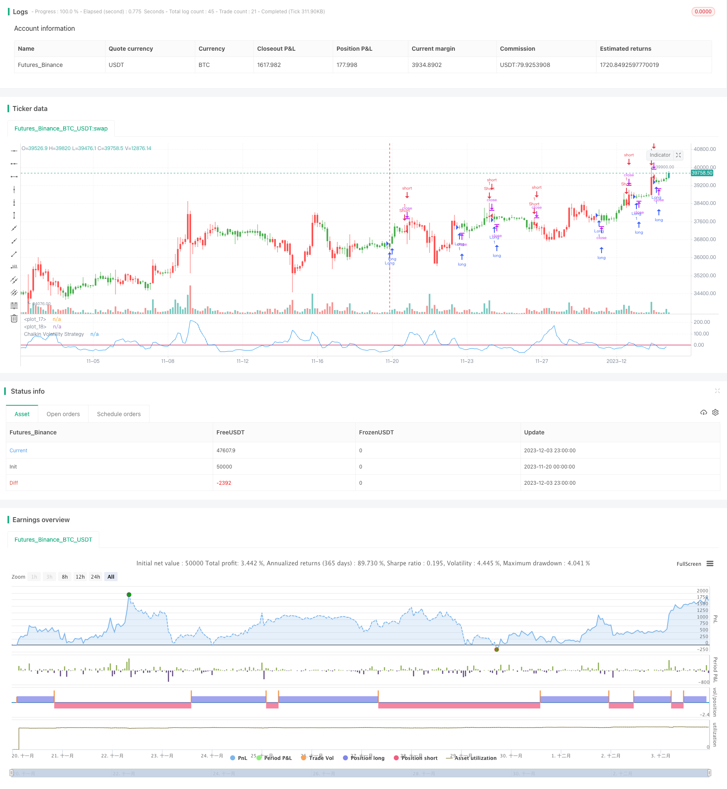

> Name

Short-term-Trading-Strategy-Based-on-Chaikin-Volatility-Indicator
> Author

ChaoZhang

> Strategy Description


[trans]

## Overview
This strategy designs a short-term trading system based on the Chaikin volatility indicator, which is mainly used to capture short-term market fluctuations. The main idea of ​​this strategy is to perform a buy or sell operation when the Chaikin volatility indicator crosses above or below a specified threshold.
## Strategy Principle
The Chaikin Volatility Indicator is a quantitative measure of volatility by calculating the range of a security's highest and lowest prices. When the difference between the highest price and the lowest price widens, it indicates an increase in volatility.
The specific logic of this strategy is:
1. Calculate Chaikin Volatility Index (xROC_EMA)
2. Set a trigger threshold (Trigger)
3. When xROC_EMA crosses Trigger above, go long; when xROC_EMA crosses below Trigger, go short
4. You can choose whether to trade in reverse direction
## Strategic advantage analysis
This strategy has the following advantages:
1. Quick response, suitable for short-term trading
2. The drawdown is relatively small and has a certain fund management effect.
3. Simple to implement and easy to understand
4. Can flexibly adjust parameters to adapt to different market environments
## Risk Analysis
This strategy also has certain risks:
1. Short-term trading brings higher trading frequency, and there is a risk of over-trading.
2. The set parameters such as Length, Trigger, etc. are prone to overfitting.
3. It is easy to cause losses when the transaction is reversed
4. Unable to effectively filter market noise, there is a certain probability of mistaken transactions
The solutions to corresponding risks are as follows:
1. Adjust parameters appropriately and control transaction frequency
2. Optimize parameter settings to prevent overfitting
3. Set a loose stop loss appropriately to give the price a certain room for correction.
4. Combine with other indicators for filtering to reduce mistaken transactions
## Strategy optimization direction
This strategy can be optimized from the following aspects:
1. Combine market structure indicators to identify trends and key support levels
2. Add filter conditions and reduce whipsaw, such as adding volume and energy indicators, moving averages, etc.
3. Dynamically adjust parameters so that they can change according to changes in the market environment
4. Optimize the stop loss mechanism, such as using trailing stop loss or Chandelier Exit, etc., to lock in more profits
## Summarize
The overall idea of ​​this strategy is clear and concise, and has the characteristics of short-term trading. Parameter settings are flexible and can be adjusted as needed. At the same time, there is also the risk that some parameters are prone to over-fitting and the trading frequency is too high. Through further optimization, the policy parameter robustness can be made stronger, resulting in more stable performance.
||

## Overview

This strategy designs a short-term trading system based on the Chaikin Volatility indicator to capture short-term market fluctuations. The main idea is to enter long or short positions when the Chaikin Volatility indicator crosses above or below a specified threshold.  

## Strategy Logic  

The Chaikin Volatility indicator quantifies volatility by measuring the spread between the highest and lowest prices of a security. A widening range between the high and low prices indicates rising volatility.  

The specific logic of this strategy is:  

1. Calculate the Chaikin Volatility indicator (xROC_EMA)  
2. Set a trigger threshold (Trigger)
3. Go long when xROC_EMA crosses above Trigger; go short when xROC_EMA crosses below Trigger  
4. Option to trade in reverse direction

## Advantage Analysis   

The advantages of this strategy include:  

1. Quick response, suitable for short-term trading  
2. Relatively small drawdowns, some capital management effect   
3. Simple to implement and easy to understand
4. Flexible parameter adjustment for different market environments   

## Risk Analysis   

There are also some risks:   

1. High trading frequency increases overtrading risk 
2. Parameters like Length and Trigger can be overfitted   
3. Vulnerable to losses when trading reverses
4. Cannot filter market noise effectively, some mis-trades  

Solutions:  

1. Adjust parameters to control trade frequency  
2. Optimize parameters to prevent overfitting  
3. Use wider stops to allow some price retracement  
4. Add filters to reduce false signals  

## Optimization  

The strategy can be improved by:  

1. Incorporate structure indicators to identify trends and support levels  
2. Add filters like volume and moving averages to reduce whipsaws 
3. Dynamic adjustment of parameters based on changing market conditions  
4. Enhance stop loss mechanisms e.g. trailing stops or Chandelier Exit to lock in more profits  

## Conclusion  

The strategy has a simple and clear logic suitable for short-term trading. The flexible parameters can be adjusted as needed. Overfitting and high trading frequency risks exist. Further optimizations can make the strategy more robust for steadier performance.

[/trans]

> Strategy Arguments


|Argument|Default|Description|
|----|----|----|
|v_input_1|10|Length|
|v_input_2|12|ROCLength|
|v_input_3|false|Trigger|
|v_input_4|false|Trade reverse|


> Source (PineScript)

``` pinescript
/*backtest
start: 2023-11-20 00:00:00
end: 2023-12-04 00:00:00
period: 3h
basePeriod: 15m
exchanges: [{"eid":"Futures_Binance","currency":"BTC_USDT"}]
*/

//@version = 2
////////////////////////////////////////////////////////////
//  Copyright by HPotter v1.0 01/12/2016
// Chaikin's Volatility indicator compares the spread between a security's
// high and low prices. It quantifies volatility as a widening of the range
// between the high and the low price.
// You can use in the xPrice1 and xPrice2 any series: Open, High, Low, Close, HL2,
// HLC3, OHLC4 and ect...
// You can change long to short in the Input Settings
// Please, use it only for learning or paper trading. Do not for real trading.
///////////////////////////////////////////////////////////
strategy(title="Chaikin Volatility Strategy Backtest")
Length = input(10, minval=1)
ROCLength = input(12, minval=1)
Trigger = input(0, minval=1)
reverse = input(false, title="Trade reverse")
hline(0, color=purple, linestyle=line)
hline(Trigger, color=red, linestyle=line)
xPrice1 = high
xPrice2 = low
xPrice = xPrice1 - xPrice2
xROC_EMA = roc(ema(xPrice, Length), ROCLength)
pos = iff(xROC_EMA < Trigger, 1,
	   iff(xROC_EMA > Trigger, -1, nz(pos[1], 0))) 
possig = iff(reverse and pos == 1, -1,
         iff(reverse and pos == -1, 1, pos))	   
if (possig == 1) 
    strategy.entry("Long", strategy.long)
if (possig == -1)
    strategy.entry("Short", strategy.short)	   	    
barcolor(pos == -1 ? red: pos == 1 ? green : blue )
plot(xROC_EMA, color=blue, title="Chaikin Volatility Strategy")
```

> Detail

https://www.fmz.com/strategy/436146

> Last Modified

2023-12-21 16:14:56
